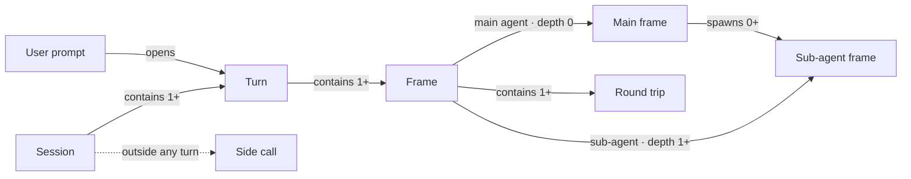
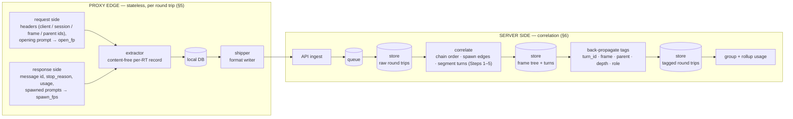

# Turn & Frame Correlation

The collector attributes every token of spend to the unit a human pays for: one **turn**
(a user prompt and all work done to answer it, including every sub-agent it spawned). The
mechanism is two-stage and content-free:

- **Edge (capture side, §5):** each round trip is reduced, statelessly, to one content-free
  record — ids, fingerprints, counts, `stop_reason` — in a consistent form regardless of
  which AI client produced it.
- **Server (correlation, §6):** those records are reassembled into the
  `session → turn → frame → round-trip` tree, and the derived correlation tags
  (`turn_id`, `frame`, `parent`, `depth`) are back-propagated onto every round trip so
  cost rolls up by turn.

Both stages are in scope here. Grounding: verified against mitmproxy captures of two
clients — Claude Code (sequential, three-parallel sub-agents, bash loop, quota/title) and
OpenCode (multi-prompt with parallel sub-agents). §7 cites each claim to a capture.

---

## 1. The problem

An operator accounting for AI spend must attribute every token to the **turn** that
incurred it. On the wire a turn is a *tree* of round trips: the model dispatches
sub-agents (often in parallel) that each run their own conversation before returning.
Turn boundaries and agent identity are not labeled uniformly, and clients differ: one
sends an explicit continuation pointer and buries the prompt under harness wrappers;
another sends per-frame session headers and a clean prompt; each names its spawn tool
differently. A correlation that hardcodes one client's vocabulary mis-groups every other
client — orphaning sub-agent cost and undercounting turns.

The model avoids two failure modes: **content-as-identity** (hashing a system prompt as
run identity collapses parallel same-type sub-agents) and **client-vocabulary hardcoding**
(a fixed spawn-tool name misses clients that spawn under another name). It correlates on
**structure and explicit identity that each client actually exposes**, normalized to one
form.

---

## 2. Glossary

| Term | Definition |
|---|---|
| Round trip | One request/response exchange with the provider. The atomic unit of capture, of usage, and of correlation. |
| Session | One client↔provider conversation. The outermost grouping. |
| Turn | One user prompt and every round trip done to answer it, across every frame it triggers. The unit of cost attribution. |
| Frame | One agent run — the main agent or one sub-agent. A turn contains one or more frames. |
| Record | The content-free per-round-trip output of the edge (§5): ids, fingerprints, counts, `stop_reason`. Carries no prompt or response text. |
| Tag | A correlation field the server derives and back-propagates onto each round trip: `turn_id`, `frame_id`, `parent_frame_id`, `depth`, `role`. |
| Side call | A round trip driven by no user prompt (quota, title-gen, monitor). Off-tree; belongs to no turn. |

---

## 3. Domain model and invariants



1. **Every round trip belongs to exactly one turn, or to no turn** (a side call).
2. **A turn has one main frame**; sub-agent frames are its children.
3. **N parallel same-type sub-agents are N distinct frames.**
4. **Turn boundaries are structural and derived server-side.** On the main frame a
   `stop_reason: end_turn` closes a turn; a `tool_use` stop (including the spawn that
   launches sub-agents) continues it. An inner frame's `end_turn` is a *return*, not a turn
   boundary. `turn_id` is assigned once per turn and back-propagated to every round trip in
   it, across all its frames.
5. **`Σ usage GROUP BY turn_id`** equals the turn's full cost including every sub-agent;
   side calls are excluded.
6. **Usage, once incurred, never changes.**

Not in the domain: content-hash identity; a fixed spawn-tool name as the spawn signal;
cross-session parentage.

---

## 4. Architecture



**Edge (§5):** a per-client **extractor** reduces one round trip to a content-free record,
attaches locally-known business context, persists to the local DB, and ships. **The edge
holds no per-session state** — every field is computed from the single round trip in
isolation. There is no local grouping, no turn windowing, no finalization.

**Server (§6):** ingests records, orders them per session, reconstructs the frame tree and
segments turns *from the records*, derives the correlation tags and back-propagates them
onto each round trip, then groups and rolls up. Correlation lives server-side because it is
the heuristic, evolving, client-shared part — centralizing it lets it change without a
fleet redeploy.

| Concern | Where |
|---|---|
| Per-round-trip identity (session, frame, declared parent), content-free signals, `stop_reason` | edge extractor |
| Local business context (cwd, git branch, user) | edge |
| Local persistence + shipping | edge (DB, shipper) |
| Order by session; reconstruct frame tree (chain + spawn edges); segment turns | server |
| Derive + back-propagate tags (`turn_id`, `depth`, `role`) onto each round trip | server |
| Group by turn/frame, rollup, business-context allocation | server |

Consequence: the edge is stateless, so the failure modes of stateful local grouping (a
finalization race, a cursor wedge) cannot occur here — they were artifacts of doing server
work at the edge.

**Restart robustness follows directly.** The linkage on a round trip is not the proxy's
state — it is the *client's* continuity, reflected on the wire (the client keeps sending the
same `session_id`, agent header, and message chain whether or not the proxy is running). The
proxy only copies that linkage onto each round trip. So an upgrade or crash — even
**mid-turn** — has nothing to corrupt: no open-turn or session state to lose, and a round
trip captured after the restart still carries its full linkage and attaches to the right
turn and frame. What a restart costs is **completeness, never correlation**: round trips
during the down window are not captured (fail-open), so that turn is undercounted, and if
the turn's *opening prompt* fell in the gap the server may mis-bound it.

---

## 5. Capture-side record

The edge emits one content-free record per `/v1/messages` round trip. Every field is derived
from that single request/response pair — no cross-round-trip state. The record carries ids,
fingerprints, counts, and enums only; never prompt or response text, headers, or secrets. The
server (§6) reconstructs the tree from these records alone.

Each value originates in a request header, the request body, the response (SSE stream or its
message envelope), or is assigned by the extractor.

| Field | Role in correlation | Claude Code source | OpenCode source |
|---|---|---|---|
| `wire_seq` | Capture order; tiebreaker and last-resort ordering | Extractor-assigned monotonic counter | Extractor-assigned monotonic counter |
| `rt_uid` | Globally unique RT id (`<run>_seq_<n>`), stable across re-runs and merged files | Extractor-assigned (run token + `wire_seq`) | Extractor-assigned (run token + `wire_seq`) |
| `client` | Selects the per-client interpretation | Header family `x-claude-code-*` | Header family `x-session-id` |
| `session_id` | Top-level grouping | Header `x-claude-code-session-id` | `null` — not on the wire; server derives it from the root frame of the parent chain |
| `frame_id` | Identifies the agent/thread this RT belongs to | Header `x-claude-code-agent-id` (absent ⟹ `MAIN`) | Header `x-session-id` |
| `parent_frame_id` | Declares the parent frame | `MAIN` when an agent id is present, else `null` (CC wire can't express deeper nesting) | Header `x-parent-session-id` (or `null` at root) |
| `prev_message_id` | Intra-frame chain link to the prior RT | Request body `diagnostics.previous_message_id` | `null` (OpenCode does not set it; server orders by `wire_seq`) |
| `this_message_id` | Chain target — what the next RT's `prev_message_id` points at | Response message `id` (`msg_…`) | Response message `id` (`msg_…`) |
| `stop_reason` | Turn segmentation (`end_turn` closes a turn; `tool_use` continues it) | Response, last `stop_reason` | Response, last `stop_reason` |
| `open_fp` | Child→parent match key — fingerprint of this RT's opening prompt; `null` on continuations | `sha256[:12]` of the last user message's leading text | `sha256[:12]` of the last user message's leading text |
| `spawn_fps` | Parent→child match keys — fingerprint per sub-agent prompt this RT spawned | Per `tool_use` block carrying a `prompt`, reassembled from the SSE `input_json_delta` stream | Same: per spawn-shaped `tool_use` prompt in the SSE |
| `n_spawn` | Spawn count (`len(spawn_fps)`); marks the spawning RT | Derived from `spawn_fps` | Derived from `spawn_fps` |
| `tokens` | Per-RT usage (`{in, out}`) | Response usage, last `input_tokens` / `output_tokens` | Response usage, last `input_tokens` / `output_tokens` |
| `activity` | Business-context classification of the work, for cost attribution by activity (controlled vocabulary: `feature-development`, `debugging`, `code-review`, …). A **context enhancement** — derived, not on the wire. | Classified by the collector | Classified by the collector |

A record (OpenCode, the opening round trip of a turn — wire-derived fields only, no enhancement):

```json
{
    "wire_seq": 1,
    "rt_uid": "742db5cc_seq_1",
    "client": "opencode",
    "session_id": null,
    "frame_id": "ses_12eb57857ffecgvQUSmmb7TQJF",
    "parent_frame_id": null,
    "prev_message_id": null,
    "this_message_id": "msg_01AdhAhyDPJ6cgE9a7BnnbaK",
    "stop_reason": "tool_use",
    "open_fp": "65dc127a0093",
    "spawn_fps": [],
    "n_spawn": 0,
    "tokens": {"in": 2, "out": 99}}
```

**Notes**
- **MANY Values Omitted for Brevity** - the focus of this document is the capture technique and data which allows correlation
- **Frame identity is header-driven.** Claude Code keys the frame on the agent id and the
  session on a separate header; OpenCode collapses the two — its frame id *is* a session id,
  and the tree's session is the root of the parent chain, so the edge leaves `session_id`
  null and the server fills it in.
- **Parentage differs in expressiveness.** OpenCode states the parent frame directly
  (`x-parent-session-id`), so arbitrary nesting reconstructs. Claude Code exposes only the
  child's own agent id, so the honest reading is "spawned by main"; deeper nesting is not on
  the CC wire.
- **The fingerprint is the spawn-edge join.** A child's `open_fp` is matched against a parent
  RT's `spawn_fps`. This needs the spawned prompt and the child's first user message to be
  byte-identical. Claude Code wraps the spawned prompt, so the match does not fire and the
  server falls back to the parent frame's last spawning RT; the fingerprint refines *which*
  RT only when it matches. OpenCode behaves the same, with `x-parent-session-id` as the
  parent-frame fallback.
- **Context enhancements are derived, not wire-read.** `activity` is not in the request or
  response — the collector classifies the turn's work into a controlled vocabulary and stamps
  it. It stays content-free (a single enum value), so it does not change the §8 contract. The
  offline test tool omits it; the production extractor adds it.

---

## 6. Server-side correlation

Correlation is a pure function of the records — no bodies, no headers, no wall-clock. It
reconstructs the `session → turn → frame → round-trip` tree and assigns every round trip a
deterministic order. The reference implementation is `tools/tree_side.py`; the SQL below
mirrors it.

### Input shape

One row per round trip, plus a child table flattening `spawn_fps` (the columns the algorithm
needs — `rt_uid` and `tokens` ride along but aren't used for ordering):

```sql
CREATE TABLE rt (
  wire_seq        INTEGER PRIMARY KEY,  -- capture order
  client          TEXT,                 -- 'claude-code' | 'opencode'
  session_id      TEXT,                 -- CC session; NULL for OpenCode
  frame_id        TEXT,                 -- 'MAIN' for the CC main frame
  parent_frame_id TEXT,                 -- 'MAIN' for a CC subagent; OC parent session; NULL at the root
  prev_message_id TEXT,                 -- CC chain link (OC leaves this NULL)
  this_message_id TEXT,
  stop_reason     TEXT,                 -- 'end_turn' | 'tool_use' | ...
  open_fp         TEXT,                 -- fingerprint of this RT's opening prompt; NULL on a continuation
  n_spawn         INTEGER               -- number of sub-agents this RT spawned
);
CREATE TABLE rt_spawn (                 -- one row per spawned sub-agent prompt
  wire_seq INTEGER REFERENCES rt(wire_seq),
  spawn_fp TEXT
);
```

### Step 1 — Frame keys

A frame is one agent/thread. Namespace its key by session so two Claude Code sessions in one
batch (both with a `MAIN` frame) don't merge. OpenCode frame ids are session ids, already
globally unique, so they live under a single `·` namespace; a record's parent key is built in
the same namespace.

```sql
CREATE VIEW rt_keyed AS
SELECT *,
       coalesce(session_id,'·') || '::' || frame_id AS frame_key,
       CASE WHEN parent_frame_id IS NOT NULL
            THEN coalesce(session_id,'·') || '::' || parent_frame_id END AS parent_key
FROM rt;
```

### Step 2 — Order within each frame

Round trips happen in capture order, so `wire_seq` ascending within a frame is the
intra-frame order for both clients:

```sql
chain AS (
  SELECT frame_key, wire_seq, stop_reason, open_fp, parent_key, n_spawn,
         row_number() OVER (PARTITION BY frame_key ORDER BY wire_seq) - 1 AS intra
  FROM rt_keyed
)
```

Refinement (Claude Code): to stay correct under reordering or merged captures, follow the
`prev_message_id → this_message_id` chain instead of raw `wire_seq`. OpenCode does not set
`previous_message_id`, so it always uses the `wire_seq` order above.

### Step 3 — Resolve spawn edges

Each non-root frame links to the round trip that spawned it. The parent frame comes from the
child's declared `parent_key`. The spawning RT within that frame is found by matching the
child's opening fingerprint (`open_fp`, from its first round trip) against a parent RT's
`spawn_fp`. When that doesn't match — Claude Code wraps the spawned prompt, so the
fingerprints never line up — fall back to the parent frame's last spawning RT, then its first.

```sql
head AS (   -- the opening round trip of each frame
  SELECT frame_key, open_fp, parent_key FROM chain WHERE intra = 0
),
edges AS (
  SELECT h.frame_key AS child_key, h.parent_key AS parent_key,
    COALESCE(
      (SELECT s.wire_seq FROM rt_spawn s JOIN rt_keyed pr ON pr.wire_seq = s.wire_seq
         WHERE pr.frame_key = h.parent_key AND s.spawn_fp = h.open_fp LIMIT 1),
      (SELECT pr.wire_seq FROM rt_keyed pr
         WHERE pr.frame_key = h.parent_key AND pr.n_spawn > 0
         ORDER BY pr.wire_seq DESC LIMIT 1),
      (SELECT pr.wire_seq FROM rt_keyed pr
         WHERE pr.frame_key = h.parent_key ORDER BY pr.wire_seq ASC LIMIT 1)
    ) AS spawner_wire_seq
  FROM head h WHERE h.parent_key IS NOT NULL
)
```

### Step 4 — Roots

A root is a frame that is no one's child. Each root anchors one session (its `session_id` for
Claude Code, or its own frame id for OpenCode).

```sql
roots AS (SELECT frame_key FROM rt_keyed EXCEPT SELECT child_key FROM edges)
```

### Step 5 — Segment turns

Within a root frame, a `stop_reason = 'end_turn'` closes a turn; `tool_use` continues it. A
round trip's turn number is the count of `end_turn`s strictly before it, plus one. (Sub-agent
frames inherit the turn of the round trip that spawned them; they are not segmented.)

```sql
turns AS (
  SELECT wire_seq,
         1 + COALESCE(
           SUM(CASE WHEN stop_reason = 'end_turn' THEN 1 ELSE 0 END)
             OVER (PARTITION BY frame_key ORDER BY intra
                   ROWS BETWEEN UNBOUNDED PRECEDING AND 1 PRECEDING), 0) AS turn_no
  FROM chain WHERE frame_key IN (SELECT frame_key FROM roots)
)
```

### Step 6 — Depth-first ordering

The tree is laid out depth-first: a frame's round trips in intra order, and immediately after
the round trip that spawned a child frame, that child's whole block (recursively). This is
encoded as a sort path — fixed-width, dot-separated components down the tree — so a plain
lexicographic sort yields the global order. A parent RT's path is a prefix of its children's,
so it always sorts ahead of them and before its own next round trip.

```sql
WITH edge_ranked AS (   -- order sibling frames spawned at the same RT
  SELECT child_key, parent_key, spawner_wire_seq,
         row_number() OVER (PARTITION BY spawner_wire_seq ORDER BY child_key) - 1 AS sib_rank
  FROM edges
),
frame_path(frame_key, path) AS (
  SELECT frame_key, '' FROM roots
  UNION ALL
  SELECT er.child_key,
         fp.path || printf('%06d.', sp.intra) || printf('%03d.', er.sib_rank)
  FROM edge_ranked er
  JOIN frame_path fp ON fp.frame_key = er.parent_key
  JOIN chain sp      ON sp.wire_seq = er.spawner_wire_seq AND sp.frame_key = er.parent_key
)
SELECT
  row_number() OVER (ORDER BY fp.path || printf('%06d', c.intra)) AS global_seq,
  (SELECT turn_no FROM turns t WHERE t.wire_seq = c.wire_seq)     AS turn,
  c.frame_key, c.intra, c.wire_seq, c.stop_reason
FROM chain c
JOIN frame_path fp ON fp.frame_key = c.frame_key
ORDER BY fp.path || printf('%06d', c.intra);
```

`global_seq` + `turn` + `frame_key` are the tags back-propagated onto each round trip
(§4 diagram); grouping and rollup are then a plain aggregation over fully-tagged rows.

### Properties and limits

- **Pure and replayable.** The ordering depends only on the records; re-running over the same
  input is identical, which makes it a consistency check.
- **Fingerprint is best-effort.** The `open_fp ∈ spawn_fps` join gives exact spawn attribution
  only when the spawned prompt reaches the sub-agent byte-identical. Under Claude Code's prompt
  wrapping it does not, so attribution falls back to the parent frame's last spawning RT —
  correct when a turn spawns from a single round trip, ambiguous if one frame spawns from
  several. Fingerprinting the *unwrapped* prompt on both sides is what makes the exact match
  fire.
- **Claude Code nesting is one level.** The CC wire exposes only a child's own agent id, so
  deeper trees flatten to main. OpenCode's `x-parent-session-id` reconstructs arbitrary depth.

---

## 7. Validation

Reconstructed with `tools/capture_side.py` → `tools/tree_side.py` over real captures:

| Claim | Capture | Evidence |
|---|---|---|
| Frame identity is explicit on Claude Code | parent-task-subagent, parent-parallel-subagents | `x-claude-code-agent-id` absent on main, constant within each sub-agent, distinct across (1 and 3 sub-agents); tree reconstructs to a single root |
| Frame + explicit parent on OpenCode | opencode-multi-prompt | `x-session-id` distinct per frame; `x-parent-session-id` points each sub-agent at main; frame counts match (main 7, subs 12 / 4 / 4) |
| Turn windowing without a pointer | opencode-multi-prompt | no `previous_message_id`; `stop_reason` segments 27 round trips into 4 turns; sub-agents nest under the turn that spawned them |
| Spawn name is not universal | OpenCode | spawn tool is `task` (lowercase), not `Task`/`Agent` — detection must be name-free |

**Not yet verified:** Claude Code's parent edge for *nested* (depth-2) sub-agents; identical
concurrent prompts; the unwrapped-prompt fingerprint match firing on Claude Code.

---

## 8. Security

The edge emits **content-free** records only: ids, prompt **fingerprints** (sha256 prefix),
counts, and stop reasons — no prompt or response text. Prompt text is read transiently to
fingerprint it, never persisted or shipped. Consistent with [003](003_data-security.md).
Captured `.mitm` artifacts carry credentials (`x-api-key`); the export tooling redacts them by
default.

---

## 9. Boundaries

- **Supersedes** the session/agent-run/turn correlation of
  [011](011_round-trip-records-and-correlation.md) and the finality clause of
  [015](015_inject-extract-architecture.md). 011's round-trip-record schema, sinks, and SQLite
  layout remain authoritative.
- **Builds on** [009](009_codec-dispatch-architecture.md) — the per-client extractor is a codec
  in the dispatch sense — and [003](003_data-security.md) for the content-free contract.
- **Out of scope:** business-context allocation and the delivery cadence (named in §4, detailed
  elsewhere).

---

## Appendix — running the two-stage tool

The edge (`capture_side.py`) and server (`tree_side.py`) are runnable offline against any
capture, as a consistency check.

```sh
# Stage 1 — capture side: one content-free JSONL record per round trip (mitmdump addon).
CZ_CAPTURE_OUT=captures/analysis/foo.jsonl \
  mitmdump -nq -r captures/foo.mitm -s tools/capture_side.py

# Stage 2 — correlation: build the turn tree (stdlib Python; reads only the JSONL).
python3 tools/tree_side.py captures/analysis/foo.jsonl
```

`tree_side.py` writes `foo.tree.md` (the `session → turn → RTs/subagents` tree + an ordered
table) and `foo.ordered.jsonl` (one node per round trip, in tree order). The client is detected
per-record from headers, so both clients run through the same command. Multiple captures'
JSONL can be concatenated — `rt_uid` keeps records distinct and frames are namespaced by
session.
