# 001 — Component architecture

The system-level specification of noodle. Each component's responsibility,
the interfaces it provides, the boundaries it exchanges data across, and
the flows that traverse it.

**Positioning.** Where rama defines the type system for **network
protocols** (HTTP, TLS, transport framing), noodle defines the type
system for **Agent Protocols** — the conversation shapes, content
categories, capability invocations, and correlation identifiers that
LLM-backed agents communicate over those network protocols. The codecs
noodle uses for in-band mutation operate at the network-protocol layer;
the content-semantic types downstream consumers use for classification
operate at the Agent-Protocol layer.

---

## 1. System context

  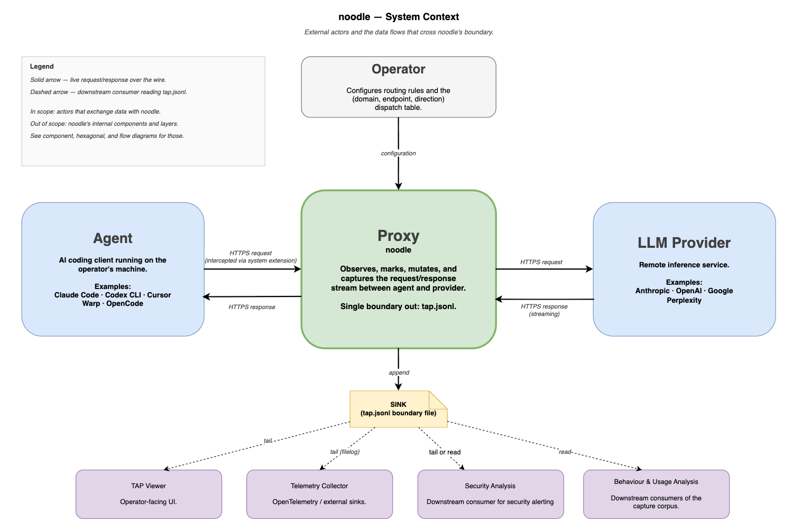

Companion: [`../diagrams/system-context.drawio`](../diagrams/system-context.drawio).

### 1.1 Actors

| Actor | Role |
|---|---|
| **IT / Security** | Authors the dispatch table. Deploys via installer or MDM override. Owns the routing policy. The only role with write access to noodle's configuration surface. Specified in ADR 025. |
| **End-user** | The human whose machine runs the agent. Reads the TAP viewer if installed. **No write access** to noodle's configuration; no bypass toggle. |
| **Agent** | AI coding client running on the end-user's machine. First-class set: Claude Code, Codex CLI, Cursor, Warp, OpenCode. |
| **LLM provider** | Remote inference service. First-class set: Anthropic, OpenAI, Google, Perplexity. |
| **Downstream consumers** | Four distinct classes: TAP viewer (end-user-facing UI), telemetry collector (OpenTelemetry / external sinks), security analysis (alerting on detected sensitive content or anomalies), behaviour / usage analysis (per-session, per-turn, per-tool analytics). |

### 1.2 Boundaries

Three boundaries cross noodle's process edge:

| Boundary | Direction | Carries |
|---|---|---|
| **Configuration** | IT / Security → proxy | The `(domain, endpoint, direction)` dispatch table. Installed default ships with the binary; IT delivers an override through the OS-native managed-config channel (Configuration Profile on macOS, `/etc/noodle/dispatch.toml` on Linux, Group Policy / Intune on Windows). Specified in ADR 025. |
| **Data (request/response)** | agent ↔ proxy ↔ LLM provider | HTTPS in both directions. Bytes reach the proxy via the OS entry transport (ADR 037); the proxy's TLS-MITM (ADR 011) terminates and re-originates TLS in both directions. |
| **Capture** | proxy → `tap.jsonl` | One JSON object per HTTP direction. The proxy's only output channel for downstream telemetry. |

### 1.3 What the proxy does, in one sentence

The proxy observes, marks, mutates, and captures the request / response
stream between agent and LLM provider, and writes one boundary file
(`tap.jsonl`) carrying every record downstream consumers need.

---

## 2. Architectural principles

Eight principles govern the design.

1. **Single-responsibility proxy.** Five responsibilities: Forward,
   Inject, Extract, Mark, Capture. Detailed in §5.
2. **Non-blocking output contract.** Output ports declared in
   `noodle-core` are specified as non-blocking. Adapter
   implementations that perform I/O execute on dedicated tasks. The
   proxy's request-forwarding path is therefore not subject to the
   latency or availability of any downstream consumer.
3. **Provider-aware dispatch by `(domain, endpoint, direction)`.**
   Every flow is classified by a three-axis key — the position it
   occupies in the dispatch matrix. Each unique `(domain, endpoint,
   direction)` position — called a **cell** — binds an ordered chain
   of codecs, transforms, and detectors. Adding a new provider is
   registering adapters in the relevant cells; the engine's interface
   surface is unchanged. Specified in ADR 019.
4. **Scope is enforced at the OS network layer.** The entry
   transport (ADR 037) claims only flows for hostnames named in the
   dispatch table. **Every other flow on the system never enters the
   noodle process.** No CA is minted, no TLS is terminated, no bytes
   are observed. Domain-level exclusion is the OS doing nothing at
   all — not a noodle pass-through. This is the dominant majority of
   traffic on a real machine.

   Inside the process, for the flows that *are* claimed, a secondary
   pass-through applies: if no `(domain, endpoint, direction)` cell
   matches, the proxy forwards bytes unmodified — no codec, no
   transform, no marking detector runs. The dispatch table is
   exhaustive in what it specifies and silent in what it does not.
5. **Trust is operator-controlled.** noodle terminates TLS to inspect
   plaintext; clients see leaf certificates signed by a CA installed
   in their trust stores. The CA is either generated on the host at
   first run (single-machine / development) or **supplied by the
   operator (bring-your-own; the enterprise default).** In the
   bring-your-own case the organization's existing internal CA — the
   one already distributed to managed devices via MDM — is the root
   noodle signs leaves under. Per-host leaf certs are minted on demand
   at first connection to a host, cached in process memory, and
   discarded on restart. CA private key never leaves the host.
   Specified in ADR 011.
6. **Fail-open by default.** When noodle is unavailable, crashed, or
   restarting, every claimed flow passes through to the OS unmodified.
   Health-driven and automatic; there is no end-user bypass. Specified
   in ADR 024.
7. **One boundary out — a sink.** The proxy publishes wire records
   through a single output interface, `WireSink`. The shipped
   implementation writes `tap.jsonl` to local disk; alternative
   implementations (in-memory ring buffer, TCP socket, OTLP endpoint,
   message queue, syslog) substitute one-for-one without the proxy
   knowing. All telemetry shaping is performed by the consumer that
   reads the sink. The proxy itself does not ship to OpenTelemetry,
   vendor SDKs, or external destinations directly — those are
   downstream-of-the-sink concerns.
8. **Layered codec stack.** Every protocol layer is a codec; every
   inspector is a transform. Six layers L0–L5 (transport → TLS → wire
   framing → application protocol → body framing → vendor semantics).
   Specified in ADR 015.

---

## 3. Components

Each component is a Rust **crate** under `crates/`. Crates couple
through interfaces declared in `noodle-core`; they do not depend on one
another's implementations.

  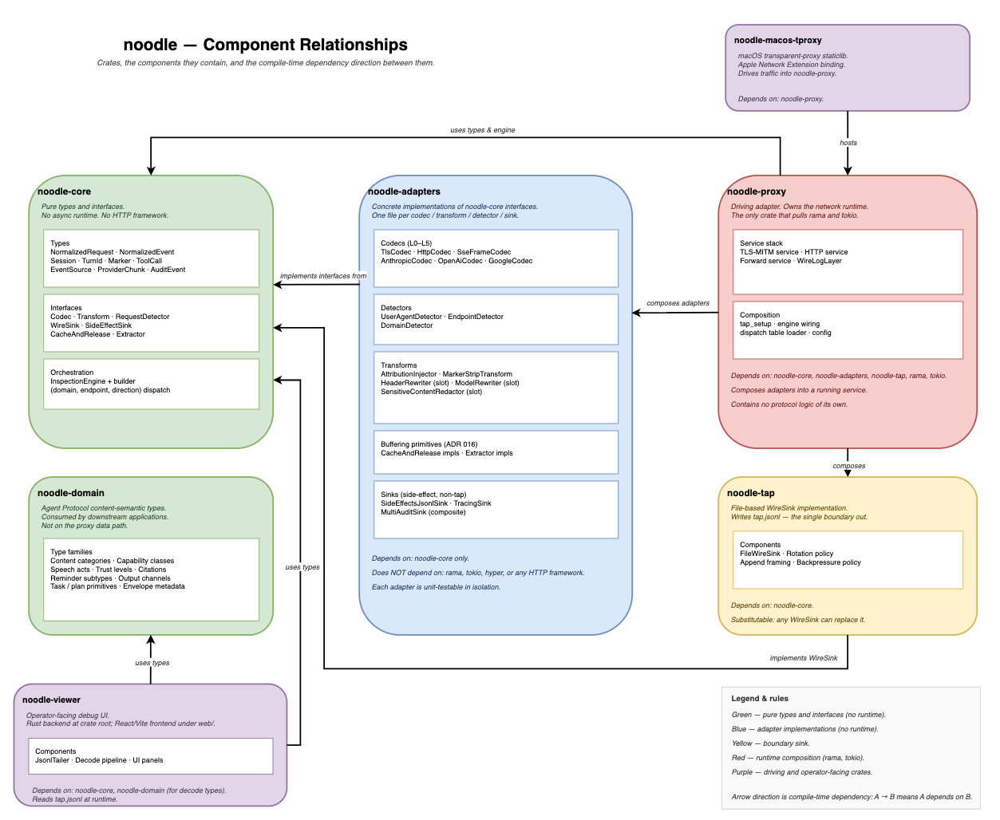

Companion diagrams in `docs/diagrams/`:
[`component-relationships.drawio`](../diagrams/component-relationships.drawio)
(crate-level view above),
[`noodle-component-object-model.drawio`](../diagrams/noodle-component-object-model.drawio)
(detailed object model),
[`architecture-hexagonal.drawio`](../diagrams/architecture-hexagonal.drawio)
(ports-and-adapters view).

### 3.1 `noodle-core` — domain core

Pure types and interface declarations. No I/O, no async runtime, no
HTTP framework dependency. Publishes the contract every other crate
depends on. Inventory of types and interfaces in §4.

**Depends on:** `bytes`, `http`, `futures`, `serde`, `sha2`, `smallvec`,
`smol_str`, `thiserror`, `tracing`. No rama, no tokio.

### 3.2 `noodle-domain` — Agent Protocol type system

Content-semantic types downstream consumers use to classify what a body
contains: content categories, capability classifications, speech acts,
trust levels, citation refs, reminder subtypes, envelope metadata,
task / plan primitives, turn-end signals.

**Origin of the vocabulary.** The type families in this crate are
**derived from analysis**, not invented. The source corpus is the
public system-prompt collection at
[`asgeirtj/system_prompts_leaks`](https://github.com/asgeirtj/system_prompts_leaks)
— leaked and operator-disclosed system prompts and harness
configurations from Anthropic (Claude / Claude Code), OpenAI
(ChatGPT / Codex), Google (Gemini), Cursor, Warp, OpenCode, and
others. Categories that recur
across three or more vendors are first-class types in this crate;
single-vendor specifics are represented as subtypes within the
relevant category. The terminology (`SystemReminder`, `ToolCall`
classifications, `Thinking` / `Reasoning` channels, `EndConversation`
turn-end signals, etc.) is the vocabulary the agents themselves are
trained on, not vocabulary noodle synthesised.

**Consumers:** `noodle-viewer`, telemetry shippers, behaviour / usage
analysis. **The proxy does not depend on this crate** — content-semantic
classification is a downstream concern.

**Coverage roadmap.** The order in which `noodle-domain` adds support
for each provider and each agent client, the three coverage tiers
(Observed / Recognised / Mutating), and the source-corpus survey
methodology are specified in
[`../features/agent-protocol-coverage-roadmap.md`](../features/agent-protocol-coverage-roadmap.md).
That document is planning material, not architecture; it pins the
priority and scope of work, while this section pins the crate's
shape.

### 3.3 `noodle-adapters` — driven adapters

Concrete implementations of `noodle-core` interfaces. One file per
codec, transform, detector, or sink.

- **Request codecs**, one per `(domain, endpoint)` cell.
- **Response codecs** (L4 framing and L5 vendor semantics).
- **Transforms** (`AttributionInjector`, `MarkerStripTransform`,
  request- and response-side mutators).
- **Detectors** (`UserAgentDetector` and per-cell marking detectors).
- **TLS / DNS adapters.**
- **Side-effect sinks** (file, tracing, in-memory, composite).

**Depends on:** `noodle-core` only. No rama, no tokio.

### 3.4 `noodle-proxy` — driving adapter

The binary. The only crate that pulls rama. Composes the rama service
stack and the inspection engine into a running process.

- `ProxyConfig`, `start()`.
- `mitm.rs` — TLS-MITM service composition.
- `wirelog.rs::WireLogLayer` — the noodle-aware layer. Observes each
  request and response, dispatches in-band injection / extraction /
  marking through the `(domain, endpoint, direction)` cell, and writes
  the resulting record via the `WireSink`.
- `tap_setup` — wires the engine, registries, and sinks.

**Depends on:** `noodle-core`, `noodle-adapters`, `noodle-tap`, rama,
tokio.

### 3.5 `noodle-tap` — file-based `WireSink`

A concrete implementation of the `WireSink` port that writes
`tap.jsonl` to local disk. Substitutable: any `WireSink` implementation
can take its place (in-memory, TCP socket, message queue, OTLP
endpoint, relational database).

**Depends on:** `noodle-core`.

### 3.6 `noodle-viewer` — end-user-facing UI

A local debug app that tails `tap.jsonl`. Rust backend serves a React
frontend; three views (HTTP, SSE, OODA) derived client-side from
`tap.jsonl` records. Read-only; no configuration surface. Specified
in ADR 007.

**Depends on:** `noodle-core`, `noodle-domain`. Reads `tap.jsonl` at
runtime.

### 3.7 `noodle-macos-tproxy` — macOS entry transport

macOS transparent-proxy staticlib. Hosts the `NETransparentProxyProvider`
and `NEDNSProxyProvider` system extensions that deliver traffic into
the noodle process. Specified in ADR 037 §3.

**Depends on:** `noodle-proxy`.

### 3.8 `noodle-sinks` — file-backed `SideEffectSink` adapters

Concrete implementations of the `SideEffectSink` port (ADR 020):
`TracingSink`, `InMemorySink`, `MultiSideEffectSink`,
`SideEffectsJsonlSink`, `RoundTripSink`, `Clock`, `SystemClock`.
Carved out of `noodle-adapters` per ADR 039 §5 so the plugin-host
crate graph does not transitively pull `tokio` and file I/O.

**Depends on:** `noodle-core`, `tokio`. Proxy-host-only — not
plugin-embeddable.

### 3.9 `noodle-cert-external` — external (CSR-over-HTTPS) cert mint

The Vault PKI signer (`VaultPkiSigner`) and the
`ExternalCertMintService` adapter for `noodle_core::CertMintService`.
Carved out of `noodle-adapters` per ADR 039 §5 so `reqwest` does
not appear in the plugin-host crate graph.

**Depends on:** `noodle-core`, `reqwest`, `tokio`, `noodle-tls`
(dev-only for chain validation in tests). Proxy-host-only.

### 3.10 `noodle-tls` — TLS MITM primitives

The self-signed root CA (`Ca`) and the in-process
`LocalCertMintService`. Uses `rcgen` and `std::fs`. Carved out of
`noodle-adapters` per ADR 039 §5 so neither dependency reaches the
plugin-host crate graph. The CSR-over-HTTPS variant lives in
`noodle-cert-external` (§3.9).

**Depends on:** `noodle-core`, `rcgen`, `time`, `x509-parser`,
`pem`. Proxy-host-only.

### 3.11 `noodle-embellish-core` — pure tap → telemetry mapper

The pure-Rust library half of the embellishment processor: the
`tap.jsonl` reader, the per-provider `ProviderDecoder` driver, and
the `ai-telemetry` v0.0.2 mapper. The SQLite writer, CLI, and
binary remain in `noodle-embellish` (§3.6 sibling). Carved out
per ADR 039 §5 so plugin hosts can consume the mapper without
dragging `rusqlite`, `clap`, or `tokio`.

**Depends on:** `noodle-core`, `noodle-domain`. Plugin-embeddable.

### 3.12 `noodle-detect` — plugin-host facade

The synchronous `detect(request, response, context) ->
AttributionFacts` entry point a plugin host calls per round trip.
Re-exports the host-independent surface from `noodle-core`,
`noodle-domain`, `noodle-embellish-core`, and the pure-logic
submodules of `noodle-adapters`. Specified in ADR 039 §2.3.
Builds clean for `wasm32-unknown-unknown` (ADR 039 §9 acceptance
signal #1).

**Depends on:** `noodle-core`, `noodle-domain`,
`noodle-embellish-core`, `noodle-adapters`. Plugin-embeddable.

### 3.13 `noodle-shipper` — OTLP/HTTP shipper

Reads `ai-telemetry` rollups from the SQLite database
`noodle-embellish` writes and emits OTLP/HTTP Log records to a
configurable collector. Drives the cursor-on-flag state machine
(`pending → in_flight → delivered | retry → poison`) specified in
ADR 022 §3 and feature story 043.

**Depends on:** `noodle-core`, `noodle-domain`, `reqwest`,
`rusqlite`, `tokio`. Proxy-host-only.

### 3.14 Cargo dependency rule

The dependency graph enforces hexagonal layering and the
plugin / proxy-host boundary (ADR 039 §5):

- `noodle-core` depends on no other noodle crate.
- `noodle-domain` and `noodle-embellish-core` depend on
  `noodle-core` only; both are plugin-embeddable.
- `noodle-adapters` depends on `noodle-core` only; its pure-logic
  submodules are plugin-embeddable, the rest is proxy-host work.
- `noodle-detect` re-exports the plugin-embeddable surface;
  itself plugin-embeddable.
- `noodle-sinks`, `noodle-cert-external`, `noodle-tls`,
  `noodle-tap`, `noodle-embellish`, `noodle-shipper`,
  `noodle-viewer`, `noodle-proxy`, `noodle-macos-tproxy` are
  proxy-host-only (they pull `tokio`, `reqwest`, `rcgen`, `rama`,
  or file I/O).
- `noodle-proxy` is the only crate that pulls `rama`.
- `noodle-macos-tproxy` depends on `noodle-proxy`.

---

## 4. Types and interfaces

`noodle-core` publishes two categories of public symbols.

### 4.1 Types — the data shapes that flow through the proxy

Where a row lists multiple types, the row briefly distinguishes each
inline. Types are lumped only when tightly coupled (parent + identifier
+ key), symmetric (call + result), sibling-of-the-same-purpose
(probes), or members of one bus (side-channel facts).

| Type | Role | Defined in |
|---|---|---|
| `NormalizedRequest` | Vendor-agnostic outbound request envelope: model, messages, abstract system-prompt slot. The shape transforms operate on without provider-specific knowledge. | ADR 018 |
| `NormalizedEvent` | Vendor-agnostic decoded response event. Variants: `TurnStart`, `Token`, `ToolCall`, `TurnEnd`, `Metadata`. | ADR 015 |
| `ProviderChunk` | The raw upstream bytes carried alongside a decoded event. The encoder replays it verbatim when no transform has mutated the event (round-trip invariant, ADR 015 §2.1). | ADR 015 |
| `EventSource` | Discriminator on raw-bearing events. `Upstream(ProviderChunk)`: replay bytes verbatim on encode. `Mutated`: re-serialise from structured fields. Forces the encoder to honour a transform's mutation rather than silently replaying the original bytes. | ADR 017 |
| `Session` / `SessionId` / `SessionKey` | The session triple. `Session`: per-session state object that accumulates `Resolved` attribution across the session's flows. `SessionId`: stable identifier the proxy stamps on every record. `SessionKey`: the lookup key the store derives from agreed headers (authorization + session header). | ADR 020 |
| `TurnId` / `ParentSessionId` / `RequestId` | Correlation identifiers stamped on every `tap.jsonl` record by the per-cell marking detector (§5.4). `TurnId`: identifies one user-intent-to-final-response cycle (one or more round trips share a `TurnId` when the cell's marking detector recognises them as the same turn). `ParentSessionId`: present when the marking detector identifies the request as a child of another session (sub-agent invocation). `RequestId`: pairs the request and response lines of a single HTTP exchange. | §7 |
| `ToolCall` / `ToolResult` | The two halves of a capability invocation, paired by `tool_use_id`. `ToolCall`: the model's request to invoke a tool (carries `tool_use_id`, tool name, input arguments). `ToolResult`: the harness's response, returned on the next request. Content-semantic classification (PlainTool / SubAgent / MCP / Skill / etc.) is a downstream concern in `noodle-domain`. | ADR 015 |
| `RequestProbe` / `CodecProbe` | Cheap, read-only views used by the dispatch machinery to select codecs, transforms, and detectors without consuming bodies. `RequestProbe`: the request-side view at flow open (URI, method, headers). `CodecProbe`: the narrower view at the codec-registry layer (host, path, accept / content-type) used for first-match codec selection. | ADR 018, ADR 019 |
| `Hint` / `Artifact` / `AuditEvent` / `ResolvedRecord` | Side-channel facts emitted by transforms and detectors during a flow. `Hint`: a confidence-ranked attribution opinion. `Artifact`: a captured named value (e.g. marker contents). `AuditEvent`: an operational event (`Injected`, `Redacted`, `Filtered`, `Errored`, …). `ResolvedRecord`: the per-flow attribution map produced by the `Resolver` at end of flow. | ADR 020 |

### 4.2 Interfaces — the contracts adapters satisfy

Same lumping rule. Where a row lists multiple interfaces, they share a
factory + instance pattern or are otherwise tightly paired.

| Interface | Role | Specified in |
|---|---|---|
| `Codec` / `CodecInstance` | The representation-conversion contract. `Codec`: stateless factory shared across all flows; cheap routing predicate via `matches(probe)`; opens a per-flow instance. `CodecInstance`: per-flow stateful instance carrying buffers and partial-frame state. Round-trip faithful: `encode(decode(bytes)) == bytes` for input no transform mutated. | ADR 015 §3 |
| `Transform` / `TransformInstance` | The content-mutation contract. `Transform`: stateless factory keyed by `(layer, pipeline, order)`. `TransformInstance`: per-flow worker. Operates on the typed values a codec produces; changes content within one representation; emits side-effects on the side channel. | ADR 015 §4 |
| `RequestDetector` | The read-only inspection contract for the boundary read at flow open. Stateless. Reads the `RequestProbe`, emits marks and other side-channel emissions, performs no mutation. Distinct from `Transform` because `Transform` is per-event mid-pipeline; `RequestDetector` is once per flow at the boundary. | ADR 021 |
| `WireSink` | The boundary output port for wire records. Non-blocking; implementation-agnostic destination (file, in-memory ring buffer, TCP, OTLP, message queue, syslog). The shipped implementation writes `tap.jsonl`. | §7 |
| `SideEffectSink` | The in-process side-channel port for `Hint` / `Artifact` / `AuditEvent` / `ResolvedRecord` delivery. Non-blocking. Distinct from `WireSink`: `WireSink` carries raw wire records (bytes), `SideEffectSink` carries derived facts. | ADR 020 |
| `InspectionEngine` | The pipeline coordinator. Selects codec / transform / detector chains by cell key for each flow; runs the request and response pipelines; drains the side channel at flow end and routes `Hint`s through the `Resolver` to produce a `ResolvedRecord`. | ADR 015 §7 |
| `SessionStore` | The cross-request state port. Holds per-`Session` data including accumulated `Resolved` attribution across the session's flows. The interface is what the engine talks to; the implementation (`InMemorySessionStore` in `noodle-adapters`) is substitutable. | ADR 020 |
| `CacheAndRelease` / `Extractor` | Bounded streaming-buffer primitives both codecs and transforms use. `CacheAndRelease`: the low-level bounded buffer with a release decision (memory ceiling, wall-clock deadline, overflow audit). `Extractor`: a higher-order pattern that uses a `CacheAndRelease` internally to look for something specific (literal pattern, regex, JSON path, classifier verdict) and decide what to do with the surrounding content. | ADR 016 |

---

## 5. The proxy's five responsibilities

Each responsibility is dispatched through the `(domain, endpoint,
direction)` cell selected for the flow (ADR 019).

### 5.1 Forward

Terminate client TLS via MITM, forward the request to the upstream
LLM, stream the response back to the client. Implemented by rama
composed with `mitm.rs`. TLS details in ADR 011.

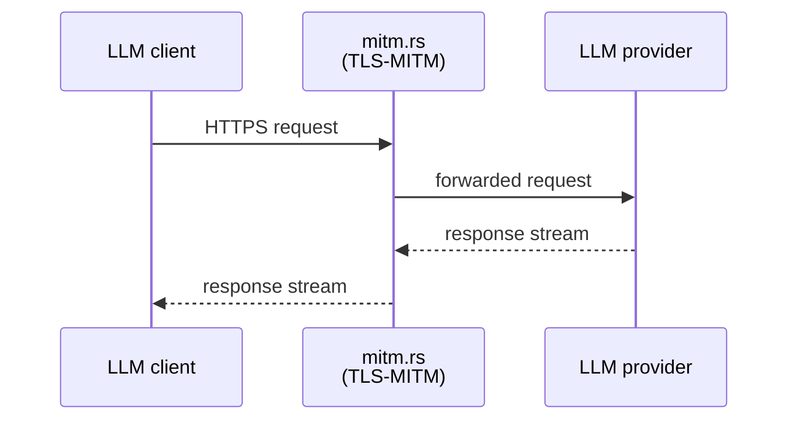

### 5.2 Inject

Mutate the request body to write the attribution directive into the
system-prompt slot. The proxy runs:

- The cell's **request codec** to decode the body to `NormalizedRequest`.
- The `AttributionInjector` transform to set the system slot.
- The same codec to re-encode the result back to bytes.

The encoded bytes are forwarded upstream. Detail in ADR 018.

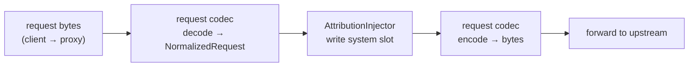

### 5.3 Extract

Mutate response bytes to remove attribution markers before they reach
the client. The proxy runs:

- The cell's **L4 framing codec** to locate SSE frame boundaries.
- The cell's **L5 codec** to decode each frame sufficient to identify
  markers.
- `MarkerStripTransform` to capture the marker value and remove the
  marker bytes from the event. Provenance discipline (ADR 017) forces
  `EventSource::Mutated`, which forces re-serialisation on encode.
- The same codecs to re-encode the modified frames.

Two outputs: post-strip bytes forwarded to the client; captured
`{name → value}` pair recorded in `extractions` on the response line
of `tap.jsonl`.

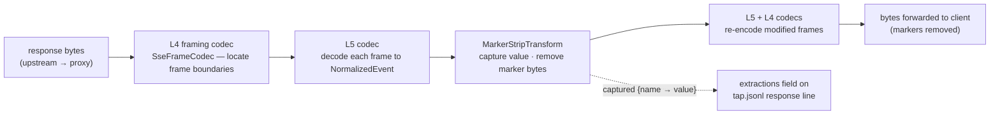

### 5.4 Mark

The cell's marking detector reads the request probe and produces the
correlation fields stamped on every `tap.jsonl` record for this flow:
`session_id`, `parent_session_id` where applicable, `turn_id`, and any
provider-specific correlation fields the cell defines. The marking
detector is a per-cell implementation of `RequestDetector` (ADR 021).

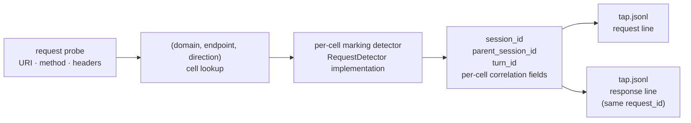

### 5.5 Capture

Compose identification metadata + marks + bodies + extractions into a
single record per direction, and write through `WireSink`. Field
schema in §7. The `WireSink` interface is destination-agnostic; the
shipped implementation (`noodle-tap::FileWireSink`) writes `tap.jsonl`.

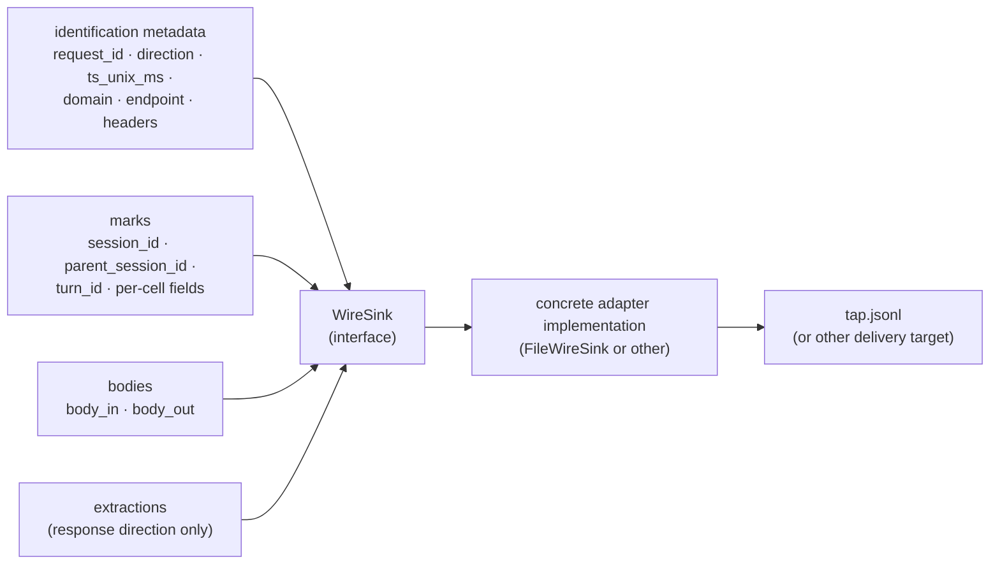

---

## 6. End-to-end flows

The five canonical flows that traverse the system end to end. All
five are **runtime** — they describe what happens while the proxy is
running. Deployment-lifecycle flows (install, configure, upgrade,
uninstall) are specified in ADR 026.

### 6.1 Request path

Bytes arrive at the proxy only if the OS entry transport (ADR 037)
claims the flow. Hosts that are not in the dispatch table's host set
never enter the proxy. Inside the proxy, the `(domain, endpoint,
request→upstream)` cell is looked up against the loaded dispatch
table (default + IT override per ADR 025); if a cell matches, its
capability chain runs in the order the cell declares; if not, bytes
forward unmodified.

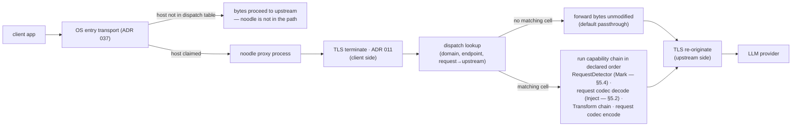

### 6.2 Response path

Bytes arriving from the upstream belong to an already-claimed flow.
The `(domain, endpoint, response→client)` cell is looked up against
the same dispatch table; if a cell matches, the L4 framing codec
locates frame boundaries, the L5 vendor codec decodes each frame to
`NormalizedEvent`, response transforms run (`MarkerStripTransform`
captures and removes markers — §5.3), and the L5 + L4 codecs
re-encode. Provenance discipline (ADR 017) decides per event whether
to re-serialise from structured fields (`EventSource::Mutated`) or
replay the original upstream bytes (`EventSource::Upstream`).

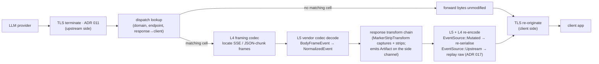

### 6.3 Capture flow

Per HTTP direction, the proxy composes a record and hands it to
`WireSink`. The capture branch is non-blocking (principle §2.2); the
forwarding path does not wait on it.

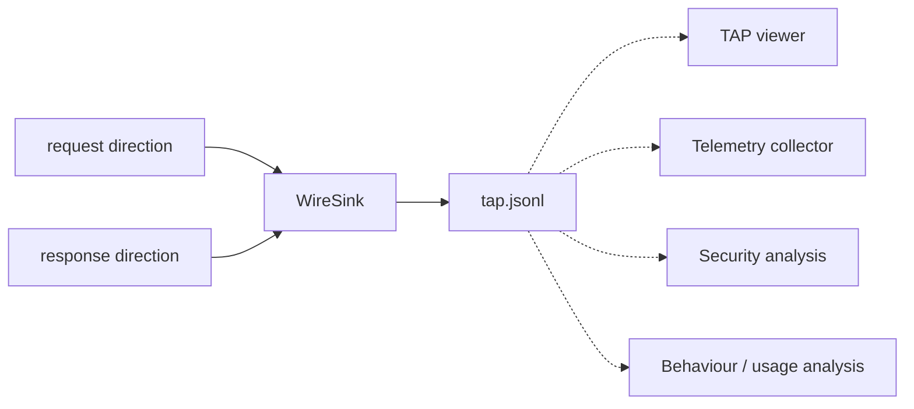

### 6.4 Downstream consumer flow

Each consumer tails `tap.jsonl` independently and performs decode →
classify → correlate → ship.

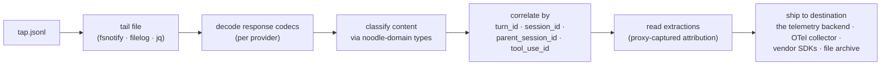

### 6.5 Fail-open flow

When the health probe reports unhealthy, the entry transport passes
claimed flows through to the OS unmodified. Health-driven and
automatic — there is no end-user toggle. Specified in ADR 024.

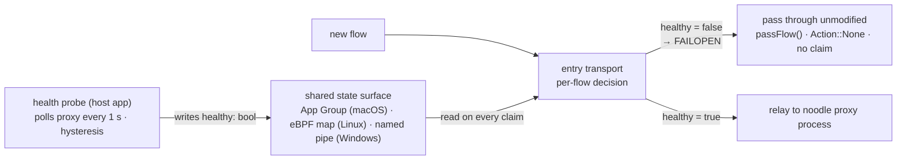

---

## 7. The boundary file (`tap.jsonl`)

`tap.jsonl` is the proxy's single output channel. One JSON object per
line, one line per HTTP direction (request or response), records
paired by `request_id`. Each line carries identification metadata
(request id, direction, timestamp, domain, endpoint, headers), marks
(`session_id`, `parent_session_id`, `turn_id`, per-cell correlation
fields), body fields (`body_in`, `body_out`), and — on response
records only — `extractions` (`{name → value}` for content the proxy
captured during in-band mutation).

The full schema, per-field semantics, JSON Schema documents,
worked examples, foreign-consumer guidance (Python / Go / TypeScript /
`jq`), and versioning posture are specified in **ADR 027**. ADR 027
also pins the relationship between `tap.jsonl` and the separate
`SideEffectSink` — only `Artifact` content lands here (as
`extractions`); `Hint`, `AuditEvent`, and `ResolvedRecord` land on
`side-effects.jsonl` (the `SideEffectSink` in ADR 020).

---

## 8. Cross-cutting attachment points

Each cross-cutting concern is named here with a one-paragraph
specification. Detail lives in the ADR cross-referenced.

### 8.1 TLS MITM (ADR 011)

The proxy terminates client TLS to inspect plaintext and
re-originates a fresh TLS connection to the upstream. The root CA is
either:

- **Generated on the host at first run** — the single-machine /
  development pattern. Persisted to disk; same CA across restarts;
  the operator installs it in their own trust stores.
- **Supplied by the operator (bring-your-own CA)** — the enterprise
  pattern. The organization's existing internal CA, already
  distributed to managed devices via MDM, is what noodle signs
  leaves under. No per-machine CA install step; the trust
  relationship already exists from the fleet's normal PKI posture.

Per-host leaf certs are minted on demand at the first connection to
each upstream host, cached in process memory, and discarded on
restart (in-memory cache; the on-disk root is the only durable
secret). Mirroring of the upstream's SAN list and ALPN is automatic.
CA private key never leaves the host. Detail and the bring-your-own
spec in ADR 011.

### 8.2 Entry transport (ADR 037)

How bytes arrive at the proxy process — OS-specific. macOS:
`NETransparentProxyProvider` + `NEDNSProxyProvider`. Linux: eBPF
cgroup hook + TUN device. Windows: WinDivert NetworkLayer +
SocketLayer. Each implementation delivers the same `NewFlow` /
bidirectional-bytes / `FlowClose` contract to the engine.

### 8.3 Fail-open (ADR 024)

When noodle is unavailable (crashed, restarting, hung), claimed flows
pass through to the OS unmodified. Health-driven and automatic; there
is no end-user bypass toggle. Five moving parts: health probe, health
state surface, per-flow decision, startup posture, lifecycle
coordinator. Inspection on / off per host is a dispatch-table
operation (ADR 025), not a fail-open one.

### 8.4 Dispatch table (ADR 025)

The configuration IT pushes. Maps `(domain, endpoint, direction)`
cells to ordered capability chains. Default ships with the install;
IT overrides via the OS-native managed-config channel. File format,
schema, validation rules, installation paths, and worked example
specified in ADR 025.

### 8.5 Layered codec stack (ADR 015)

The structural core. `Codec` (type-changing, round-trip faithful) +
`Transform` (type-preserving, mutating) + `RequestDetector`
(read-only). Six layers L0–L5. Two pipelines (request, response).
Side-channel emissions (`Hint`, `Artifact`, `AuditEvent`,
`ResolvedRecord`) carry observations alongside the typed event stream.

### 8.6 Endpoint-routed capability dispatch (ADR 019)

The dispatch contract: three-axis cell key, four-way direction axis,
catalog-vs-config split, default passthrough, cross-direction
correlation scope.

### 8.7 Provenance discipline (ADR 017)

`EventSource::{Upstream, Mutated}` discriminator. Unmutated events
replay original bytes verbatim; mutated events force re-serialisation.
Prevents redaction-that-doesn't-reach-the-wire bugs.

### 8.8 Buffering primitives (ADR 016)

`CacheAndRelease` (bounded buffer with release decision) and
`Extractor` (literal pattern, regex, JSON path, classifier-driven).
Memory ceiling, wall-clock deadline, overflow audit are part of the
contract.

### 8.9 Side-effect sink and resolver (ADR 020)

The `SideEffectSink` port through which `Hint` / `Artifact` /
`AuditEvent` / `ResolvedRecord` are delivered. The `Resolver`
collapses per-flow hints into a `ResolvedRecord` at end-of-flow.

### 8.10 Embellishment plane (ADR 022)

Identity resolution (`device_id` → person / team / org) and any other
content-enrichment work that depends on data outside the wire.
Downstream of `tap.jsonl`; the proxy emits the raw facts and never
performs identity resolution itself.

### 8.11 Detector vs Transform (ADR 021)

The two-tier read split: `RequestDetector` for boundary reads
(probe-time, stateless), `Transform` for pipeline reads (per-event,
stateful).

### 8.12 Extensibility posture (ADR 006)

Compile-time plugins only for v1. Adding a new codec, transform,
detector, or sink is a new file plus registration at startup. WASM
extensibility is deferred until the trait surface is stable for at
least one release cycle.

### 8.13 Viewer architecture (ADR 007)

Local end-user-facing UI that tails `tap.jsonl`. Three modes (HTTP,
SSE, OODA) derived client-side from the same event store. Read-only.

### 8.14 QUIC MITM (ADR 014)

Engineering plan for terminating QUIC connections in the proxy. Three
options (DNS suppression, UDP blackhole, true MITM); MITM is the
architectural goal. Independent of the entry-transport mechanism that
delivers QUIC flows (ADR 037).

### 8.15 Sensitive-content protection (planned)

Outbound and inbound secret / IP / PII detection and redaction. No
new interface required; attaches at the same transform surfaces as
`AttributionInjector` (request) and `MarkerStripTransform` (response).

### 8.16 Control plane / watchtower (planned)

An external watchtower observes `tap.jsonl` (or a downstream
telemetry feed derived from it) and signals per-session decisions
(model switching, session abort, header rewriting) back through a
control port. Decision authority resides in the watchtower; the
proxy provides observation and execution surfaces.

### 8.17 Deployment lifecycle (ADR 026)

The four lifecycle events — install, configure, upgrade, uninstall —
are IT-driven and travel through OS-native managed-configuration
channels. ADR 026 sequences each per OS, names the version-bump
constraint for macOS sysext upgrades, specifies in-flight flow
behaviour across transitions, and pins the audit-event emissions for
each lifecycle event.

### 8.18 `tap.jsonl` boundary format (ADR 027)

The schema, per-field semantics, JSON Schema documents, foreign-
consumer guidance, and versioning posture of `tap.jsonl`. ADR 027 also
pins which side-channel facts land where: `Artifact` content as
`extractions` on `tap.jsonl` response records (byte-aligned with the
wire record); `Hint`, `AuditEvent`, and `ResolvedRecord` on a
sibling `side-effects.jsonl` via the separate `SideEffectSink`.

---

## 9. Single-page attachment reference

| Concern | Proxy attachment | Downstream attachment | Spec |
|---|---|---|---|
| Session-level injection | `Transform<NormalizedRequest>` writes the system slot | — | §5.2, ADR 018 |
| Session-level extraction | `Transform<NormalizedEvent>` captures markers; values land in `extractions` | reads `extractions` from `tap.jsonl` response lines; accumulates per session | §5.3, ADR 017 |
| Round-trip body mutation | the same transforms, run once per `request_id` | reads the paired (request, response) lines from `tap.jsonl` | §5.2, §5.3 |
| Tool-use response capture | passthrough (response-body bytes captured in `tap.jsonl`) | decodes response body; joins by `tool_use_id` | §5.5 |
| Tool-result request capture | passthrough (request-body bytes captured in `tap.jsonl`) | decodes request body; joins by `tool_use_id` | §5.5 |
| HTTP visualisation | `WireSink` writes `tap.jsonl` | viewer tails | ADR 007 |
| SSE timing visualisation | `WireSink` writes `tap.jsonl` | viewer derives per-frame timing from response bodies client-side | ADR 007 |
| OODA visualisation | `WireSink` writes `tap.jsonl` | viewer derives session / agent-run / turn / round-trip hierarchy client-side | ADR 007 |
| Telemetry shipping | `WireSink` writes `tap.jsonl` | telemetry shipper tails; ships to chosen destination | ADR 022 |
| Behaviour / usage analysis | `WireSink` writes `tap.jsonl` | third-party app tails; computes per-session, per-turn, per-tool analytics | §1.1 |
| Security analysis | `WireSink` writes `tap.jsonl` | security consumer tails; alerts on detected sensitive content or anomalies | §1.1 |
| Correlation with external data sources | `WireSink` writes `tap.jsonl` | correlator joins with other data sources | §1.1 |
| Outbound secret / credential scan | `Transform<NormalizedRequest>` scans `messages`; redacts in place and / or emits `extractions` | reads `extractions` for audit | §8.15 |
| Inbound secret disclosure scan | `Transform<NormalizedEvent>` scans `Token` text and tool I/O | reads `extractions` for audit | §8.15 |
| IP-classified content detection | `RequestDetector` for recognition only; `Transform` for recognition with mutation | reads detection marks or `extractions` | §8.15 |
| Per-session model switch | `Transform<NormalizedRequest>` mutates `model`; policy supplied via the control port | watchtower observes `tap.jsonl` and signals the policy decision | §8.16 |
| Provider translation | asymmetric decode / encode codec pair | watchtower selects the target provider | ADR 018 |
| Header mutation | `Transform<HeaderMap>` slot at L3 | watchtower supplies the header rewrite | §8.16 |
| Session abort on policy | control port signals abort by `session_id`; proxy returns an error to the client | watchtower issues the abort decision | §8.16 |
| Cost feedback to watchtower | proxy emits operational audit events on the side channel | watchtower's telemetry consumer reads them and decides | §8.16 |
