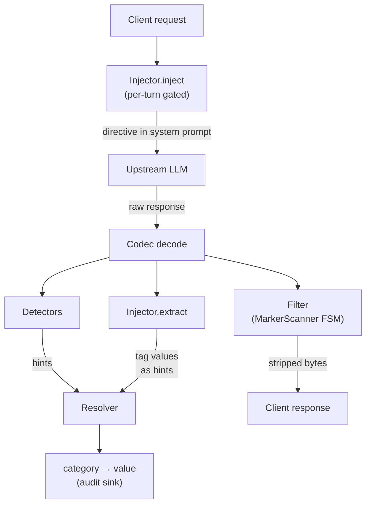

# The attribution model

**Status:** foundational
**Author:** Joe Barnett
**Last updated:** 2026-05-12

This is the conceptual core of noodle. The trait surface
([`005-trait-refactor.md`](005-trait-refactor.md)) describes *how*
the code is shaped. This doc describes *what attribution is* and
*why the moving parts compose the way they do*.

## What attribution is

Attribution is the act of answering, for a single AI request /
response flow, four orthogonal questions:

1. **Who.** Which human (or service identity) drove this request?
2. **What tool.** Which agent or client originated it (Claude Code,
   Cursor, a custom script, the API directly)?
3. **What work.** What category of activity is the prompt in
   service of — engineering, research, ops, customer-support, etc.?
4. **Which session.** Which conversation does it belong to, so
   turns and OODA loops collate correctly across requests? (See
   [`008-session-hierarchy.md`](008-session-hierarchy.md).)

Some of these are inferable from the wire: User-Agent, provider
headers, system-prompt hash. Others are not — *what work* is in the
user's head, and we have to **ask the model** to put it on the wire
by injecting a directive into the prompt and extracting the model's
tagged reply.

That asymmetry — **passive read for facts on the wire, active
inject + extract for facts that aren't** — is the core of the
model.

## Four moving parts

### 1. Hints

A hint is one detector's opinion about one category, with a
confidence score:

```
ContextHint { category, value, confidence, source }
```

Hints are *proposals*, not answers. A single flow produces many of
them; multiple detectors may emit for the same category with
different values and confidences. The resolver collapses them.

### 2. Detectors

A detector is a pure function from a flow to a stream of hints.

Detectors run after response decode, take a `FlowResolver` (headers,
body, provider, host, session), and call `HintWriter::write` zero
or more times. No mutation. No side effects on the stream.

Examples:

- **User-agent classifier** → tool name (heuristic).
- **Anthropic-org-id header** → identity (authoritative when present).
- **Claude-Code-Session-Id header** → session (authoritative).
- **System-prompt SHA-256, first 12 hex** → session (fallback).
- **Git identity / repo name** → who + project.

Detectors split into a **common group** (runs on every flow) and
**per-provider groups** (run when the flow's provider matches the
group key). Common-first then specific: heuristic hints land first;
authoritative provider-specific hints overwrite them through
confidence ranking.

### 3. Resolver

The resolver collapses ranked hints into a `Resolved` map of
`category → value`:

1. Group hints by category.
2. Per category: pick the max-confidence hint. Tie-break by detector
   priority order (configured per-category).
3. If the category declares a non-empty `values:` allow-list:
   case-insensitive match → emit canonical form. No match falls
   through to default (or is omitted).
4. Defaults pass: any declared category with a configured `default:`
   and no surviving hint gets the default.

The resolver itself is twenty lines of substantive logic. The trait
shapes around it carry the weight.

### 4. Injector

An injector owns one round-trip lifecycle. Two methods:

- **`inject(req)`** runs before the request egresses. It mutates
  the body to embed a directive — typically appending a `text` block
  to the `system` field that instructs the model to emit
  `<noodle:NAME>VALUE</noodle:NAME>` tags carrying named answers
  (work-type, project, customer — anything the model can infer from
  context).
- **`extract(resp)`** runs after response decode. It pulls the tag
  values out of the assembled response text and stamps them onto
  the flow's resolved categories alongside detector-sourced hints.

Injection is **gated per turn**: the first request in a turn (keyed
on session header) gets the directive; subsequent requests in the
same turn skip injection because the model already saw the
directive in the previous exchange's system prompt. Turn boundaries
are detected by session header presence + change in session id.

## The marker round-trip

`inject` and `extract` are bound by a contract: the marker grammar.

```
<noodle:NAME>VALUE</noodle:NAME>
```

The open prefix `<noodle:` is fixed (configurability is a future
story if noodle ever needs to coexist with a third party's
markers). `NAME` is ASCII `[a-zA-Z0-9_-]`. Total open-marker length
is bounded at 64 bytes so an adversarial prompt cannot grow the FSM
accumulator without limit.

The model is told, in the directive, to wrap its named answers in
these tags. We **strip them out of the rendered response before the
client sees a byte**. The client gets clean text; we keep the
values.

### Stripping is a streaming FSM, not a regex

We cannot buffer the full response. SSE deltas arrive one token at
a time, and a marker can split across delta boundaries —
`<noodle:wo` in one delta, `rk_type>...` in the next. A regex over
the assembled response would also force us to defer client delivery
until the full response is in, which kills the streaming UX.

So the strip is a hand-rolled FSM (`MarkerScanner`,
`crates/noodle-core/src/marker.rs`) with four states:

```
Normal           → '<' seen → MaybeTagStart
MaybeTagStart    → prefix matches "<noodle:" → InTagOpen
                 → divergence → release held bytes verbatim, Normal
InTagOpen        → name char → accumulate
                 → '>' and name known → InTagContent
                 → divergence or overflow → release verbatim, Normal
InTagContent     → match expected close marker
                 → matched → emit MarkerHit, eat trailing newline, Normal
```

State persists across calls — a marker that straddles a delta
boundary resolves correctly. Bytes that *might* be a marker prefix
are held back, not emitted; if they turn out to be ordinary text,
they release in a subsequent call. **One algorithm, two outputs:**
stripped bytes for the client, captured values for `extract`. No
regex pass.

The FSM is the load-bearing correctness piece of the attribution
write path. Everything else is plumbing around it.

## Filters

A filter modifies the byte / event stream the client sees. The
`MarkerScanner` wrapped in a streaming filter
(`MarkerStripFilter`) is the canonical instance. Other filters are
conceivable (redaction, sampling) but are not on the v1 critical
path.

Filters are stateful **per flow** — they hold partial-match state
across event boundaries. Detectors are stateless across flows.
Injectors are stateful **per turn**. Three different state
lifetimes, three different roles. Conflating them couples
streaming-rewrite correctness to read-only inference and to
per-turn gating — none of which test well in isolation.

## What attribution is **not**

- **Not enforcement.** Attribution describes what happened; it
  does not gate, rate-limit, or block. Policy lives separately —
  see the layered codec architecture
  ([`015-layered-codec-architecture.md`](015-layered-codec-architecture.md)),
  where telemetry is normalized at the top of the codec stack and
  policy (filters, extractors, rewriters) lives in the
  provider-aware codecs and `Transform<E>`s below it.
- **Not the model's job alone.** The model only fills the *what
  work / what project* gap. Identity, tool, and session come from
  the wire.
- **Not a regex pass over response text.** Buffering kills
  streaming; the FSM is the only acceptable shape.
- **Not free of trust assumptions.** We trust the model to honor
  the directive most of the time, and we tolerate misses (no tag
  emitted → no value, fall through to default). We do *not* trust
  the model enough to skip the strip — adversarial output cannot
  be allowed to leak markers through to the client.

## Configuration shape

A YAML config defines the attribution surface at runtime:

- **`categories:`** — business dimensions noodle attributes against.
  Each declares a `values:` allow-list (empty = open), a
  `detectors:` tie-break priority order, and an optional `default:`.
- **`attribution:`** — the directive template, plus a `selector`
  whose `entries[]` are matched against the operator's declared
  identity (department, role, team) with auto-specificity (most
  matching keys wins). The matched entry's `values:` and
  `default_value:` are substituted into the directive at startup,
  and refreshed at turn-start when the identity changes.

Detector input data (UA → tool patterns, static profile mappings)
lives here too, so new patterns are a config change, not a code
change.

## Pipeline at a glance



`inject` mutates the request body. The filter mutates the
response stream the client sees. Detectors + `extract` feed hints
into the resolver. The resolved `category → value` map is the
attribution output, emitted to the audit sink alongside the
original event.

## Why this composes

The three-role split (`Detector` / `Injector` / `Filter`) is what
makes attribution testable:

- **Detectors** test against a synthetic `FlowResolver` — no proxy,
  no network, no streaming. Each detector is a pure function.
- **The resolver** tests against a hand-built hint vec and a
  `CategoryConfig`. No flow at all.
- **The marker FSM** tests against `&[u8]` inputs — every state
  transition, every byte boundary, property-tested with 1024
  randomized cases.
- **Injectors** test against a synthetic request and a synthetic
  assembled response — no SSE, no upstream, no decode.

Each role's tests run in microseconds. The integration story is
"these compose," not "these need a full proxy in scope."
