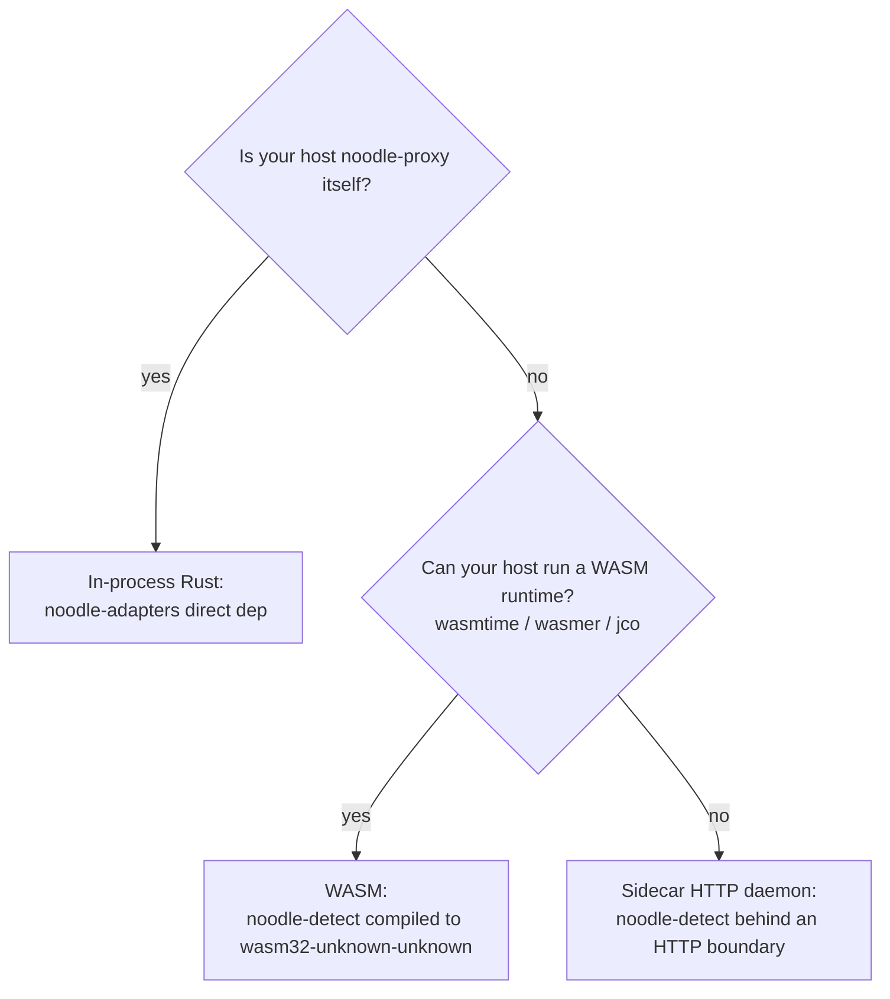

# ADR 006 — Extensibility posture

**Status:** current.
**Related:** ADR 015 (layered codec architecture — the trait surface
plugins extend), ADR 020 (`SideEffectSink` port), ADR 021
(`RequestDetector`), ADR 028 (`MarkingDetector`),
ADR 039 (deployment topologies — pins WASM as the cross-language
plugin vehicle).

---

## 1. Premise

noodle extends in three ways. Each addresses a different deployment
context and a different trust boundary:

| Mode | Where it runs | Trust boundary | Primary use case |
|---|---|---|---|
| **In-process Rust** | proxy host (`noodle-proxy`) | full proxy privileges | Adding capabilities to noodle's own deployment |
| **WASM in a host gateway** | embedded in a third-party LLM gateway (LiteLLM, Bifrost, Portkey, in-house) | host-gateway sandbox; explicit imports | Embedding noodle's attribution pipeline in someone else's gateway |
| **Sidecar HTTP daemon** | separate process behind an HTTP boundary | network sandbox | Hosts that cannot run WASM (FaaS, constrained runtimes) |

The in-process and WASM modes share **one trait surface** —
`Codec`, `Transform`, `RequestDetector`, `MarkingDetector`,
`SideEffectSink` (ADRs 015, 020, 021, 028). A capability written
once compiles to either target without source changes; the only
difference is the crate it depends on
(`noodle-adapters` for in-process, `noodle-detect` for WASM) and
the entry point that exposes it.

## 2. Decision

### 2.1 The trait surface is the contract

The extension points are Rust traits in `noodle-core` and the
pure-logic submodules of `noodle-adapters`. The traits are stable
across the in-process and WASM hosts. Adding a new capability is
implementing a trait and registering the impl with the host's
registry — either at proxy startup (in-process) or at WASM plugin
load (WASM host).

ADR 015 §3 specifies the codec trait surface; ADR 020 §2.1 the
side-channel surface; ADR 021 the request-detector surface; ADR
028 the marking-detector surface; ADR 042 the codec error
contract. Plugin authors implement against these directly.

### 2.2 WASM is the cross-language extensibility vehicle

For any host that is not `noodle-proxy` itself, the supported
plugin shape is a `wasm32-unknown-unknown` artifact built from the
plugin author's Rust crate and depending on `noodle-detect`.
ADR 039 pins this. The facade exposes a synchronous
`detect(request, response, context) -> AttributionFacts` API the
host calls per round trip.

The WASM choice over C ABI dynamic loading rests on four
considerations:

| Concern | WASM (wasmtime, wasmer, jco) | C ABI (`libloading`) |
|---|---|---|
| Sandboxing | Explicit imports/exports; no host syscalls without grant | Plugin runs with host privileges |
| Cross-platform | Same `.wasm` runs on Linux, macOS, Windows, ARM, x86 | Per-target builds; ABI mismatches hard to detect |
| ABI stability | wasmtime + raw `extern "C"` shim (or Component Model when stable) provide a versioned interface | Rust has no stable ABI; C ABI is brittle |
| Failure isolation | Plugin trap → host catches; host stays up | Plugin segfault → host process dies |

For an attribution pipeline that may run inside a third-party
production gateway, sandboxing and failure isolation are
load-bearing. WASM trades a small per-call serialisation cost for
those guarantees.

### 2.3 The sidecar HTTP daemon is the fallback

For hosts that cannot run WASM (FaaS, constrained edge runtimes),
`noodle-detect` is also packagable as a sidecar HTTP daemon
exposing the same `detect(request, response, context) ->
AttributionFacts` shape over JSON. The contract is identical; only
the transport differs. This path is not the primary recommendation
but is the documented fallback in ADR 039 §4.

## 3. Which mode to pick

Most third-party host integrations land on WASM. The in-process
path is reserved for capabilities that ship as part of the noodle
proxy's own deployment. The sidecar path is the last-resort fallback.

## 4. Trust model

| Mode | Trust model |
|---|---|
| In-process | Plugin runs with proxy privileges. Trusted code path; reviewed by the noodle maintainers. |
| WASM | Host gateway grants explicit imports (`Clock`, `MarkingStore`). The plugin cannot reach network, filesystem, or memory outside its sandbox. |
| Sidecar | Network-isolated; plugin runs with its own credentials. Standard HTTP authn/authz between host and sidecar. |

For third-party plugins (capabilities authored outside the noodle
team), WASM is the only supported mode. In-process and sidecar are
reserved for capabilities the deploying organisation owns.

## 5. Versioning

The trait surface follows semver:

- The `noodle-core` crate's public surface (`Codec`, `Transform`,
  `SideChannelTx`, `Hint`, `Artifact`, `AuditEvent`,
  `ResolvedRecord`, `Correlation`) is the source of truth.
- Breaking changes to those types are major-version bumps.
- The `noodle-detect` facade's WASM ABI (ADR 039 §2.5) is
  additive-only: new fields on `AttributionFacts` land via JSON
  schema evolution, not ABI breaks.

A plugin built against `noodle-detect` v1 continues to work
against any minor or patch v1 release of the facade.

## 6. Out of scope

- **Runtime policy loading (dispatch table v2).** ADR 025 tracks
  runtime configuration of *which* capabilities run on *which*
  cells. This ADR concerns extensibility — adding new
  capabilities — not configuring existing ones.
- **Native dynamic-library plugins.** Not supported; see §2.2.
- **Custom bytecode VMs or scripting layers.** Not supported.
- **Per-host sandboxing posture.** WASM provides per-instance
  isolation by construction; further sandbox hardening (memory
  limits, fuel, syscall denylists) is the host gateway's policy.

## 7. Acceptance signals

This ADR is honoured when:

1. A new capability authored against the trait surface in
   `noodle-core` works unchanged in both `noodle-proxy`
   (in-process) and a `noodle-detect` WASM build, with no
   source-level conditional compilation in the capability's own
   code.
2. The `noodle-detect` WASM artifact is loadable from
   `wasmtime-py`, `wasmtime-go`, and `@bytecodealliance/jco`
   without per-host code in the plugin crate beyond the shim
   specified by ADR 039 §2.5.
3. The sidecar HTTP daemon path exists and exposes the same
   `AttributionFacts` JSON shape as the WASM facade.
