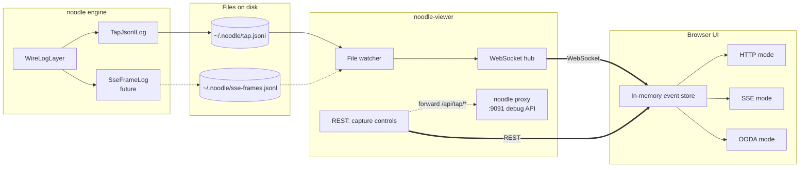

# Viewer architecture (`noodle-viewer`)

**Status:** Approved 2026-05-10. Implementation in progress.
**Supersedes:** Reliance on an external TAP viewer. TAP remains a
useful fallback but is not the long-term debug surface.

## Problem

We need to see what's flowing through noodle while we build it.
"Seeing" means three different things depending on what we're
debugging:

- **HTTP mode** — flat list of round-trip exchanges. Useful for
  *"did the proxy handle this request? what status came back? how
  long did it take?"* — including non-LLM traffic (MCP servers,
  Anthropic's auxiliary endpoints, OAuth, etc.).
- **SSE mode** — per-frame timeline of streaming responses, with
  arrival timestamps and vendor-specific event-type rendering
  (Anthropic's typed events vs OpenAI's `data:` deltas). Useful
  for codec validation and protocol-comparison.
- **OODA mode** — agent ↔ LLM conversation reconstruction.
  Sessions → turns → content blocks (`thinking`, `text`,
  `tool_use`, `tool_result`), with tool calls paired to results
  from the next turn, and sub-agent chains rendered as parent/child.

An external TAP viewer covers OODA mode well but is OODA-only —
bolting HTTP-flat and SSE-per-frame views onto its data model is more
work than designing fresh. Noodle's debug surface is also broader
(non-LLM HTTP, WebSockets eventually, multiple sinks), so we want a
viewer that maps cleanly onto our own data shapes.

## Non-goals

- Replacing the engine's wire log on stdout (`JsonStdoutLog`). That stays
  for jq-driven debugging and CI capture.
- Supporting the external `tap.jsonl` format as the *primary* contract.
  We continue to emit TAP-compatible JSONL via `TapJsonlLog` (so an
  external `tap-server` + viewer keep working as a fallback), but our
  viewer's data layer reads noodle's events directly and is not bound
  to that contract.

## Three modes, one event stream



The single in-memory event store is the architectural pivot.
**Modes are pure derived views over the same event stream** — switching
tabs is a client-only re-render, no fetch, no backend round-trip. This
falls out of treating the JSONL streams as append-only sources of truth
the client materializes into Exchange / Session / Turn / Frame views on
demand.

## Hexagonal architecture

```
┌──────────────────────────────────────────────────────────┐
│                   noodle-viewer (Rust)                   │
│                                                          │
│  Inbound ports                  Outbound ports           │
│  ┌────────────────┐             ┌──────────────────┐     │
│  │ EventSource    │             │ DebugProxy       │     │
│  │ (jsonl tail)   │             │ (forward         │     │
│  │                │             │  /api/tap/* →    │     │
│  │                │             │  noodle :9091)   │     │
│  └────────────────┘             └──────────────────┘     │
│         │                                ▲               │
│         ▼                                │               │
│  ┌──────────────────────────────────────┴────────┐       │
│  │            HubService                         │       │
│  │  - parses raw jsonl into typed events         │       │
│  │  - broadcasts to subscribers                  │       │
│  │  - serves UI assets (embedded)                │       │
│  └────────────┬──────────────────────────────────┘       │
│               │                                          │
│  Outbound port                                           │
│  ┌────────────▼─────────────┐                            │
│  │ ClientChannel (WS)       │                            │
│  └──────────────────────────┘                            │
└──────────────────────────────────────────────────────────┘
                │
                ▼
        ┌───────────────────┐
        │ React UI (TS)     │
        │  - WS subscriber  │
        │  - mode views     │
        └───────────────────┘
```

### Inbound port: `EventSource`

A trait the file watcher implements. Adapters today: `TapJsonlSource`
(for `~/.noodle/tap.jsonl`); future `SseFrameJsonlSource` (for the
deferred per-frame sink). Each adapter is a tokio task that watches
its file and pushes typed events on a channel.

### Outbound port: `ClientChannel`

A trait that broadcasts events to one connected client. The adapter is
a WebSocket connection. The same trait could later target SSE-to-the-
browser, gRPC-to-an-IDE-extension, etc. — debug viewers compose.

### Outbound port: `DebugProxy`

A trait that forwards capture-control verbs (`Status`, `Enable`,
`Disable`, `Clear`) to noodle's debug API. The adapter is a tiny HTTP
client targeting `127.0.0.1:9091`. Tests stub it.

### Service: `HubService`

Owns the in-memory state (recent events, capture status), parses
incoming raw lines into typed events, and serves the embedded UI. One
service, one set of invariants.

## Tech stack

- **Backend**: Rust binary (`crates/noodle-viewer/`). Uses `axum` (or
  `rama` if it adds nothing on top) for HTTP/WS, `notify` for fsnotify,
  `tokio` for async, `rust-embed` for static asset bundling, `serde` /
  `serde_json` for the wire shape.
- **Frontend**: React + TypeScript + Vite, lives in
  `crates/noodle-viewer/web/`. Built artifacts (`dist/`) are embedded
  into the Rust binary at compile time.
- **Single binary in release**: `cargo run --bin noodle-viewer` serves
  the UI and the WebSocket from one port. No separate file servers, no
  path configs.
- **Hot reload in dev**: Vite dev server runs separately
  (`cd web && npm run dev`) and proxies `/api/*` and `/ws` to the Rust
  backend. Only the React side hot-reloads; backend changes need a
  restart, which is fast.

## Data model

The server-side event stream is intentionally thin — the client
materializes higher-level views.

```rust
// Server emits these to the client over WS.
enum ServerMsg {
    /// One captured exchange line, parsed from tap.jsonl.
    Exchange(Exchange),
    /// One per-frame SSE event. Future, when SseFrameLog ships.
    SseFrame(SseFrame),
    /// Capture status changed (start/stop/clear).
    Capture(CaptureState),
}

struct Exchange {
    direction: Direction,    // request | response
    timestamp: String,       // RFC3339Nano
    event_id: String,        // pairs request and response
    provider: String,        // anthropic | openai | mcp | unknown
    session_hash: Option<String>,
    headers: Map<String, Vec<String>>,
    body: serde_json::Value, // object | string | null
}
```

The client builds:

- **`ExchangePair { request, response }`** — keyed by `event_id`. The
  fundamental unit of all three modes.
- **`Session`** — one or more pairs sharing `session_hash` (or
  synthesized identity for null hashes).
- **`SubAgentChain`** — `Session`s linked by sub-agent detection.
  OODA-mode-only.
- **`Turn`** — derived from a single chat-completion `ExchangePair`'s
  bodies (`request.body.messages` → user, `response.body.content` →
  assistant content blocks). OODA-mode-only.

Each derivation is a pure function. Mode switching costs a re-render,
not a re-derive of the whole store.

## Capture controls

The viewer's REST API is `/api/tap/{status,enable,disable,clear}`,
matching the external `tap-server` contract used by third-party TAP
viewers. The viewer backend forwards verbatim to noodle's debug API
at `127.0.0.1:9091`. The browser only talks to one host; operator can
reverse-proxy or change the noodle debug port without touching the
UI.

## Module structure

```
crates/noodle-viewer/
    Cargo.toml
    src/
        main.rs                 -- bin entry, arg parse, signal handling
        server/
            mod.rs              -- HTTP+WS server bootstrap
            assets.rs           -- rust-embed static asset routes
            ws.rs               -- WebSocket session lifecycle
            api.rs              -- /api/tap/* forward to debug proxy
        ports/
            mod.rs              -- trait definitions
            event_source.rs     -- EventSource trait
            client_channel.rs   -- ClientChannel trait
            debug_proxy.rs      -- DebugProxy trait
        adapters/
            mod.rs
            tap_jsonl_source.rs -- file watcher → events
            ws_client.rs        -- ClientChannel impl
            http_debug_proxy.rs -- DebugProxy impl
        hub.rs                  -- HubService (parsing, broadcast)
        model.rs                -- Exchange, ExchangePair, Session, ...
    web/
        package.json
        vite.config.ts
        tsconfig.json
        src/
            main.tsx
            App.tsx
            modes/
                HttpMode.tsx
                SseMode.tsx
                OodaMode.tsx
            components/
                CaptureControls.tsx
                ModeSwitcher.tsx
                ExchangeRow.tsx
                BodyViewer.tsx
                SessionList.tsx
                SubAgentChain.tsx
            store/
                events.ts       -- in-memory event store, WS subscriber
                derived.ts      -- pure derivations (pairs, sessions, turns)
                capture.ts      -- start/stop/clear API client
            lib/
                ws.ts
                api.ts
                parse_sse.ts
                ooda.ts
        tests/                   -- vitest
```

Each Rust file has its own `#[cfg(test)] mod tests`. Each TS module
has a sibling `.test.ts` file under `tests/`.

## Test strategy

- **Rust unit**: per-module — `tap_jsonl_source` (line splitting, fsnotify
  integration via temp file), `hub` (event broadcast under load),
  `http_debug_proxy` (request shape, error handling).
- **Rust integration** (`crates/noodle-viewer/tests/`): end-to-end
  spawn-server + WS-client + temp-file → assert events propagate.
  Capture-control proxy with a mock debug server.
- **TS unit (vitest)**: `derived.ts` (pair grouping, session grouping,
  turn parsing, sub-agent detection), `parse_sse.ts` (frame splitting),
  `ooda.ts` (content block extraction, tool pairing).
- **TS component**: smoke render of each mode with a fixture event
  list. Snapshot-based to catch accidental layout regressions.

## Performance posture

- **Backend**: single tokio task per file watcher; one tokio task per
  WS client. Broadcast via `tokio::sync::broadcast`. No per-event
  allocation beyond the parsed `Exchange`.
- **Client**: the in-memory store is bounded (default 5_000 most-recent
  events) — long sessions roll the front. Mode views recompute lazily;
  `useMemo` over the event slice.
- **Cold start**: opening the viewer with a populated `tap.jsonl`
  reads the file from offset 0 and replays. Bounded read (e.g. last
  10_000 lines) to avoid blowups on multi-day captures.

## Security

- **Bind to loopback only.** Default `127.0.0.1:9092`. The viewer
  shows redacted-but-still-sensitive request/response bodies; do not
  expose to the network without thinking.
- **No auth.** Local-debug tool. Add token auth before any non-loopback
  binding.
- **CORS**: not applicable when the UI is served from the same host.
  Disabled on `/api/*` for non-loopback origins as a belt-and-braces.

## Phasing

Implementation is decomposed into numbered stories under
`docs/features/012-…`. Story 1 lays the foundation (skeleton + WS +
HTTP-mode list + capture controls). Each subsequent story adds one
mode, one capability, or polish. See those files for concrete
acceptance criteria.
