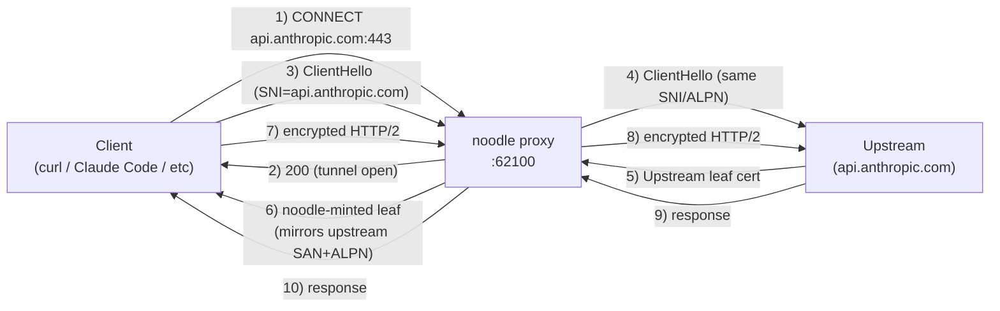
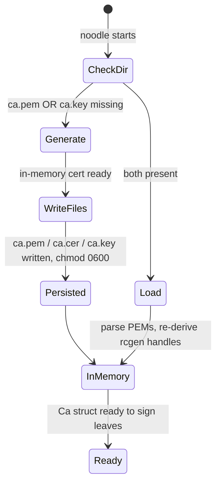
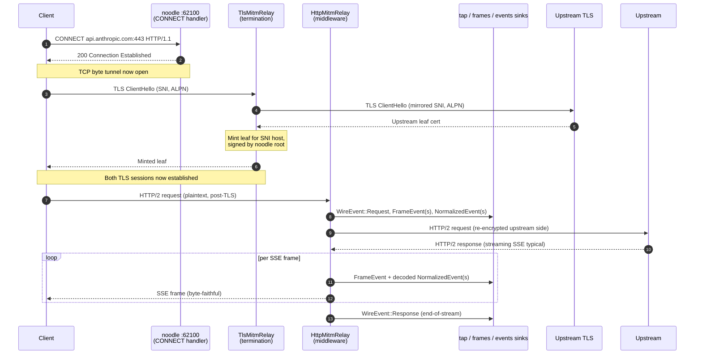
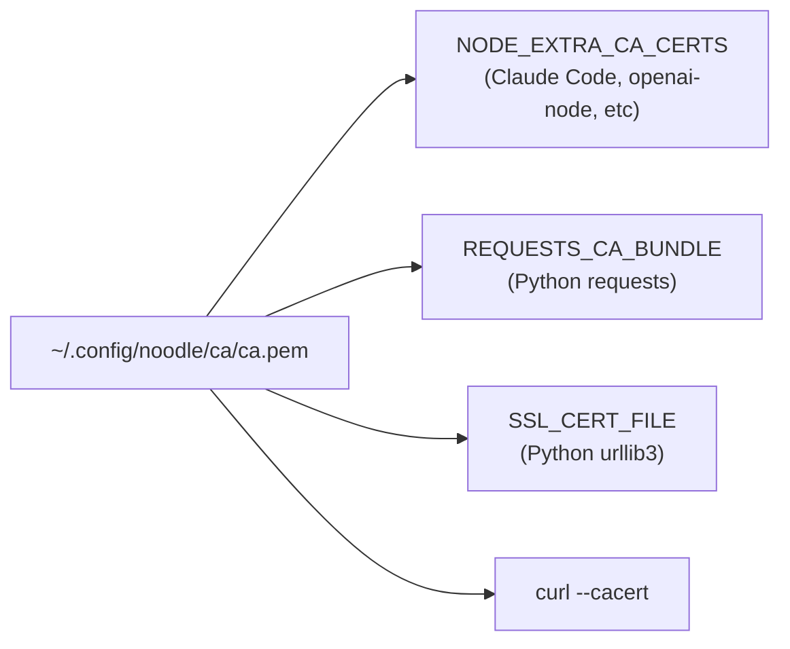

# TLS MITM and the noodle root CA

**Status:** Approved 2026-05-11. Implementation in `noodle-adapters`
(`src/tls/ca.rs`) and `noodle-proxy` (`src/mitm.rs`); shipped in
PR #1.
**Audience:** Anyone who's going to touch the MITM path, the cert
plumbing, or operator-facing trust setup. Written so an engineer in
their first year of TLS work can read it cold.

---

## 1. Why noodle does MITM at all

Noodle is an **attribution proxy**: it sits in front of LLM endpoints
(Anthropic, OpenAI, …) and observes traffic so we can tag, filter,
and inject. Real LLM endpoints speak HTTPS. If we only see TLS-encrypted
bytes, we see nothing useful. So the proxy has to **terminate** TLS
on the client side, observe (and optionally mutate) the plaintext,
and **re-originate** TLS to the upstream.

In TLS terms this is "man in the middle" — the client sees a noodle
certificate, not the upstream's. That's only OK because **the client
explicitly trusts our root CA**. Without that explicit trust, every
client would (correctly) refuse the connection.

### What we promise

- The plaintext never leaves the noodle process. Sinks (`tap.jsonl`,
  `frames.jsonl`, `events.jsonl`) are local files; the operator
  controls them.
- We don't substitute, modify, or fake any byte we're not entitled
  to modify. Bytes-to-the-client are the upstream's bytes unless an
  attribution filter / injector is explicitly registered for that
  body shape.
- The root CA is generated **on the operator's machine** and never
  leaves it. There's no shared "noodle root" out there in the wild.

### What we don't promise (yet)

- We don't pin upstream certs. A compromised upstream cert is a
  compromised upstream.
- We don't run any cert revocation (OCSP / CRL). On a 3-year root
  with the only relying parties being the operator's own clients,
  rotation-by-regeneration is the recovery story.
- We're not (today) a defense against a hostile process on the same
  machine. The CA key is on disk at `~/.config/noodle/ca/ca.key`
  with `chmod 0600` — that's the boundary. If something runs as
  the same user, it can read the key.

---

## 2. Glossary (skip if you know it)

- **CA (Certificate Authority)** — the entity that signs other
  certificates. Browsers trust a fixed set of CAs out of the box;
  any cert ultimately signed by one of those CAs is considered
  authentic.
- **Root CA** — a self-signed cert that signs other certs. Noodle's
  root is `~/.config/noodle/ca/ca.pem`.
- **Leaf cert** — the cert a *server* presents to *clients* at
  TLS handshake. Server name written in CN / SAN; signed by some
  CA. Browsers chase the signature chain back to a root they
  trust.
- **Chain of trust** — leaf → intermediate(s) → root. Noodle has
  no intermediates today; the noodle root signs leaves directly.
- **SNI (Server Name Indication)** — the hostname the client sends
  in the TLS handshake before encryption starts. Tells the server
  *"I want to talk to api.anthropic.com"*. We read it to know
  which leaf to mint.
- **ALPN (Application-Layer Protocol Negotiation)** — TLS extension
  the client and server use to agree on h2 vs http/1.1. We mirror
  the upstream's ALPN choice on the leaf so the client gets the
  same protocol it would have gotten without us.
- **SAN (Subject Alternative Name)** — the list of hostnames a cert
  is valid for. Modern TLS ignores CN and only checks SAN.
- **CONNECT** — the HTTP method a client uses to ask a proxy to open
  a raw byte tunnel. The client typically does this *before* TLS,
  saying *"connect me to api.anthropic.com:443"*; the proxy normally
  replies with a 200 and forwards bytes. Noodle replies with 200
  too, but then **terminates** the TLS coming through that tunnel
  instead of just forwarding it.

---

## 3. The 30-second mental model



There are **two distinct TLS sessions**, both terminating at the
proxy. The plaintext only exists inside the noodle process. The
client sees a leaf the proxy minted; the upstream sees a fresh TLS
connection from the proxy.

---

## 4. The CA (root certificate)

### 4a. Layout on disk

```
~/.config/noodle/ca/   (mode 0700)
├── ca.pem    (mode 0644)  public CA cert, PEM-encoded
├── ca.cer    (mode 0644)  same bytes as ca.pem, .cer ext for macOS
└── ca.key    (mode 0600)  private key, PEM-encoded PKCS#8
```

Only `ca.key` is sensitive — leaking it lets an attacker mint leaves
that any operator who trusts noodle's CA will accept. `ca.pem` is
public; that's *the* thing operators install into trust stores.

### 4b. Bootstrap — first run vs subsequent runs



The contract: **same directory → same root, run after run**. If you
trust the CA in your browser once, you keep trusting it. Deleting
either file forces a regeneration with a new fingerprint, and you
have to re-trust.

Code: `Ca::generate_or_load` in
`crates/noodle-adapters/src/tls/ca.rs:119`.

### 4c. What the cert looks like

```
Subject:    CN=noodle MITM root CA, O=noodle
Issuer:     CN=noodle MITM root CA, O=noodle      ← self-signed
Validity:   3 years from generation
            (back-skew: -48h, so freshly-minted certs work on
             clients with slightly-fast clocks)
Algorithm:  ECDSA P-256 (PKCS_ECDSA_P256_SHA256)
KeyUsage:   keyCertSign, cRLSign
BasicConst: CA:TRUE, no path length limit
```

ECDSA P-256 was chosen over RSA-2048 because it's smaller and faster
with no compatibility cost (every modern client accepts P-256).

---

## 5. Per-host leaves — minted on demand

The root only **signs** other certs. The actual certs servers
present to clients are short-lived leaves the proxy mints when a
client connects.

### 5a. When a leaf is minted

```mermaid
sequenceDiagram
    participant C as Client
    participant P as noodle (TlsMitmRelay)
    participant Cache as Leaf cache
    participant U as Upstream

    C->>P: TLS ClientHello (SNI=api.anthropic.com)
    P->>Cache: Look up "api.anthropic.com"
    alt cache hit
        Cache-->>P: cached leaf (signed by noodle root)
    else cache miss
        P->>U: Open TLS (SNI=api.anthropic.com)
        U-->>P: Real upstream leaf cert
        Note over P: Read upstream cert:<br/>subject, SAN list, key usages
        P->>P: Mint new leaf with mirrored SAN+CN,<br/>sign with noodle root key
        P->>Cache: Store {api.anthropic.com → minted leaf}
    end
    P-->>C: Minted leaf
    Note over C,P: TLS handshake completes;<br/>client encrypts to proxy
```

**Single-flight**: if two concurrent requests hit `api.anthropic.com`
before either's leaf is cached, only one upstream handshake fires.
The second request waits for the first to populate the cache. This
prevents a thundering herd under load and is provided by
[rama's `CachedBoringMitmCertIssuer`](https://github.com/plabayo/rama)
out of the box — we don't implement it ourselves.

### 5b. What we mirror from upstream

| field | what we copy | why |
|---|---|---|
| **CommonName** | from upstream subject | legacy clients still inspect CN |
| **SAN list** | full DNS / IP list from upstream | modern clients trust SAN, not CN |
| **ALPN** | upstream's chosen protocol (h1 / h2) | client gets the same protocol it would have natively |
| **Validity window** | a short window (rama default) | leaves are ephemeral; in-memory cache is the system of record |

What we don't copy:

- **Public key** — it's our key (rama's per-leaf keypair); we can't
  use the upstream's because we don't have their private key.
- **Issuer** — we set it to noodle's root, not the upstream's real
  CA. That's literally the point.
- **OCSP / CT / SCT extensions** — irrelevant; we're not in the
  public PKI.

### 5c. Cache lifetime

The leaf cache lives in process memory only. When noodle restarts,
the cache is gone and the first request to each host re-mints. This
is fine: a fresh restart is a few hundred ms of warm-up, and the
on-disk root key is the only durable secret.

If you ever need to evict a stale leaf (rare — for example, the real
upstream rotated its cert and we'd like to mirror the new SAN list),
restart noodle.

Code: `mitm::build_mitm_service` at
`crates/noodle-proxy/src/mitm.rs:71`, specifically the
`TlsMitmRelay::new_cached_in_memory(crt, key)` call.

---

## 6. The full request flow



The key invariant: the **client never sees an upstream byte before
the proxy has passed it through** (and observed it). The reverse —
bytes from the client to upstream — is the same shape, just narrower
(no streaming).

---

## 7. Trust model — how clients accept noodle's cert

For a client to talk to a noodle-MITM'd endpoint without errors, it
has to trust noodle's root CA. The CA is **per-machine**, so this
trust is local; nobody else is trusting noodle's certs.

Three ways to install:

### 7a. Per-tool env var (recommended, lowest blast radius)



Only the tool you point at the CA trusts it. Easiest to undo (just
unset the env var). Use this for routine development.

### 7b. macOS user keychain

```sh
make ca-trust-macos    # security add-trusted-cert -k login.keychain ...
make ca-untrust-macos  # rollback
```

Now every macOS-native client (Safari, Mail, anything using
SecureTransport) trusts noodle's leaves. Broader blast radius —
use it when you're running through a tool that doesn't honour env
vars.

### 7c. System trust store (not recommended for general use)

You *can* drop `ca.pem` into `/Library/Keychains/System.keychain`
or `/etc/ssl/certs/`. Don't, unless you're certain you need it.
Every process on the box will trust noodle's certs at that point.

---

## 8. Threats considered

### 8a. Attacker gets `ca.key` on disk

They can mint leaves that any operator who's installed noodle's CA
will accept. Mitigations:

- File is `chmod 0600` and parent dir `0700`; only the operator
  user can read it.
- The CA is per-machine, so a key from one box doesn't poison
  another box.
- No remote attestation: we don't claim to defend against a
  process running as the same user. If that's your threat model,
  noodle is not the answer (use a hardware-backed keystore /
  HSM-based proxy).

### 8b. Operator forgets they installed the CA

When noodle is uninstalled or rotated, the trust relationship
persists in whatever keystore the operator updated. We don't auto-
remove on `make ca-untrust-macos` failure; we surface the
mechanism explicitly.

- The cert's 3-year validity is the upper bound. Even if the
  operator forgets, no signed leaf is valid more than 3 years
  later.
- `make ca-untrust-macos` reverses keychain installs.

### 8c. Upstream returns a malicious cert

Upstream-side TLS still validates against the system roots — noodle
re-originates TLS to the upstream as a normal client. If the
upstream is presenting a cert that doesn't chain to a real public
CA, the upstream-side handshake fails and we surface a 502 to the
client. We don't strip or downgrade upstream cert checks.

### 8d. Client sends bytes that are not HTTP

The MITM stack peeks for HTTP after TLS termination. Non-HTTP
plaintext (e.g. WebSocket upgrade that we don't recognise) falls
through to `IoForwardService`, which byte-forwards without
decoding. The plaintext is still inside the noodle process at
that point — same trust posture — but it isn't captured into
sinks because we don't have a parser for it.

---

## 9. Operator runbook — checklist

When everything works:

```sh
# 1. Start noodle. First boot creates ~/.config/noodle/ca/.
make run-release

# 2. Point one tool at the CA. Pick the lowest-blast-radius option.
export NODE_EXTRA_CA_CERTS=$HOME/.config/noodle/ca/ca.pem
export HTTPS_PROXY=http://127.0.0.1:62100

# 3. Use the tool. Bytes flow through noodle; sinks populate.
make tap-tail   # or make frames-tail / make events-tail
```

When you want to rotate the CA (rare — e.g. the key was exposed):

```sh
# 1. Stop noodle.
make stop

# 2. Remove the CA dir.
rm -rf ~/.config/noodle/ca

# 3. Remove the trust install (macOS only).
make ca-untrust-macos

# 4. Start noodle. New CA generated.
make run-release

# 5. Re-install the new CA per §7.
```

---

## 10. Where to read more

- **rama's TLS MITM internals** —
  `rama-tls-boring/src/proxy.rs` (in the sibling rama checkout
  at `../rama`). Look for `TlsMitmRelay::new_cached_in_memory` and
  the `CachedBoringMitmCertIssuer<InMemoryBoringMitmCertIssuer>` it
  wraps.
- **Cert generation in noodle** —
  `crates/noodle-adapters/src/tls/ca.rs`. The whole CA module is
  under ~330 lines; read it.
- **MITM service wiring** —
  `crates/noodle-proxy/src/mitm.rs`. Shows how `TlsMitmRelay`,
  `HttpMitmRelay`, and the inspection middleware stack connect.
- **Operator runbook** — [`demos/end-to-end-demo.md`](../../demos/end-to-end-demo.md)
  §4 drives a real client through the MITM; `docs/guides/demo.md`
  §2 shows how to verify the minted leaf.
- **Why we use boring (not rustls)** — TLS MITM needs to mint and
  serve certs at runtime; the boring-tls / openssl bindings have
  the more complete API for that.

---

## 11. Common questions

**Q: Can I share noodle's CA across machines?**
A: Don't. The CA is per-machine by design — sharing the key
multiplies your attack surface for no real gain. Each developer
runs their own.

**Q: Why ECDSA, not RSA?**
A: P-256 is smaller, faster, and accepted everywhere noodle cares
about. RSA-2048 would also work; we picked the better default.

**Q: Why 3-year validity? Public CAs are moving to 90 days.**
A: The 90-day push is for the *public* PKI (Let's Encrypt, etc.) and
is driven by auto-renewal infrastructure. A local development CA
doesn't have that infrastructure — a shorter validity here just
forces operators to re-trust every 90 days for zero security
benefit. If we ever ship a hosted noodle, this number gets revisited.

**Q: Can I use a CA I already have?**
A: Not via the current `generate_or_load` path. If you point the CA
directory at pre-existing `ca.pem` + `ca.key` files, noodle will
load them and use them — that's literally what `Ca::load` does. The
only constraint is that the cert must be a valid CA (`BasicConst:
CA:TRUE`) and the key must match.

**Q: What happens to in-flight requests when I restart noodle?**
A: They fail. The TLS session is bound to the proxy process; killing
it closes both sides. Clients see a connection reset. There's no
graceful drain across restart today — `make stop` waits for
in-flight requests to settle before exit, but a hard `kill -9` won't.
