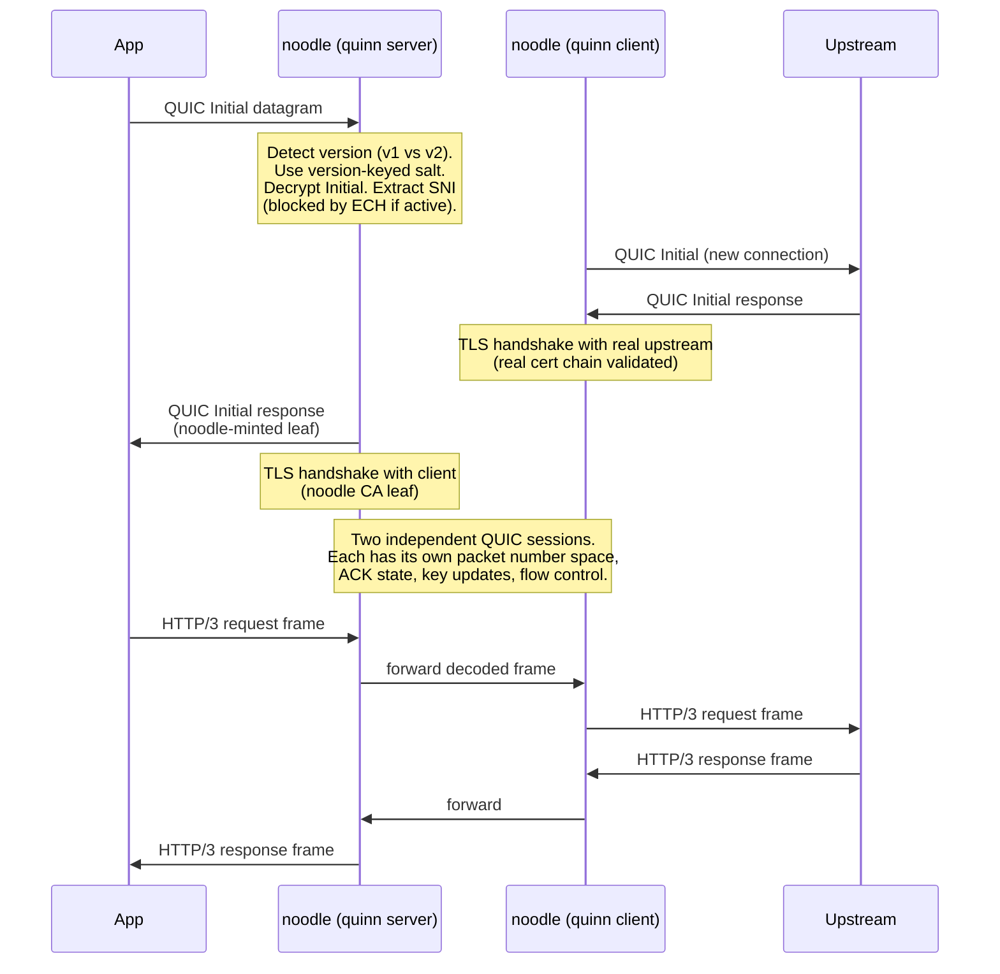

# ADR 014 — QUIC MITM engineering plan

**Status:** sub-stages 013.a / 013.b / 013.c — not yet a numbered backlog
row. The macOS entry transport that delivers QUIC flows to noodle is
specified in ADR 037.

**Scope.** Once a QUIC UDP datagram reaches the noodle process (via the
entry transport in ADR 037), what does noodle do with it? Three answers,
sequenced — suppress, drop, and full MITM. This document specifies the
policy for each and the engineering plan for the MITM option.

**Audience:** assumes
[`../knowledge/quic-and-http3-primer.md`](../knowledge/quic-and-http3-primer.md) —
why QUIC is a problem for HTTP proxies, the Chromium CA-trust constraint,
ECH, and QUIC v2.

**Related:**
- [`011-tls-mitm-and-ca.md`](011-tls-mitm-and-ca.md) — TCP TLS MITM design (the analogue for the TCP path).
- [`037-entry-transport.md`](037-entry-transport.md) — how QUIC UDP flows arrive at the noodle process, per OS.
- [`015-layered-codec-architecture.md`](015-layered-codec-architecture.md) — the codec stack this MITM plugs into.

---

## 1. The three options for QUIC traffic

Once the entry transport hands noodle a UDP datagram that is a QUIC
Initial packet, noodle has three viable responses, listed in order of
increasing engineering cost and increasing coverage.

| Option | What it does | Where the policy is expressed | Engineering cost |
|---|---|---|---|
| **A — Suppress** | Strip `alpn=h3` and `ech=` from DNS HTTPS / SVCB records for target origins. The client never tries QUIC; falls back to TCP+TLS and noodle's existing TLS MITM (ADR 011) handles it. | DNS-rewrite rule in `NEDNSProxyProvider` (macOS) — the mechanism is in ADR 037 §3.3; the rule is the policy. | Trivial — the mechanism already exists; the rule is data. |
| **B — Drop** | Claim the UDP flow at the entry transport and discard packets in both directions. Client's QUIC handshake times out (~100ms), then falls back to TCP. | Dispatch-table entry (ADR 025) routing UDP-to-target-host to a `drop` capability. | Cheap — a few lines in the entry transport's UDP path. |
| **C — MITM** | Terminate the client's QUIC connection, mint a leaf certificate, decrypt the QUIC handshake and HTTP/3 frames, re-originate a QUIC connection to the upstream. Feed the plaintext HTTP/3 frames into the same codec stack that handles HTTP/2. | A `noodle-quic-mitm` crate on top of `quinn` + `h3`. | Substantial — see §5. |

**Recommendation: ship all three, sequenced. They compose; they do not
compete.** Phase 1 (suppress + drop) is in flight as part of story 011
and uses the entry-transport mechanisms in ADR 037. Phase 2 (MITM) is
the substantive engineering work in this document.

---

## 2. Option C — QUIC MITM (the engineering plan)

The entry transport (ADR 037) claims the UDP flow and forwards it to noodle.
noodle runs a Rust port of mitmproxy's `quic/` layer on top of
`quinn` (with `h3` for HTTP/3 framing) — terminates the client's
QUIC connection, mints a leaf cert, decrypts, inspects HTTP/3
frames, re-originates a QUIC connection to upstream. This is what
015's "every transport is a codec" premise demands: a codec stack
that goes from L0 (UDP) through L1 (QUIC) through L2 (HTTP/3) and
plugs into the same L3+ stack that today serves HTTP/2.

**Four named constraints — each has a proven solution. None is a
deferral reason.**

**Constraint 1: Chromium does not trust user-added CAs for QUIC
connections.** Confirmed in 013 §4 and §13. Chromium (Chrome,
Edge, *and all Electron-based apps including Claude Desktop*)
rejects a locally-trusted certificate presented over QUIC and
silently falls back to HTTP/2 over TCP. For *Chromium-based*
targets, Option C's leaf cert will be refused over QUIC, and the
client falls back to TCP which Options A/B handle. **This is not
a reason not to build Option C** — it is a reason Option C alone
is not sufficient for the Chromium subset. The Chromium-CA
constraint is one client class out of many; the others use Option
C as designed:
- **Firefox** trusts local CAs over QUIC today — Option C produces
  plaintext HTTP/3.
- **curl --http3**, **Python aioquic**, **Go HTTP/3 clients**, and
  most native iOS/macOS NWConnection apps trust the system trust
  store (which we populate) — Option C works.
- **Anthropic's official SDKs** are Python (`anthropic` PyPI
  package) and TypeScript / Node — both honor `NODE_EXTRA_CA_CERTS`
  /  `REQUESTS_CA_BUNDLE`. If those SDKs move to HTTP/3, Option C
  is the *only* mechanism that surfaces the request body for
  attribution. Options A/B make them invisible-via-fallback or
  invisible-via-drop respectively.
- **Option C is also additive observability for the Chromium
  case** — we see the QUIC attempt and the fallback, both of which
  are telemetry we don't have today.

**Constraint 2: QUIC v2 (RFC 9369) uses a different Initial-packet
salt.** Cloudflare's edge negotiates v2 with capable clients
(`claude.ai` is Cloudflare-fronted). A port that hardcodes v1's
salt sees v2 Initials as opaque. *Solution: version-keyed salt
table* (~30 lines) plus a `KNOWN_QUIC_VERSIONS` detection set
(~30 lines). mitmproxy maintains theirs separately from aioquic;
we own ours.

**Constraint 3: Encrypted Client Hello (ECH).** If the DNS HTTPS
record carries `ech=` and the client uses it, the inner SNI is
encrypted with the server's HPKE public key. The QUIC Initial
decrypts cleanly (we have the salt), but the ClientHello's SNI is
opaque. Without SNI we can't mint the right leaf certificate.
*Solution: strip `ech=` from DNS HTTPS records* — the same
interception path Option A uses for `alpn=h3`. Option C is
*additive* on top of Option A's DNS infrastructure, not an
alternative to it. Cloudflare already ships ECH for free-tier
domains; we'd ship ECH stripping as part of Option A and Option C
inherits it.

**Constraint 4: 0-RTT replay protection.** Clients with a cached
session send application data in the *first* UDP packet, encrypted
with keys from a previous session. The TLS 1.3 spec acknowledges
0-RTT is replay-vulnerable; servers must either disable 0-RTT for
non-idempotent requests or implement replay detection. *Solution:
port mitmproxy's `_stream_layers.py` 0-RTT logic* — replay-marker
tracking and the policy decision. ~150 lines of the 638 in that
file are specifically 0-RTT handling.

**What Option C costs to build.**

The scope is real but bounded — mitmproxy's Python QUIC layer is
a reference implementation we port, not a research project.

| Component | mitmproxy source (Python) | Estimated Rust port |
|---|---|---|
| QUIC version detection set | `addons/next_layer.py` `KNOWN_QUIC_VERSIONS` | ~30 lines |
| Version-keyed Initial-packet salt table | derived from RFC 9000 + 9369 | ~30 lines |
| ClientHello parser (extract SNI from encrypted Initial) | `_client_hello_parser.py` (111 lines) | ~200 lines on `quinn`'s lower-level APIs |
| MITM splice (`ClientQuicLayer` + `ServerQuicLayer`) | `_stream_layers.py` (638 lines) | ~1000 lines |
| Stream multiplexer + raw QUIC frame handling | `_raw_layers.py` (433 lines) | ~600 lines |
| Message types (`_commands.py` + `_events.py` + `_hooks.py`) | ~240 lines | ~300 lines |
| **Total** | | **~2100 lines of Rust** |

Library landscape:

- **`quinn`** — Rust QUIC stack. Provides `Endpoint::server` +
  `Endpoint::client`, custom certificate resolvers via
  `ServerConfig::with_cert_resolver`, manual handshake control.
  No MITM mode out of the box but the primitives are there.
- **`h3` (Hyperium)** — HTTP/3 framing on top of `quinn`. Used by
  production HTTP/3 servers and clients. Handles QPACK, frames,
  flow control.
- **`quiche` (Cloudflare)** — alternative QUIC stack we could
  evaluate. Used at Cloudflare's edge so it's battle-tested
  against the same servers we're intercepting. Lower-level than
  quinn; trade-off is more work for finer control.
- **`mitmproxy`** — reference Python implementation we port from.
- **`mitmproxy_rs`** — transport shim only; not a QUIC stack and
  not on a path to becoming one. We do the QUIC port ourselves.

Other implementations of value as references: `ngtcp2` (C),
`tquic` (Tencent, Rust), `s2n-quic` (AWS, Rust). The MITM-specific
pattern is identical across them — two endpoints, certificate
minting on the server side, real cert validation on the client
side, splice the streams.

Hard items that aren't lines-of-code:

- **Connection migration.** A QUIC connection isn't bound to a
  5-tuple; it's bound to a Connection ID. The client can change
  IPs mid-session. The extension tracks flows by Connection ID,
  not 5-tuple. mitmproxy solves this; we port the solution.
- **Key update handling.** QUIC rotates keys mid-connection.
  `quinn` handles this for each endpoint; the MITM has to keep
  the two endpoints' key schedules independent (they will rotate
  at different times) and not leak.
- **DNS infrastructure dependency.** Option C requires Option A's
  ECH-stripping to see SNI on ECH-protected origins. Option C is
  *additive* on top of Option A, not an alternative.

## 3. Recommendation — phased delivery

**Ship all three, sequenced.** They compose; they don't compete.

**Phase 1 (now, in Story 011):** Land DNS suppression (Option A)
and UDP blackhole (Option B) together as part of Story 011. DNS
suppression handles target origins surgically; blackhole catches
anything that slips through (cached `Alt-Svc`, missed origins,
unknown vendors). Operator gets immediate visibility into
`claude.ai` chat traffic with no QUIC stack yet built.

**Phase 2 (Story 013, the next major work):** Build Option C —
the Rust QUIC MITM crate on top of `quinn` + `h3`. Ship in three
sub-stages so each lands testable value:

- **013.a — QUIC interception scaffold.** UDP-flow forwarding from
  the extension to noodle, raw datagram passthrough (no
  termination yet), version detection + salt table, Initial
  decryption + SNI extraction. End state: noodle observes QUIC
  flows and identifies which client/server they belong to.
  Estimate: 2 weeks.
- **013.b — Single-direction termination.** Mint client-facing
  leaf cert, terminate the client's QUIC connection, originate a
  real QUIC connection to upstream, splice streams. HTTP/3 frame
  visibility for non-Chromium clients. Estimate: 3 weeks.
- **013.c — Connection migration, 0-RTT, key updates.** The
  hardening pass — handle the things production QUIC clients do
  in the wild. Estimate: 2 weeks.

Total Story 013 estimate: **~7 weeks for one engineer who's
comfortable with quinn and async Rust.** Each sub-stage is
independently mergeable and produces working telemetry.

**What Phase 2 buys us, beyond the architectural completeness:**

- **Firefox HTTP/3 visibility.** Firefox trusts local CAs over
  QUIC. Today this is invisible to noodle. Phase 2 surfaces it.
- **Native (non-Chromium) client visibility.** curl --http3,
  Python aioquic clients, Go HTTP/3, native NWConnection — all
  trust the system trust store we populate. Today they bypass
  noodle if they use HTTP/3. Phase 2 captures them.
- **Anthropic SDK future-proofing.** The Python and Node SDKs
  honor `*_CA_BUNDLE` env vars. If they adopt HTTP/3, Phase 1
  alone forces fallback for all of them; Phase 2 lets them keep
  HTTP/3 perf and still produces attribution telemetry.
- **Telemetry on the Chromium fallback itself.** Even when
  Chromium refuses our leaf over QUIC and falls back to TCP,
  Phase 2 lets noodle observe the failed QUIC attempt. That's
  data we don't have today.
- **Per-stream QUIC metrics.** Flow control state, key updates,
  0-RTT markers, ACK timing — none of this surfaces on TCP
  fallback. The viewer can expose it once we have it.

The architecture earns its keep: when Story 013 lands, the codec
layer gets a new transport stack (L0 UDP + L1 QUIC + L2 HTTP/3)
that feeds the same L3+ codec chain as HTTP/2. The provider-aware
codecs at L5 don't change. The viewer doesn't change. That's
[`006-extensibility-posture.md`](006-extensibility-posture.md)
and 015's "every layer is a codec" working as designed.

---

## 4. Concrete reuse plan

Entry-transport reuse (Swift Network Extension, IPC scaffolding, packet
sources) is covered by ADR 037 — that ADR specifies what noodle reuses
from `mitmproxy-macos/redirector/` and `mitmproxy_rs/src/packet_sources/`.
This section covers what noodle ports from mitmproxy's **QUIC layer**
specifically.

### 4.1 What we port (read theirs, write ours)

| What | Source | Lines | Notes |
|---|---|---|---|
| QUIC version detection | mitmproxy `addons/next_layer.py` `KNOWN_QUIC_VERSIONS` | ~30 (Py) | A small set of known QUIC version numbers (v1, v2, Google QUIC). Owned by us, not delegated to a library. |
| QUIC client-hello parser | `_client_hello_parser.py` | 111 (Py) | Port to Rust on `quinn`. Must use a **version-keyed Initial-packet salt table** (v1 vs v2 differ; see the QUIC primer). Quinn has lower-level packet APIs that make this clean. |
| QUIC dual-endpoint splice | `_stream_layers.py` | 638 (Py) | The meat of this engineering work. Becomes a `noodle-quic-mitm` crate built on `quinn`. Includes 0-RTT replay protection, key-update handling, connection migration. |
| QUIC stream multiplexer | `_raw_layers.py` | 433 (Py) | Pairs with above. |

### 4.2 What we don't port

- WireGuard mode. mitmproxy supports it for non-NE clients. Out of scope.
- Anything related to mitmproxy's Python addons system. Out of scope.

---

## 5. Phasing

Phase 1 (suppress + drop) is the entry-transport work in ADR 037 §3 plus
the dispatch-table entries in ADR 025. Not specified here.

Phase 2 (this ADR) is the QUIC MITM stack — sub-stages 013.a, 013.b,
013.c. Each sub-stage is independently mergeable.

*013.a — QUIC interception scaffold (~2 weeks):*

1. Add UDP-flow forwarding in the macOS extension. Flows matched
   by hostname (post-DNS) or remote IP get forwarded to noodle
   over the same IPC channel TCP flows use.
2. Stand up a `noodle-quic-mitm` workspace member on `quinn` +
   `h3`.
3. Version detection set (`KNOWN_QUIC_VERSIONS`: v1, v2, Google
   QUIC) and version-keyed Initial salt table.
4. Initial-packet decryption + SNI extraction (depends on Option
   A having stripped ECH at the DNS layer for target origins).
5. End state: noodle observes QUIC flows, identifies the client
   and server, logs each flow. No termination yet.

*013.b — Single-direction termination (~3 weeks):*

1. Certificate minting on the client-facing side, leveraging the
   existing TLS MITM CA from Story 011.
2. `quinn::Endpoint::server` config with our cert resolver.
   Terminate the client's QUIC connection.
3. `quinn::Endpoint::client` config originating a real QUIC
   connection to upstream, validating the real cert chain.
4. `h3` framing on both sides; splice HTTP/3 streams.
5. Plumb into `ProviderCodec` so HTTP/3 responses produce the
   same telemetry as HTTP/2 (provider-aware codec stays; only
   the transport changed).
6. End state: Firefox / curl --http3 / Python aioquic clients
   produce plaintext HTTP/3 telemetry in noodle.

*013.c — Hardening: connection migration, 0-RTT, key updates
(~2 weeks):*

1. Track flows by Connection ID, not 5-tuple. Handle IP changes
   mid-session.
2. Port mitmproxy's 0-RTT replay logic. Decide replay policy
   (likely: drop 0-RTT for non-GET requests, log markers
   everywhere).
3. Independent key schedules on the two endpoints. Verify no
   cross-endpoint key leakage during rotation.
4. End state: production-grade QUIC MITM.

Total Story 013 estimate: **~7 weeks**, one engineer comfortable
with quinn and async Rust. Each sub-stage is independently
mergeable. `mitmproxy` is the reference spec for the harder
chunks (013.b and 013.c).

We do the port ourselves — `mitmproxy_rs` is and remains a
transport shim, with no public roadmap toward a Rust QUIC stack.

---

## 6. Open decisions

1. **0-RTT replay policy.** Once 013.c lands, what does the splice do with replayed 0-RTT data? Drop on non-idempotent requests, mark every 0-RTT packet on the audit channel, or accept and rely on upstream replay detection. Likely answer: drop on non-idempotent requests, mark always. Decide when 013.c implementation forces it.
2. **QUIC library choice.** `quinn` is the default. `quiche` is the alternative and is what Cloudflare runs at their edge — same servers we're MITM'ing. The trade-off is `quinn`'s higher-level API vs `quiche`'s lower-level control. Default to `quinn`; revisit only if a real handshake-compat issue surfaces.
3. **HTTP/3 framing crate.** `h3` (Hyperium) on top of `quinn` is the default. Alternative is `quiche` (which has HTTP/3 built in). Same trade-off as #2.
4. **`InspectionConf` shape for QUIC.** Today's macOS InterceptConf carries hostnames; QUIC needs hostname-or-SNI matching plus the option to claim post-DNS-resolution by IP. Pin the schema when 013.a wires the entry-transport handoff.

Out of scope for this ADR but pinned for forward reference: the dispatch-table entries that express Option A (DNS rewrite for `alpn=h3` and `ech=` stripping) and Option B (UDP-to-target-host drop) are specified in ADR 025.

---

