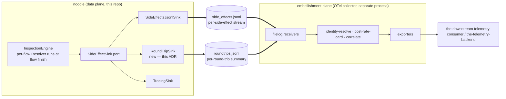

# 023 — Round-trip telemetry records and correlation IDs

**Status:** current.
**References:** 004 (attribution model — `Hint` / `Resolved`
semantics), 008 (session hierarchy — turn / round-trip / agent
run / sub-agent definitions; external knowledge), 015 §5
(side-channel buses), 020 §2.1 (`SideEffectSink` port), 022 rev 2
(two-process boundary — file-based interchange to the
collector), 027 (the sibling `tap.jsonl` format), 038 (the sibling
`side_effects.jsonl` wire format). Viewer reference:
`crates/noodle-viewer/web/src/store/derived/ooda.ts`
(`foldIntoTurns`, `groupIntoAgentRuns`, `pairToolsAcrossTurn`)
— the existing inference logic this ADR ports into the data
plane.

**System diagram:** [`../diagrams/system-architecture.drawio`](../diagrams/system-architecture.drawio).


---

## 1. Context

The telemetry write contract is the load-bearing edge of the
attribution product. Slices 031.a/b/c and item 2's Detector
slice closed the inspection loop into `side_effects.jsonl`;
ADR 022 rev 2 pinned the two-process boundary (noodle writes
files; the collector tails them). Job one for shipping is
turning that file into a telemetry feed that downstream
consumers (the downstream telemetry consumer primary; OTel vendors as a generalisation)
can ingest as one record per LLM round trip.

The shipped `side_effects.jsonl` does not satisfy this directly.
Its records are per-`SideEffect` (one `Hint`, one `Artifact`,
one `Audit`, or one `Resolved` per line). A consumer that wants
one row per round trip must correlate these by `flow_id` to
reconstruct the round trip. That correlation work belongs in
the data plane.

A round trip is also not the only useful unit. Per ADR 008:

- **Round trip** = one HTTP request/response pair.
- **Turn** = one user intent → final agent answer; 1–N round trips.
- **Agent run** = one agent persona within a session; 1–N turns.
- **Session** = one client connection; 1–N agent runs.

`tool_use` is an output-side block; the corresponding
`tool_result` is an input-side block on the next round trip.
Tool chains span round trips within a turn. Attribution markers
(`<noodle:work_type>`) typically arrive in one round trip but
semantically apply to the whole turn.

The data plane needs to emit enough correlation information that
the consumer can roll up round trips to turns, agent runs, and
sessions cheaply — without buffering across round trips in
noodle.

## 2. Decision

Five additions, no breaking changes to the trait surface.

### 2.1 New file: `roundtrips.jsonl`

One JSONL line per completed HTTP round trip. Self-contained:
request meta + response meta + attributions + usage + the
contributing hints, artifacts, and audits + correlation IDs.

- Default location: `$HOME/.noodle/roundtrips.jsonl`.
- Configurable via the same plumbing as
  `SideEffectsJsonlSink`'s path.
- Written at flow finish; one line per `flow_id`.
- Wire format pinned in §4.

### 2.2 New sink: `RoundTripSink`

A new `SideEffectSink` implementation in `noodle-adapters` that:

1. Buffers per-flow side-effects (`Hint`, `Artifact`, `Audit`)
   indexed by `flow_id`.
2. At flow finish — signalled by receiving a `SideEffect::Resolved`
   on the bus or by an explicit flow-end notification from the
   engine — assembles the per-flow buffer into a single
   `RoundTripRecord`.
3. Writes one JSONL line to `roundtrips.jsonl`.
4. Drops the per-flow buffer.

The sink composes alongside `SideEffectsJsonlSink` and
`TracingSink` under `MultiSideEffectSink`. The two files —
`side_effects.jsonl` and `roundtrips.jsonl` — are siblings;
both populated from the same `SideEffect` stream by sibling
sinks.

The buffer is bounded per-flow (small constant; a flow's
side-effect set is on the order of tens of records). Total
memory is bounded by `concurrent_flows × buffer_per_flow`.

### 2.3 Correlation ID set on every record

Every record in every JSONL file the data plane writes (today:
`side_effects.jsonl`; new: `roundtrips.jsonl`; future:
whatever) carries the same four correlation IDs:

| Field | Identifies | Source |
|-------|-----------|--------|
| `session_id` | One client connection | Already shipped; `SessionKey::id()` derives from `Authorization` + `x-noodle-session` headers |
| `agent_run_id` | One agent persona within a session | Minted by noodle on system-prompt change (§2.5) |
| `turn_id` | One user intent → final agent answer | Minted by noodle on detected turn start (§2.4) |
| `flow_id` | One HTTP round trip | Already shipped; engine-assigned per flow |

`session_id` already lands on `ResolvedRecord` as
`session_prefix`. The other three are new fields on the
emitted facts; downstream code only ever reads them, never
mints them.

The IDs are noodle-minted ULIDs except `session_id` (existing
hash). The consumer correlates by them but does not reconstruct
them.

### 2.4 Turn boundary detection

The data plane mints a new `turn_id` when:

1. **First round trip of a session.** `turn_id` ← new ULID.
2. **Previous round trip in the same session ended with a
   `stop_reason` other than `tool_use`** (i.e., `end_turn`,
   `max_tokens`, anything else, including no `stop_reason` on
   protocol error). `turn_id` ← new ULID.
3. **Otherwise (previous `stop_reason == "tool_use"`)** the
   current round trip continues the same turn. `turn_id` ←
   carried from the previous round trip in the session.

This rule is the same as the viewer's `foldIntoTurns` in
`crates/noodle-viewer/web/src/store/derived/ooda.ts:712`. The
viewer infers it from `ExchangePair[]` after the fact. ADR 023
moves that inference into the data plane so the `turn_id`
travels with every emitted record and the consumer does not
have to recompute it.

State required: per-session, the latest `(turn_id, last_stop_reason)`.
Stored on the `Session` (or an extension of it). Updated at
round-trip finish, before the next round trip's open.

The `stop_reason` is observable on the response side from
`message_delta.stop_reason` events in the SSE stream. The
data-plane decode already sees these; surfacing them to the
Session is a small addition.

### 2.5 Agent run boundary detection

The data plane mints a new `agent_run_id` when:

1. **First round trip of a session.** `agent_run_id` ← new
   ULID.
2. **The canonical system prompt of the round trip differs
   from the current agent run's canonical system prompt.**
   `agent_run_id` ← new ULID.

Canonical system prompt = the request body's `system` field,
text concatenated across `{type:"text", text}` blocks, with the
`x-anthropic-billing-header` block stripped (it varies per
request but is not part of the effective system prompt). This
is the same definition as the viewer's `systemPromptCanonical`.

State required: per-session, the latest
`(agent_run_id, canonical_system_hash)`. Stored alongside the
turn state.

**Sub-agent vs tool-context distinction is out of scope.** The
wire signal "system prompt changed within a session" can mean
either (a) the model spawned a real sub-agent via the `Agent`
tool, or (b) a tool internally swapped the prompt. v1 mints a
new `agent_run_id` on every change and treats them uniformly.
Consumers that want to distinguish layer interpretation on top
using the `Agent` tool's `tool_use_id` (visible in the round-
trip record's `tools_invoked`).

### 2.6 Tool correlation

`tool_use` and `tool_result` are correlated by the model's
`tool_use_id`. The data plane does not mint anything for tools;
it surfaces the protocol's IDs verbatim.

The `RoundTripRecord` carries:

- `tools_invoked: [{id, name, ...}]` — from `tool_use` blocks
  in the response side.
- `tools_resolved: [{tool_use_id, name, is_error}]` — from
  `tool_result` blocks in the request side that match a prior
  `tool_use_id`.

A consumer that wants the tool chain reconstructs from these
by `tool_use_id` join.

Extraction depends on item 5 (story 032 — L5 coverage for
`tool_use` → `ToolCall`). Until item 5 lands, the lists are
populated best-effort from the legacy decoder and may be
incomplete on the layered path.

### 2.7 Late-arriving attributions

The Resolver runs at flow finish. The `Resolved` map is part of
the `RoundTripRecord`. Attribution markers that arrive in later
round trips of the same turn are written to those later
round trips' records, not back-patched into earlier ones.

The consumer is responsible for back-propagating the attribution
to the turn's earlier round trips via a `turn_id` join. Noodle
does not buffer across round trips. The streaming write
contract is preserved.

This is an explicit non-decision for noodle: per-turn buffering
would couple the data plane to turn-end detection (no clean
signal exists; `end_turn` is reliable but `max_tokens` and
protocol errors are not) and would block emission until turn
end, which contradicts the durable-buffer property of the file
boundary.

## 3. Architecture



Both JSONL files share the corrected ADR 022 file boundary.
Both are ingested by the collector's `filelog` receiver.
`roundtrips.jsonl` is the primary consumer feed; `side_effects.jsonl`
is retained for fine-grained debugging and as the substrate
the `RoundTripSink` aggregates from.

## 4. `RoundTripRecord` wire shape

One JSON document per line in `roundtrips.jsonl`. All times
are epoch-milliseconds. Optional fields are omitted (never
emitted as `null`) when unknown.

```json
{
  "kind": "round_trip",
  "session_id": "abc12345-...",
  "agent_run_id": "01HXYZA...",
  "turn_id": "01HXYZB...",
  "flow_id": 12345,
  "started_at_unix_ms": 1779000000000,
  "completed_at_unix_ms": 1779000001234,
  "duration_ms": 1234,
  "request": {
    "host": "api.anthropic.com",
    "endpoint": "/v1/messages",
    "method": "POST",
    "user_agent": "Claude-Code/2.1.143 (...)",
    "model": "claude-3-5-sonnet-20241022",
    "directive_injected": true,
    "tools_resolved": [
      {"tool_use_id": "toolu_abc", "name": "Read", "is_error": false}
    ]
  },
  "response": {
    "status": 200,
    "kind": "sse",
    "complete": true,
    "stop_reason": "tool_use",
    "tools_invoked": [
      {"id": "toolu_def", "name": "Write"}
    ]
  },
  "attributions": {
    "tool": "Claude Code",
    "work_type": "refactor"
  },
  "usage": {
    "input_tokens": 1234,
    "output_tokens": 567,
    "cache_read_tokens": 100,
    "cache_write_tokens": 0
  },
  "evidence": {
    "hints":     [ /* SideEffect::Hint wire shapes per ADR 020 §5.1 */ ],
    "artifacts": [ /* SideEffect::Artifact wire shapes */ ],
    "audits":    [ /* SideEffect::AuditEvent wire shapes */ ]
  }
}
```

### 4.1 Field semantics

| Field | Type | Required | Meaning |
|-------|------|----------|---------|
| `kind` | `"round_trip"` | yes | Discriminator. Distinguishes from future record shapes (e.g., a per-turn rollup if we ever add one). |
| `session_id` | string | yes | Per ADR 020 §5.1 (matches `session_prefix`). |
| `agent_run_id` | string (ULID) | yes | Per §2.5. |
| `turn_id` | string (ULID) | yes | Per §2.4. |
| `flow_id` | integer | yes | Engine-assigned. |
| `started_at_unix_ms` | integer | yes | Time of request arrival at the proxy. |
| `completed_at_unix_ms` | integer | yes | Time of flow-finish (after response drain). |
| `duration_ms` | integer | yes | Convenience; `completed - started`. |
| `request.host` | string | yes | From URI authority or `Host` header. |
| `request.endpoint` | string | yes | URI path. |
| `request.method` | string | yes | HTTP method. |
| `request.user_agent` | string | optional | Raw `User-Agent` header. |
| `request.model` | string | optional | From `messages` body's `model` field. |
| `request.directive_injected` | bool | yes | Whether `AttributionInjector` modified the system field on this round trip. |
| `request.tools_resolved` | array | yes (may be empty) | `tool_result` blocks present in the latest user message. |
| `response.status` | integer | yes | HTTP status code. |
| `response.kind` | string | yes | `"sse"` or `"json"` or `"other"`. |
| `response.complete` | bool | yes | `false` if the SSE stream errored or the body was truncated. |
| `response.stop_reason` | string | optional | From `message_delta.stop_reason`. Drives turn-boundary detection. |
| `response.tools_invoked` | array | yes (may be empty) | `tool_use` blocks emitted in the response. |
| `attributions` | object | yes (may be empty) | `Resolved.resolved` — category → canonical value. |
| `usage` | object | optional | Token counts from `message_delta.usage`. Pending item 5. |
| `evidence.hints` | array | yes (may be empty) | Contributing hints. Same wire shape as `side_effects.jsonl` `hint` records. |
| `evidence.artifacts` | array | yes (may be empty) | Captured artifacts. |
| `evidence.audits` | array | yes (may be empty) | Audit events emitted during the flow. |

### 4.2 Excluded fields

The record does **not** include:

- Raw request body.
- Raw response body or SSE event stream.
- Per-token / per-frame deltas.

Forensic detail lives in `tap.jsonl`. The round-trip file is
summary-only; lines stay bounded (typically a few kilobytes,
not megabytes).

### 4.3 Schema evolution

Additive only. New fields can be added at any level; existing
field semantics are immutable. Consumers must ignore unknown
fields. Removals require a new `kind` discriminator value.

## 5. Relationship to existing JSONL files

| File | Status | Role |
|------|--------|------|
| `tap.jsonl` | retained | Raw HTTP exchange capture; debugging substrate |
| `frames.jsonl` | retained | Per-SSE-frame timing; debugging substrate |
| `side_effects.jsonl` | retained | Fine-grained side-effect stream; aggregation source for `RoundTripSink` |
| `events.jsonl` | **retire** | Pre-codec event dump; unused by the viewer; recomputable from `tap.jsonl`. Story 035 already files this retirement; ADR 023 confirms it as part of the same cleanup. |
| `roundtrips.jsonl` | **new** | Per-round-trip summary; primary consumer feed |

The retirement of `events.jsonl` is restated under this ADR's
framing. Story 035's other element (folding SSE timing into
HTTP-mode row detail) is unaffected.

## 6. Non-goals

- **Real-time visibility of in-flight round trips.** The record
  is written at flow finish. Consumers wanting in-flight data
  read `side_effects.jsonl`.
- **Per-turn rollup written by noodle.** The consumer rolls up
  by `turn_id`.
- **Per-agent-run rollup written by noodle.** Same; consumer's
  job.
- **Identity resolution.** The collector's
  identity-resolve processor handles `device_id` → "this person
  on this team."
- **Cost computation (tokens × rate-card).** The collector's
  cost-rate-card processor.
- **Sub-agent / tool-context disambiguation in noodle.** The
  data plane emits the boundary as `agent_run_id`; the consumer
  interprets.
- **Parent agent-run lineage.** Out of scope (see §7).

## 7. Open questions

| Question | Disposition |
|---|---|
| Parent agent-run lineage on `agent_run_id` records | Deferred. ADR 008 documents that sub-agents inherit the parent's session id; the parent-child relationship requires tracking `Agent`-tool-use spawn → next-system-prompt-change in noodle. The viewer already does it (`groupIntoAgentRuns`). Port when a consumer needs it. |
| `usage` block availability | Pending item 5 (story 032 — L5 coverage for `message_delta.usage`). Until then, `usage` is omitted or empty. |
| Tool list extraction from layered path | Pending item 5. Until then, `tools_invoked` / `tools_resolved` populated best-effort. |
| Concurrent sub-agents in one session (parallel `Agent` spawn) | Out of scope. The viewer's stack-based heuristic handles sequential interleaving; parallel may mis-attribute. The data plane v1 mints `agent_run_id` on every system-prompt change without inferring the stack; the consumer's interpretation problem. |
| Non-streaming response support | Pending item 6 (story 033 — `JsonChunk BodyFrame`). Until then, only SSE responses produce records on the layered path. |
| Stamping correlation IDs on the existing `side_effects.jsonl` | Required by §2.3. Schema-additive change to ADR 020 §5.1's `JsonlEntry` — adds `session_id` (already present as `session_prefix` on Resolved; promote to top-level), `agent_run_id`, `turn_id`, `flow_id` (already on Artifact/Audit; add to Hint/Resolved). Ships with the rest of this ADR's implementation. |

## 8. Implementation outline

Not committed here; sketched for §9's priority discussion.

1. **Turn / agent-run state on `Session`.** Add
   `current_turn_id`, `current_agent_run_id`,
   `last_stop_reason`, `current_system_hash` fields. Update at
   round-trip finish.
2. **Boundary detector(s) on the request side.** A new
   `RequestDetector` (per ADR 021) that reads the latest
   `stop_reason` from the Session and the request's canonical
   system prompt, emits the correct
   `(turn_id, agent_run_id)` for the current round trip.
   Stamps onto the per-flow side-channel as audit metadata or
   on a new ID-bearing event type.
3. **`stop_reason` surfacing.** Extract from
   `message_delta.stop_reason` in the response codec; store on
   the Session at flow finish.
4. **`RoundTripSink` adapter.** New in `noodle-adapters`.
   Aggregates per-flow side-effects, emits one record on
   flow-end.
5. **Wire-up in `tap_setup`.** Compose under
   `MultiSideEffectSink` alongside the existing sinks. New CLI
   flag (or env var) for the `roundtrips.jsonl` path; default
   `$HOME/.noodle/roundtrips.jsonl`.
6. **Correlation IDs on `side_effects.jsonl`.** Schema-additive
   change to ADR 020 §5.1; promote the IDs across all four
   side-effect kinds.
7. **Tests.** Unit on the boundary detector; unit on the
   `RoundTripSink` aggregation; integration on the round-trip
   record's wire shape; e2e re-runs against the existing
   `e2e_full_attribution_loop` test, asserting the new file
   contains a record per round trip.
8. **`events.jsonl` retirement.** Per story 035; folded into
   this work.
9. **Documentation.** Operator runbook for the new file path;
   collector configuration example (filelog receiver pointed at
   `roundtrips.jsonl`).

## 9. References

- ADR 004 — attribution model
- ADR 008 — session hierarchy (authoritative external knowledge)
- ADR 015 §5 — side-channel buses
- ADR 020 §2.1 — `SideEffectSink` port
- ADR 020 §5.1 — `side_effects.jsonl` JSONL format
- ADR 021 — `RequestDetector` trait (boundary detector shape)
- ADR 022 rev 2 — two-process architecture
- Story 028 — embellishment plane build (deferred)
- Story 035 — viewer mode consolidation (`events.jsonl`
  retirement, partially subsumed)
- Viewer OODA derivation:
  `crates/noodle-viewer/web/src/store/derived/ooda.ts` —
  `foldIntoTurns` (§2.4 source), `groupIntoAgentRuns` (§2.5
  source), `pairToolsAcrossTurn` (§2.6 source)
