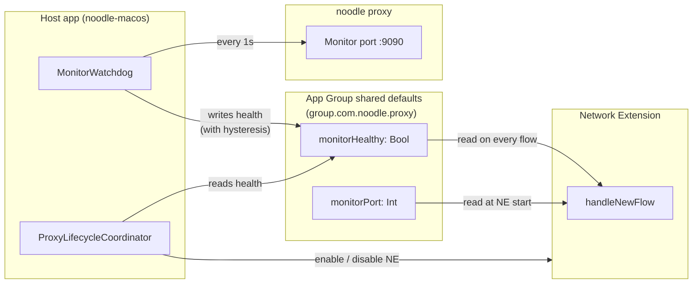

# ADR 024 — Fail-open behaviour

**Status:** current. macOS implementation reference: the the telemetry backend AI
Collector (`(external reference removed)/`,
release/0.1 branch). Linux and Windows specified at design-spec depth;
implementation deferred to those OSes' entry-transport stories.

**Sister design:** ADR 037 (entry transport — the mechanism this
fail-open contract sits on top of).
**Related:** ADR 011 (TLS MITM — the proxy's main work; this ADR keeps
that work from becoming a single point of failure), ADR 025 (dispatch
table — the only policy surface; there is no separate bypass surface).

---

## 1. Context

Entry transport (ADR 037) puts noodle in the middle of every claimed
network flow on the system. That position is the source of noodle's
value (it can attribute, inspect, mutate) and the source of its risk
(if it fails, every claimed flow fails with it). The proxy cannot be
a mandatory dependency of the user's network connectivity.

This ADR specifies the **fail-open contract** every entry transport
implementation honours: **when the proxy is unavailable, crashed,
slow, or restarting, claimed flows pass through to the operating
system unmodified — exactly as if noodle were not installed.**

Fail-open is automatic and health-driven. There is no end-user
bypass toggle, no menu-bar item, no CLI flag, no operator-level
on / off switch. Inspection on / off is controlled by the dispatch
table (ADR 025): a host that should not be inspected has no cell.
The fail-open contract here is purely the proxy's self-protection
against its own unavailability.

The the reference AI collector for macOS already ships the health-driven
pattern. This ADR codifies it as the canonical contract and identifies
the per-OS equivalents.

---

## 2. Decision

### 2.1 Five moving parts

Every fail-open implementation, on every OS, decomposes into the same
five moving parts:

| Part | What it does | Owns the state | Reads the state |
|---|---|---|---|
| **Health probe** | Actively probes the proxy process on a fixed interval. Reports up / down with hysteresis. | The host app (or equivalent OS userspace daemon). | — |
| **Health state surface** | A read-only-from-the-entry-transport flag, written by the health probe. | Host app. | Entry transport. |
| **Per-flow decision** | In the entry transport's flow-claim handler: `shouldClaim = healthy && supportedTransport`. If false, pass through to the OS. | — | Health state. |
| **Startup posture** | Health state is written `false` at start. The entry transport refuses to claim flows until the health probe confirms the proxy is ready. | Health probe initialisation. | — |
| **Lifecycle coordinator** | Orchestrates entry-transport enable / disable on health state changes. Cancels in-flight enable / disable requests if state moves underneath them. | Host app. | Health state + entry-transport status. |

### 2.2 Hysteresis

The health probe declares **unhealthy** after N consecutive failures
and declares **healthy** after M consecutive successes. The asymmetry
prevents flapping: a single missed probe should not flip every claimed
flow into fail-open mode; recovery should require sustained success
before flows are claimed again. Reference values from the the telemetry backend
collector: `N = 3`, `M = 2`, probe interval 1 s.

### 2.3 Fail-closed at start, fail-open at runtime

At process start, the health probe writes `healthy: false` *before*
the entry transport's filter rules are installed. The first claimed
flow arrives only after at least M successful health probes. Two
reasons:

- **Avoid spurious passthroughs during the startup race.** If the
  entry transport claimed flows before the proxy was confirmed ready,
  those flows would race against the proxy starting and produce
  inconsistent behaviour.
- **Make uninstall safe.** If a previous run of the proxy died with
  shared-state still claiming "healthy," a fresh start clears it
  before installing claim rules.

At runtime, when the proxy goes down (crashes, hangs, restarts, is
explicitly stopped), the health probe transitions to unhealthy and
the entry transport switches every subsequent flow to pass-through.
**Flows that are mid-relay continue to relay** until they close —
fail-open is the contract for *new* flows, not a kill switch for
in-flight ones.

### 2.4 The pass-through contract

When the per-flow decision says "do not claim," the entry transport
passes the flow through to the operating system. The semantics are
OS-specific but the contract is the same:

- **macOS:** call `flow.passFlow()` on the `NEAppProxyFlow`. The OS
  proceeds as if the flow had not been claimed.
- **Linux:** the eBPF program returns `Action::None`. The socket is
  not redirected.
- **Windows:** the WinDivert NetworkLayer filter does not match (or
  matches and returns the packet to the network stack unmodified).

In every case the flow is processed by the OS's normal network stack
exactly as if noodle were not installed. **No DNS rewrite happens for
non-claimed flows; no certificate mint; no TLS termination.** The
connection completes end-to-end between the client and the upstream
without noodle in the path.

### 2.5 Inspection on / off is a dispatch-table operation

Disabling inspection for a host is **never** a fail-open operation.
It is a dispatch-table change (ADR 025). IT pushes an override that
removes or `enabled = false`-s the cell for that host; the proxy
reloads; the entry transport's filter no longer claims that host's
flows; flows proceed naturally.

There is no separate bypass surface, no runtime toggle, no
shared-state flag the operator can write to. The only condition under
which fail-open engages is the health probe reporting the proxy
unhealthy. That is automatic and not under any human's control at
runtime.

---

## 3. Per-OS implementation

### 3.1 macOS (canonical reference)

The the reference AI collector implements every part of §2 in Swift +
shared `UserDefaults`. The pattern is:



**Concrete contract:**

| Part | Implementation | Reference |
|---|---|---|
| Health probe | `MonitorWatchdog` — a `Timer`-scheduled async task that opens a TCP connection to `127.0.0.1:monitorPort` every 1 s. 3 consecutive failures → unhealthy; 2 consecutive successes → healthy. | `app/the telemetry backend/Shared/Services/MonitorWatchdog.swift` |
| Health state surface | App Group `UserDefaults` (suite `group.local.noodle.proxy`), key `monitorHealthy: Bool`. App Group is the macOS mechanism for sharing data across processes that share an entitlement. | Shared defaults. |
| Per-flow decision | In `TransparentProxyProvider.handleNewFlow`: `shouldRelay = isMonitorHealthy && flowInfo.isTCP`. If false: `flow.passFlow()`. If true: open a TCP connection to the monitor port and pipe bytes. | `app/CZNetworkExtension/TransparentProxyProvider.swift` |
| Startup posture | `MonitorWatchdog.start()` writes `healthy: false` immediately, then runs the probe loop. The NE refuses to claim flows until at least M successful probes. | `MonitorWatchdog.swift` |
| Lifecycle coordinator | `ProxyLifecycleCoordinator.evaluateNEState()` — subscribes to `healthMonitor.isHealthy`, enables / disables the NE accordingly. Handles in-flight enable / disable cancellation. | `app/the telemetry backend/Shared/Services/ProxyLifecycleCoordinator.swift` |

Log lines the operator sees:

```
[TRACE] Flow #1234: shouldRelay=true  healthy=true  monitorPort=9090
⚠️ FAILOPEN flow #1235: api.anthropic.com:443 — monitor unhealthy
```

### 3.2 Linux

Linux has no direct analogue to macOS App Group shared defaults —
there is no Apple-style sandbox boundary for the eBPF program.
Equivalents mapped to Linux primitives:

| Part | Implementation |
|---|---|
| Health probe | A userspace daemon (the noodle host process or a sibling) probes the proxy on a fixed interval. Same hysteresis as macOS. |
| Health state surface | An eBPF **`HashMap` or `Array` map** with a single slot for `healthy: u8`. The userspace daemon writes the slot; the eBPF program reads it at socket-create. eBPF maps are the kernel's standard mechanism for kernel ↔ userspace state sharing, and they're already in use for the intercept-config array (ADR 037 §4). |
| Per-flow decision | In the eBPF program: `if !healthy: return Action::None`. The socket is not redirected; the syscall completes normally and the connection proceeds without noodle. |
| Startup posture | The userspace daemon writes `healthy: 0` before it loads the eBPF program, and ensures the program is loaded but the map says unhealthy until M successful probes. |
| Lifecycle coordinator | Lives in the userspace daemon. Same decision logic as macOS. Has the additional concern of unloading the eBPF program cleanly on stop (no orphaned cgroup attachments). |

### 3.3 Windows

The cleanest approach is the same one mitmproxy uses: a small piece of
state managed by the host service, read by the redirector via a
named-pipe message.

| Part | Implementation |
|---|---|
| Health probe | Host service probes the proxy. Same hysteresis. |
| Health state surface | A named-pipe message channel from host to redirector carries `HealthState{healthy: bool}` messages. The redirector caches the last received state. |
| Per-flow decision | In the WinDivert redirector: on every NetworkLayer packet matching a target rule, check cached `healthy`. If false: the redirector filter rule is dynamically removed for the duration. |
| Startup posture | The host service starts the redirector executable, which loads the WinDivert driver but does not install any filter rules. Filter rules are installed only after the first M successful probes. |
| Lifecycle coordinator | Host service runs as a Windows service; the lifecycle coordinator is the service's main loop. |

Driver-level concern: WinDivert filter installation requires admin
privilege. The host service runs as Local System (or a dedicated
service account); the redirector inherits its privilege.

---

## 4. Comparative cross-OS table

| Concern | macOS | Linux | Windows |
|---|---|---|---|
| Shared state surface | App Group `UserDefaults` (cross-process) | eBPF map (kernel ↔ userspace) | Named-pipe message channel |
| Health probe location | Host app (`MonitorWatchdog`) | Userspace daemon | Host service |
| Per-flow check site | `handleNewFlow` in NE | `BPF_CGROUP_INET_SOCK_CREATE` program | WinDivert filter callback |
| Pass-through action | `flow.passFlow()` | `Action::None` (no redirect) | No reinject (or no filter match) |
| Hysteresis | 3 fail → unhealthy; 2 success → healthy | Same | Same |
| Probe interval | 1 s | 1 s | 1 s |

---

## 5. Failure modes covered

| Failure | Fail-open behaviour |
|---|---|
| Proxy process crashes mid-relay | The relay connection breaks. The flow it was relaying terminates. **Subsequent** flows pass through (health goes unhealthy on the next probe). |
| Proxy process hangs (TCP accept stalls) | Probe fails. After N consecutive failures, health goes unhealthy. **Subsequent** flows pass through. The hung relay times out per the OS / app's normal connection-timeout policy. |
| Proxy process explicit shutdown | Health probe sees clean disconnect. Health goes unhealthy after one failed probe (the disconnect is a definitive signal — no need to wait for the full hysteresis window). Subsequent flows pass through. |
| Proxy restarts | Health goes unhealthy (process gone), then healthy (process back, M probes succeed), entry-transport claims resume. |
| OS sleep / wake | Network state changes detected by OS APIs (macOS `NWPathMonitor`, Linux `NETLINK`, Windows network change notifications). Health probe re-stabilises before any flows are claimed. |
| Network interface change | Same. |

## 6. Failure modes deliberately not covered

| Failure | Why not |
|---|---|
| Proxy compromised but live | Different threat. If the proxy is running and probes succeed but is producing malicious output, fail-open does not engage. This is the integrity threat in ADR 011 §8 — covered by the CA-key protection model, not by this contract. |
| OS network stack failure | Out of scope. No proxy-level mitigation. |
| Adversarial DoS on the probe | Probe runs in the host app over loopback. An attacker capable of degrading loopback already has a higher-level capability. |
| Selective fail-open per host | Inspection on / off per host is a dispatch-table operation (ADR 025), not a fail-open feature. Fail-open is binary across all claimed flows; if you want a host never inspected, remove its cell. |

---

## 7. Security considerations

- **The health state surface is trust-boundary-relevant.** It controls
  whether bytes are inspected. An attacker who can write the health
  state silently disables inspection. Each OS uses the strongest
  available local IPC primitive: App Group entitlement (macOS), eBPF
  map kernel ACL (Linux), named-pipe DACL (Windows). All require the
  operator's user-level or system-level privilege to write.
- **There is no end-user write surface.** The end-user cannot toggle
  bypass, cannot edit a config, cannot reach any state that disables
  inspection. The only ways inspection turns off are (a) noodle becomes
  unhealthy and the health-driven fail-open engages, or (b) IT pushes
  a dispatch-table override that removes cells. Both leave audit
  trails.
- **Health-driven fail-open is observable.** Every fail-open flow
  produces a log line (`FAILOPEN flow #N: <description> — monitor
  unhealthy`). Operators can monitor the rate of fail-open events as a
  proxy-health metric. A sustained high rate is a noodle-is-broken
  alert, not an attack signal.
- **The proxy cannot mark itself healthy.** Health is asserted by the
  external probe in the host app, not by the proxy declaring it. A
  compromised proxy can produce bad output but cannot lie about being
  available — the probe is the source of truth and the probe lives in
  a different process.
- **Hysteresis cannot be used to evade detection.** N = 3, M = 2 are
  config knobs but their values are bounded by the design (single
  failure must not flap; N and M are O(1) probes, not minutes). An
  operator that tunes these to extreme values would observably degrade
  fail-open coverage; the values are not under the end-user's control.

---

## 8. Open questions deferred

- **Health probe protocol.** Today the macOS probe is a TCP connect to
  the monitor port; a successful connect counts as a healthy probe.
  This is coarse — a half-broken proxy that accepts connections but
  cannot process bytes would still register as healthy. A future
  iteration can promote the probe to an application-level check (HTTP
  GET to `/health` with a deadline) without changing the contract.
- **Network change recovery.** OS-native network-change notifications
  exist on every OS but the right reaction (re-probe immediately?
  re-probe after a debounce?) is not pinned. Decide when a real
  network-change regression surfaces.
