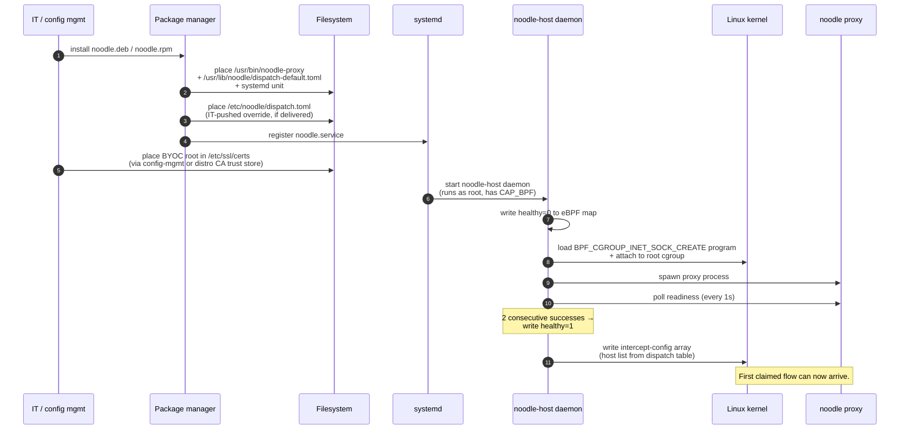
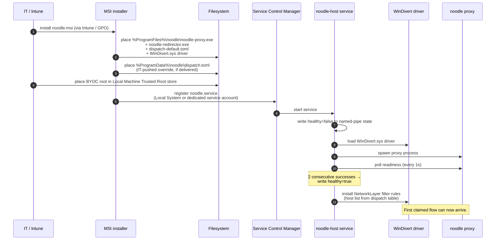
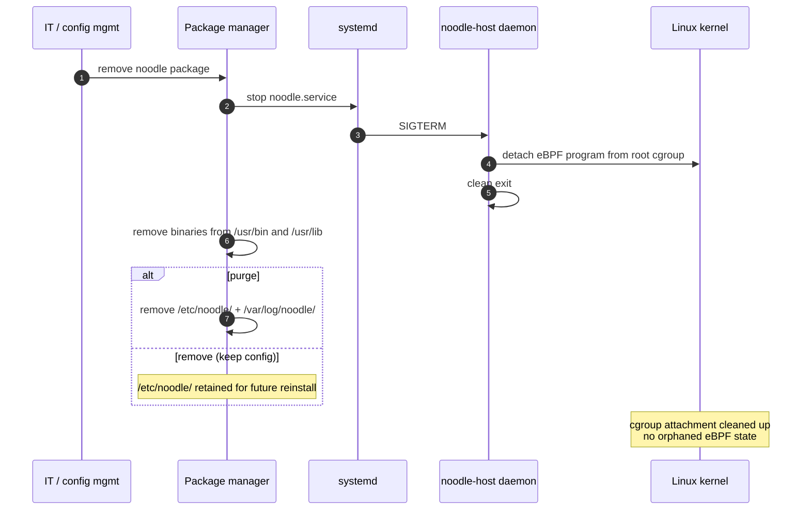
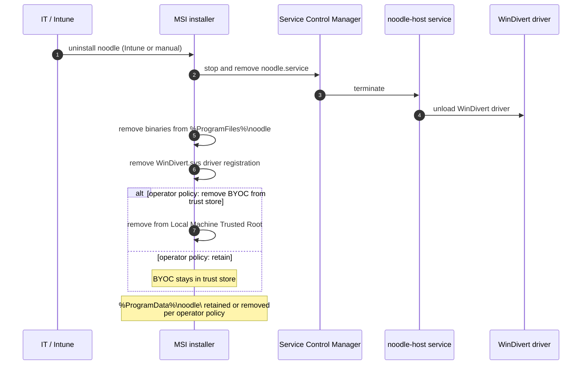

# ADR 026 — Installation, upgrade, and uninstall (deployment lifecycle)

**Status:** current. macOS specified at full design depth; Linux and
Windows specified at design-spec depth, implementation deferred to
those OSes' entry-transport stories.

**Related:** ADR 011 (TLS MITM and the noodle root CA — what the
install establishes), ADR 037 (entry transport — what the install
registers with the OS), ADR 024 (fail-open — the health posture the
install brings up), ADR 025 (dispatch table — what the install places
and what an override replaces).

---

## 1. Context

The deployment lifecycle has four events: **install, configure,
upgrade, uninstall**. All four are **IT-driven** and travel through
OS-native managed-configuration channels. No event is initiated by
the end-user. Specifying the four sequences in one place is necessary
because each touches every other architectural concern — entry
transport, CA trust, dispatch table, health-driven fail-open — and an
engineer needs the end-to-end view to reason about state transitions.

This ADR specifies what each event does, in what order, and what the
proxy's state looks like across the transition. Per-OS mechanism
detail (Network Extension classes, eBPF program load, WinDivert
driver, etc.) lives in ADR 037; this ADR sequences those mechanisms
into lifecycle flows.

---

## 2. Install

The install flow places the binary, places the default dispatch table,
establishes trust (CA generation or BYOC), registers the entry
transport with the OS, and brings the proxy up to the point of
claiming its first flow.

### 2.1 macOS — `.pkg` installer

```mermaid
sequenceDiagram
    autonumber
    participant IT as IT / MDM
    participant OS as macOS
    participant App as Noodle.app
    participant Sysext as Network Extension
    participant Probe as MonitorWatchdog
    participant Proxy as noodle proxy

    IT->>OS: install Noodle.pkg (via MDM or manual)
    OS->>App: place /Applications/Noodle.app
    Note over App: Bundle includes default dispatch.toml<br/>at Contents/Resources/dispatch-default.toml
    IT->>OS: deliver Configuration Profile<br/>(BYOC + optional dispatch override)
    OS->>OS: install BYOC root in System Keychain
    App->>App: first-run check — CA present?
    alt BYOC delivered
        App->>App: load BYOC from Configuration Profile
    else no BYOC
        App->>App: generate self-signed CA<br/>(persist to /Library/Application Support/noodle)
    end
    App->>OS: OSSystemExtensionRequest.activationRequest
    OS->>IT: prompt for approval (first install only;<br/>auto-approved under MDM)
    IT->>OS: approve
    OS->>Sysext: load NETransparentProxyProvider<br/>+ NEDNSProxyProvider
    Probe->>Probe: write healthy=false to App Group defaults
    App->>Proxy: spawn proxy process
    Probe->>Proxy: poll monitor port (every 1s)
    Note over Probe: 2 consecutive successes →<br/>write healthy=true
    Sysext->>Sysext: read dispatch table<br/>(default or override)
    Sysext->>OS: install NETransparentProxyNetworkSettings<br/>with host list derived from dispatch
    Note over Sysext,Proxy: First claimed flow can now arrive.
```

Key constraints:

- The default dispatch table ships inside the app bundle (ADR 025
  §2.2). An override delivered via Configuration Profile takes
  precedence at the moment the proxy reads its dispatch.
- The CA is either generated at first run (single-machine /
  development) or supplied via the Configuration Profile (BYOC,
  enterprise default — ADR 011 / ADR 001 §2 principle 5).
- The entry-transport filter (the `claimHostnames` set on
  `NETransparentProxyProvider`) is **derived from the dispatch table**
  (ADR 037 — projection over the cell set). The install does not
  hardcode this set.
- Health probe writes `healthy=false` before the entry-transport
  filter is installed (ADR 024 §2.3 — fail-closed at start, fail-open
  at runtime). The first claimed flow arrives only after the probe
  stabilises.

### 2.2 Linux — `.deb` / `.rpm` package



Key constraints:

- Override at `/etc/noodle/dispatch.toml` is registered as a package
  `conffile` so upgrades don't overwrite IT's edits.
- BYOC root is delivered through the distribution's CA trust path
  (`/usr/local/share/ca-certificates/`, `update-ca-trust`, etc.); the
  proxy reads from the system trust store.
- The eBPF program is loaded but the `healthy` slot is zero until the
  proxy is confirmed ready — same fail-closed-at-start posture as
  macOS.

### 2.3 Windows — `.msi` installer



Key constraints:

- BYOC root delivered to the Local Machine Trusted Root store via
  Group Policy or Intune certificate-deployment.
- WinDivert.sys is a signed kernel driver; install requires admin
  privilege (the MSI handles this).
- The redirector binary loads the driver on service start and unloads
  on service stop; the driver is not persistent across restarts.

---

## 3. Configure

Configuration delivery — IT pushing a dispatch-table override after
install — uses the same OS-native channel as install. The proxy
re-reads the override on its next reload cycle.

| OS | Override delivery | Reload trigger |
|---|---|---|
| macOS | New Configuration Profile (replaces the previous managed-preferences plist) | OS notifies the app; app issues SIGHUP-equivalent; proxy re-reads on next cycle |
| Linux | New `/etc/noodle/dispatch.toml` written by config-mgmt | `systemctl reload noodle` or SIGHUP to the daemon |
| Windows | New `%ProgramData%\noodle\dispatch.toml` written by Group Policy / Intune file-deployment | Service-control verb `Reload` |

Reload semantics are atomic (ADR 025 §2.4):

- New file parsed and validated before being swapped in.
- Validation failure leaves the current table active and emits an
  `AuditEvent { kind: Errored, .. }`.
- In-flight flows continue on the table they opened with; new flows
  pick up the new table.
- The entry-transport filter is recomputed and pushed to the
  extension / eBPF program / WinDivert layer atomically alongside the
  dispatch-table swap.

Detail on the dispatch file format and the override mechanism in
ADR 025. This ADR covers only the lifecycle sequencing.

---

## 4. Upgrade

The upgrade flow stops the running proxy, replaces files, and brings
the new version up under the same fail-open contract that covered
the install.

### 4.1 macOS

```mermaid
sequenceDiagram
    autonumber
    participant IT as IT / MDM
    participant OS as macOS
    participant Sysext as old sysext
    participant App as Noodle.app
    participant NewSysext as new sysext
    participant Probe as MonitorWatchdog
    participant Flows as in-flight flows

    IT->>OS: install Noodle.pkg (new version)
    OS->>OS: stop existing noodle service
    Note over Sysext,Flows: claimed flows lose the proxy;<br/>in-flight flows fail per OS timeout policy
    OS->>App: replace /Applications/Noodle.app
    App->>OS: OSSystemExtensionRequest.activationRequest<br/>(CFBundleVersion bumped — required for clean upgrade)
    OS->>NewSysext: load new sysext (replaces old)
    Probe->>Probe: write healthy=false
    App->>App: spawn new proxy process
    Probe->>Probe: re-stabilise (~2 s)
    NewSysext->>OS: install NETransparentProxyNetworkSettings
    Note over Flows: claimed flows resume on new sysext
```

**The sysext-version-bump constraint.** `CFBundleVersion` in
`Info.plist` **must** increment between releases; macOS refuses to
re-approve a sysext with the same version. Forgetting to bump is a
class of release-process bug; CI should enforce it.

**In-flight flow behaviour during the restart window.** Flows already
relaying when the upgrade starts terminate when the proxy stops
(the relay connection breaks; clients see a connection reset or
EOF). Flows that arrive during the gap between sysext deactivation
and activation pass through to the OS unmodified (fail-open during
the unhealthy window). New flows after the new sysext is healthy
relay normally.

### 4.2 Linux

```mermaid
sequenceDiagram
    autonumber
    participant IT as IT / config mgmt
    participant Pkg as Package manager
    participant Systemd as systemd
    participant Daemon as noodle-host daemon
    participant Kernel as Linux kernel

    IT->>Pkg: upgrade noodle package
    Pkg->>Systemd: stop noodle.service
    Systemd->>Daemon: SIGTERM
    Daemon->>Kernel: detach eBPF program from cgroup
    Pkg->>Pkg: replace binaries (atomic via package manager)
    Note over Pkg: /etc/noodle/dispatch.toml preserved<br/>(registered conffile)
    Pkg->>Systemd: start noodle.service
    Systemd->>Daemon: spawn new daemon
    Daemon->>Daemon: write healthy=0 to eBPF map
    Daemon->>Kernel: load new BPF program + attach cgroup
    Note over Daemon,Kernel: probe stabilises; flows resume
```

The package manager preserves `conffile`-registered overrides on
upgrade (Debian: `dpkg-conffile`; RPM: `%config(noreplace)`). IT's
edits to `/etc/noodle/dispatch.toml` survive.

### 4.3 Windows

```mermaid
sequenceDiagram
    autonumber
    participant IT as IT / Intune
    participant MSI as MSI installer
    participant SCM as Service Control Manager
    participant Service as noodle-host service
    participant WD as WinDivert driver

    IT->>MSI: install noodle.msi (new version)
    MSI->>SCM: stop noodle.service
    SCM->>Service: terminate
    Service->>WD: unload WinDivert driver
    MSI->>MSI: replace binaries in %ProgramFiles%\noodle
    Note over MSI: %ProgramData%\noodle\dispatch.toml preserved
    MSI->>SCM: start noodle.service
    SCM->>Service: spawn new service
    Service->>WD: load new WinDivert driver
    Note over Service,WD: probe stabilises; flows resume
```

`%ProgramData%\noodle\dispatch.toml` is preserved by the MSI's
component table (`KeepExistingFile = yes` on that file).

---

## 5. Uninstall

The uninstall flow stops the proxy, deregisters the entry transport
from the OS, removes binaries, and presents the operator with the
trust-store cleanup choice. After uninstall, the system is in the
state it was in before install — no orphaned filter rules, no
orphaned sysext / driver registrations.

### 5.1 macOS

```mermaid
sequenceDiagram
    autonumber
    participant IT as IT / MDM
    participant App as Noodle.app
    participant OS as macOS
    participant Sysext as Network Extension
    participant Keychain as System Keychain

    IT->>App: initiate uninstall<br/>(MDM payload removal or manual)
    App->>OS: OSSystemExtensionRequest.deactivationRequest
    OS->>Sysext: deactivate (and remove approval state)
    App->>App: stop proxy process
    App->>App: stop MonitorWatchdog
    alt operator policy: remove CA
        App->>Keychain: remove noodle CA from trust store
    else operator policy: retain CA
        Note over Keychain: CA stays; in-flight TLS sessions<br/>continue trusting it
    end
    App->>App: remove /Library/Application Support/noodle/<br/>(generated CA, logs)
    Note over App: /Applications/Noodle.app removed by IT;<br/>tap.jsonl retained or removed per operator policy
```

The CA cleanup choice is the operationally sensitive one. If the
CA is removed from the trust store, every TLS leaf noodle minted
becomes untrusted retroactively — but those leaves are in process
memory only and gone with the process. If the CA stays, it remains
trusted but unused; the operator can remove it later.

### 5.2 Linux



BYOC root in the distribution trust store is the operator's
responsibility to remove; the package does not touch system-wide
trust roots on uninstall.

### 5.3 Windows



---

## 6. Cross-cutting

### 6.1 The version-bump constraint (macOS)

`CFBundleVersion` must increment on every release that ships a sysext
change. Sysexts with the same version cannot be re-approved by the OS
without manual user intervention. This applies to upgrades only;
install of an entirely new version always works.

### 6.2 In-flight flow behaviour during transitions

| Transition | In-flight relayed flows | Flows arriving during the gap |
|---|---|---|
| Install (first run) | n/a | Pass through (entry transport not yet active) |
| Reload (dispatch table) | Continue on the table they opened with | New table applies |
| Upgrade | Terminate when the proxy stops | Pass through during the unhealthy window |
| Uninstall | Terminate when the proxy stops | Pass through (entry transport deactivated, OS handles normally) |

### 6.3 MDM channel relationships

| OS | MDM channel | Delivers |
|---|---|---|
| macOS | Configuration Profile (`.mobileconfig`) | Install approval, BYOC, dispatch override, end-user policy toggles |
| Linux | config-mgmt (Ansible / Puppet / Chef) + distro CA trust path | Package install, BYOC, dispatch override |
| Windows | Intune / Group Policy | MSI install, BYOC, dispatch override, registry-based settings |

The MDM channel is the one trusted write path. No other source can
write to the dispatch-override location or the trust store.

### 6.4 Audit events for lifecycle events

Every lifecycle event emits an `AuditEvent` to the side-effect sink:

- `InstalledFromVersion=N` at first start after install.
- `UpgradedFromVersion=N1 ToVersion=N2` at first start after upgrade.
- `DispatchReloaded { from_hash, to_hash, cell_count_before, cell_count_after }` on reload.
- `Uninstalling` immediately before sysext / eBPF / driver
  deactivation.
- `CaEstablished { source: Generated | Byoc, fingerprint }` on first
  run.

These records appear on the side-effect sink (ADR 020) and are
operator-visible. An audit trail of lifecycle events is the
configuration-change observability mechanism.

---

## 7. Security considerations

- **Lifecycle is IT-only.** Install, configure, upgrade, and
  uninstall all go through OS-native managed-config channels. There
  is no end-user surface for any of the four events. The end-user
  cannot upgrade the proxy, cannot change its configuration, cannot
  uninstall it (in a managed deployment — single-machine /
  development installs work differently).
- **CA private key never leaves the host.** On install (generated
  path) the key is created locally with mode `0600`. On install
  (BYOC path) the key is delivered through the MDM channel — IT is
  responsible for the channel's confidentiality. On uninstall the
  generated CA's private key is removed; the BYOC key is removed
  from the trust store but retained by IT.
- **Default-deny posture during transitions.** Health is `false`
  during install, upgrade, and immediately before uninstall. Claimed
  flows pass through to the OS during these windows — the proxy
  never relays without a valid live process behind it.
- **Audit trail.** Every lifecycle event emits a record (§6.4). An
  attacker who installs or upgrades noodle is observable in the
  audit stream. An attacker who substitutes a malicious binary
  before install would be observable via signature verification at
  install time (handled by the OS package mechanism, not by noodle).
- **No orphaned state on uninstall.** The uninstall flow deactivates
  the entry-transport extension, unloads any kernel-level component
  (eBPF program, WinDivert driver), and removes the proxy's state
  directories. The CA cleanup is an explicit operator choice surfaced
  at uninstall time, not a silent removal.

---

## 8. Open questions deferred

- **Rollback semantics.** Today an upgrade that fails leaves the
  system in the new-binary state with the old `tap.jsonl`. A
  rollback flow (auto-restore the previous version on health-probe
  failure) is reasonable but not specified. Decide when a real
  upgrade failure surfaces.
- **Multi-version concurrent install.** Side-by-side install of two
  noodle versions is not currently supported (bundle identifier
  collision on macOS, package conflict on Linux, service-name
  collision on Windows). Could be added if the use case surfaces.
- **Partial-state cleanup.** If uninstall is interrupted (process
  killed mid-deactivation), the system may be left with an
  orphaned sysext / eBPF program / WinDivert filter. A repair-mode
  invocation that detects and cleans orphan state is not
  specified. Decide when this becomes a real operational concern.
- **Dispatch-override delivery without proxy restart.** Today a
  reload requires the proxy process to be running (SIGHUP / service
  control verb). An offline-delivered override that the proxy picks
  up on next start works without restart but won't take effect until
  the proxy restarts independently. Decide whether to add an
  out-of-band reload trigger (file-system watch, MDM-delivered
  reload signal).
