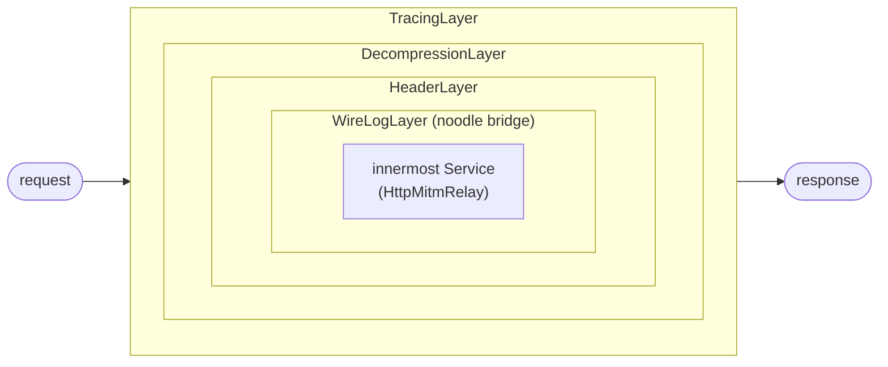
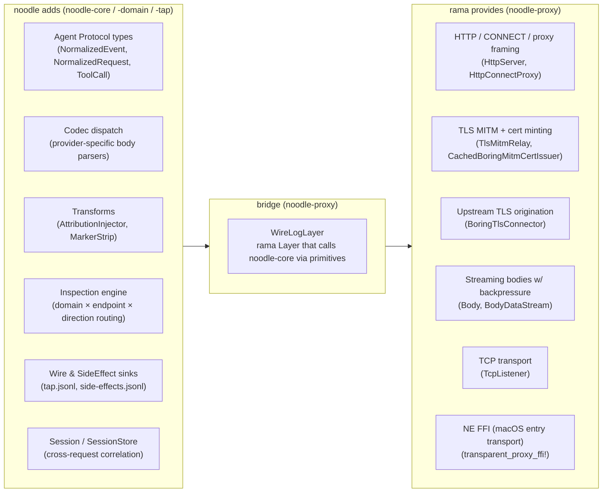
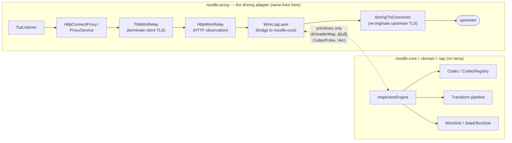
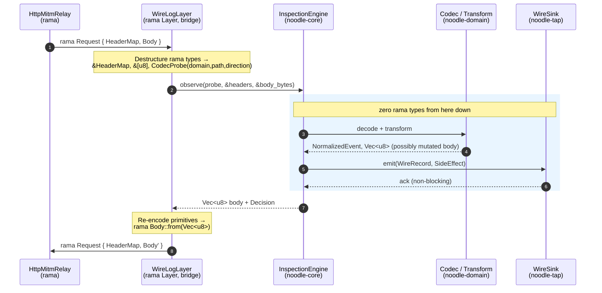
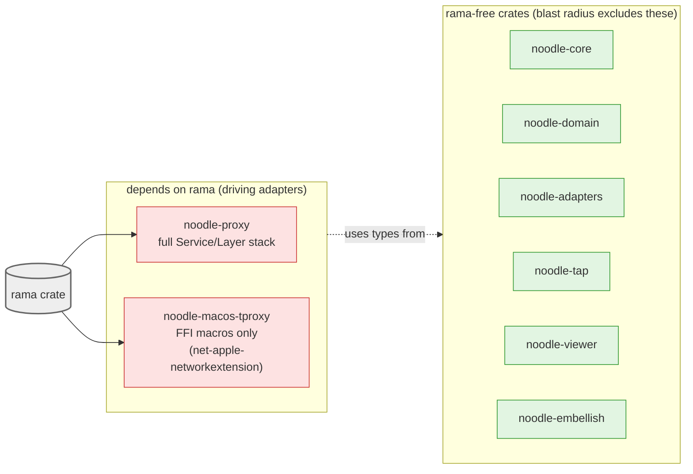

# ADR 032 — Rama foundation: how rama supports noodle's goals

**Status:** current.
**Audience:** Anyone who needs to understand why noodle uses rama,
what rama provides, what noodle adds on top, and where the
boundary between the two sits.

---

## 1. Context

noodle is an **attribution proxy** — it sits in the network path
between AI agents and inference providers, observes and mutates
traffic, and emits structured telemetry. Building this from raw
TCP/TLS/HTTP primitives is a large surface; building it on a
framework that already composes those primitives lets noodle
focus on what's unique: the **Agent Protocol** layer above the
network stack.

[rama](https://github.com/plabayo/rama) is an open-source Rust
service framework for building proxies, gateways, and network
middleware. It provides the network-protocol type system that
noodle builds on. This ADR documents which rama capabilities
noodle uses, how they map to noodle's architecture, and where
the framework boundary sits.

---

## 2. What rama provides

rama is a modular proxy-building toolkit. Its design is
`tower`-style Service/Layer composition applied to the full
proxy lifecycle: transport, TLS, HTTP, and proxy protocols.

### 2.1 Core model: Service and Layer

```
Layer<S: Service> → wraps a Service, adds behaviour, returns a new Service
Service<State, Request> → async fn call(&self, ctx, req) → Response
```

Every stage of request processing is a `Service`. Layers
(middleware) wrap services to add cross-cutting behaviour:
tracing, decompression, header manipulation, auth, body mapping.
The rama service stack is a nested composition of Layers around
an innermost Service — the same pattern as `tower`, but with
rama-specific `Context` threading and a richer proxy vocabulary.

Visually, the stack is an onion: each Layer wraps the next,
and the request travels inward until it reaches the innermost
Service, with the response unwinding back out through each Layer:



Each Layer can observe, mutate, short-circuit, or pass through.
`WireLogLayer` is one such Layer — it is the seam between rama's
network-protocol world and noodle's Agent-Protocol world (§3).

### 2.2 The building blocks noodle uses

| rama building block | What it does | Where noodle uses it |
|---|---|---|
| **`TcpListener`** | Binds a port, accepts connections, feeds them into a service stack | `noodle-proxy` — the proxy's entry point for forward-proxy mode |
| **`HttpServer` / `HttpLayer`** | HTTP/1.1 and HTTP/2 server built on hyper, composed as a Layer | The HTTP layer inside the MITM stack |
| **`ProxyService` / `HttpConnectProxy`** | Implements the HTTP CONNECT tunnel | Forward-proxy mode: client sends `CONNECT host:443`, noodle opens the tunnel |
| **`TlsMitmRelay`** | TLS man-in-the-middle relay: terminates client TLS, re-originates upstream TLS, manages cert minting via a pluggable `CertIssuer` | Core of noodle's MITM — ADR 011 §3 |
| **`CachedBoringMitmCertIssuer`** | In-memory cert cache with single-flight dedup: first request to a host triggers an upstream handshake and leaf mint; concurrent requests wait | Leaf cert minting — ADR 011 §5a |
| **`InMemoryBoringMitmCertIssuer`** | The actual minter: reads upstream SAN/CN/ALPN, generates a leaf signed by the noodle root, ECDSA P-256 | Wrapped inside the cache |
| **`HttpMitmRelay`** | HTTP-layer relay sitting inside a terminated-TLS session: receives the plaintext HTTP request, can observe/mutate, forwards upstream | The request/response observation point where `WireLogLayer` attaches |
| **`BoringTlsConnector`** | Upstream TLS origination with configurable trust roots, ALPN, SNI | Re-originating TLS to the real LLM endpoint |
| **`Body` / `BodyDataStream`** | Streaming HTTP body with backpressure | Body-level streaming through the codec stack |
| **`HeaderLayer` / `SetRequestHeaderLayer`** | Header manipulation Layers | Request/response header mutation (e.g. stripping hop-by-hop headers) |
| **`TracingLayer`** | Distributed tracing spans for each request | Operational observability in development |
| **`DecompressionLayer`** | Transparent gzip/br/zstd decompression | Handling compressed upstream responses |
| **`IoForwardService`** | Byte-level bidirectional forwarding for non-HTTP flows (fallback) | WebSocket upgrade, unrecognised protocols after TLS termination |
| **`NETransparentProxyProvider` FFI** | rama's macOS Network Extension transparent proxy FFI helpers (the `transparent_proxy_ffi!` macro) | `noodle-macos-tproxy` — the macOS entry transport (ADR 037 §3) |
| **`quinn` integration** | QUIC/HTTP-3 client and server via the quinn crate | Future: QUIC MITM (ADR 014) |

### 2.3 What rama does NOT provide (and noodle adds)

| Concern | Why it's noodle's job |
|---|---|
| **Agent Protocol types** (`NormalizedEvent`, `NormalizedRequest`, `ToolCall`, …) | Network-layer framing stops at HTTP bodies. The semantic content of an LLM conversation — turns, tool calls, system prompts, attribution markers — is noodle's type system. |
| **Provider codec dispatch** (`Codec`, `CodecInstance`, `CodecRegistry`) | rama knows how to relay HTTP; it does not know that `api.anthropic.com/v1/messages` needs a different body parser than `api.openai.com/v1/chat/completions`. |
| **Content transforms** (`Transform`, `AttributionInjector`, `MarkerStripTransform`) | In-band prompt injection and marker extraction are noodle's business logic. rama never touches body semantics. |
| **Inspection engine** (`InspectionEngine`, dispatch table, cell routing) | The `(domain, endpoint, direction)` dispatch model is noodle's architecture (ADR 019). rama provides the HTTP plumbing the engine observes through. |
| **Wire and side-effect sinks** (`WireSink`, `SideEffectSink`, `tap.jsonl`) | Structured telemetry output is noodle's product surface. rama doesn't have a concept of capture files. |
| **Session and turn state** (`Session`, `SessionStore`, marking detectors) | Cross-request correlation is Agent Protocol state, not HTTP state. |
| **Entry transport integration** (macOS NE lifecycle, eBPF, WinDivert health probes) | OS-level traffic interception is orchestrated by noodle's host app. rama provides the FFI helpers for macOS; noodle owns the lifecycle. |

### 2.4 The boundary as a stack

The two tables above describe a stack: rama provides the
network-protocol substrate; noodle layers Agent-Protocol
semantics on top. The bridge between them is a single rama
Layer (`WireLogLayer`) that calls into noodle-core through
primitive types.



The arrows are *dependency*, not data flow: noodle types are
defined without rama, the bridge knows both worlds, and rama
sits underneath knowing nothing about Agent Protocols.

---

## 3. How rama's model maps to noodle's architecture

noodle's hexagonal architecture (ADR 002) draws a hard line: the
domain core (`noodle-core`) has **zero rama dependency**. rama
lives exclusively in the driving adapter (`noodle-proxy`).



`WireLogLayer` is the bridge. It is a rama `Layer` — it
implements `Service` and wraps the relay — but internally it
calls `InspectionEngine` methods that are defined in
`noodle-core` and take no rama types. The engine receives
`&HeaderMap`, `&[u8]` body slices, and `CodecProbe` views; it
returns `Vec<u8>` encoded bodies and `SideEffect` emissions.
rama's `Body`, `Request`, `Response` types are destructured
into these primitives at the `WireLogLayer` boundary.

The boundary crossing is the hexagonal seam in motion:



The shaded region is rama-free. Steps 1–2 destructure rama
types into primitives; steps 7–8 re-encode primitives back
into rama types. Everything inside the shaded box compiles
without rama in its dependency tree (ADR 002).

### 3.1 The service stack (forward-proxy mode)

```mermaid
flowchart LR
    Listen["TcpListener :62100"] --> Accept["accept connection"]
    Accept --> Http["HttpServer (h1/h2)"]
    Http --> Connect["HttpConnectProxy<br/>(intercepts CONNECT)"]
    Connect --> TlsTerm["TlsMitmRelay<br/>(terminate client TLS)"]
    TlsTerm --> PeekSni["PeekTlsClientHelloService<br/>(read SNI for dispatch)"]
    PeekSni --> HttpRelay["HttpMitmRelay<br/>(plaintext HTTP)"]
    HttpRelay --> WireLog["WireLogLayer<br/>(noodle inspection bridge)"]
    WireLog --> TlsOrig["BoringTlsConnector<br/>(re-originate upstream TLS)"]
    TlsOrig --> Upstream["LLM provider"]
```



### 3.2 The service stack (transparent-proxy mode, macOS)

```mermaid
flowchart LR
    NE["NETransparentProxyProvider<br/>(OS claims flow)"] --> Relay["flow bytes → 127.0.0.1:9090"]
    Relay --> Listen["TcpListener :9090<br/>(noodle monitor port)"]
    Listen --> PeekSni["PeekTlsClientHelloService<br/>(read SNI — hostname not in flow metadata)"]
    PeekSni --> TlsTerm["TlsMitmRelay<br/>(terminate client TLS)"]
    TlsTerm --> HttpRelay["HttpMitmRelay"]
    HttpRelay --> WireLog["WireLogLayer"]
    WireLog --> TlsOrig["BoringTlsConnector"]
    TlsOrig --> Upstream["LLM provider"]
```



The two stacks differ only in how bytes arrive (CONNECT tunnel vs
NE relay) and where SNI is read (from the CONNECT target vs from
peeking the ClientHello). From `TlsMitmRelay` inward, the stack
is identical.

---

## 4. Why rama (and not alternatives)

### 4.1 Decision criteria

| Criterion | Weight | Rationale |
|---|---|---|
| TLS MITM as a first-class primitive | Critical | noodle's entire value depends on terminating + re-originating TLS. A framework that treats MITM as a bolted-on special case is untenable. |
| Service/Layer composition | High | The proxy pipeline is inherently layered. Composing behaviours as Layers keeps the stack legible and testable per-layer. |
| Streaming body support with backpressure | High | LLM responses are long-lived SSE streams. The body abstraction must support streaming without buffering entire responses. |
| Rust, async, production-grade TLS | High | Performance, safety, and boring-tls (OpenSSL-compatible) for cert minting at runtime. |
| Transparent-proxy FFI (macOS NE) | Medium | The macOS Network Extension integration is novel and non-trivial. rama's `transparent_proxy_ffi!` macro saved months of FFI work. |

### 4.2 Alternatives considered

| Alternative | Why not |
|---|---|
| **hyper + tower (raw)** | hyper provides HTTP server/client; tower provides Service/Layer. But assembling a TLS-MITM proxy from raw hyper+tower requires writing the CONNECT handler, the TLS relay, the cert minter, the upstream connector, and the body-streaming bridge from scratch. rama composes these as building blocks. |
| **mitmproxy (Python)** | Reference implementation for transparent-proxy entry transports (macOS, Linux, Windows). noodle's Rust entry-transport code borrows patterns from mitmproxy's Rust components (`mitmproxy_rs`). But the Python core is not suitable for a latency-sensitive, streaming-aware proxy in the LLM request path. |
| **Envoy / NGINX (C++)** | General-purpose L4/L7 proxies. TLS MITM is possible via Lua/WASM filters but is not a first-class path. Provider-specific body codec dispatch would require a custom filter per provider — no better than building noodle's engine from scratch, with the added complexity of C++ filter development. |
| **Pingora (Cloudflare, Rust)** | Rust HTTP proxy framework. Strong in L3/L4; weaker in TLS-MITM-as-a-Service composition. Does not provide cert minting or transparent-proxy FFI. Closer to raw hyper+tower for noodle's use case. |

### 4.3 What this coupling means

rama is a **compile-time dependency of two crates only**:
`noodle-proxy` (full Service/Layer stack) and
`noodle-macos-tproxy` (rama's NE FFI macros for the macOS entry
transport — `net-apple-networkextension`, `net-apple-xpc`
features only). The hexagonal boundary (ADR 002) ensures:

- If rama breaks or is abandoned, the blast radius is two
  adapter crates. `noodle-core`, `noodle-adapters`, `noodle-tap`,
  `noodle-domain`, `noodle-viewer`, `noodle-embellish` compile
  without rama.
- If a better proxy framework appears, the migration is rewriting
  `noodle-proxy` — the driving adapter — without touching business
  logic. The macOS entry transport's FFI dependency is narrower
  and independently swappable.
- rama types do not leak into noodle's public API surface. No
  downstream consumer, no config format, no telemetry schema
  carries a rama type.



A future rama replacement requires rewriting the red boxes; the
green boxes compile through the migration unchanged.

---

## 5. rama capabilities noodle does not yet use

These are rama features that align with noodle's roadmap but are
not wired today:

| Capability | noodle roadmap item | Status |
|---|---|---|
| **QUIC/HTTP-3 termination** (quinn integration) | ADR 014 — QUIC MITM | Designed, not implemented |
| **WebSocket relay** | Story 009 — WebSocket adapter | Open |
| **gRPC relay** | Bedrock / Vertex streaming | Not started |
| **Rate limiting / concurrency Layer** | Cloud-hosted multi-tenant mode | Not started |
| **TLS client cert authentication** | mTLS to upstream for enterprise endpoints | Not started |
| **WASM plugin host** | ADR 006 — extensibility (post-v1) | Deferred |

---

## 6. Positioning statement

> Where **rama** defines the type system for **network protocols**
> (TCP, TLS, HTTP, CONNECT, proxy framing), **noodle** defines
> the type system for **Agent Protocols** — the conversation
> shapes, content categories, capability invocations, and
> correlation identifiers that LLM-backed agents communicate over
> those network protocols.

rama gives noodle a running proxy in one service-stack
composition. noodle gives that proxy something to say about the
bytes it relays.
