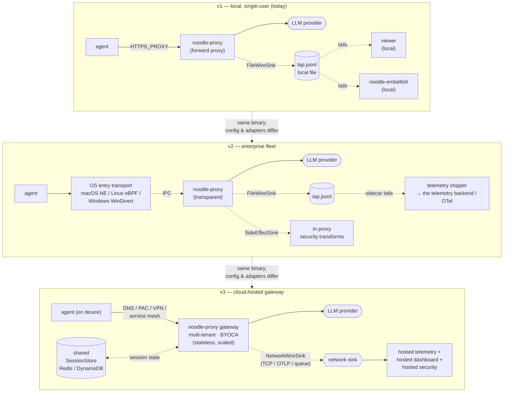

# ADR 033 — Product architecture: separation of concerns

**Status:** current.
**Audience:** Anyone making scope, deployment, or packaging decisions
about what noodle becomes as a product. Engineers deciding where code
belongs. PMs deciding what ships together vs separately.

**Companion:** ADR 001 (component architecture), ADR 002 (hexagonal
layout), ADR 006 (extensibility posture), ADR 022 (embellishment plane),
ADR 024 (fail-open), ADR 039 (deployment topologies + `noodle-detect`
facade — the across-deployment axis orthogonal to this ADR's
within-deployment axis).

---

## 1. Context

noodle today is a single workspace that compiles into a local
forward-proxy binary, a macOS transparent-proxy app, and a viewer
UI. The immediate product goal — **AI cost attribution** — requires
only a subset of the capabilities this architecture enables.

As noodle grows, the same core will serve different products with
different deployment models, trust boundaries, and operational
postures. This ADR names the five distinct **product surfaces** the
architecture supports, specifies which components belong to each,
and draws the lines that keep them decoupled.

---

## 2. The five product surfaces

### 2.1 noodle-proxy — the data-plane core

**What it is:** The attribution proxy. Terminates TLS, inspects
traffic between AI agents and inference providers, injects
attribution directives, extracts markers, and writes `tap.jsonl`.

**What it is NOT:** A UI. A telemetry shipper. A security policy
engine. A cloud service.

**Deployment:** A single-machine binary. Runs on the user's
workstation (forward-proxy mode) or on a host that the OS entry
transport routes traffic through (transparent-proxy mode). One
instance per machine.

**Crates:** `noodle-core`, `noodle-adapters`, `noodle-proxy`,
`noodle-tap`.

**Boundary:** The proxy's only output is `tap.jsonl` via the
`WireSink` interface. Everything downstream of that file is a
separate product surface. The proxy does not ship telemetry, does
not classify content, does not alert, does not render UI.

```
  agent ──► noodle-proxy ──► LLM provider
                │
                ▼
            tap.jsonl  ← the boundary
                │
        ┌───────┼───────┬──────────┐
        ▼       ▼       ▼          ▼
     viewer  telemetry  security  analytics
```

### 2.2 TAP viewer — optional local inspection UI

**What it is:** A local debug and inspection application. Tails
`tap.jsonl`, decodes response bodies via `noodle-domain` types,
and presents three views: HTTP (per-request), SSE (per-frame
timing), OODA (session → agent-run → turn → round-trip hierarchy).

**What it is NOT:** A telemetry dashboard. An analytics tool. An
alerting system. A production monitoring surface. **Not a required
component.**

**Deployment:** Runs on the same machine as the proxy when present.
Reads `tap.jsonl` from local disk. No network listener (except for
serving its own React frontend to `localhost`). Read-only —
no configuration surface, no write path to the proxy.

**Crates:** `noodle-viewer`, `noodle-domain`, `noodle-core`.

**Who uses it:** The end-user (developer) during development and
debugging. IT/Security for incident investigation on a specific
machine.

**When it is absent:** Enterprise and cloud deployments may ship
noodle **without** the viewer. The proxy's behaviour is identical
with or without it — the viewer is a passive consumer of
`tap.jsonl`, and the proxy does not know whether anything is
reading that file. Enterprises that want visibility use the
telemetry app's output (a telemetry dashboard, OTel-backed Grafana,
etc.) rather than a per-machine local UI.

**Separation from the proxy:** The viewer is a completely
independent binary. It does not import `noodle-proxy` or
`noodle-adapters`. It reads `tap.jsonl` as a file — the same file
any other consumer could read. The proxy has no knowledge of the
viewer's existence. This means:

- The viewer can be removed from the build without touching any
  other crate.
- The viewer can be replaced by a hosted dashboard that reads
  `tap.jsonl` via a network sink.
- The viewer can be shipped as a standalone download for
  troubleshooting without shipping the proxy.

### 2.3 Telemetry application — AI cost intelligence

**What it is:** A downstream consumer that reads `tap.jsonl` (or
the forthcoming `roundtrips.jsonl` per ADR 023-roundtrip), enriches
records with identity resolution and organizational context, and
ships structured telemetry to the telemetry backend or an OTel collector.

**What it is NOT:** Part of the proxy. A real-time alerting system.
A local debug tool.

**Deployment:** Today: the embellishment processor
(`noodle-embellish`) runs locally, reading `tap.jsonl` and writing
enriched events. Future: a sidecar or hosted service that receives
wire records via a network `WireSink` implementation (TCP socket,
message queue, OTLP endpoint) rather than tailing a local file.

**Crates:** `noodle-embellish`, `noodle-domain`, `noodle-core`.

**Boundary:** The telemetry app consumes the proxy's output and
produces a different output (the telemetry backend events, OTel spans). It
never writes back to the proxy, never modifies `tap.jsonl`, and
never influences in-flight traffic.

**Key design point:** The proxy emits raw facts (bodies, headers,
extracted markers, correlation IDs). The telemetry app performs
identity resolution (`device_id` → person → team → org), cost
attribution (token counts → dollar amounts), and organizational
roll-up. This split is intentional (ADR 022): the proxy must never
depend on an identity service or billing system, because any
dependency on an external service in the request path degrades
fail-open guarantees.

### 2.4 Security application — policy, detection, alerting

**What it is:** A downstream consumer that reads `tap.jsonl`,
applies security policy (secret detection, IP/PII scanning,
anomaly detection), and emits alerts or enforcement signals.

**What it is NOT:** Part of the proxy's hot path (in v1).

**Deployment:** Initially a local consumer (same as the telemetry
app pattern). Future: a hosted service or sidecar that receives
wire records via a network sink.

**Crates:** `noodle-domain`, `noodle-core`, plus
security-specific analysis code (not yet implemented).

**Relationship to the proxy:** The proxy provides attachment
points for in-band security transforms (ADR 001 §8.15):
`Transform<NormalizedRequest>` for outbound secret scanning,
`Transform<NormalizedEvent>` for inbound disclosure scanning.
These transforms run in the proxy's hot path — they are
compile-time plugins (ADR 006), not a separate app. The
security *application* is the downstream consumer that receives
the detection events from those transforms (via `SideEffectSink`)
and acts on them: alerting, dashboarding, compliance reporting.

**Separation:** Detection happens in-proxy (transform).
Alerting and policy enforcement happen out-of-proxy (security
app). The proxy emits observations; it does not decide what to
do about them.

### 2.5 Cloud-hosted proxy — managed and customer-hosted

**What it is:** noodle running as a network gateway rather than a
per-machine binary. Two sub-modes:

| Mode | Who operates | Where it runs | Who trusts the CA |
|---|---|---|---|
| **backend-managed** | the telemetry backend | the telemetry backend's infrastructure | Customer devices trust a backend-managed CA (distributed via MDM or network policy) |
| **Customer-hosted** | Customer IT | Customer's infrastructure (VPC, on-prem, Kubernetes) | Customer devices trust the customer's existing internal CA (BYOCA) |

**What it is NOT:** A different codebase. The proxy binary is the
same. The deployment model, CA trust model, and operational surface
differ.

**Deployment:**

```
                    ┌─────────────────────────────┐
  agent ──────────► │  noodle-proxy (cloud)        │ ──────► LLM provider
  (on device)       │                              │
                    │  + multi-tenant dispatch      │
                    │  + per-org CA or BYOCA        │
                    │  + control plane integration  │
                    │  + rate limiting / quota       │
                    └──────────┬───────────────────┘
                               │
                               ▼
                          tap sink (network)
                               │
                    ┌──────────┼──────────┐
                    ▼          ▼          ▼
                 telemetry  security   analytics
```

**What changes vs local:**

| Concern | Local | Cloud-hosted |
|---|---|---|
| Entry transport | OS-level (NE, eBPF, WinDivert) | Network routing (DNS, VPN, PAC file, cloud-native service mesh) |
| CA trust | Per-machine root, operator-installed | Per-org CA distributed to fleet via MDM, or customer's existing internal CA |
| Dispatch table | Local file, IT-pushed | Control plane API, per-org configuration |
| `WireSink` | Local `tap.jsonl` file | Network sink (TCP, message queue, OTLP) |
| Multi-tenancy | N/A (one user, one machine) | Per-org isolation: dispatch tables, CA material, wire sinks, rate limits |
| Fail-open | Health probe → entry transport passthrough | Health probe → DNS/routing failover to direct path |
| Scaling | Single process | Horizontally scalable (stateless proxy instances behind a load balancer; session state in a shared store) |

**Architectural enablers already in place:**

- **`WireSink` is an interface** (ADR 001 §2.7). Replacing
  `FileWireSink` with a network sink requires one new adapter, not
  a proxy change.
- **`SessionStore` is an interface** (ADR 002 §4). Replacing
  `InMemorySessionStore` with Redis / DynamoDB requires one new
  adapter.
- **Dispatch table is config-driven** (ADR 025). Loading config
  from an API instead of a file is a config-source change.
- **The proxy is stateless per-request.** Session state is the only
  cross-request state, and it's behind an interface.
- **Fail-open is health-driven** (ADR 024). In a cloud deployment,
  the "entry transport" is DNS/routing, and the health signal
  drives DNS failover instead of NE passthrough.

**What's missing for cloud (not yet designed):**

- Multi-tenant dispatch (per-org config, per-org CA material).
- Control plane API (dispatch-table CRUD, CA management, health
  monitoring).
- Network-sink `WireSink` implementations.
- Shared `SessionStore` implementation.
- Rate limiting / quota / billing integration.
- mTLS or other client auth for device → cloud proxy.
- Horizontal scaling posture (load balancer, session affinity or
  shared session store).
- Enterprise CA integration in a hosted context (BYOCA — see
  ADR 034).

### 2.6 Entry transport — per-OS, independently packaged

**What it is:** The OS-level mechanism that routes traffic into the
noodle proxy process. Specified in ADR 037.

**Why it is a separate product surface:** Each OS uses a completely
different mechanism:

| OS | Mechanism | Packaging | Language |
|---|---|---|---|
| **macOS** | `NETransparentProxyProvider` + `NEDNSProxyProvider` | System Extension `.appex` inside a signed container app | Swift (NE lifecycle) + Rust staticlib (FFI to noodle-proxy) |
| **Linux** | eBPF cgroup hook + TUN device + userspace redirector | ELF binary + eBPF program + setuid/capability install | Rust (eBPF via aya) |
| **Windows** | WinDivert NetworkLayer + SocketLayer | EXE + signed kernel driver | Rust |

These are **three separate codebases** with:

- Different build toolchains (Xcode for macOS, aya/bpf-linker for
  Linux, MSVC + driver signing for Windows).
- Different packaging formats (.pkg/.dmg, .deb/.rpm, .msi/.exe).
- Different privilege models (sysext entitlement, CAP_BPF, admin).
- Different IPC to the proxy (localhost TCP, Unix datagram, named
  pipe).
- Different coexistence concerns with VPN / endpoint-security
  products (see ADR 035).

**Separation from the proxy:** The entry transport delivers
`NewFlow` / `FlowData` / `FlowClose` over IPC (ADR 037 §7). The
proxy consumes this contract without knowing which OS produced the
flow. The proxy binary is cross-platform; the entry transport is
per-OS.

**Crates:**

- macOS: `noodle-macos-tproxy` (Rust staticlib), `apps/noodle-macos/`
  (Xcode project).
- Linux: `noodle-linux-redirector` (planned), `noodle-linux-ebpf`
  (planned).
- Windows: `noodle-windows-redirector` (planned).

**Key design point:** The entry transport is the only component that
the OS interacts with (approval prompts, driver loading, sandbox
enforcement). The proxy and everything downstream are normal
userspace processes. This means:

- Entry-transport bugs are OS-specific and can be fixed without
  touching the proxy.
- Entry-transport updates require OS-level approval (sysext version
  bump on macOS, driver re-signing on Windows). Proxy updates do
  not.
- The entry transport can be tested against a mock proxy (just a
  TCP listener that accepts flows) without running the full
  inspection stack.

---

## 3. The separation principle

```
                    ┌───────────────────────────────┐
                    │        noodle-core            │
                    │   types · interfaces · engine │
                    └──────┬──────────┬─────────────┘
                           │          │
              ┌────────────┤          ├────────────┐
              ▼            ▼          ▼            ▼
        noodle-proxy  noodle-tap  noodle-domain  noodle-adapters
        (driving      (file      (Agent Protocol (driven
         adapter)      WireSink)  types)          adapters)
              │                       │
              │                  ┌────┴────┐
              │                  ▼         ▼
              │           noodle-viewer  noodle-embellish
              │           (TAP viewer)  (telemetry app)
              │
         noodle-macos-tproxy
         (entry transport)
```

The principle: **each product surface is a separate binary (or
deployable) that depends on `noodle-core` for types and
interfaces, but does not depend on the other product surfaces.**

| Rule | Rationale |
|---|---|
| The viewer does not import the proxy | The viewer reads `tap.jsonl`. If the proxy changes its internal pipeline, the viewer is unaffected as long as the file schema (ADR 027) is stable. |
| The telemetry app does not import the proxy | Same boundary: `tap.jsonl` schema. The telemetry app can run on a different machine, in a different language, against a network sink. |
| The security app does not import the telemetry app | Security analysis and cost attribution are independent concerns. They share the input (`tap.jsonl`) but produce different outputs. |
| The cloud-hosted proxy does not fork the codebase | Same binary, different configuration and deployment. The interfaces (`WireSink`, `SessionStore`, dispatch-table loader) are the extension points. |
| The proxy does not depend on any downstream consumer | The proxy writes `tap.jsonl` and moves on. If a consumer is slow, crashed, or absent, the proxy is unaffected. Non-blocking output contract (ADR 001 §2.2). |

### 3.1 What crosses the boundary

Only three things cross the boundary between the proxy and its
downstream consumers:

1. **`tap.jsonl`** — the wire-record file (ADR 027). Schema-versioned.
   The contract between the proxy and every consumer.
2. **`side-effects.jsonl`** — the side-effect file (ADR 020). Carries
   `Hint`, `AuditEvent`, `ResolvedRecord`. Secondary contract.
3. **`roundtrips.jsonl`** (planned, ADR 023-roundtrip) — one record
   per HTTP round trip with full correlation IDs. The telemetry
   consumer's primary input.

These files (or their network-sink equivalents) are the **only
integration surface**. No shared memory, no IPC, no function calls
across product boundaries.

---

## 4. Deployment matrix

| Product surface | v1 (local, single-user) | v2 (enterprise, fleet) | v3 (cloud-hosted) |
|---|---|---|---|
| **noodle-proxy** | Local binary, forward-proxy mode | Local binary, transparent-proxy mode, IT-managed dispatch table | Cloud gateway, multi-tenant, per-org CA |
| **TAP viewer** | Local binary, same machine | Optional — IT may disable for end-users | Replaced by hosted dashboard |
| **Telemetry app** | Local `noodle-embellish` | Local or sidecar, ships to the telemetry backend | Hosted service, reads network sink |
| **Security app** | Not shipped | In-proxy transforms for detection; downstream alerting via `SideEffectSink` | Hosted security service |
| **Entry transport** | `HTTPS_PROXY` env var | macOS NE / Linux eBPF / Windows WinDivert | DNS/routing/PAC/service mesh |

The same proxy binary appears in all three rows. What changes is
the entry transport, the `WireSink` implementation, and where
the downstream consumers live:



The interfaces that shift between rows — `WireSink`,
`SessionStore`, dispatch-table loader, entry transport contract —
are the architectural seams that make each step a configuration
change rather than a fork.

---

## 5. Why this separation matters

### 5.1 Independent release cadence

The proxy's hot path (TLS, codecs, transforms) has different
stability requirements than the viewer's UI or the telemetry
app's shipping logic. Coupling them means a viewer bug blocks a
proxy release.

### 5.2 Independent trust boundaries

The proxy holds the CA private key and processes plaintext. The
viewer is read-only. The telemetry app talks to external services.
These are different privilege levels. Bundling them in one process
means the telemetry app's network access lives in the same process
as the CA key.

### 5.3 Independent scaling (cloud)

In a cloud deployment, the proxy is CPU-bound (TLS, codec,
transform). The telemetry app is I/O-bound (shipping events). The
security app is CPU-bound (scanning). They scale differently and
should be independently deployable.

### 5.4 Independent failure domains

If the telemetry app crashes, the proxy continues to attribute
traffic. If the viewer crashes, the proxy continues to attribute
traffic. If the proxy crashes, the entry transport fails open
(ADR 024) and the user's traffic is unaffected. Each product
surface failing cannot cascade into another.

---

## 6. Decision record

1. **The proxy's only output is `tap.jsonl`** (or a network-sink
   equivalent). All downstream products are consumers of this
   output.
2. **Each product surface is a separate binary / deployable.** No
   product surface imports another's implementation crate.
3. **`noodle-core` is the shared vocabulary.** Types and interfaces
   flow through it; runtime coupling does not.
4. **Cloud-hosted mode is a deployment configuration, not a fork.**
   The same proxy binary, with different `WireSink`, `SessionStore`,
   and dispatch-table-loader adapters.
5. **The viewer is a development tool, not a production surface.**
   Enterprise and cloud deployments may replace it with a hosted
   dashboard that reads the same `tap.jsonl` schema.
