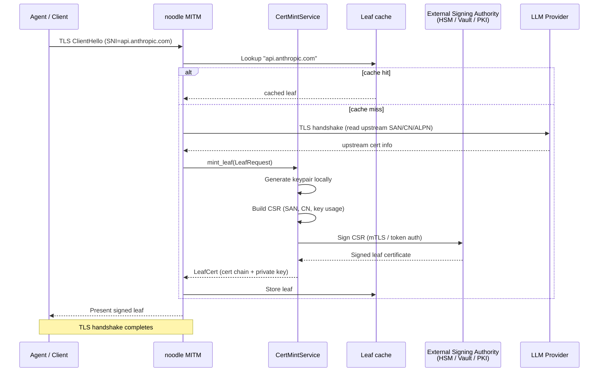
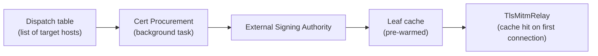
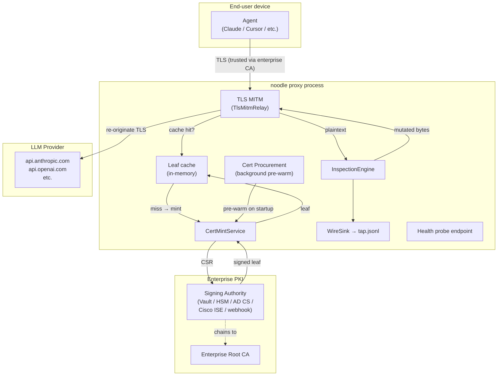

# ADR 034 — Enterprise CA integration: BYOCA and external signing

**Status:** current. Supporting features have shipped: S17 (local
cert-mint), S18 (BYOCA-static + `Ca::load_static`), S19
(`ExternalCertMintService` + `VaultPkiSigner`), B.2 (carved into
`noodle-cert-external`), B.5 (`noodle-tls` host-coupled boundary).
**Extends:** ADR 011 (TLS MITM and the noodle root CA), ADR 024
(fail-open), and ADR 025 (system keychain CA).
**Audience:** Engineers working on the MITM path, enterprise deployment,
or CA plumbing. Security architects evaluating noodle for fleet
deployment.

---

## 1. Context

ADR 011 specifies two CA modes:

- **Generated on the host** — a self-signed root created at first
  run. The single-machine / development pattern.
- **Supplied by the operator (BYOCA)** — the organization's existing
  internal CA, already distributed to managed devices via MDM.

The second mode is stated as the enterprise default but the
mechanism is not specified. In enterprise deployments — especially
large regulated environments — the CA picture is more nuanced:

- The organization may not want a static CA key on disk at all.
  Private keys live in HSMs, AWS CloudHSM, Azure Key Vault, or
  HashiCorp Vault.
- The organization may require that all leaf certificates are
  signed by their existing PKI chain (Cisco ISE, Microsoft AD CS,
  Venafi, DigiCert CertCentral) — not by a standalone root that
  happens to be trusted.
- The organization must be able to **revoke trust instantly** if
  something goes wrong — pull the rip cord and have all noodle
  MITM activity stop, with traffic failing open and reaching LLM
  providers directly.

This ADR specifies the CA-integration architecture that supports
these requirements.

---

## 2. Decision

### 2.1 Three CA modes

noodle supports three CA modes. The mode is set by configuration
(dispatch table or managed-config channel, per ADR 025).

| Mode | Key material | Who signs leaves | Trust anchor |
|---|---|---|---|
| **Local (dev)** | RSA/ECDSA key generated on-host, stored at `~/.config/noodle/ca/ca.key` | noodle process (in-memory, using `rcgen`) | The generated `ca.pem`, installed per ADR 011 §7 |
| **BYOCA (static)** | Operator places existing CA cert + key at the noodle CA path | noodle process (in-memory, same `Ca::load` path) | The operator's existing CA, already trusted by fleet devices |
| **BYOCA (external signer)** | No private key on the noodle host. Signing is delegated to an external service. | External signing authority (HSM, Vault, cloud KMS, enterprise PKI) | The enterprise's existing CA chain |

### 2.2 The CertMintService abstraction

Today, leaf minting is handled by rama's
`InMemoryBoringMitmCertIssuer`, which generates a keypair and
signs a leaf certificate in-process using the loaded CA key. This
works for modes 1 and 2 but not for mode 3.

The design introduces a **`CertMintService`** — a noodle-side
abstraction that sits between the MITM relay and the actual
signing operation.

```
                     ┌──────────────────────────────┐
  TlsMitmRelay       │       CertMintService         │
  (rama)       ───►  │                                │
  needs a leaf       │  ┌─────────┐  ┌────────────┐  │
  for host X         │  │ Local   │  │ External   │  │
                     │  │ Signer  │  │ Signer     │  │
                     │  │ (rcgen) │  │ (HSM/Vault │  │
                     │  │         │  │  /PKI API) │  │
                     │  └─────────┘  └────────────┘  │
                     └──────────────────────────────┘
```

```rust
#[async_trait]
pub trait CertMintService: Send + Sync {
    async fn mint_leaf(
        &self,
        request: LeafRequest,
    ) -> Result<LeafCert, MintError>;
}

pub struct LeafRequest {
    pub server_name: ServerName,
    pub upstream_san: Vec<GeneralName>,
    pub upstream_cn: Option<String>,
    pub alpn: Vec<Vec<u8>>,
}

pub struct LeafCert {
    pub cert_chain: Vec<CertificateDer>,
    pub private_key: PrivateKeyDer,
}

pub enum MintError {
    SignerUnavailable(String),
    SignerDenied(String),
    Timeout,
    InvalidRequest(String),
}
```

Two implementations:

| Implementation | Signing operation | Latency |
|---|---|---|
| **`LocalCertMintService`** | Generates keypair + signs leaf using the in-process CA key. Wraps the existing `rcgen` path. | < 1 ms |
| **`ExternalCertMintService`** | Sends a CSR to an external signing authority. Receives the signed cert. | 10–500 ms (network round trip to HSM/Vault/PKI) |

### 2.3 External signing flow



Key details:

- **The private key for each leaf is generated locally on the noodle
  host.** Only the CSR (public key + metadata) is sent to the
  external signer. The leaf's private key never leaves the host.
- **The external signer only signs.** It receives a CSR and returns
  a signed certificate. It does not see traffic, does not have
  access to plaintext, and does not participate in the TLS session.
- **The signed cert chains to the enterprise's existing trust
  anchor.** Devices that already trust the enterprise's CA (via MDM
  or Group Policy) automatically trust noodle-minted leaves.
- **Single-flight dedup still applies.** The leaf cache is
  upstream of the mint service. Concurrent requests for the same
  host wait for one mint operation, same as ADR 011 §5a.

### 2.4 External signer adapters

The `ExternalCertMintService` delegates to a pluggable signer
backend:

| Backend | Protocol | Use case |
|---|---|---|
| **HashiCorp Vault PKI** | HTTPS (Vault API) | Vault's PKI secrets engine issues certs against a configured CA. Widely deployed. |
| **AWS CloudHSM / ACM PCA** | AWS SDK | AWS-native environments. ACM Private CA signs CSRs via `IssueCertificate`. |
| **Azure Key Vault** | Azure SDK | Azure-native environments. Key Vault's certificate API or Managed HSM. |
| **SCEP / EST** | RFC 8894 (EST) / RFC 8894 (SCEP) | Enterprise PKI standard protocols. Microsoft AD CS, Cisco ISE, Venafi. |
| **Custom webhook** | HTTPS POST (CSR in, signed cert out) | Catch-all for enterprise PKI systems with a REST API. |

The backend is selected by configuration. v1 ships the **Vault PKI**
and **custom webhook** backends. Cloud-KMS backends follow based on
customer demand.

### 2.5 Cert procurement (pre-warming)

For external signers with higher latency (50–500 ms), first-
connection latency is noticeable. The **cert procurement** path
pre-warms the leaf cache:



At proxy startup (or dispatch-table reload), the procurement
task iterates the dispatch table's host set and pre-mints a leaf
for each host via the configured `CertMintService`. By the time
a client connects, the cache is warm.

Pre-warming is:
- **Best-effort.** If the signer is unavailable at startup, the
  proxy starts anyway and mints on demand (with the latency hit).
- **Background.** Does not block proxy startup or the first request.
- **Idempotent.** Re-running procurement for an already-cached host
  is a no-op.

---

## 3. The rip cord: emergency disable and fail-open

Enterprises need the ability to instantly disable noodle's MITM
activity and have traffic fail open — reaching LLM providers
directly without inspection. This is the "rip cord."

### 3.1 Three levels of rip cord

| Level | Mechanism | Speed | Effect |
|---|---|---|---|
| **1. Revoke the signing authority** | Revoke the CA cert in the enterprise PKI, or disable the Vault PKI mount / webhook endpoint | Minutes (PKI propagation) | New leaf mints fail. Cached leaves continue working until they expire or the proxy restarts. Next restart: all mints fail → all connections fail → health probe fails → fail-open engages. |
| **2. Push an empty dispatch table** | IT pushes a dispatch-table override with zero cells (or `enabled: false` on all cells) via MDM / managed config | Seconds to minutes (MDM push latency) | Proxy reloads config. No hosts are claimed. Entry transport stops routing traffic to the proxy. All flows proceed directly. Proxy is still running but idle. |
| **3. Kill the proxy** | Stop the noodle process (or push an MDM command that stops it) | Seconds | Health probe detects unhealthy. Entry transport fails open (ADR 024). All flows proceed directly to the OS network stack. |

### 3.2 Fail-open guarantee under signer failure

The most important scenario: the external signing authority
becomes unavailable while the proxy is running.

```mermaid
stateDiagram-v2
    [*] --> Running : proxy starts, signer healthy
    Running --> CacheHit : client connects to cached host
    Running --> MintAttempt : client connects to uncached host
    CacheHit --> Running : serve cached leaf, proceed normally
    MintAttempt --> SignerCall : CertMintService.mint_leaf()
    SignerCall --> LeafMinted : signer responds with signed cert
    SignerCall --> SignerTimeout : signer unreachable (timeout)
    SignerCall --> SignerDenied : signer returns error
    LeafMinted --> Running : cache leaf, proceed normally
    SignerTimeout --> MintFailed
    SignerDenied --> MintFailed
    MintFailed --> ConnectionError : return 502 to client for THIS flow
    MintFailed --> HealthDegrade : increment mint-failure counter
    HealthDegrade --> StillHealthy : failures < threshold
    HealthDegrade --> Unhealthy : failures >= threshold (e.g. 5 consecutive)
    StillHealthy --> Running : proxy continues; cached hosts still work
    Unhealthy --> FailOpen : health probe fails → entry transport passthrough
    FailOpen --> [*] : all traffic bypasses proxy
```



**Behaviour guarantees:**

1. **A single signer failure does not take down traffic.** The
   affected connection gets a 502; the proxy remains healthy.
   Cached leaves for other hosts are unaffected.
2. **Sustained signer failure triggers fail-open.** After N
   consecutive mint failures (configurable, default 5), the proxy's
   health degrades. The health probe (ADR 024) detects unhealthy.
   The entry transport fails open. All traffic bypasses the proxy.
3. **Fail-open is automatic.** No human action required. The
   entry transport passthrough engages within seconds of the health
   transition (probe interval × hysteresis window).
4. **Recovery is automatic.** When the signer comes back, mint
   succeeds, the failure counter resets, health restores, and the
   entry transport resumes claiming flows.

### 3.3 Signer timeout and latency budget

| Config | Default | Rationale |
|---|---|---|
| `signer_timeout` | 2 s | A TLS handshake that takes > 2 s is already degrading UX. Better to fail this one connection and let the client retry (hitting cache on the second attempt if another flow already minted). |
| `mint_failure_threshold` | 5 | Five consecutive failures across all hosts. Not five failures for one host — the concern is signer availability, not host-specific issues. |
| `health_degrade_on_mint` | true | Can be disabled if the operator wants the proxy to continue serving cached hosts even when the signer is down. Trade-off: uncached hosts get 502s indefinitely instead of failing open. |
| `leaf_cache_ttl` | 24 h | Cached leaves are valid for this duration. After expiry, the next connection re-mints. Short enough to pick up cert rotations; long enough to survive overnight signer maintenance. |
| `procurement_on_startup` | true | Pre-warm the leaf cache from the dispatch table at startup. |

### 3.4 The rip cord is not a bypass toggle

Consistent with ADR 024 §2.5: **there is no end-user bypass
toggle.** The rip cord is an IT/Security operation:

- Revoking the CA is a PKI operation.
- Pushing an empty dispatch table is an MDM operation.
- Killing the proxy is a fleet-management operation.

The end-user cannot disable inspection. The fail-open mechanism
engages only when the proxy is genuinely unable to function, not
because someone clicked a button.

---

## 4. BYOCA static mode — how the operator supplies the CA

For enterprises that are comfortable with a CA key on disk (e.g.
a dedicated noodle intermediate CA, not the org's root), the
static BYOCA mode is simpler than external signing.

### 4.1 Configuration

The operator places CA material at the noodle CA path before
first run:

```
~/.config/noodle/ca/   (or /etc/noodle/ca/ on Linux, managed path on macOS)
├── ca.pem    operator's CA cert (PEM)
├── ca.key    operator's CA private key (PEM PKCS#8)
└── chain.pem (optional) intermediate chain
```

noodle's `Ca::generate_or_load` (ADR 011 §4b) detects that both
files exist and loads them. If `chain.pem` is present, it's
included in the leaf cert chain so clients can validate back to
the root.

### 4.2 MDM distribution

On managed fleets:

- **macOS:** Configuration Profile pushes the CA files to
  `/Library/Application Support/noodle/ca/`. The profile also
  installs the CA cert in the System Keychain (ADR 025).
- **Linux:** Package postinst places the files in `/etc/noodle/ca/`.
  The CA cert is added to `/etc/ssl/certs/` or the distro's trust
  store.
- **Windows:** Group Policy or Intune pushes the files and installs
  the CA cert in the Trusted Root Certification Authorities store.

### 4.3 Rip-cord for static BYOCA

Remove the CA cert from the fleet's trust store (MDM revocation).
Clients immediately reject noodle's leaves → connections fail →
users switch to direct connections (or the IT team pushes an empty
dispatch table). The proxy is unaffected (it still has the key);
the trust relationship is broken at the client side.

---

## 5. Security considerations

### 5.1 External signer trust boundary

The external signer is a **trust-critical component**. An attacker
who compromises it can sign arbitrary leaf certificates that fleet
devices will trust. This is the same threat as compromising any
enterprise CA — it's not specific to noodle. Enterprises already
have controls around their PKI (HSM access, audit logs, rotation
policies). noodle inherits those controls.

### 5.2 CSR-only: the leaf private key never leaves the host

The `ExternalCertMintService` generates the leaf keypair locally
and sends only the CSR (public key + metadata) to the signer.
The signer never sees the leaf's private key. If the signer is
compromised, the attacker can sign new certs but cannot decrypt
traffic that used previously-minted leaves (assuming the attacker
doesn't also compromise the noodle hosts).

### 5.3 Signer authentication

The `ExternalCertMintService` authenticates to the signer using:

- **mTLS** — the noodle host presents a client cert to the signer.
  The cert is a machine identity, issued separately from the
  signing CA.
- **Token auth** — a bearer token (Vault token, AWS IAM role,
  Azure managed identity). Rotated per the enterprise's token
  policy.

The credential is stored in the noodle configuration directory
with the same permissions as the CA key (mode 0600).

### 5.4 Audit trail

Every mint operation is logged:

```json
{
  "event": "leaf_minted",
  "host": "api.anthropic.com",
  "signer": "vault-pki",
  "latency_ms": 47,
  "cached": false,
  "serial": "3a:f2:...",
  "ts": "2026-05-20T14:30:00Z"
}
```

Every mint failure is logged with the error:

```json
{
  "event": "mint_failed",
  "host": "api.anthropic.com",
  "signer": "vault-pki",
  "error": "SignerUnavailable: connection refused",
  "consecutive_failures": 3,
  "ts": "2026-05-20T14:30:05Z"
}
```

These events flow through the `SideEffectSink` as `AuditEvent`
emissions, available to the telemetry and security apps.

### 5.5 No intermediate key caching

The external signer's signing key is never cached or stored on
the noodle host. Each mint operation requires a round trip to the
signer. This is intentional: the signer is the control point, and
revoking access to the signer immediately stops new leaf issuance.

---

## 6. Architecture diagram

The full picture with external signing, procurement, and
fail-open:



---

## 7. Configuration example

```toml
[ca]
mode = "external"   # "local" | "byoca-static" | "external"

[ca.external]
backend = "vault-pki"
endpoint = "https://vault.corp.example.com:8200/v1/pki/sign/noodle-leaf"
auth = "token"
token_path = "/etc/noodle/vault-token"
# auth = "mtls"
# client_cert = "/etc/noodle/client.pem"
# client_key = "/etc/noodle/client.key"

signer_timeout = "2s"
mint_failure_threshold = 5
health_degrade_on_mint = true
leaf_cache_ttl = "24h"
procurement_on_startup = true

[ca.external.tls]
ca_cert = "/etc/noodle/vault-ca.pem"   # CA cert to verify the signer's TLS
```

---

## 8. Relationship to other ADRs

- **ADR 011 — TLS MITM and the noodle root CA.** This ADR extends
  011 by specifying the external-signer mode. ADR 011's local and
  static-BYOCA modes are unchanged.
- **ADR 024 — Fail-open.** This ADR adds signer-failure as a
  health-degradation signal. The fail-open contract (health-driven,
  automatic, no user toggle) is unchanged.
- **ADR 025 — Dispatch table.** The dispatch table's host set
  drives cert procurement pre-warming.
- **ADR 033 — Product architecture.** Cloud-hosted mode requires
  enterprise CA integration. This ADR specifies how.

---

## 9. Open questions

- **Leaf revocation.** Today noodle does not support OCSP or CRL
  for minted leaves (ADR 011 §1). For external-signer mode with
  enterprise PKI, customers may require OCSP stapling on minted
  leaves. Defer until a customer requires it.
- **CA rotation.** When the enterprise rotates their signing CA,
  cached leaves signed by the old CA become invalid. The simplest
  path: restart the proxy (clears the cache) after CA rotation.
  A smarter path: the proxy watches for CA-change signals and
  flushes the cache. Defer.
- **Multi-CA.** Some enterprises use different CAs for different
  host groups (internal endpoints vs external providers). The
  dispatch table could carry per-cell CA configuration. Defer until
  the requirement surfaces.
