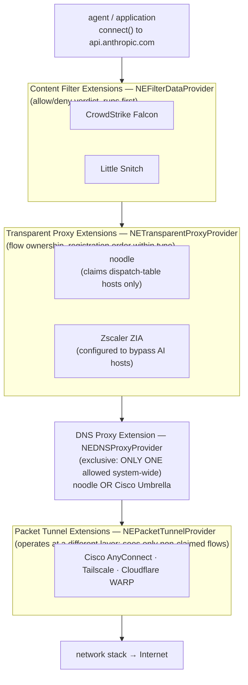
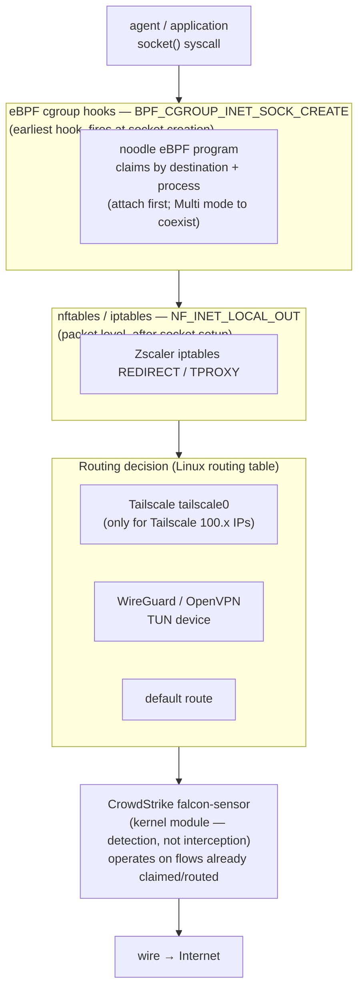
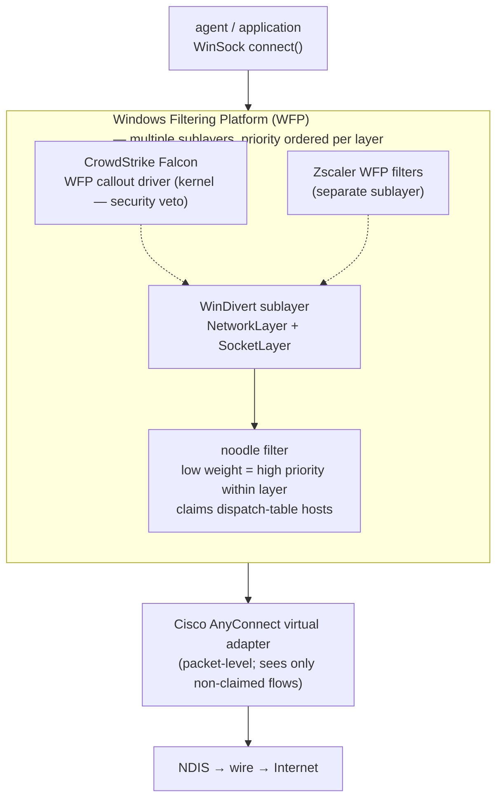

# ADR 035 — Endpoint product coexistence

**Status:** proposed. Design-spec depth for all OSes; implementation
deferred to each OS's entry-transport story.
**Audience:** Engineers working on entry transports, IT/Security teams
evaluating noodle for fleet deployment, anyone debugging connectivity
issues on a machine with noodle plus another network product.

**Related:** ADR 037 (entry transport — the mechanism this ADR sits on
top of), ADR 024 (fail-open — the safety contract when coexistence
fails), ADR 026 (deployment lifecycle).

---

## 1. Context

Enterprise machines are not clean rooms. A typical managed device
runs one or more of:

| Category | Products |
|---|---|
| **Secure Web Gateway / ZTNA** | Zscaler (ZIA/ZPA), Cisco Umbrella / Secure Client (AnyConnect), Netskope, Palo Alto Prisma Access |
| **VPN** | Cisco AnyConnect, GlobalProtect, Tailscale, WireGuard, OpenVPN |
| **Endpoint security** | CrowdStrike Falcon, SentinelOne, Microsoft Defender for Endpoint, Carbon Black |
| **DNS filtering** | Cisco Umbrella, NextDNS, DNSFilter, Cloudflare Gateway |
| **Network Extension / packet filter** | Little Snitch (macOS), Lulu (macOS), GlassWire (Windows) |
| **Cloud access broker** | Cloudflare WARP / Zero Trust, Netskope CASB |

Many of these products operate at the same OS layers noodle uses:
transparent proxy, DNS interception, TLS termination, kernel-level
packet filtering. When two products claim the same traffic through
the same OS mechanism, one of three things happens:

1. **One wins.** The OS enforces a priority order. The lower-priority
   product never sees the flow.
2. **They chain.** Both products process the flow sequentially. This
   can work but introduces latency, ordering dependencies, and
   failure-mode coupling.
3. **They conflict.** Both try to claim the flow, and the result is
   a connection failure, a loop, or undefined behaviour.

This ADR specifies how noodle avoids conflicts, chains correctly
where possible, and fails open when coexistence breaks.

---

## 2. Design principles

### 2.1 noodle claims narrowly

The single most important coexistence decision: **noodle claims only
the traffic it needs and nothing more.**

- The dispatch table (ADR 025) names a small, explicit set of
  hostnames: `api.anthropic.com`, `api.openai.com`,
  `generativelanguage.googleapis.com`, etc.
- The OS entry transport claims only flows to those hosts.
- **Every other flow on the system never enters the noodle process.**
  No CA is minted, no TLS is terminated, no bytes are observed.

This is not a workaround — it's the architecture. A VPN that routes
all traffic through a tunnel, a secure web gateway that inspects all
HTTPS, and noodle coexist because their claim sets are disjoint for
99%+ of traffic. noodle doesn't want `*.google.com` or
`login.microsoftonline.com`; it wants `api.anthropic.com`.

### 2.2 noodle sits closest to the application

For the flows noodle does claim, the ideal position in the network
stack is **closest to the application, before any other network
product processes the flow.** This means:

```
  Application (agent)
       │
       ▼
  noodle (claims AI-provider flows)
       │
       ▼
  VPN / SWG / ZTNA (routes / inspects everything else)
       │
       ▼
  Internet
```

noodle inspects the plaintext, injects attribution, strips markers,
writes `tap.jsonl`, then re-encrypts and hands the flow to the
normal network stack — which may include a VPN tunnel, a secure web
gateway, or nothing at all. The downstream product sees an
encrypted HTTPS flow to `api.anthropic.com` and routes it normally.

### 2.3 Double MITM is the enemy

The worst coexistence scenario: both noodle and another product
(e.g. Zscaler) perform TLS MITM on the same flow. The result:

```
  Agent → noodle-minted cert → noodle → Zscaler-minted cert → Zscaler → real upstream cert → API
```

This can work if noodle trusts Zscaler's CA for upstream
connections. But it's fragile:

- Certificate pinning in the agent may reject noodle's cert.
- Zscaler may reject noodle's cert (Zscaler doesn't know about
  noodle's CA).
- The double-MITM adds latency (two TLS terminations, two
  re-originations).
- Debugging TLS failures becomes a three-party investigation.

**noodle's answer: don't double-MITM.** For noodle-claimed flows,
noodle terminates TLS. The downstream product sees an already-
encrypted flow and routes it without inspecting. For non-noodle
flows, the other product's MITM operates normally — noodle is not
in the path.

This requires the other product to **not** also MITM the same
AI-provider hostnames. Achieving this is an IT configuration task
(see §4 per product).

### 2.4 Fail-open covers coexistence failures

When coexistence breaks (flows loop, connections fail, latency
spikes), noodle's fail-open contract (ADR 024) engages. The health
probe detects proxy unhealthy (because connections are failing), the
entry transport stops claiming flows, and traffic proceeds through
the normal stack without noodle.

This is the safety net. It doesn't fix the coexistence issue, but
it prevents noodle from being a permanent outage.

---

## 3. Per-OS coexistence mechanics

### 3.1 macOS — Network Extension priority and chaining

macOS Network Extensions are loaded by
`OSSystemExtensionManager` and activated through System
Settings → Network Extensions. When multiple extensions are
active, macOS processes flows through them in an order determined
by:

- **Extension type priority.** Content Filter Extensions
  (`NEFilterDataProvider`) run before Transparent Proxy Extensions
  (`NETransparentProxyProvider`). Packet Tunnel Extensions
  (`NEPacketTunnelProvider`) operate at a different layer.
- **Within the same type**, the order is determined by the
  system (not well-documented by Apple; empirically, it's
  registration order).



**noodle's macOS posture:**

| Other product | Their mechanism | Coexistence approach |
|---|---|---|
| **Zscaler ZIA** | `NETransparentProxyProvider` (or `NEPacketTunnelProvider` in tunnel mode) | Configure Zscaler to bypass AI-provider hostnames (Zscaler admin: App Profile → Bypass). noodle claims those hosts; Zscaler routes everything else. |
| **Cisco AnyConnect / Umbrella** | `NEPacketTunnelProvider` (VPN) + `NEDNSProxyProvider` (Umbrella DNS) | VPN tunnel carries all traffic; noodle's NE claims happen before the tunnel. Cisco Umbrella's DNS proxy may need a bypass for AI-provider hosts to avoid DNS conflict with noodle's DNS proxy. |
| **Tailscale** | `NEPacketTunnelProvider` | Tailscale routes to Tailscale IPs (100.x.y.z) and configured exit nodes. AI-provider IPs are not Tailscale destinations, so there's no conflict unless Tailscale is configured as a full exit node. If exit-node mode: Tailscale tunnels all traffic, and noodle's NE sees the pre-tunnel flow. |
| **CrowdStrike Falcon** | Kernel extension (legacy) or System Extension (`NEFilterDataProvider`) | Content Filter runs before Transparent Proxy in macOS's pipeline. CrowdStrike sees the flow first (for allow/block), then noodle claims it. No conflict — different extension types. |
| **Little Snitch** | `NEFilterDataProvider` | Same as CrowdStrike: content filter runs first. Little Snitch may prompt the user to allow noodle's outbound connections. Whitelist noodle's binary. |
| **Cloudflare WARP** | `NEPacketTunnelProvider` (Zero Trust) or `NETransparentProxyProvider` (WARP mode-dependent) | Same as Zscaler: configure WARP to bypass AI-provider hostnames (Cloudflare dashboard → Split Tunnels → Exclude). |

**DNS coexistence (macOS):**

noodle's `NEDNSProxyProvider` intercepts DNS queries to strip
`alpn=h3` and `ech=` records for target origins. If another product
also runs a `NEDNSProxyProvider` (e.g. Cisco Umbrella DNS), macOS
allows only one DNS proxy extension active at a time.

Resolution: noodle's DNS rewriting should be integrated into the
proxy's flow-handling rather than requiring a separate DNS proxy
extension, OR noodle should coordinate with the other DNS proxy
(deferred — depends on which products are common in target fleets).

### 3.2 Linux — eBPF and iptables/nftables coexistence

Linux network interception is less structured than macOS's NE
framework. Multiple products can attach eBPF programs to the same
cgroup, add nftables/iptables rules, and modify routing tables
simultaneously.



noodle's eBPF hook fires before iptables sees the packet, which
is why narrow claiming works regardless of where Zscaler's rules
or the routing table would otherwise send the flow.

**noodle's Linux posture:**

| Other product | Their mechanism | Coexistence approach |
|---|---|---|
| **Zscaler ZIA** | iptables REDIRECT + PAC proxy, or TPROXY | noodle's eBPF hook runs at `BPF_CGROUP_INET_SOCK_CREATE`, which is earlier in the stack than iptables REDIRECT (which operates at the packet level). noodle claims AI-provider sockets before Zscaler's iptables rules see them. Zscaler processes everything else. |
| **Tailscale** | WireGuard in userspace (`tailscale0` interface) + nftables routing | Tailscale routes Tailscale IPs through `tailscale0`. AI-provider IPs go through the default route. noodle's eBPF hook claims by process name, not by destination — so noodle intercepts the socket regardless of routing. The intercepted flow exits noodle and then follows the normal route (which may or may not be Tailscale). |
| **CrowdStrike Falcon** | Kernel module (`falcon-sensor`) | CrowdStrike operates at a different layer (endpoint detection, not traffic interception). No conflict with noodle's eBPF socket-create hook. |
| **OpenVPN / WireGuard** | TUN/TAP device + routing table | VPN routes all (or split) traffic through the tunnel device. noodle's eBPF hook claims sockets at creation time, before routing. Claimed flows exit noodle and then follow the routing table (through the VPN tunnel if that's where the destination routes). |

**Key Linux concern: cgroup attachment mode.**

noodle attaches its eBPF program to the root cgroup with
`CgroupAttachMode::Single` (only one program of this type per
cgroup). If another product also attaches a
`BPF_CGROUP_INET_SOCK_CREATE` program with `Single` mode, the
second attachment fails.

Mitigation: use `CgroupAttachMode::Multi` instead, which allows
multiple programs. The programs run in attachment order. noodle's
program should attach first (at install time) so it sees sockets
before other hooks. If another product already occupies the hook,
noodle can still attach in `Multi` mode — both programs run.

### 3.3 Windows — WinDivert and WFP coexistence

Windows Filtering Platform (WFP) allows multiple providers to
register filters at different layers and sublayers. WinDivert
creates its own sublayer and registers filters at the
NetworkLayer and SocketLayer.



CrowdStrike's kernel callout is by design the first thing to
inspect the flow (security veto). noodle's WinDivert filter
claims the flow at the SocketLayer for AI-provider hosts only;
everything else proceeds through the normal WFP pipeline.

**noodle's Windows posture:**

| Other product | Their mechanism | Coexistence approach |
|---|---|---|
| **Zscaler ZIA** | WFP callout driver + LSP/WinSock | Zscaler's WFP filters operate in a different sublayer. WFP processes filters in priority order within each layer. noodle's WinDivert filters should have higher priority (lower weight) so they process AI-provider packets before Zscaler. Configure Zscaler to bypass AI-provider hostnames. |
| **CrowdStrike Falcon** | Kernel driver + WFP callouts | CrowdStrike operates at the kernel level for inspection/blocking. WFP allows both products' filters to coexist. CrowdStrike may allow/block the flow before noodle's WinDivert filter sees it — this is correct (security product has veto). |
| **Cisco AnyConnect** | Virtual network adapter + WFP | VPN adapter captures routed traffic. noodle's WinDivert SocketLayer hook sees sockets before routing. Same pattern as Linux: noodle claims at socket-create, VPN routes at the network layer. |

---

## 4. IT configuration playbook

For each endpoint product co-deployed with noodle, IT must
configure one or both of:

1. **Bypass noodle-claimed hosts** in the other product's
   inspection/MITM config, so the other product does not also
   terminate TLS for those hosts.
2. **Allow noodle's traffic** in the other product's
   allow/block rules, so noodle's outbound connections to LLM
   providers are not blocked.

### 4.1 Zscaler ZIA

```
Admin Portal → Policy → Forwarding Policy:
  Add rule: Bypass Zscaler for destinations:
    - api.anthropic.com
    - api.openai.com
    - generativelanguage.googleapis.com
    - <other hosts from noodle dispatch table>
```

Or in the Zscaler app profile (for macOS/Windows client):
```
App Profile → Forwarding Profile → Bypass:
  Add hostnames from noodle dispatch table
```

### 4.2 Cisco Umbrella / Secure Client

```
Umbrella Dashboard → Policies → Proxy Settings:
  Bypass Decryption for:
    - api.anthropic.com
    - api.openai.com
    - <other dispatch-table hosts>
```

### 4.3 Cloudflare WARP / Zero Trust

```
Cloudflare Dashboard → Settings → Network → Split Tunnels:
  Mode: Exclude IPs and Domains
  Add:
    - api.anthropic.com
    - api.openai.com
    - <other dispatch-table hosts>
```

### 4.4 Tailscale

No configuration needed unless Tailscale is running as a full
exit node. In exit-node mode, Tailscale tunnels all traffic —
noodle intercepts before the tunnel, so claimed flows work
normally. Tailscale sees the re-encrypted flow from noodle and
tunnels it.

### 4.5 CrowdStrike / SentinelOne / Defender

No configuration needed. Endpoint security products operate at
the kernel / driver level for detection and response, not for
traffic interception. They may inspect connections for threat
indicators but do not MITM TLS.

Exception: if the endpoint security product blocks noodle's
binary from making outbound connections (application whitelisting),
add noodle to the allow list.

---

## 5. Detection and diagnostics

When coexistence breaks, the symptom is usually one of:

| Symptom | Likely cause | Diagnostic |
|---|---|---|
| TLS handshake failure on noodle-claimed hosts | Double MITM: another product is also terminating TLS | `openssl s_client -connect api.anthropic.com:443 -proxy 127.0.0.1:62100` — check the cert chain. If you see the other product's CA instead of noodle's, the other product is intercepting first. |
| Connection timeout on noodle-claimed hosts | Traffic loop: noodle and the other product are redirecting to each other | `tcpdump` on loopback. Look for repeated connections between noodle's port and the other product's port. |
| DNS resolution failure for noodle-claimed hosts | DNS proxy conflict: both noodle and another product are rewriting DNS | `dig api.anthropic.com +short` with and without noodle's DNS proxy active. Compare results. |
| Intermittent failures | Priority ordering: noodle and the other product are racing to claim flows | Check OS-specific extension/filter ordering (macOS: `systemextensionsctl list`; Linux: `bpftool cgroup list`; Windows: `netsh wfp show filters`). |
| noodle fails open unexpectedly | The other product is blocking noodle's outbound connections | Check the other product's logs for blocks on noodle's binary or on connections to LLM provider IPs. |

### 5.1 Diagnostic commands

**macOS:**
```sh
# List active Network Extensions
systemextensionsctl list

# Check which NE claims a specific host
log stream --predicate 'subsystem == "com.apple.networkextension"' --level debug

# Verify cert chain through noodle
openssl s_client -connect api.anthropic.com:443 \
  -proxy 127.0.0.1:62100 2>/dev/null | openssl x509 -noout -issuer
```

**Linux:**
```sh
# List eBPF programs attached to root cgroup
bpftool cgroup list /sys/fs/cgroup/

# Check nftables rules that might conflict
nft list ruleset | grep -i redirect

# Verify noodle's eBPF program is first in the chain
bpftool prog list | grep noodle
```

**Windows:**
```powershell
# List WFP filters
netsh wfp show filters

# Check WinDivert sublayer
netsh wfp show sublayers

# Verify driver load order
sc query type= driver | findstr /i "noodle windivert"
```

---

## 6. The coexistence contract

noodle makes the following guarantees to co-deployed products:

1. **Narrow claim set.** noodle claims only the hosts in the
   dispatch table — a small, explicit, IT-controlled list.
   Everything else is untouched.
2. **Standard re-encryption.** After inspection, noodle
   re-originates a normal HTTPS connection to the upstream. The
   downstream network stack (VPN, SWG) sees a standard encrypted
   flow and can route it normally.
3. **No routing-table modification.** noodle does not add routes,
   change DNS servers, or modify the default gateway. Traffic
   routing is unchanged.
4. **No kernel module (except Windows driver).** On macOS and
   Linux, noodle operates in userspace (NE framework / eBPF).
   No kernel module conflicts.
5. **Fail-open on conflict.** If coexistence breaks, noodle's
   health probe detects the failure and the entry transport fails
   open. Traffic proceeds without noodle. The other product's
   operation is unaffected.

noodle requests the following from co-deployed products:

1. **Bypass AI-provider hosts from TLS inspection.** The other
   product should not also MITM the hosts noodle claims.
2. **Allow noodle's outbound connections.** The other product
   should not block noodle's binary from reaching LLM providers.
3. **Stable filter/extension ordering.** The IT team should verify
   ordering after any product update.

---

## 7. Architecture for coexistence testing

Coexistence is not something noodle can test in isolation. The test
matrix is:

```
  noodle × {Zscaler, Cisco, CrowdStrike, Tailscale, WARP, ...}
         × {macOS, Linux, Windows}
         × {forward-proxy, transparent-proxy}
```

This is a combinatorial problem. The approach:

1. **Tier 1 (mandatory before GA):** Zscaler + CrowdStrike on
   macOS (the most common enterprise stack). Verify: no double-
   MITM, no flow loops, fail-open engages on conflict.
2. **Tier 2 (before enterprise launch):** Cisco + Tailscale on
   macOS and Linux. Same verification.
3. **Tier 3 (on-demand):** All other combinations. Tested when a
   customer deployment requires it.

Each tier produces a runbook entry in `docs/guides/` with
the specific configuration steps and diagnostic commands.

---

## 8. Open questions

- **macOS DNS proxy exclusivity.** macOS allows only one
  `NEDNSProxyProvider` at a time. If a co-deployed product (Cisco
  Umbrella) also uses a DNS proxy, noodle cannot run its DNS
  extension. Alternative: perform DNS record rewriting inside the
  transparent proxy (read the DNS response, strip records, forward
  modified response) rather than using a separate DNS extension.
  Defer until the conflict surfaces in a real deployment.
- **Zscaler tunnel mode vs proxy mode.** Zscaler can operate as a
  full tunnel (all traffic) or as a proxy (configured traffic).
  The coexistence approach differs. Tunnel mode may require
  Zscaler-side split-tunnel configuration. Detail deferred to the
  Zscaler-specific runbook.
- **Certificate chain validation.** When noodle sits in front of a
  VPN that also performs TLS inspection on non-noodle flows, the
  VPN's CA must be in noodle's upstream trust store so noodle can
  validate the VPN's certs for non-AI traffic that accidentally
  routes through noodle. Today this shouldn't happen (noodle claims
  narrowly), but investigate if it becomes an edge case.
- **QUIC coexistence.** ADR 014 specifies QUIC MITM. Some endpoint
  products (Zscaler, WARP) also intercept QUIC. The coexistence
  story for QUIC is identical to TCP (bypass AI hosts) but the
  mechanics differ (UDP blackhole vs filter). Defer to ADR 014.
