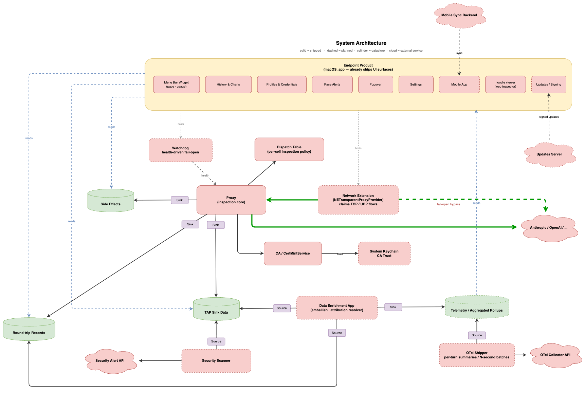

# 036 — macOS-collector parity: value-cadence plan

**Status:** Open · 2026-05-27
**Author:** Joe Barnett · Claude (via `~/.claude/skills/value-cadence/SKILL.md`)
**Related:** ADR 001 §principle 7, ADR 020, ADR 022, ADR 023 (roundtrip telemetry), ADR 027, ADR 028, ADR 030, ADR 031, ADR 038 (side_effects.jsonl wire format); feature 028 (deferred), feature 040 (round-trip records story).
**External reference:** `(external reference removed)/docs/design/ai-telemetry-event-schema.md` — `ai-telemetry` v0.0.2 schema.
**System diagram:** [`../diagrams/system-architecture.drawio`](../diagrams/system-architecture.drawio).

---

## Goal

Close the macOS-collector parity gap — ship "marker emitted → token-aware OTLP span lands in the telemetry backend" in rust by building the downstream pieces ADR 022 + ADR 031 specify (`ai-telemetry` v0.0.2 mapping, OTel shipper, separate-repo OTel collector) and fixing the correlation gap on `side_effects.jsonl` that blocks all of them.

The architecture is **file-boundary, post-enrichment OTLP**: proxy → typed JSONL files → `noodle-embellish` → rollups SQLite → `noodle-shipper` (OTLP) → OTel collector → the telemetry backend. See [`docs/diagrams/system-architecture.drawio`](../diagrams/system-architecture.drawio). An earlier draft of this cadence included an in-proxy `OtlpSideEffectSink` (slice 041) that emitted OTLP directly from the SideEffect bus; that path is **retired** — it re-couples the proxy to collector availability and bypasses enrichment. The shipper component in slice 043 owns OTLP emission.

## Gating questions, self-quoted from corpus

- `docs/adrs/022-otel-collector-embellishment-plane.md:status` — "shape-locked but build deferred." The build is the gap.
- `docs/adrs/031-embellishment-processor.md:§"Why"` — the processor is "the validating consumer that proves the boundary delivers consumable value." No validating consumer exists in rust today.
- `docs/features/000-overview.md:item-24` — "today's per-side-effect file forces consumer-side correlation by `flow_id`." Confirmed on disk: `~/.noodle/side_effects.jsonl` shows `flow_id=0`, no `event_id`, no `turn_id`, `at_unix_ms=0` on Artifact/Audit.
- `docs/features/done/028-embellishment-addon-layer.md:status` — "deferred / parked since 2026-05-16." Identity resolution is the unblock; lives in the OTel collector per ADR 022 §2 point 4.

## What's actually built in rust today vs the macOS reference

| Component | macOS collector | Rust noodle |
|---|---|---|
| Network entry / fail-open | ✅ shipping | ❌ design-spec only (ADR 037, 024) |
| Proxy + MITM | ✅ | ✅ |
| Hint/Artifact/Audit/Resolved bus | implicit, in-process | ✅ `side_effects.jsonl` ([040.a](../features/040.a-side-effect-correlation-block.md) shipped) |
| Per-round-trip records | implicit | ✅ `roundtrips.jsonl` ([040.b](../features/040.b-roundtripsink-and-roundtrips-jsonl.md) shipped) |
| Decoded wire boundary | (none — opaque dump) | ✅ `tap.jsonl` with marks / content.blocks[] / events[] / pairing / usage / envelope / attribution.markers[] |
| Embellishment processor → SQLite | ✅ in-process | 🟡 `noodle-embellish` exists; `ai-telemetry` v0.0.2 mapping per ADR 031 missing |
| OTel shipper (rollups → OTLP) | ✅ (the telemetry backend proprietary protocol, in-process) | ❌ `noodle-shipper` not built; slice 043 owns it |
| OTel collector with identity resolution | ✅ in-process | ❌ separate-process pattern documented; not built |

## Architectural contrast (one-liner)

macOS = one process did everything (capture + shape + enrich + ship). Rust = four processes (proxy emits typed JSONL facts; `noodle-embellish` maps to `ai-telemetry`; `noodle-shipper` pushes OTLP; OTel collector owns identity + cost rate-card), with `tap.jsonl` + `side_effects.jsonl` + `roundtrips.jsonl` as the typed boundary. Payoff: plurality of consumers + protocol-purity of the core + every stage's file-buffer survives downstream outage. Cost: more processes to operate; the shipper + collector aren't built in rust yet.

## Evidence tracks (zero substrate dependency)

- **E1** — `jq` over live `~/.noodle/{tap,side_effects}.jsonl`; per-variant ID coverage with cited counts. Grounds every downstream AC.
- **E2** — Map every required field in `ai-telemetry-event-schema.md` to a source field on `tap.jsonl` + `side_effects.jsonl`. Fixture table, no code. Catches schema infeasibility before 042 starts.
- **E3** — Instrument `AnthropicMarkingDetector` with boundary-decision trace; replay multi-turn + multi-agent-run real `claude` capture; verify ADR 023 §2.4 / §2.5 logic before 040.c lands.
- **E4** — Stand a wiremock OTLP receiver; hand-craft one OTLP payload per `ai-telemetry` row shape; assert acceptance. Catches wire-format gotchas before 043's OTLP exporter starts.
- **E5** — Document the existing the telemetry backend shipper's input contract (`(external reference removed)/`). The cursor-on-flag SQLite pattern is what slice 043's `noodle-shipper` adopts.

## Cadence

| # | Slice | What it demonstrates | Dep | ETA |
|---|---|---|---|---|
| E1 | Live correlation-gap audit (`jq`) | Per-variant ID coverage today, cited counts | — | 2h | ✅ shipped (PR #86) |
| E2 | `ai-telemetry` v0.0.2 → tap+side_effects fixture mapping (no code) | Every target field is reachable | — | 4h | ✅ shipped (PR #86) |
| E3 | `AnthropicMarkingDetector` boundary-trace replay | §2.4 / §2.5 detection logic correct | — | 1d | ✅ shipped (PR #86) |
| E4 | Wiremock OTLP receiver + hand-crafted ai-telemetry payloads | OTLP wire shape accepts what 043 will emit | — | 3h | ✅ shipped (PR #86; live round-trip deferred to 043 AC #7) |
| E5 | the telemetry backend shipper input-contract documented | Cursor-on-flag SQLite pattern documented | — | 2h | ✅ shipped (PR #86) |
| 040.a | `Correlation` block on every `SideEffect`; drain stamps it | `side_effects.jsonl` carries 4 IDs + non-zero `at_unix_ms` on every record; `jq` join with `tap.jsonl` by `event_id` is 1:1 | E1 | 2–3d | ✅ shipped (PR #87) |
| 040.b | `RoundTripSink` + `RoundTripRecord` → `roundtrips.jsonl` | One self-contained record per round-trip; the downstream telemetry consumer reads directly | 040.a, E2 | 3–5d | ✅ shipped (PR #88) |
| 040.c | Turn + agent-run boundary detection in `MarkingDetector` | `turn_id` stable across continuation RTs; `agent_run_id` stable across system-prompt-stable turns | 040.a, E3 | 2–3d | open |
| 042 | `noodle-embellish` maps `tap.jsonl` + `roundtrips.jsonl` → `ai-telemetry` v0.0.2 (ADR 031) | SQLite rows match macOS schema verbatim | 040.b, E2 | 3–5d | open |
| 043 | `noodle-shipper`: rollups SQLite → OTLP → collector | Live OTel collector receives one OTLP record per round-trip; at-least-once delivery via cursor-on-flag | 042, E4, E5 | 5–8d | open (scope-expanded — was "handoff contract"; now owns the OTLP exporter retired from 041) |
| 044 | OTel collector with identity-resolution + cost-rate-card processors (separate repo, ADR 022 §2) | "Marker emitted → token-aware OTLP span lands in the telemetry backend" end-to-end | 043 | 1–2w | open (out-of-repo) |

> **Retired:** slice 041 (`OtlpSideEffectSink` — in-proxy OTLP adapter). The in-proxy path re-couples the proxy to collector availability and bypasses enrichment. The OTLP emission lives in `noodle-shipper` ([043](../features/043-shipper-handoff-contract.md)) as drawn in `system-architecture.drawio`. See PR retiring the 041 story file.

## Parallelism + proof points

- E1–E5 ran in parallel (zero substrate dependency). All shipped.
- After 040.a landed, 040.b / 040.c / 042 run in parallel.
- After 040.b lands, 042 has the per-round-trip record it joins against; the mapper work starts.
- After 042 lands, 043 has the SQLite source to read from; the shipper work starts.
- 044 implementation picks up after 043.
- **040.b is the data-shape proof point** — one self-contained per-round-trip record on disk, joinable, no client-side reconstruction. The validating contract for everything downstream. ✅ shipped.
- **044 is the full-runbook proof point** — macOS-collector parity demonstrated end-to-end in rust.

## Next move

[040.c](../features/040.c-turn-and-agent-run-boundary-detection.md) — boundary detection so `turn_id` + `agent_run_id` populate on `tap.jsonl` marks block and propagate through the [040.a](../features/040.a-side-effect-correlation-block.md) correlation block (which today stamps `agent_run_id: None`). E3's instrumentation confirmed the call-site plumbing gap in `crates/noodle-adapters/src/marking/anthropic.rs`.

## Backlog state

Cadence slices map to backlog items 24–28 in [`docs/features/000-overview.md`](../features/000-overview.md):

- **#24** → story [`040`](../features/040-roundtrip-telemetry-records-and-correlation-ids.md) (sub-stories `040.a` / `040.b` / `040.c`)
- **#25** → **retired.** Was `OtlpSideEffectSink`; the OTLP-emission scope moved into slice 043's `noodle-shipper`. Renumbering deferred — `000-overview.md` row 25 now reads "(retired) → 043".
- **#26** → story [`042`](../features/042-ai-telemetry-v0-0-2-mapping.md) — `ai-telemetry` v0.0.2 mapper
- **#27** → story [`043`](../features/043-shipper-handoff-contract.md) — `noodle-shipper` (rollups SQLite → OTLP → collector)
- **#28** → story [`044`](../features/044-otel-collector-separate-repo.md) — OTel collector (out-of-repo)
