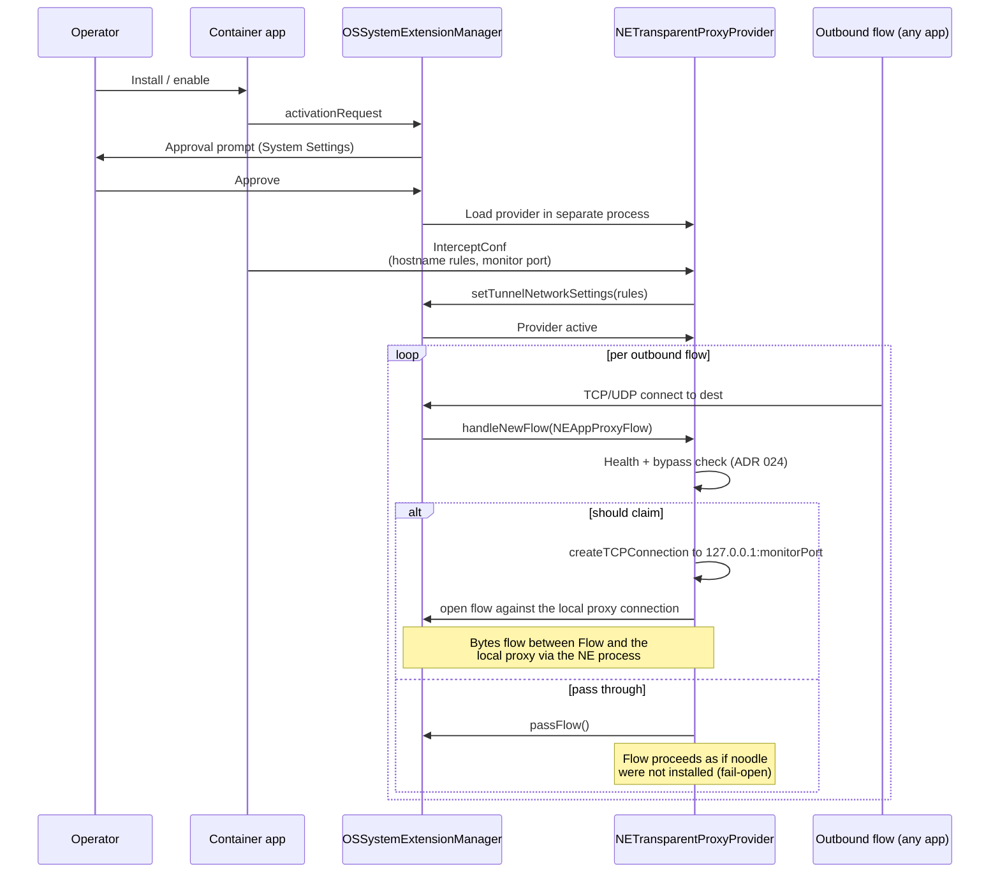
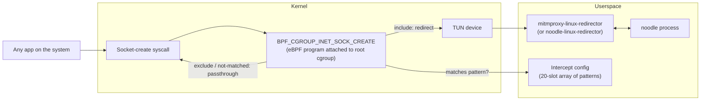

# ADR 037 — Entry transport: how bytes arrive at noodle

**Status:** current. macOS is in flight (story 011). Linux and Windows are
specified at design-spec depth; implementation deferred.

**Sister design:** ADR 024 (fail-open / bypass behaviour).
**Companion:** ADR 014 (QUIC MITM engineering plan — what to do with QUIC
flows *once they arrive*).
**References:** mitmproxy at `/Users/josephbarnett/business/code/mitmproxy/`
(macOS, Linux eBPF, Windows redirectors); the telemetry backend AI collector at
`(external reference removed)/`
(macOS Network Extension reference, release/0.1 branch);
`crates/noodle-macos-tproxy/`, `apps/noodle-macos/` (noodle's macOS
implementation in progress).

---

## 1. Context

The proxy cannot inspect, mutate, or attribute traffic until that traffic
reaches the proxy process. **Entry transport** is the mechanism by which
operating-system traffic is delivered into the noodle process. It is the
foundation under everything else — codecs, transforms, the dispatch
table, the wire log all presuppose that bytes have already arrived.

The classic forward-proxy posture (`HTTPS_PROXY=http://127.0.0.1:62100`)
covers only well-behaved HTTP / HTTPS clients that honour the environment
variable. It does not cover:

- Apps that ignore `HTTPS_PROXY` (many native applications, OS components).
- QUIC / HTTP-3 traffic (UDP; outside the HTTP-proxy contract).
- DNS queries (UDP/53 by default).
- Any non-HTTP traffic in scope (MCP-over-anything, telemetry, etc.).

A system-level entry transport catches all of these by intercepting at
the operating system's network plane. Each OS exposes a different
mechanism. This ADR specifies what noodle uses on macOS, Linux, and
Windows, what each mechanism does, and the common contract every
implementation delivers to the engine.

## 2. Decision

### 2.1 Each OS uses its native traffic-claim mechanism

| OS | Mechanism | Packaging |
|---|---|---|
| **macOS** | `NETransparentProxyProvider` (Network Extension framework) | System Extension `.appex` in a container app |
| **Linux** | eBPF `BPF_CGROUP_INET_SOCK_CREATE` cgroup hook + TUN device | ELF binary + setuid/capability install |
| **Windows** | WinDivert (user-mode wrapper around WFP) | Executable + WinDivert driver install |

DNS interception is per-OS and uses the same native facilities:

| OS | DNS interception |
|---|---|
| **macOS** | `NEDNSProxyProvider` (separate provider class in the same bundle) |
| **Linux** | nftables / systemd-resolved redirect to a local resolver, OR eBPF UDP/53 path |
| **Windows** | WinDivert NetworkLayer claim on UDP/53 |

### 2.2 Every entry transport delivers the same contract to noodle

Each implementation hands the engine:

- **New-flow event.** Identifier (connection id or 5-tuple), transport
  (TCP / UDP), and process info (PID + process command name) when the OS
  provides it.
- **Bidirectional byte stream** keyed by the flow identifier.
- **Per-flow close**.

The engine consumes this shape. It does not know which OS produced the
flow. Per-OS state (sysext lifecycle, eBPF program load, WinDivert
driver) is contained inside the entry-transport implementation.

### 2.3 Default behaviour is to pass through

When the noodle process is not reachable, or when the entry transport is
explicitly bypassed, every implementation passes the flow through to the
OS unmodified — the flow proceeds as if noodle were not installed.
Pass-through is the safety contract. The mechanism is specified in
ADR 024.

### 2.4 Path A relative to ADR 014

This ADR is the canonical cross-OS entry-transport specification. The
macOS-entry-transport content previously carried by ADR 014 (transparent
mode + QUIC MITM) is consolidated here. ADR 014's scope narrows to its
QUIC MITM engineering plan — what noodle does to QUIC bytes *once they
have been claimed* by the macOS entry transport.

---

## 3. macOS — Network Extension

macOS exposes traffic interception through Apple's
[Network Extension](https://developer.apple.com/documentation/networkextension)
framework. The framework defines several **provider classes**; each one
runs as a separate process (an `.appex`) installed by a container app via
`OSSystemExtensionManager`. The provider classes differ by what they
claim and what they can do with what they claim.

### 3.1 The four provider classes

| Provider | What it sees | What it can do | Used by noodle? |
|---|---|---|---|
| **`NETransparentProxyProvider`** | TCP and UDP flows matched by destination rules (hostname or IP + port). | Redirect the flow's bytes to a user-space process (typically a local socket). Pass through unmodified. | **Yes — primary.** This is how noodle claims AI-provider TCP flows and how it redirects them into the noodle process. |
| **`NEDNSProxyProvider`** | DNS queries (all system DNS, before any TCP connection forms). | Forward queries to upstream resolvers; rewrite responses; drop queries. | **Yes — for DNS stripping.** Removes `alpn=h3` and `ech=` from HTTPS (SVCB / RR type 65) records for target origins. |
| **`NEFilterDataProvider`** | Every packet of every claimed flow, in both directions. | Allow / block / defer per packet. Cannot redirect. | **No.** Too heavy for noodle's posture; we want bytes in the proxy process, not byte-level policy decisions in the extension. |
| **`NEPacketTunnelProvider`** | Full VPN-style packet tunnel. | Anything a VPN can do — entire packet streams routed through the extension. | **No.** Disproportionate. The transparent-proxy variant is the right granularity. |

A single container app may host more than one provider — noodle ships
both `NETransparentProxyProvider` (for TCP/UDP flow claim) and
`NEDNSProxyProvider` (for DNS rewriting). Each is a separate `.appex`
inside the container app's bundle and is approved independently by the
user.

### 3.2 What `NETransparentProxyProvider` does, in detail

The provider's lifecycle:



Key details:

- **Hostname-based rules.** `NETransparentProxyNetworkSettings` requires
  rules expressed by hostname (not IP range). The provider must declare
  the set of hostnames it claims at start-up, e.g.
  `api.anthropic.com`, `claude.ai`, `*.openai.com`. The hostname list is
  the coarse first filter.
- **Per-flow decision in `handleNewFlow`.** When a matching flow opens,
  the provider gets an `NEAppProxyFlow` (TCP) or `NEAppProxyUDPFlow`
  (UDP) object. The provider decides whether to claim or pass.
- **Process attribution.** `flow.metaData.sourceAppSigningIdentifier`
  and `flow.metaData.sourceAppAuditToken` carry signing identity and
  PID. The provider can record which app originated each flow without
  the proxy having to derive it from sockets.
- **The bypass channel into the local proxy.** Inside the extension,
  `createTCPConnection(to: NWHostEndpoint("127.0.0.1", "9090"))` opens
  a connection to noodle's monitor port. This is an NEProvider API that
  *bypasses the NE's own filtering*, allowing the extension to reach
  localhost from within its own sandbox. The two flows (incoming
  `NEAppProxyFlow` and outgoing `NEProvider`-created TCP connection)
  are wired together; the extension shuttles bytes between them.

### 3.3 What `NEDNSProxyProvider` does, in detail

For each DNS query the system originates:

1. The provider receives the query (`handleNewFlow(NEAppProxyUDPFlow)`
   for UDP/53, or the equivalent for DoT / DoQ if they go through the
   system resolver).
2. The provider forwards the query to the configured upstream resolver
   and reads the response.
3. For target origins (a configured list), the provider rewrites the
   response **before** handing it back to the system:
   - Strip `alpn=h3` from HTTPS / SVCB records (forces the client to
     fall back to TCP+TLS, which `NETransparentProxyProvider` then
     claims).
   - Strip `ech=` from HTTPS records (prevents Encrypted Client Hello,
     which would hide the SNI from TLS MITM).
   - A / AAAA, `ipv4hint`, `port`, and unrelated records pass through
     unchanged.
4. For non-target origins, the response passes through unchanged.

DoH (DNS-over-HTTPS) bypasses the system resolver entirely — Chromium
and some Electron apps ship their own DoH client. The DNS proxy cannot
see these queries. The mitigation is per ADR 014 §5.1: block known DoH
endpoints at the transparent proxy layer, forcing fallback to system
DNS.

### 3.4 System Extension packaging

```
Noodle.app/                                        ← container app
├── Contents/
│   ├── MacOS/Noodle                                ← the container binary
│   ├── Library/
│   │   └── SystemExtensions/
│   │       ├── com.noodle.transparent-proxy.appex   ← NETransparentProxyProvider
│   │       └── com.noodle.dns-proxy.appex           ← NEDNSProxyProvider
│   └── Info.plist
```

Each provider:
- Has its own bundle ID under `com.noodle.*`.
- Carries the `com.apple.developer.networking.networkextension`
  entitlement (a *restricted* entitlement granted to a developer team
  by Apple — `NOODLE_TPROXY_DEVELOPMENT_TEAM = KRU5V3NCWA`).
- Is signed by the team identity that owns the entitlement.
- Is loaded and approved independently by the user in System Settings →
  General → Login Items & Extensions → Network Extensions.

### 3.5 IPC between the extension and the noodle process

The extension and the proxy process communicate via a **localhost TCP
connection** opened from inside the extension to `127.0.0.1:9090`
(the configured monitor port). This is intentional rather than a Unix
socket or named pipe:

- `createTCPConnection` is the documented NEProvider API; it works from
  within the sandbox.
- The monitor port is configurable so the operator can move it.
- Loopback only; no external listener.

The byte protocol is opaque to the OS — it's just bidirectional bytes
on the connection. The proxy speaks rama's normal HTTP-over-TLS to
inspect the claimed flow.

### 3.6 macOS-specific gotchas (lessons from current implementations)

- **Sysexts run as root.** Swift APIs that resolve to user-domain paths
  (`FileManager.url(for:in:appropriateFor:create:)` with
  `.userDomainMask`) resolve to `/var/root/Library/...` and are
  unreadable by the operator user. Any file the user needs to see (CA
  bundle, status, logs) must be written to a system-readable path with
  explicit permissions. noodle writes the CA to
  `/Library/Application Support/noodle/macos-tproxy-ca.pem` with
  `chmod 0644`.
- **`TransparentProxyFlowMeta` does not carry the hostname.** The flow
  metadata exposes only the resolved remote IP and port — not the
  original hostname the app asked for. Hostname-based routing decisions
  inside the engine require peeking the TLS ClientHello's SNI (the
  `PeekTlsClientHelloService` in front of `TlsMitmRelayService`).
- **`launchctl setenv` distribution.** Setting `NODE_EXTRA_CA_CERTS`,
  `REQUESTS_CA_BUNDLE`, `SSL_CERT_FILE`, `CURL_CA_BUNDLE`,
  `AWS_CA_BUNDLE` via `launchctl setenv` makes the CA visible to
  GUI-launched apps. Shell-launched processes need rc-file edits
  separately.
- **Sysext version upgrade.** Approved sysexts cannot be cleanly
  upgraded in place unless the version number is bumped. Track this in
  the bundle's `CFBundleVersion`.

### 3.7 macOS reference implementations

- **noodle (in flight):** `crates/noodle-macos-tproxy/` (Rust staticlib
  with FFI), `apps/noodle-macos/` (Xcode project, xcodegen-managed).
- **the reference AI collector (canonical reference for fail-open):**
  `app/CZNetworkExtension/TransparentProxyProvider.swift` — full
  `NETransparentProxyProvider` with health-driven fail-open and
  user-controlled bypass.
- **mitmproxy:**
  `mitmproxy_rs/mitmproxy-macos/redirector/network-extension/TransparentProxyProvider.swift`
  — alternative reference.

---

## 4. Linux — eBPF cgroup hook

Linux exposes traffic interception through several mechanisms. The most
flexible and modern is **eBPF** (extended Berkeley Packet Filter)
programs attached to **cgroup hooks**. eBPF programs run in-kernel, are
verified before load, and can make per-socket policy decisions with
process context.

### 4.1 The mechanism



Concretely:

- **eBPF program type:** `BPF_CGROUP_INET_SOCK_CREATE`. Attached to the
  root cgroup with `CgroupAttachMode::Single`, so every socket created
  anywhere on the system passes through the program.
- **Pattern matching:** the eBPF program reads a kernel-side
  configuration array (length `INTERCEPT_CONF_LEN = 20`) of `Action`
  records:
  ```rust
  pub enum Action {
      None,
      Include(Pattern),
      Exclude(Pattern),
  }
  pub enum Pattern {
      Pid(u32),
      Process([u8; TASK_COMM_LEN]),  // TASK_COMM_LEN = 16
  }
  ```
  Patterns can target a specific PID or a process command name. Include
  rules claim sockets for redirection; exclude rules explicitly skip.
- **TUN device for forwarding:** matched sockets are redirected to a
  TUN device the userspace redirector created. The redirector reads
  packets from the TUN device and forwards them to the noodle process
  over a Unix datagram socket.

### 4.2 Why eBPF (vs nftables / TPROXY / `iptables`)

- **Process awareness.** nftables and `iptables` operate on
  packets — they have no notion of which process originated the
  connection. eBPF cgroup hooks see the socket at creation time, with
  the originating PID and command. This is the same per-app
  granularity macOS provides through `NEAppRule`.
- **Lower latency.** No per-packet match against userspace rules.
- **No kernel module.** eBPF programs are JIT-compiled and verified;
  installing one requires `CAP_BPF` (and on older kernels, `CAP_SYS_ADMIN`),
  not a custom kernel module.
- **Modern kernels only.** eBPF cgroup hooks require Linux 4.10+ for
  the basic shape; the program style here works reliably on 5.5+. On
  older kernels the fallback is nftables TPROXY (per-port redirection
  without process awareness).

### 4.3 IPC between the redirector and the noodle process

Unix datagram socket. Length-delimited Protobuf messages (the
`mitmproxy::ipc` shape). The redirector spawns the noodle process or is
connected by it; the IPC channel carries:

- `NewFlow` messages with connection id, transport, remote endpoint,
  process info.
- `PacketWithMeta` for forwarded payload data.
- Configuration updates from the noodle process to update the
  `INTERCEPT_CONF` array via eBPF map syscalls.

### 4.4 DNS interception on Linux

Three viable approaches; the choice depends on system configuration:

1. **Redirect UDP/53 to a local resolver.** nftables rule:
   `redirect tcp/udp dport 53 → 127.0.0.1:5353` plus a small DNS
   server running on 5353 that performs the same record-rewriting as
   `NEDNSProxyProvider` on macOS. Most portable; works on any kernel.
2. **systemd-resolved hook.** On distros that use systemd-resolved,
   replace `/etc/resolv.conf` with a stub that points at the local
   rewriter, or use the systemd-resolved DBus interface to register a
   custom DNS receiver.
3. **eBPF UDP/53 redirect.** Extend the eBPF program to also redirect
   sockets matching `dst_port == 53`. Same TUN-device path as TCP.

The decision among the three is deferred until the Linux story is
prioritized.

### 4.5 Linux reference implementation

- mitmproxy:
  `mitmproxy_rs/mitmproxy-linux/` (userspace redirector),
  `mitmproxy_rs/mitmproxy-linux-ebpf/` (eBPF program loader),
  `mitmproxy_rs/mitmproxy-linux-ebpf-common/` (types shared between the
  kernel-side eBPF program and the userspace loader).
- Build tooling: `aya` (Rust eBPF framework), `bpf-linker`, nightly Rust
  for the kernel-side program.

---

## 5. Windows — WinDivert + WFP

Windows exposes traffic interception through the **Windows Filtering
Platform (WFP)**, a kernel-level packet-filtering framework.
[WinDivert](https://reqrypt.org/windivert.html) is a user-mode driver
that wraps WFP and exposes a simpler API for redirecting packets.
noodle uses WinDivert at two layers simultaneously.

### 5.1 The two WinDivert layers

| Layer | What it sees | What it does for noodle |
|---|---|---|
| **NetworkLayer** | Every IP packet, in either direction. | Redirects matching packets (intercepts the bytes themselves). |
| **SocketLayer** | Socket-info events (process opens / accepts a socket on a (address, port, transport) tuple). | Builds a connection table mapping `(socket addr, transport) → process_info`. Provides per-flow process attribution. |

The redirector listens on both layers concurrently. The NetworkLayer
gives it the packets; the SocketLayer gives it the process attribution
to label those packets with.

### 5.2 The connection table

```rust
enum ConnectionState {
    Known(ConnectionAction),       // a SocketLayer event has arrived
    Unknown(Vec<(...)>),            // packets queued waiting for attribution
}

enum ConnectionAction {
    None,
    Intercept(ProcessInfo),
}
```

When a NetworkLayer packet arrives:

1. Look up the connection in the table by `(remote addr, transport)`.
2. If `Known(Intercept(info))`, forward the packet to noodle with
   `info`.
3. If `Known(None)`, pass the packet through unmodified.
4. If `Unknown`, queue the packet; the SocketLayer event will arrive
   shortly and resolve the connection's state. Then drain the queue.

This dual-layer design is Windows-specific: the OS exposes process
attribution and packet bytes through separate notification streams, so
the redirector has to join them.

### 5.3 IPC between the redirector and the noodle process

Windows **named pipe**. Default name:
`\\.\pipe\mitmproxy-transparent-proxy` (noodle's equivalent would be
`\\.\pipe\noodle-transparent-proxy`). Same length-delimited Protobuf
message format used on the other OSes.

### 5.4 DNS interception on Windows

WinDivert NetworkLayer claim on UDP/53 — same mechanism as for other
traffic, with the redirector forwarding the DNS query to a local
rewriter that performs `alpn=h3` / `ech=` stripping. WFP filter
callouts at the ALE layer (Application Layer Enforcement) are an
alternative but require a kernel-mode driver; user-mode WinDivert is
simpler.

### 5.5 Windows install posture

- WinDivert ships a signed kernel driver (`WinDivert.sys`); the
  redirector binary loads it on start and unloads on exit.
- Administrator privileges required to load the driver.
- The redirector runs as a system service.

### 5.6 Windows reference implementation

- mitmproxy: `mitmproxy_rs/mitmproxy-windows/redirector/` (Rust),
  `mitmproxy_rs/mitmproxy-windows/mitmproxy_windows/` (Python wrapper).
- Library: the `windivert` Rust crate.

---

## 6. Comparative cross-OS table

| Concern | macOS | Linux | Windows |
|---|---|---|---|
| **TCP/UDP flow claim** | `NETransparentProxyProvider` | eBPF cgroup hook + TUN device | WinDivert NetworkLayer |
| **Process attribution** | `flow.metaData` (signing identity + PID) | eBPF reads PID + `task->comm` at socket-create | WinDivert SocketLayer + connection table |
| **Granularity of claim rule** | Hostname (set at provider start) | PID or process command name (16-byte `task->comm`) | Per-packet WFP filter (configurable) |
| **DNS interception** | `NEDNSProxyProvider` | nftables / systemd-resolved / eBPF UDP/53 | WinDivert NetworkLayer on UDP/53 |
| **IPC to noodle process** | Localhost TCP (`127.0.0.1:9090` by default) | Unix datagram socket | Named pipe |
| **Packaging** | System Extension `.appex` inside container app | ELF binary + cgroup setup | EXE + WinDivert kernel driver |
| **Privileged install** | sysext approval prompt | root + `CAP_BPF` | Administrator + driver install |
| **Sandbox** | Apple sysext sandbox | none (root in user namespace) | none (admin process) |
| **Pass-through cost** | One `passFlow()` call per non-claimed flow | eBPF returns `Action::None` — no userspace cost | One WFP filter rule match per packet |

---

## 7. The IPC contract — what every entry transport hands to noodle

Every entry-transport implementation, regardless of OS, delivers the
same shape over its IPC channel:

```
NewFlow {
    flow_id:           u64,                       // local, monotonically increasing
    transport:         enum { TCP, UDP },
    local_addr:        SocketAddr,                // the OS-visible source
    remote_addr:       SocketAddr,                // the destination as the app sees it
    remote_hostname:   Option<String>,            // populated when the OS supplies it
                                                  // (NETransparentProxyProvider does;
                                                  // eBPF can derive at socket-create;
                                                  // WinDivert SocketLayer carries it)
    process_info:      Option<ProcessInfo>,       // OS-specific shape
}

ProcessInfo {
    pid:               u32,
    command_name:      Option<String>,            // executable name / TASK_COMM
    signing_identity:  Option<String>,            // macOS only
}

// After NewFlow, bidirectional Bytes streams keyed by flow_id.

FlowData { flow_id, direction: enum { Inbound, Outbound }, bytes }
FlowClose { flow_id }
```

The engine consumes `NewFlow` to construct a `CodecProbe` (host, port,
process info), runs `RequestDetector`s at flow open (ADR 021), and
dispatches the flow through the codec stack (ADR 015 / ADR 019). The
engine does not differentiate by which OS produced the flow.

The contract is intentionally minimal so that future entry transports
(BSD pf, OpenWrt nft, in-cloud TUN, etc.) can be added without changing
the engine.

---

## 8. Relationship to other ADRs

- **ADR 011 — TLS MITM and the noodle root CA.** What noodle does
  *with* the TCP bytes after they arrive. Independent of entry
  transport.
- **ADR 014 — Transparent mode + QUIC MITM.** Scope narrows to its
  QUIC-MITM engineering plan (the 013.a / 013.b / 013.c sub-stages,
  which are about the QUIC stack itself). The macOS entry-transport
  content from earlier revisions of ADR 014 is consolidated into §3
  of this document.
- **ADR 024 — Fail-open / bypass behaviour.** What every entry
  transport does when noodle is not reachable.
- **ADR 025 — Dispatch table.** What the engine does with a flow once
  it has arrived.
- **ADR 026 — Coexistence with endpoint-control products.** What
  happens when another endpoint product (Zscaler, Cisco AnyConnect /
  Umbrella, CrowdStrike, Cloudflare WARP / Zero Trust) is also
  installed on the host. Deferred.

---

## 9. Security considerations

- **Privilege.** Each per-OS mechanism runs with elevated privileges
  (sysext / root / administrator). This is the OS-specific install
  boundary; noodle inherits the OS's sandbox. The privilege scope is
  necessary — claiming traffic at the system level cannot be done in
  userland without OS approval.
- **IPC channel.** Localhost TCP (macOS), Unix datagram (Linux), named
  pipe (Windows). All local-only. macOS adds the loopback bind
  constraint; Linux relies on filesystem permissions on the socket
  path; Windows relies on the named-pipe DACL. Each implementation
  sets permissions so that only the operator's user can reach the
  channel.
- **Process attribution as audit input.** The PID / command / signing
  identity carried with each `NewFlow` is recorded in the wire log.
  It is a load-bearing input for attribution and must be treated as
  trusted — if the entry transport reports a wrong PID, noodle's
  attribution is wrong. The OS facilities used here (sysext metadata
  from Apple, eBPF reading the kernel task struct, WFP socket events)
  are all authoritative within their respective systems.
- **Pass-through is the safety default.** ADR 024 specifies the
  fail-open contract: any time the noodle process is unreachable,
  every entry transport passes the flow through unmodified. The
  alternative — failing closed (blocking flows when noodle is down) —
  would turn an attribution proxy into a network outage.
- **CA private key.** TLS MITM (ADR 011) requires the noodle root CA's
  private key. The key lives on disk under the operator's user with
  mode 0600. The entry transport does not have or need access to it;
  the proxy process holds it. Anyone with the key could mint
  client-trusted leaves — same threat model as the CA in ADR 011 §8.

---

## 10. Open questions deferred

- **DNS-over-HTTPS bypass.** Clients that ship their own DoH client
  (Chromium-based apps) bypass the system resolver entirely and the
  per-OS DNS interception cannot see those queries. Mitigation per
  ADR 014 §5.1 — block known DoH endpoints via the transparent proxy.
  Detailed policy deferred until the issue surfaces in a capture for a
  target client.
- **Linux DNS interception mechanism choice.** Three viable approaches
  (§4.4); the right choice is environment-dependent. Pick when the
  Linux story is prioritized.
- **Windows install posture.** Driver signing and distribution channel
  (Authenticode, EV cert, Microsoft Update validation). Pick when the
  Windows story is prioritized.
- **BSD / OpenWrt / cloud-VM entry transports.** The IPC contract in
  §7 is intentionally minimal so these can be added later. No design
  here; named for forward compatibility.
