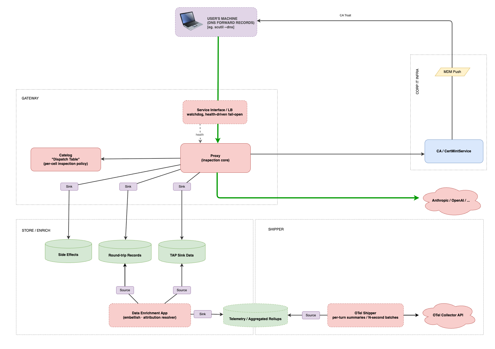
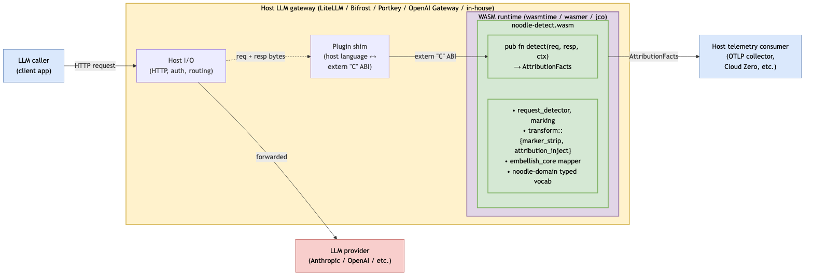
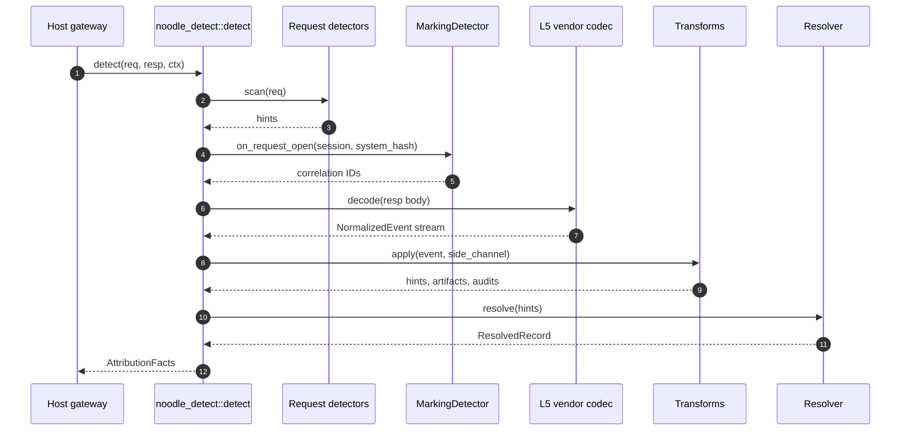

# ADR 039 — Deployment topologies and the `noodle-detect` facade

**Status:** current. Pins the deployment-topology axis as a first-class
architectural concern and defines the componentization boundary that
lets one codebase serve all three contexts.

**Related:** ADR 001 (component architecture), ADR 002 (hexagonal +
patterns — this ADR is the concrete application of hexagonal at the
deployment-topology granularity), ADR 020 (`SideEffectSink` port —
the same port works for every host context), ADR 022 §2 (separate
processes), ADR 033 (process-separation within a deployment), ADR 037
(entry transport for the proxy host).

**System diagrams:**

- [`../diagrams/system-architecture.drawio`](../diagrams/system-architecture.drawio) — endpoint topology.


- [`../diagrams/gateway-architecture.drawio`](../diagrams/gateway-architecture.drawio) — gateway topology.



- [`../diagrams/plugin-architecture.drawio`](../diagrams/plugin-architecture.drawio) — plugin topology. Rendered PNG at [`../images/plugin-architecture.png`](../images/plugin-architecture.png).



---

## 1. Context

noodle's product mission is **attributing LLM API spend to business
activity** — extracting `(who, what tool, what work_type, what cost)`
from request/response traffic so finance and platform teams can answer
"where is the spend going?" The proxy is a means, not the end.

The same attribution logic — detectors, transforms, the Resolver, the
per-round-trip aggregator, the `ai-telemetry` mapping — has value in
three distinct deployment contexts:

| # | Host | Where it runs | What the host provides | What noodle provides |
|---|------|---------------|------------------------|----------------------|
| 1 | **Endpoint** | macOS / Linux / Windows laptop | OS entry transport (Network Extension, eBPF, redirector); System Keychain CA trust | Proxy + capture + attribution + telemetry |
| 2 | **Gateway** | Server / appliance | DNS forwarding from clients; MDM-pushed fleet CA trust; LB watchdog | Proxy + capture + attribution + telemetry |
| 3 | **Plugin** in existing LLM gateway (LiteLLM, Bifrost, Portkey, OpenAI Gateway, OpenRouter) | The host gateway's process | The bytes — already captured by the host gateway | Attribution + telemetry only (no proxy, no capture) |

The first two share the **proxy host**. The third does not. The
codebase must support all three from the same source tree without
forking. This ADR pins the boundary that makes that real.

## 2. The componentization boundary

Two halves of the codebase, by reusability across host contexts:

### 2.1 Host-independent (reusable across all three topologies)

| Crate | Role | Plugin-embedable today |
|---|---|---|
| `noodle-core` | Protocol-pure types and ports (`Codec`, `Transform`, `SideEffect`, `Hint`, `Artifact`, `AuditEvent`, `Resolved`, `Correlation`, `RoundTripRecord`, the `SideEffectSink` / `WireSink` ports, the Resolver) | ✅ yes — no rama, no tokio runtime, no file I/O |
| `noodle-domain` | Telemetry vocabulary (`TokenUsage`, `Latency`, envelope shapes) | ✅ yes |
| `noodle-adapters` | Concrete detectors, transforms, mappers, marking, attribution-injection | 🟡 **mixed** — the pure-logic submodules (`request_detector`, `marking`, `transform/`) are plugin-embeddable; the I/O submodules (`sink`, `cert/external`) are not. See §5. |
| `noodle-embellish` | `tap.jsonl` + `roundtrips.jsonl` → `ai-telemetry` v0.0.2 mapping | 🟡 **mixed** — the mapper logic is pure; the SQLite writer + CLI are not. See §5. |

### 2.2 Proxy-host-specific (NOT consumed by the plugin context)

| Crate | Role | Why it's proxy-only |
|---|---|---|
| `noodle-proxy` | rama wirelog, codec engine harness, `tap_setup` | Built on rama; assumes a network proxy is on the listening end |
| `noodle-tap` | `tap.jsonl` file writer | Assumes the proxy is the byte source; a plugin host already has the bytes via the host gateway's own capture |
| `noodle-macos-tproxy` | macOS Network Extension shim | Endpoint-only mechanism |

### 2.3 The `noodle-detect` facade

A top-level crate that re-exports the host-independent types from
`noodle-core`, `noodle-domain`, and the pure-logic submodules of
`noodle-adapters`, and exposes the **synchronous detect API** a
plugin host calls:

```rust
pub fn detect(
    request: &DetectRequest,
    response: Option<&DetectResponse>,
    context: &DetectContext,
) -> AttributionFacts;

pub struct DetectRequest {
    pub method: SmolStr,
    pub host: SmolStr,
    pub path: SmolStr,
    pub headers: Vec<(SmolStr, SmolStr)>,
    pub body: Bytes,
}

pub struct DetectResponse {
    pub status: u16,
    pub headers: Vec<(SmolStr, SmolStr)>,
    pub body: Bytes,
}

pub struct DetectContext {
    pub clock: Arc<dyn Clock>,
    pub marking_store: Arc<dyn MarkingStore>,
    pub session_id: Option<SmolStr>,
}

pub trait Clock: Send + Sync + 'static {
    fn now_unix_ms(&self) -> u64;
}

pub struct AttributionFacts {
    pub correlation: Correlation,
    pub hints: Vec<Hint>,
    pub artifacts: Vec<Artifact>,
    pub audits: Vec<AuditEvent>,
    pub resolved: Option<ResolvedRecord>,
    pub round_trip: Option<RoundTripRecord>,
    pub at_unix_ms: u64,
}
```

`Correlation`, `Hint`, `Artifact`, `AuditEvent`, `ResolvedRecord`,
and `RoundTripRecord` are the same types `noodle-core::layered`
defines for the proxy host's drain seam. The plugin host consumes
the same shapes the proxy host produces; no parallel schema.

**Per-record usage.** Token usage rides on `RoundTripRecord.usage`
(via `round_trip`) and on the `TurnEnd` event the codec emits
into the record's event stream. The facade does not surface a
separate top-level `usage` field; ADR 023 §4 holds usage at the
round-trip record level.

**Invariants of the facade:**

- **Synchronous.** No `async` in the signature. The host gateway
  has the bytes; there's nothing to await.
- **No I/O.** No file paths, no sinks, no network calls. The host
  decides what to do with the returned `AttributionFacts`.
- **No runtime.** No tokio dependency. WASM-compilable
  (`wasm32-unknown-unknown` builds clean).
- **Pure function modulo `Clock` and `MarkingStore`.** Same inputs
  + same clock reading + same store state → same outputs. Enables
  replay, snapshot tests, deterministic plugin behaviour.
- **Streaming-friendly.** A streaming variant produces facts
  incrementally as response bytes arrive — for SSE response bodies
  the host gateway feeds chunks; the facade emits partial facts at
  frame boundaries. (Streaming variant is reserved; v1 ships the
  request-with-complete-response shape.)

The proxy host uses the same facade. The proxy's `InspectionEngine`
is one consumer of `noodle-detect`; the engine wraps facts into
the `SideEffectSink` + `WireSink` ports it already drives. No
duplicated logic.

### 2.4 `detect()` call lifecycle



The host gateway controls the entire boundary: it owns `req` and
`resp`, supplies the `DetectContext`, and consumes the returned
`AttributionFacts`. The facade is pure between those two points —
no callbacks back into the host except through `Clock` and
`MarkingStore` (see §3).

### 2.5 Guest ABI

The plugin artifact is **`wasm32-unknown-unknown`** with the public
surface in §2.3 exposed via `extern "C"` shim functions. The shim
layer (one Rust file in the plugin author's crate, referenced from
the authoring guide at
[`docs/guides/plugin-authoring-guide.md`](../guides/plugin-authoring-guide.md))
serialises `DetectRequest` / `DetectResponse` / `DetectContext`
across the WASM boundary using `serde_json` and returns the
serialised `AttributionFacts` for the host to deserialise.

Component Model / WIT remains a future option once the toolchain
on the major host languages (Python `wasmtime-py`, Go `wasmtime-go`,
Node `@bytecodealliance/jco`) stabilises against a single
component-model version. v1 picks raw `extern "C"` because:

- Every WASM runtime supports it identically.
- No language-specific binding generators required on the host
  side — every host language can call `extern "C"` shims via its
  WASM runtime's exported-function API.
- Component-Model serialisation overhead is comparable to JSON for
  the per-call data sizes the facade handles (kilobytes of
  request/response bytes), so the perf argument for WIT is weak at
  this scale.

The shim ABI is specified in §2.5 of this ADR and stays additive:
new fields on `AttributionFacts` land via JSON schema evolution,
not via ABI breaks.

## 3. Host-callback contract

The facade depends on two traits the host gateway must satisfy:

- `Clock::now_unix_ms() -> u64` — wall-clock reading stamped on
  every emitted record.
- `MarkingStore` — the per-cell session/turn/agent-run mint and
  lookup surface (ADR 028 §1).

When the plugin runs in-process in a Rust host (the proxy itself,
or a Rust gateway), the host passes concrete `Arc<dyn Trait>`
implementations directly. When the plugin runs as WASM in a
non-Rust host, the host satisfies these traits across the WASM
boundary via host-imported functions declared by the plugin shim:

```text
// Plugin imports the host satisfies
host_clock_now_unix_ms() -> u64
host_marking_store_get(session_id_ptr, session_id_len, out_ptr) -> i32
host_marking_store_put(session_id_ptr, session_id_len, state_ptr, state_len) -> i32
```

The plugin shim wraps these in `Clock` / `MarkingStore` impls the
facade consumes. State serialisation across the boundary uses the
same JSON shape ADR 023 §4 defines for the data-plane records;
no parallel schema.

For hosts that cannot supply a per-session store (stateless plugin
deployments), the shim's default `MarkingStore` impl is the
in-memory `InMemoryMarkingStore` from `noodle-adapters::marking`,
scoped to one WASM instance's lifetime. Sessions persist only as
long as the plugin instance.

## 4. Embedding strategy by host language

(See §5 for the crate-by-crate audit of what's plugin-embeddable
and what remains host-coupled.)

| Host | Embedding | Rationale |
|---|---|---|
| `noodle-proxy` (rust) | Direct crate dependency on `noodle-detect` | Same source tree; zero friction |
| LiteLLM (Python) | WASM via `wasmtime-py` or `wasmer-python` | Python plugin systems already pull native deps; WASM avoids per-Python-version ABI work |
| Bifrost (Go) | WASM via `wasmtime-go` | Same rationale |
| Portkey (Node) | WASM via `@bytecodealliance/jco` | Same rationale |
| OpenAI Gateway / OpenRouter / others | WASM (default) or sidecar HTTP daemon (fallback for hosts where WASM is impractical) | One artifact serves the long tail of hosts |
| Bespoke / future hosts | Sidecar HTTP daemon (`noodle-detect` behind an OpenAPI surface) | Last-resort embedding for hosts that can't run WASM (FaaS, constrained runtimes) |

WASM is the primary cross-language vehicle. Compiling `noodle-detect`
to `wasm32-unknown-unknown` (or `wasm32-wasi` for the sidecar variant)
gives every host language access to the same binary artifact. The
core crates' dependencies (§5 audit) are WASM-friendly.

## 5. Crate audit — what's plugin-embeddable today, what remains host-coupled

Grounded in actual `Cargo.toml` + source inspection at the time of
this ADR, not aspirational.

### Plugin-embedable as-is

- `noodle-core` — dependencies: `bytes`, `futures`, `http`, `serde`,
  `serde_json`, `sha2`, `smallvec`, `smol_str`, `thiserror`, `tracing`.
  All WASM-friendly. Public API has no tokio/rama/reqwest leaks.
- `noodle-domain` — dependencies: `noodle-core`, `serde`, `serde_json`,
  `thiserror`, `time`, `semver`. All WASM-friendly.
- `noodle-adapters` **pure-logic submodules**:
  - `noodle-adapters::request_detector` (`UserAgentDetector`)
  - `noodle-adapters::marking` (`AnthropicMarkingDetector`, `InMemoryMarkingStore`)
  - `noodle-adapters::transform::marker_strip`
  - `noodle-adapters::transform::attribution_inject`

### Blocked by host-coupling — needs refactor

| Today | Blocker | Refactor |
|---|---|---|
| `noodle-adapters::sink` | `tokio::fs`, async runtime, file I/O | Move to a new `noodle-sinks` crate (proxy-host-only). The `SideEffectSink` *port* stays in `noodle-core`; the file-backed *implementations* move out. |
| `noodle-adapters::cert::external::vault` | `reqwest`, HTTPS signer client | Move to a new `noodle-cert-external` crate. Endpoint + gateway hosts use it; plugin host doesn't need it (the plugin host already has TLS termination — noodle never MITM's in plugin context). |
| `noodle-embellish` (the binary + SQLite writer) | `rusqlite`, `clap` | Carve the *mapping* logic into a `noodle-embellish-core` (pure) library; keep the binary + writer in `noodle-embellish-bin`. Plugin hosts call the mapper directly. |

### New crate

- `noodle-detect` — the facade described in §2.3. Re-exports pure
  types + pure-logic submodules + exposes the synchronous `detect`
  API. Compiles to WASM cleanly.

## 6. The attribution mission framing

This ADR centres a framing the rest of the corpus has implicitly
assumed but not stated:

> **noodle's value is the attribution detect-and-extract pipeline.
> The proxy is one host that runs it. Embedding the same pipeline in
> existing LLM gateways serves the same mission with zero source
> duplication.**

Future architecture decisions should evaluate against this framing.
Specifically: any proposal that puts host-specific assumptions
(network listening, file paths, async runtime, OS-specific APIs)
into `noodle-core`, `noodle-domain`, the pure-logic adapter
submodules, or `noodle-detect` is rejected. Host-specific concerns
live in their own crates.

## 7. Implications for existing ADRs

- **ADR 020** (`SideEffectSink` port) — the port stays where it is.
  Concrete implementations move out. `noodle-detect` returns the
  same `SideEffect`s the port already carries; the proxy host wraps
  them into sinks, the plugin host returns them to the gateway's
  collector directly.
- **ADR 022** (OTel collector embellishment plane) — unaffected. The
  collector is downstream of every topology.
- **ADR 023** (round-trip telemetry + correlation) — unaffected. The
  record shape is the same regardless of who produces it (the proxy
  host's in-process aggregator or the plugin host calling
  `noodle-detect`).
- **ADR 033** (product architecture separation of concerns) — focused
  on within-deployment process separation. This ADR is the
  across-deployment counterpart. The two are orthogonal axes.
- **ADR 037** (entry transport) — covers the endpoint + gateway
  proxy-host entry mechanisms. The plugin host has no entry transport
  — the host gateway already has the bytes.

## 8. Non-goals

- **Replacing the proxy hosts.** The endpoint and gateway proxy
  deployments stay first-class. The plugin context is additive, not
  a replacement.
- **Defining specific gateway plugin APIs.** LiteLLM, Bifrost, Portkey
  etc. each have their own plugin shapes. `noodle-detect` exposes the
  rust/WASM facade; per-gateway adapter shims are out of scope here
  (each gets its own follow-up story when the integration is
  prioritised).
- **Cross-language attribution-rule configuration.** v1 ships static
  detector + transform registration at WASM compile time. Runtime
  policy loading (cf. ADR 025's dispatch table) is a future story.
- **Plugin sandboxing posture.** WASM provides per-instance isolation
  by construction; further sandbox hardening (memory limits, fuel,
  syscall denylists) is the host gateway's policy, not noodle's.

## 9. Acceptance signals

This ADR is "honoured" when:

1. A new commit can build `noodle-detect` to `wasm32-unknown-unknown`
   without conditional-compilation gymnastics — no `#[cfg(not(target_arch = "wasm32"))]`
   guards within `noodle-core`, `noodle-domain`, or the pure-logic
   adapter submodules.
2. The `noodle-proxy` binary uses `noodle-detect` as its detection
   engine, with zero duplicated detector / transform / mapper code
   between the proxy host and any plugin host.
3. A reference plugin (likely against LiteLLM, as the most-used Python
   LLM gateway) exists in a sister repository and consumes the
   shipped WASM artifact. Out of scope here; tracked as a future
   feature story.
