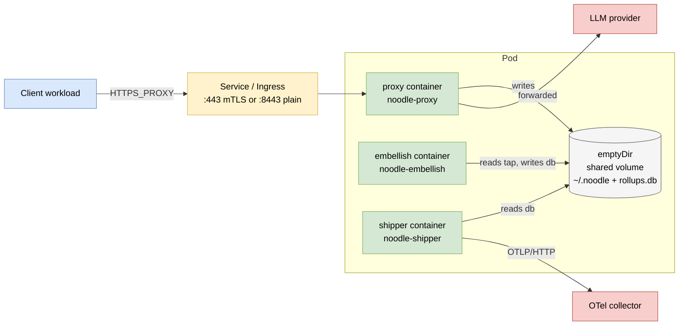

# ADR 043 — Kubernetes gateway deployment

**Status:** current.
**Audience:** Engineers deploying `noodle-proxy` as the gateway
deployment topology (ADR 039 §1 row 2) into a Kubernetes cluster.
**Related:** ADR 011 (TLS MITM and the noodle root CA), ADR 022
(OTel collector embellishment plane), ADR 023 (round-trip
telemetry records), ADR 034 (enterprise CA + external signing —
BYOCA-static and Vault PKI), ADR 037 (entry transport), ADR 039
(deployment topologies — names this one), ADR 042 (codec error
contract).

---

## 1. Context

ADR 039 §1 names three deployment topologies. This ADR specifies
the second — `noodle-proxy` running as a service in a Kubernetes
cluster, fronting LLM traffic from client workloads in the same
or peered networks. Two reference shapes:

- **Cluster-egress gateway** — every workload's `HTTPS_PROXY`
  points at one cluster-internal `Service`; the proxy MITMs LLM
  traffic on its way out.
- **Per-team gateway** — multiple `Deployment`s, each owned by a
  team or business unit, each fronting that team's LLM traffic.
  Sized and observed independently.

Both shapes share the same Pod, Service, and ConfigMap / Secret
contracts. They differ only in how many `Deployment`s exist and
how clients are pointed at which `Service`.

## 2. Decisions

### 2.1 Pod shape — sidecar pipeline

Each `Pod` runs the full attribution pipeline in three colocated
containers sharing one `emptyDir` volume:

| Container | Image | Role |
|---|---|---|
| `proxy` | `noodle-proxy` (release binary) | Terminates client TLS, MITMs LLM traffic, writes `tap.jsonl` + `roundtrips.jsonl` + `side_effects.jsonl` to the shared volume. |
| `embellish` | `noodle-embellish` (release binary) | Tails `tap.jsonl`, maps to `ai-telemetry` v0.0.2 rows, writes to SQLite on the shared volume. |
| `shipper` | `noodle-shipper` (release binary) | Walks the SQLite cursor, POSTs OTLP/HTTP to a configurable collector endpoint. |

The colocation rationale: the JSONL → SQLite → OTLP chain is one
logical pipeline, the bytes between stages are small (kilobytes
per round trip), and an `emptyDir` is the simplest shared-state
primitive Kubernetes offers. Splitting across `Pod`s would buy
independent scaling but introduce a queue between proxy and
embellish where none exists today.



### 2.2 Listener address

The proxy binary's listener address is configurable via the
`NOODLE_LISTEN` environment variable. The default is
`0.0.0.0:62100` so a containerised proxy is reachable from
sibling containers and from the `Service` cluster endpoint
without further configuration. The legacy loopback default
(`127.0.0.1:62100`) is reserved for ad-hoc local use outside the
cluster.

### 2.3 CA strategy

The Pod mounts an enterprise CA via a `Secret`:

```yaml
volumeMounts:
  - name: noodle-ca
    mountPath: /etc/noodle/ca
    readOnly: true
env:
  - { name: NOODLE_CA_MODE, value: "byoca-static" }
  - { name: NOODLE_CA_DIR,  value: "/etc/noodle/ca" }
```

The `Secret` carries `ca.pem`, `ca.key`, and optionally
`chain.pem`. The proxy's BYOCA-static mode (ADR 034 §4) validates
that `ca.pem` and `ca.key` agree on SPKI and then mints leaves
in-process for every MITM'd host.

Three CA sourcing patterns, all supported:

| Source | Mechanism |
|---|---|
| Existing enterprise CA | Operator places `ca.pem` + `ca.key` into the `Secret`. Client trust is whatever the org already does (MDM, Group Policy, etc.). |
| Vault PKI | The Pod's `Secret` carries only the static CA; leaf signing routes through the `noodle-cert-external` Vault client at runtime (ADR 034 §2.4). `NOODLE_CA_EXTERNAL_*` env vars wire the backend. |
| Auto-generated for dev | Operator omits the `Secret`; proxy falls back to auto-generation on first run. The generated `ca.pem` must be exported from the `emptyDir` and distributed manually — only appropriate for non-production. |

### 2.4 Client trust distribution

Clients must trust the gateway's CA before they can use the
`HTTPS_PROXY`. This ADR does **not** mandate a mechanism — every
organisation has an existing client-trust pipeline. The supported
shapes:

- **Pre-installed in client images** — bake `ca.pem` into the
  client workload's container image at build time.
- **Mounted via Secret** — workloads mount the same `Secret` the
  gateway uses, point `NODE_EXTRA_CA_CERTS` / `REQUESTS_CA_BUNDLE`
  / `SSL_CERT_FILE` at the mount path.
- **System trust store** — for VMs / bare metal clients, MDM or
  configuration-management pushes `ca.pem` to
  `/etc/ssl/certs/`.

### 2.5 Service exposure and authentication

The Pod exposes `noodle-proxy` on its container port (default
`62100`). A `Service` of type `ClusterIP` (or `LoadBalancer` for
cross-cluster reach) terminates client traffic. Two authentication
shapes:

| Shape | Mechanism | When to use |
|---|---|---|
| Network policy | `NetworkPolicy` restricts ingress to the gateway `Service` from labeled namespaces / pods only. | The cluster is single-tenant; team boundaries are namespaces. |
| Service-mesh mTLS | Istio / Linkerd terminates client → gateway mTLS at the sidecar; the gateway's listener is plain HTTP behind the mesh. | The cluster already runs a mesh; you want per-workload identity. |

The gateway itself does not implement listener-level authentication
in v1; that's the responsibility of the mesh or `NetworkPolicy`.
If neither is acceptable, place an authenticating reverse proxy
(`oauth2-proxy`, `pomerium`, etc.) in front of the `Service`.

### 2.6 Storage

The `emptyDir` shared volume is ephemeral: pod restart loses
unshipped rollup rows. The shipper's cursor-on-flag state machine
(ADR 022 §3, story 043) tolerates this — restarted shipper
re-reads its SQLite cursor from disk on each tick, and any rows
in `in_flight` at the moment of crash are re-claimed.

For deployments that need restart-survivable rollup state, the
shared volume is upgradable to a `PersistentVolumeClaim`:

```yaml
volumes:
  - name: noodle-data
    persistentVolumeClaim:
      claimName: noodle-data-pvc
```

The PVC must be `ReadWriteOnce` (single-Pod access) — the
embellish ↔ shipper handoff is local-file-based and assumes one
writer per cursor. For multi-Pod scaling (§2.8), each Pod gets
its own PVC; multiple Pods do not share storage.

### 2.7 Observability

The proxy exposes an **ops HTTP listener** separate from the proxy
listener. The split keeps probe/scrape traffic off the data path
and lets cluster operators expose ops to the kubelet / Prometheus
without exposing the proxy listener.

| Env | Default | Purpose |
|---|---|---|
| `NOODLE_LISTEN` | `127.0.0.1:62100` | Proxy listener — accepts HTTP `CONNECT` and forwarded requests from clients. |
| `NOODLE_OPS_LISTEN` | `127.0.0.1:9091` | Ops listener — health, readiness, metrics, tap control. |

Off-machine gateway deployments set both to `0.0.0.0:<port>` so
the listeners accept sibling-container and cluster-peer traffic.

| Surface | Endpoint | Behaviour |
|---|---|---|
| Logs | `stderr` | All three containers write structured `tracing` output to stderr. The cluster's existing log-aggregation (fluentbit, vector, Stackdriver, CloudWatch, etc.) picks them up by `kubectl logs` semantics. No file-based log paths. |
| Liveness | `GET /healthz` on ops listener | Returns `200 ok\n` while the process is running. Used by `livenessProbe`. |
| Readiness | `GET /readyz` on ops listener | Returns `200 ready\n` once the engine has been wired by `noodle_proxy::start()`; returns `503 not ready\n` until then. Used by `readinessProbe`. |
| Metrics | `GET /metrics` on ops listener | Prometheus text exposition. Initial surface — `noodle_proxy_uptime_seconds`, `noodle_proxy_build_info{version=...}`, `noodle_proxy_tap_enabled`. Counters for marked-request volume, mint outcomes, tap drop-rate land additively as each emission path is instrumented; the endpoint contract (text exposition, scrape from ops listener) does not change. |
| Tap control | `GET /debug/tap/status`, `POST /debug/tap/{enable,disable}` on ops listener | Viewer-driven Start/Stop Capture. Tap defaults to enabled; `disable` pauses the writer, `enable` resumes it. Only relevant when the `tap` feature is compiled in. |
| Traces | OTLP/HTTP via shipper | Shipper emits OTLP/HTTP to an OTel collector at `NOODLE_OTLP_ENDPOINT`. The collector forwards to whatever traces backend the organisation runs. |

The ops listener is single-purpose: every route returns within a
few milliseconds, no upstream calls, no per-request allocation
beyond response bodies. Probe failures therefore unambiguously
indicate proxy-process health rather than upstream weather.

### 2.8 Scaling

The proxy is stateless modulo the in-memory `MarkingStore`
(session/turn/agent-run IDs scoped to a session). Two scaling
shapes:

| Shape | When to use |
|---|---|
| `Deployment` with `HPA` on CPU / memory; clients balanced via the `Service` cluster IP | Most cases. Each Pod runs an independent `MarkingStore`; multi-turn sessions that span pod restarts re-mint IDs (acceptable for v1 — ADR 028 §1 makes the in-memory store the default). |
| `StatefulSet` with sticky-by-`session_id` `Service` selectors | Required only if downstream consumers cannot tolerate `turn_id` discontinuity within a single session across pod boundaries. Not the v1 recommendation. |

Resource budgets the proxy targets (single replica, no contention):

| Metric | Target |
|---|---|
| Memory floor (idle) | 30–50 MiB |
| Memory ceiling under load | Capped by ADR 042 §2.1 SSE frame buffer (4 MiB) × concurrent flows; observed plateau ≈ 200 MiB at 100 concurrent flows |
| CPU per round trip | Sub-millisecond CPU for the codec path (ADR's reference perf bench in [`codec-perf-bench.md`](../guides/codec-perf-bench.md)); dominated by upstream LLM latency in wall-clock |

### 2.9 Image strategy

Two-stage `Dockerfile` per crate, single base image across the
three sidecar containers to share layers:

- Build stage: `rust:1.93-bookworm`, `cargo build --release -p {proxy,embellish,shipper}`.
- Runtime stage: `gcr.io/distroless/cc-debian12` (carries the
  minimum dynamic libs the bundled OpenSSL / rcgen / rusqlite need;
  no shell, no package manager).

Tags: `noodle/proxy:<git-sha>`, `noodle/embellish:<git-sha>`,
`noodle/shipper:<git-sha>`. Pinned by `<git-sha>` for
reproducibility; rolling-update strategy is the consumer's
choice.

## 3. Manifest skeleton

A reference `Deployment` + `Service` + `Secret` + `ConfigMap`
shape lives at [`docs/guides/kubernetes-gateway-deployment.md`](../guides/kubernetes-gateway-deployment.md).
This ADR pins the contracts; the operations doc carries the
concrete YAML and the runbook.

## 4. Non-goals

- **Helm chart in this repo.** Operators wrap the manifest
  skeleton in whatever package manager they already use (Helm,
  Kustomize, ArgoCD, raw YAML). Shipping a canonical Helm chart
  forces a packaging-tool choice on every consumer.
- **Multi-cluster mesh routing.** The gateway is a per-cluster
  primitive; cross-cluster traffic routes through whatever
  cluster mesh / Anthos / Submariner setup the operator already
  has.
- **Built-in client identity / per-workload authorisation.** The
  service mesh or reverse-proxy layer handles this (§2.5).
- **Persistent session storage across pod restarts.** §2.8's
  v1 recommendation is acceptable for v1; richer session
  durability is a future ADR if a consumer needs it.

## 5. Implications for existing ADRs

- **ADR 039** — this ADR is the concrete instantiation of the
  gateway topology row in §1 row 2.
- **ADR 034** — the BYOCA-static and Vault PKI paths shipped for
  the enterprise CA case underpin §2.3 of this ADR.
- **ADR 022** — the embellishment-plane → OTel-collector boundary
  applies unchanged; the shipper container is the OTLP emitter.
- **ADR 028** — the in-memory `MarkingStore` per-Pod assumption
  in §2.8 follows from the ADR's default.

## 6. Acceptance signals

This ADR is honoured when:

1. A reference `Deployment` + `Service` + `Secret` + `ConfigMap`
   set deploys to a stock Kubernetes cluster (no service-mesh
   dependency) and serves `HTTPS_PROXY` traffic from a sibling
   workload, with the workload's LLM traffic landing on
   `tap.jsonl` inside the Pod.
2. `noodle-embellish` + `noodle-shipper` colocated in the same
   Pod produce delivered OTLP rows to a cluster-internal OTel
   collector within the cursor poll interval (default 5s).
3. The Pod survives `kubectl rollout restart deployment/noodle-gateway`
   without losing delivered rows (re-claimed via the cursor
   state machine).
4. The gateway scales horizontally under load via
   `HorizontalPodAutoscaler` on CPU, without per-session
   stickiness, and downstream attribution remains correct
   modulo the cross-pod `turn_id` discontinuity §2.8 calls out.
