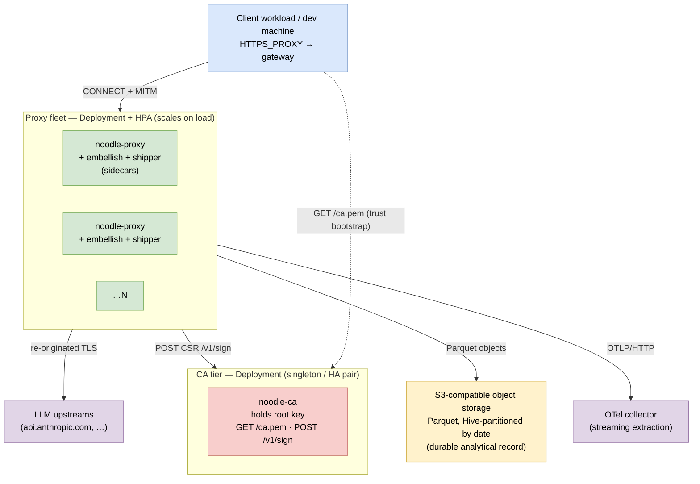
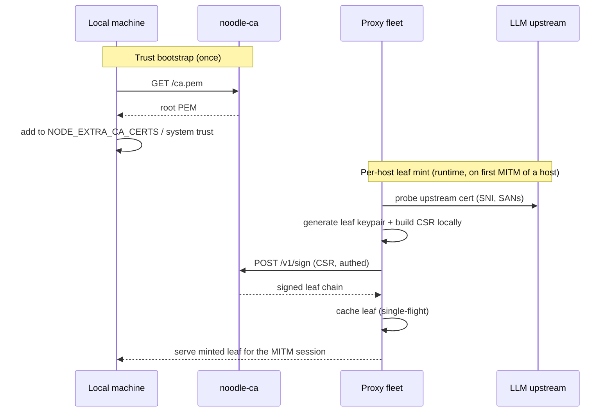
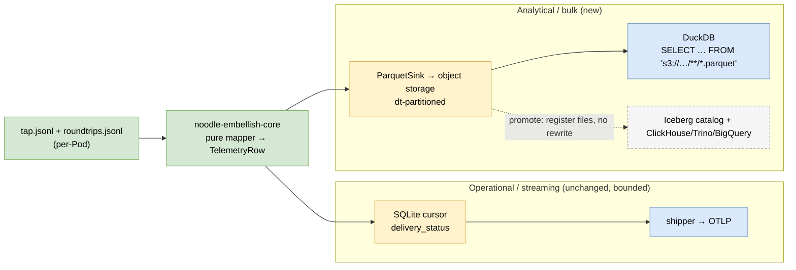

# ADR 044 — Scalable cluster deployment: CA service, proxy fleet, and the portable data plane

**Status:** current.
**Audience:** Engineers standing up `noodle-proxy` as a scalable Kubernetes deployment with a self-hosted CA, a horizontally-scaled proxy fleet, local-machine traffic capture, and a data plane that can grow from "files in a bucket" to a full lakehouse without a migration.
**Related:** ADR 011 (TLS MITM and the noodle root CA), ADR 022 (OTel collector embellishment plane), ADR 023 (round-trip telemetry records), ADR 031 (ai-telemetry v0.0.2 schema), ADR 034 (enterprise CA + external signing — the `CertMintService` abstraction this builds on), ADR 037 (entry transport — transparent capture), ADR 039 (deployment topologies), ADR 043 (Kubernetes gateway deployment — the single-Pod substrate this scales out).

---

## 1. Context

ADR 043 ships the gateway topology as a **single sidecar Pod** —
`proxy` + `embellish` + `shipper` colocated, sharing one `emptyDir`,
streaming OTLP out. That is correct for one team's egress and scales
by adding replicas. It does **not** answer four things a real
cluster deployment needs:

1. **A CA you operate.** The proxy MITMs TLS, so every client must
   trust noodle's root. ADR 011 generates that root on the proxy
   itself; ADR 034 adds an *external* signer (Vault PKI) behind a
   clean `CertMintService` trait. Neither gives you a **service** you
   can `curl` for the public PEM (to install in a local trust store)
   and `POST` a CSR to. A scaled fleet also can't each hold its own
   root — they must share one issuer.
2. **A scalable fleet design** — proxy replicas that scale on load
   independently of the CA and the data plane.
3. **Local-machine capture** — pointing a developer's Claude traffic
   at the in-cluster proxy and seeing data land, end to end.
4. **A data backend for large-volume capture and extraction** that
   does not require building a data pipeline before there is funding
   or a consumer to justify one — yet expands without a rewrite.

The governing constraint on (4) is explicit: **get this working at
startup scale without building a data pipeline, while preserving the
ability to expand without hiccups.** §2.5 is the load-bearing
decision; the rest of this ADR is the deployment shell around it.

### 1.1 The data-store insight

The mistake that forces a premature pipeline is treating capture as
*one* store. It is two, with opposite shapes:

| | Operational state | Analytical record |
|---|---|---|
| **What** | delivery cursor (`pending`/`in_flight`/`delivered`/`retry`/`poison`) | the telemetry events themselves |
| **Shape** | tiny, mutable per-row, short-lived (prune after ship) | append-only, immutable, columnar, grows forever |
| **Scales to** | bounded — never "large quantities" | unbounded — *this* is the extraction target |
| **Right home** | a boring RDBMS (today: per-Pod SQLite) | open columnar files on object storage |

Conflating them puts a growing analytical workload on an OLTP engine
and an update-heavy state machine on a columnar store — both wrong.
Splitting them lets each take the cheapest correct substrate.

---

## 2. Decisions

### 2.1 Topology — three independently-scaled tiers

ADR 043's single Pod splits into three tiers that scale and fail
independently:



| Tier | Kind | Scales on | Holds |
|---|---|---|---|
| **Proxy fleet** | `Deployment` + `HPA` | request load | nothing durable — shared-nothing |
| **CA tier** | `Deployment` (1, or HA pair) | n/a — issuance is cheap | the **root CA key** (crown jewel) |
| **Data plane** | object storage + OTel collector (external) | data volume | the durable analytical record |

The proxy fleet stays the ADR 043 sidecar Pod internally — the
`proxy`+`embellish`+`shipper` chain is unchanged. What changes:
the fleet no longer holds its own CA root (it calls the CA tier),
and `embellish` gains a second output (Parquet to the shared
bucket, §2.5). The bucket is the aggregation point, so the fleet
needs **no shared database** for the analytical path — concurrent
writers write distinct object keys with zero coordination.

### 2.2 CA service — noodle-native, Vault-pluggable

A new `noodle-ca` HTTP service is the **server side of a protocol
the proxy already speaks.** ADR 034's `ExternalCertMintService`
already builds a CSR locally and ships it to a remote signer (Vault
PKI today). `noodle-ca` is a sibling signer backend plus a thin
service that holds the root and signs.

**Surface:**

| Route | Auth | Purpose |
|---|---|---|
| `GET /ca.pem` | none (public cert) | Trust bootstrap — fetch the root PEM to install in a local/CI trust store. |
| `POST /v1/sign` | mTLS or bearer token | Sign a leaf CSR (PKCS#10). Body: CSR (PEM/DER). Returns the signed leaf chain (leaf-first DER). |
| `GET /healthz` `/readyz` `/metrics` | none | Ops listener (ADR 043 §2.7 pattern). |

**Root key lifecycle.** On first boot the service generates a
self-signed ECDSA P-256 root (reusing `Ca::generate_or_load`,
`crates/noodle-tls/src/ca.rs`) and persists it to a mounted Secret;
on restart it loads the same root — same fingerprint, stable trust.
BYOCA-static and Vault remain available by pointing the service (or
the proxy fleet) at those instead — the signer abstraction is
unchanged, so `noodle-ca` is the *default* backend, not the *only*
one.

**Two ladder rungs in one diagram** — trust bootstrap (once, per
client) and per-host leaf minting (per upstream, at runtime):



The proxy's private leaf keys never leave the proxy — only the CSR
crosses the wire, exactly as ADR 034 §2.4 specifies. `noodle-ca`
caches nothing client-specific; leaf TTL is short (the local mint
default is 90 days — §2.6 keeps it configurable).

**Fleet config** (reuses ADR 034's env surface, one new backend
value):

| Env (on the proxy fleet) | Value | Effect |
|---|---|---|
| `NOODLE_CA_MODE` | `external` | route minting to a remote signer |
| `NOODLE_CA_EXTERNAL_BACKEND` | `noodle-ca` | **new** — target the noodle-ca service (sibling to `vault-pki`) |
| `NOODLE_CA_EXTERNAL_ENDPOINT` | `https://noodle-ca.noodle-system.svc:8444/v1/sign` | the signing endpoint |
| `NOODLE_CA_EXTERNAL_AUTH` | `token` \| `mtls` | how the fleet authenticates to the CA |

### 2.3 Proxy fleet — shared-nothing, scales on load

Each Pod is the ADR 043 sidecar pipeline, with two differences:
it mints via the CA tier (§2.2) and writes Parquet to the shared
bucket (§2.5). Because no Pod holds durable shared state, the fleet
is a stock `Deployment` + `HorizontalPodAutoscaler` on CPU (and,
once `/metrics` exposes it, in-flight flow count). Resource budgets
inherit ADR 043 §2.8 (~30–50 MiB idle, ~200 MiB at 100 concurrent
flows — measured figures live in that ADR, not invented here).

### 2.4 Traffic capture — explicit proxy first, transparent DNS later

**v1: explicit `HTTPS_PROXY`.** The client points at the cluster
gateway and trusts the fetched root:

```sh
curl -s https://noodle-ca.<cluster>/ca.pem > ~/noodle-ca.pem
export HTTPS_PROXY=http://<gateway-host>:62100
export NODE_EXTRA_CA_CERTS=$HOME/noodle-ca.pem   # Claude Code CLI (Node)
claude -p "say hi"
```

The Claude Code CLI honors `HTTPS_PROXY`; the gateway is reached via
a `LoadBalancer`/`NodePort` `Service` (or `kubectl port-forward` for
a dev demo). This is the proven path and the v1 demo target.

**Later: DNS-override transparent capture.** Clients that ignore
proxy env (Claude Desktop) are captured by pointing the hostname at
the proxy and MITMing on `:443` by SNI:

```
# /etc/hosts (or local resolver)
<gateway-host>   api.anthropic.com
```

This requires a transparent `:443` SNI-routed listener (ADR 037
territory) and is documented as a follow-on, not built in v1 — its
listener-design impact is real and is deliberately deferred.

### 2.5 Data backend — Parquet on object storage, DuckDB now, Iceberg as a declared seam

This is the load-bearing decision. The durable analytical record is
**Parquet, Hive-partitioned by date, on S3-compatible object
storage** — *not* a database:

```
s3://<bucket>/<prefix>/telemetry/dt=YYYY-MM-DD/hour=HH/part-<uuid>.parquet
```



**The streaming half is unchanged.** SQLite cursor + `shipper` +
OTLP keep running exactly as ADR 043 ships them — that is the
real-time observability path, already built and working. We **add**
a `ParquetSink` as a second output of the same pure
`noodle-embellish-core` mapper. We do not replace the pipeline.

**v1 query engine is DuckDB** reading the Parquet directly — zero
standing infra, comfortably handles low-TB on a single node. That
*is* the analytical stack for startup scale. No Kafka, no Spark, no
warehouse, no catalog.

**Iceberg is a declared seam, not built day-one.** Parquet-in-date-
partitions is already the physical layout Iceberg sits on top of, so
promotion is a catalog registration (Glue / Nessie / S3 Tables) over
the *existing files* — the data does not move and `embellish` does
not change. Iceberg is the safe long-term bet (it won the open-table-
format consolidation; every major engine reads it), but its
operational machinery (catalog, compaction, snapshot expiry) is
exactly the pipeline we are deferring.

**Implementation seam** (from the substrate map): `noodle-embellish-core`
is already a pure, portable mapper (no `rusqlite`, no `tokio`). The
SQLite writer in `crates/noodle-embellish/src/sqlite.rs` is one
output port; `ParquetSink` is a second, batching `TelemetryRow`s into
Arrow `RecordBatch`es and writing via the `object_store` + `parquet`
crates. Output selection is config, not a fork:

| Env | Value | Effect |
|---|---|---|
| `NOODLE_EMBELLISH_SINKS` | `sqlite`, `parquet`, or `sqlite,parquet` | which output ports run (default `sqlite` preserves ADR 043) |
| `NOODLE_PARQUET_BUCKET` | `noodle-telemetry` | target bucket |
| `NOODLE_PARQUET_PREFIX` | `telemetry` | key prefix under the bucket |
| `NOODLE_PARQUET_ROLL_SECS` | `300` | close + flush a part file on this interval … |
| `NOODLE_PARQUET_ROLL_ROWS` | `50000` | … or this row count, whichever first |
| `AWS_ENDPOINT_URL` / `AWS_REGION` / `AWS_ACCESS_KEY_ID` / `AWS_SECRET_ACCESS_KEY` | per provider | standard S3-compatible credentials (S3, R2, MinIO, GCS-S3-mode) |

Targeting the **S3-compatible API** keeps the cloud vendor a config
detail, not an architectural commitment.

### 2.6 Operational delivery state stays small

The delivery cursor is bounded by design: a row exists only until
its OTLP delivery is acknowledged, then it is pruned (the durable
copy lives in Parquet). At fleet scale this stays per-Pod SQLite —
it never needs to be a shared database. A shared **operational
view** (a "recent traffic" dashboard across the fleet) is the *only*
reason to introduce a small managed Postgres, and even then it is
bounded by the same prune discipline. We do not introduce Postgres
in v1; §7 names the signal that would.

### 2.7 Observability

Every tier exposes the ADR 043 §2.7 ops listener (`/healthz`,
`/readyz`, `/metrics`, and on the proxy, `/debug/tap/*`) on
`NOODLE_OPS_LISTEN`. The CA tier adds CA-specific gauges
(`noodle_ca_sign_total`, `noodle_ca_sign_errors_total`,
`noodle_ca_root_not_after_seconds` — the latter is the root-expiry
early-warning). The data plane's health is observable as Parquet
object count/age in the bucket and the shipper's existing cursor
counts.

### 2.8 Manifests

The deployment ships as four manifest groups; the companion runbook
(`docs/guides/`) carries the full YAML once the `noodle-ca`
service and `ParquetSink` exist (writing runnable manifests for
unbuilt images would be unverifiable — see §6):

1. **`noodle-system` namespace** — CA tier + shared config/secrets.
2. **CA `Deployment` + `Service` + root-key `Secret`** — singleton
   (or 2-replica HA reading the same root Secret), ops port off the
   `Service`, `/v1/sign` reachable only from the proxy fleet's
   namespace (NetworkPolicy).
3. **Proxy fleet `Deployment` + `HPA` + gateway `Service`** —
   inherits ADR 043's Pod, adds the §2.2 CA env and the §2.5 Parquet
   env, object-store credentials from a `Secret`.
4. **NetworkPolicy** — clients → proxy `:62100`; proxy → CA
   `:8444`; proxy/CA → object store + collector egress; nothing
   reaches the CA root except `/v1/sign` from the fleet.

---

## 3. Security considerations

- **The CA root key is the highest-value secret in the system** — it
  signs leaves every client trusts. It lives in one tier, in a
  `Secret` (sealed-secrets / KMS-backed in production), mounted
  read-only. `/v1/sign` is authenticated (mTLS or token) and reachable
  only from the proxy fleet namespace via NetworkPolicy. `GET /ca.pem`
  is intentionally public — it returns only the *public* cert.
- **Compromise blast radius:** a stolen root lets an attacker forge
  trusted leaves for any host. Mitigations: short leaf TTLs (§2.6),
  root rotation runbook (declared in §7), `noodle_ca_root_not_after_seconds`
  alerting, and keeping the root off every other tier (the fleet holds
  no root in `external` mode).
- **Leaf private keys never leave the proxy** — only CSRs cross to
  the CA (ADR 034 §2.4 preserved).
- **MITM exposes plaintext LLM traffic inside the proxy** — including
  prompts and API keys. `tap.jsonl` redaction (ADR 027 §9 prefix-
  preserving) applies before anything is written; the Parquet sink
  inherits the redacted view, so secrets are not durably persisted to
  the lake.
- **Object-store credentials** are a `Secret`, scoped to the one
  bucket/prefix, write-only for the fleet where the provider supports
  it. The bucket holds redacted telemetry, not raw bodies.
- **Capture is consequential:** pointing `api.anthropic.com` at the
  proxy (transparent mode, §2.4) means every client resolving that
  host is intercepted. That is an explicit, audited operator action,
  not a default.

---

## 4. Non-goals

- **A built data pipeline.** v1 is "Parquet in a bucket, DuckDB reads
  it." Catalog, compaction, streaming ingestion, and a standing query
  engine are §7 rungs, not v1.
- **Iceberg machinery day-one** — declared seam only.
- **Postgres as the primary store** — rejected in §1.1; introduced
  only under the §7 signal.
- **Transparent `:443` DNS capture** — designed in §2.4, deferred.
- **Multi-region / multi-cluster CA federation** — single root, single
  cluster for this ADR.
- **Replacing the OTLP streaming path** — it stays; the lake is
  additive.

## 5. Implications for existing ADRs

- **ADR 043** — its single-Pod topology becomes the *fleet Pod* of
  this ADR. The §2.7 ops contract is inherited unchanged. The CA
  strategy (§2.3 there) gains `noodle-ca` as the recommended
  in-cluster default.
- **ADR 034** — `noodle-ca` is a new `ExternalSignerBackend`
  alongside `vault-pki`; the `CertMintService` trait and CSR-local
  invariant are unchanged. This ADR is the first *server* for that
  protocol.
- **ADR 031 / 023** — the ai-telemetry v0.0.2 row is now also
  serialized to Parquet; the schema is the source of the Parquet
  column set. Schema evolution becomes an Iceberg concern at the §7
  promotion rung.
- **ADR 022** — the OTel collector remains the streaming consumer;
  the Parquet lake is the complementary bulk consumer.

## 6. Acceptance signals

1. A client fetches `GET /ca.pem` from the in-cluster CA, installs
   it, sets `HTTPS_PROXY`, runs `claude -p`, and the completion
   returns through the proxy (`x-proxy: noodle`).
2. The proxy fleet mints leaves via `POST /v1/sign` against
   `noodle-ca` (no root on any proxy Pod); `openssl s_client` shows
   `issuer=CN=noodle MITM root CA` on the served leaf.
3. Scaling the fleet (`kubectl scale` / HPA) adds Pods that serve
   immediately with no per-Pod CA setup.
4. `embellish` with `NOODLE_EMBELLISH_SINKS=sqlite,parquet` writes
   both: the OTLP stream still flows **and** dt-partitioned Parquet
   objects appear in the bucket.
5. `DuckDB` runs `SELECT count(*), provider FROM 's3://…/telemetry/**/*.parquet' GROUP BY provider`
   against the bucket and returns the captured rows — with no
   database server running.
6. Killing and restarting `noodle-ca` re-loads the same root
   (stable fingerprint); previously-trusted clients keep working.

## 7. Phased rollout — the expansion ladder

Each rung is gated by a **real signal**, so growth is demand-driven,
not speculative:

| Rung | Build | Trigger to climb |
|---|---|---|
| **0 (v1)** | CA service + fleet + `ParquetSink` to bucket + DuckDB for queries | — (this ADR) |
| **1** | Iceberg catalog over the existing Parquet (Glue/Nessie/S3 Tables) | >1 concurrent analytical consumer, or need for schema evolution / time-travel |
| **2** | Standing query engine — ClickHouse (telemetry-shaped OLAP) or Trino/BigQuery | ad-hoc DuckDB can't keep up, or always-on dashboards are required |
| **3** | Streaming ingestion (queue → continuous Parquet/Iceberg) | per-Pod batch write becomes the bottleneck, or sub-minute freshness is required |
| **4** | Shared operational Postgres | a cross-fleet "recent traffic" operational view is needed (§2.6) |

No rung rebuilds a prior one; each adds a component when the
previous bends. The data never migrates — it is open Parquet from
rung 0, which is the whole point.
