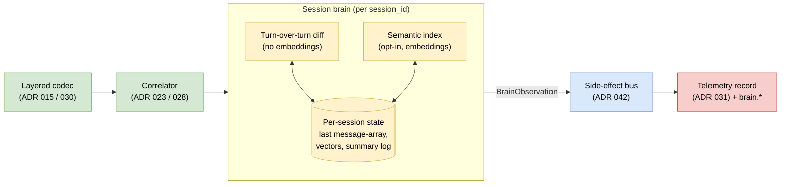

# ADR 047 — Session brain: ephemeral per-session retrieval over the decoded stream

**Status:** current.
**Audience:** Engineers extending `noodle-proxy` with stateful,
session-scoped intelligence — the in-path equivalent of "what is
actually in the provider's context right now, and what fell out of
it" — without standing up a new service or persisting cross-session
state.
**Related:** ADR 015 (layered codec engine — the framing the brain
reads), ADR 017 (`EventSource` provenance), ADR 020 §2.4 (byte
substitution — the seam any future injection would reuse), ADR 023
(round-trip correlation — the session tree), ADR 028 (marking
detector + session store — session identity), ADR 029 (typed
annotations — how brain outputs flow on the bus), ADR 030 (decoded
layer — the index source), ADR 031 (ai-telemetry schema v0.0.2 — the
OTLP record the brain stamps), ADR 042 (codec side channel — the
bus brain outputs ride), ADR 044 (data plane — the cross-session
substrate, deferred), ADR 045 (Watchtower — sibling observer, brain
is a candidate input).

---

## 1. Context

The proxy sits in the only place that can answer, in real time, a
question every operator and every safety classifier eventually
asks: **what context does the model provider still have for this
session, and what was dropped?** The clients we serve (Claude Code,
Cursor, bespoke agents) routinely *summarise* or *compact* their
own history before sending the next turn — that compaction is
opaque to the provider and to every downstream consumer of the
provider's response. It is not opaque to noodle: the bytes that
*were* in turn N−1 and the bytes that *are* in turn N are both on
our wire, decoded (ADR 030), correlated to the same session (ADR
023, ADR 028).

That makes a small, cheap "session brain" tractable: a per-session
state that watches the decoded stream and surfaces what the model
*has*, what it *lost*, and (later) what we could *recall back* to
it. The brain is not a knowledge store about the world; it is a
mirror of the provider's per-session context window — the one piece
of state every agent depends on and no agent introspects honestly.

Prior art in the LLM-proxy-with-inline-memory space (headroom and
similar) has explored the same shape. This ADR positions the brain
inside noodle's existing substrate — correlation, decoded layer,
side-effect bus, OTLP record — rather than as a parallel system.

### 1.1 The cheap, high-signal v0 — the diff

The most defensible first function does not need embeddings, an
ANN index, or a model: it is the **turn-over-turn diff of the
forwarded message array.** When the client compacts history, blocks
disappear. When the client truncates, the oldest turns drop. When
the client rewrites a tool-call history into a summary, the shape
collapses. Each of these is a sequence diff over decoded message
blocks, computable in the same hot path the codec already runs,
with no extra dependency.

That single signal — *"the client just compacted N blocks out of
the provider's view at turn 7"* — is the cheapest thing the brain
can ship and likely the single most useful one: it tells operators
when the model is operating with diminished context they cannot
see from the response, and it gives Watchtower (ADR 045) a feature
to reason about (*"this `tool_use` was proposed after summarisation
dropped the originating user instruction"* is a different risk
profile than the same call with full history present).

### 1.2 What the brain is *not*

- Not a knowledge base. Not a long-term agent memory.
- Not cross-session. The brain is bounded to one session's wire
  context, exactly because that bound is what makes its claims
  honest.
- Not a replacement for the client's own context management.
  Claude Code's compaction is a feature; we **observe** it, we do
  not subvert it.

---

## 2. Decisions

### 2.1 The unit of state is the noodle session_id; the brain is per-session

The brain attaches to ADR 028's `MarkingStore` lifecycle. One brain
instance per `session_id`, created lazily on the first decoded
round-trip that resolves a session, evicted on idle TTL (default
30 minutes, env-configurable) or on `MarkingStore` session
eviction — whichever comes first. The brain holds no state across
sessions and no state across pods; it is per-Pod, in-process, in
RAM, matching ADR 043's single-Pod and ADR 044's shared-nothing
fleet assumptions.

"Session" here is noodle's correlated session, not the provider's —
no major model provider exposes a first-class session concept; the
"session" the model effectively *has* is whatever message array the
client chose to send this turn. The brain's job is to track the
delta between those arrays across turns of the *noodle* session.

**Per-thread keying within a `session_hash`.** E1 empirical evidence
([`notes/e1-compaction-evidence.md`](../../notes/e1-compaction-evidence.md),
2026-06-04) showed a single `session_hash` can interleave multiple
distinct conversation chains — the main user-driven thread and short
utility/sub-task calls (e.g. summary/intent-check model calls with
`previous_message_id=None`, `max_tokens` in the low hundreds, no
`context_management`) — within the same noodle session.

**Rung 1 keying.** The brain's per-thread state is keyed on
`session_hash` for main-conversation turns, plus a single
`"utility"` bucket for short sub-task calls matching the heuristic
`(prev_msg_id is None) AND (max_tokens ≤ 256) AND (context_management
is None)`. The utility bucket is excluded from compaction accounting
(turn-over-turn diff within "utility" is not meaningful — those calls
are independent of each other). This is sufficient for the common
case where one noodle session holds one user-facing conversation
plus interleaved utility calls.

**Rung 1.5 — per-chain disambiguation (deferred).** The fuller key,
`(session_hash, chain_anchor)` where chain_anchor is the chain rooted
at a request whose `body.diagnostics.previous_message_id` is null and
extending through subsequent requests linking to the response's
`msg_id`, requires the brain to track each response's `msg_id` and
bind it to the chain root assigned for that turn. That wiring needs
the brain to inspect decoded response events (or non-streaming
response body) — out of scope for rung 1. When two independent
chains run in parallel on the same `session_hash`, rung 1 collapses
them into one thread; this is observed-rare in current Claude Code
traffic and the diff still detects compaction *within* the
collapsed thread (with some false-positive `dropped`/`added` noise
when the two chains alternate). Rung 1.5 lands when that noise
becomes a real demo concern.



### 2.2 Two functions, layered by cost — diff first, index second

The brain has two output functions, gated by cost and by signal:

| Function | Cost | Signal | Ships in |
|---|---|---|---|
| **Turn-over-turn diff** | O(message-blocks) string compare; no model, no index | *"Summarisation/compaction occurred; N blocks dropped; M new"* | v1 (rung 1) |
| **Session semantic index** | Embedding + ANN over decoded blocks | *"Block matching query Q present in session at turns [...]"* | v1 (rung 2), opt-in |

Diff is unconditional and free. The semantic index is opt-in
(`NOODLE_BRAIN_INDEX=on`), backed by a pluggable embedding port
(§2.6), and queryable only by in-process consumers (the bus
resolver, Watchtower, the codec). It is **not** exposed as a
network surface. v1 has no external `POST /recall` API; that is a
§7 ladder rung.

### 2.3 Observe-first; no injection in v1

This follows ADR 045 §2.4 verbatim: the brain emits observations to
the bus; it does **not** mutate the outbound request body in v1.
The mutation seam (ADR 020 §2.4) exists, would technically work,
and is the natural rung where retrieval-augmentation injection
lands — but only after observation has told us *what would have
been injected and what the precision would have been*. Shipping a
context-rewriting layer on unmeasured signal is the same mistake
Watchtower's ladder avoids; we avoid it identically.

### 2.4 Decisions flow on the rails that already carry telemetry

Brain observations are correlated side-effects — exactly the shape
ADR 042's side channel already routes and ADR 031's OTLP record
already carries. v0 materialisation is **new attributes on the
existing record**, no new sink:

```
brain.thread_id                    = <opaque>          # stable id for the (session_hash, chain) thread (or "utility")
brain.compaction_detected          = true | false      # structural — messages[] shrank vs prior chain turn
brain.compaction_directive_present = true | false      # explicit — body.context_management.edits[] non-empty
brain.compaction_directive_kind    = "<edit type>"     # e.g. "clear_thinking_20251015" when directive present
brain.blocks_dropped               = <int>             # vs prior turn's array within same chain
brain.blocks_added                 = <int>
brain.estimated_window_tokens      = <int>             # running estimate of provider-side context
brain.thread_turn_index            = <int>             # which turn within this thread
brain.api_context_management_beta  = true | false      # request's anthropic-beta header lists context-management-*
brain.recall.hits                  = <int>             # populated only when a consumer queried the index
brain.recall.query_kind            = "watchtower" | "codec" | ...
```

stamped beside the existing `session_id`, `correlation_quality`,
and token fields. The "see it working" step is real the moment the
first attribute appears in the same `tap`/OTLP view operators use
today.

**Two complementary compaction signals.** `compaction_directive_present`
captures the client's *stated intent* — lifted directly out of the
request body's `context_management.edits[]`, zero diff cost, semantic
("the client says it's compacting, here is the edit kind it requested").
`compaction_detected` captures the *structural effect* — the diff
confirms what the directive actually changed and also catches any
compaction that bypasses the directive (e.g. third-party clients, or
future directive forms we don't decode yet). Either alone is useful;
together they let the brain distinguish *intended* compaction from
*surprise* compaction, which is the signal a Watchtower classifier
(§2.8) most cares about.

### 2.5 The brain is a consumer of the decoded layer, not a parser

The brain takes already-decoded `Message`/`ContentBlock`/`ToolUse`/
`ToolResult` shapes from ADR 030. It does not re-parse provider
wire formats and it does not couple to a specific provider. New
provider codecs (e.g. Anthropic, OpenAI Chat, Gemini, future
arrivals) light up the brain automatically by emitting the same
decoded model; no per-provider brain code.

The diff is therefore over a decoded sequence of `(role, block_kind,
content_hash)` tuples — content-hash so two equal user turns
register as equal without keeping raw text in two places. The
semantic index, when enabled, embeds the decoded text per block and
stores it alongside the hash.

**In-place edits, observed but out of scope for rung 1.** E1 also
surfaced a third pattern in long-running sessions: the message-array
length stays constant across turns, but the *content* of N specific
messages changes turn-over-turn (tool_result re-issued with updated
content). This is neither growth nor compaction — it is in-place
rewriting and is correctly handled by content-hash equality
(unchanged hashes stay equal; rewritten ones diverge). Surfacing it
as a first-class signal (`brain.in_place_edits = <int>`) is a rung 2
candidate; rung 1 only needs the diff to be content-aware so it does
not double-count rewrites as compactions.

### 2.6 Embedding model is a port; the default is local

The semantic index is behind an `Embedder` trait with three
adapters:

| Adapter | Where it runs | Default? |
|---|---|---|
| **Local small embedder** (e.g. fastembed / candle / a small ONNX) | In-process on the Pod | yes |
| **Local HTTP embedder** (ollama, local Triton, etc.) | Sidecar or cluster service | no |
| **Hosted API** (OpenAI / Voyage / Cohere) | External | no, off by default |

Defaulting to a local embedder is non-negotiable for the same
reason ADR 045 §3 defaults the classifier local: the brain sees
plaintext prompts and tool content. Shipping that to a third party
is an opt-in egress decision, never a default.

| Env | Default | Purpose |
|---|---|---|
| `NOODLE_BRAIN_ENABLED` | `true` | master switch for diff function |
| `NOODLE_BRAIN_INDEX` | `false` | enable the semantic index (and embeddings) |
| `NOODLE_BRAIN_EMBEDDER` | `local` | `local`, `http`, `api` |
| `NOODLE_BRAIN_EMBEDDER_ENDPOINT` | unset | required when `http`/`api` |
| `NOODLE_BRAIN_IDLE_TTL_SECS` | `1800` | evict the brain after this idle interval |
| `NOODLE_BRAIN_MAX_BLOCKS` | `4096` | cap on indexed blocks per session (oldest evicted) |

### 2.7 Lifecycle and crash semantics

The brain is held by the `MarkingStore`-adjacent session map (ADR
028 §1). It is created on `session_id` first observation, dropped
on idle TTL, and on Pod restart it is **not** recovered. This is
deliberate: the brain's value proposition is current-session
state, not durability. A restart loses the diff history for active
sessions, which manifests as `brain.compaction_detected` being
unable to fire until a new prior-turn baseline is established.
That is acceptable for v1 and matches ADR 043 §2.6's "emptyDir is
ephemeral; restart loses unshipped state" posture — the brain is
strictly more ephemeral than the cursor.

Cross-pod session migration (a session bouncing between Pods of
the fleet) re-establishes the brain on the new Pod from the next
turn forward. ADR 044 §2.3's shared-nothing assumption is
preserved.

### 2.8 The brain as a Watchtower input

Watchtower (ADR 045) classifies a round-trip with whatever signal
is available. The brain adds two signals that meaningfully change
a verdict:

- *"This `tool_use` was proposed in turn 7 after summarisation
  dropped the originating user instruction in turn 6"* — Watchtower
  may treat that as elevated risk (intent without preserved
  authorisation context).
- *"Recall: the path this `tool_use` operates on was first
  introduced by the user three turns ago, in scope"* — Watchtower
  may treat that as evidence for `Allow`.

The brain exposes a synchronous in-process query API
(`brain.recall(session_id, query, k)`); Watchtower classifiers may
call it. No network surface, no async, no fan-out.

---

## 3. Security considerations

The brain reads and holds **decoded plaintext** for the full
duration of a session — prompts, tool arguments, tool results,
secrets the client may have failed to redact, source code, file
contents. Its sensitivity equals Watchtower's (ADR 045 §3) and the
same posture applies:

- **In-RAM, per-Pod, ephemeral** — the brain is never written to
  disk in v1. The `MarkingStore` is in-memory (ADR 028); the brain
  inherits that placement. No `emptyDir`, no PVC, no Parquet, no
  Iceberg in v1. A future cross-session brain (§7 rung 4) would
  change this with an explicit opt-in and an explicit ADR.
- **Embedding model is local by default.** Hosted embeddings are
  opt-in and the same egress disclosure that applies to a hosted
  classifier (ADR 045 §3) applies here. The embedding payload is
  decoded block text — i.e. *the prompt itself* — going to a third
  party.
- **Redaction follows tap.** ADR 027 §9 prefix-preserving redaction
  applies to anything the brain emits onto the bus or stamps onto
  the OTLP record (e.g. a captured snippet in `brain.rationale`).
  The brain may operate on un-redacted content in-memory because
  classification value requires it, but it must not re-emit un-
  redacted spans to durable surfaces. The "redact on emission, not
  on read" pattern.
- **Idle eviction is a security boundary, not just a memory bound.**
  A session brain held past session liveness widens the time window
  in which a compromise of a Pod yields plaintext. The default TTL
  (30 min) is a balance; operators with stricter postures lower it.
- **Tamper / bypass.** Same as Watchtower: the brain only knows what
  transits the proxy. A client that bypasses the proxy is invisible
  to the brain. The trust boundary is the MITM CA plus egress
  policy.
- **Dual-use.** The brain is a defensive observability capability
  for operator-owned agents. It is not a covert-surveillance tool;
  deployments must disclose that traffic is decoded, correlated,
  and held in memory for the duration of the session.

---

## 4. Non-goals and honest limits

- **No injection in v1.** The brain does not rewrite outbound
  requests. §2.3 is firm; §7 rung 5 names the conditions to revisit.
- **No cross-session memory.** The brain is per-session by design;
  *"like a brain"* refers to the per-session quality, not to
  permanence. A persistent cross-session memory is a different
  product with different security posture and requires its own ADR
  (§7 rung 4).
- **No cross-pod sharing.** A session that bounces between Pods
  re-establishes its brain. ADR 044's shared-nothing assumption is
  preserved.
- **Bounded by what was decoded.** The brain can index what ADR 030
  decoded. Opaque payloads (no codec, encrypted inner content) are
  invisible to it — diff still works on outer message-array shape,
  index does not.
- **Not authoritative provider-side state.** `brain.estimated_window_tokens`
  is an *estimate* from the client-sent message array; the provider
  may apply its own truncation or context-management policies we
  cannot observe. Labelled as an estimate everywhere it appears,
  never as truth.
- **Latency is a hard budget on the index path.** Embedding +
  ANN search is on the request path only if a consumer asks for a
  recall (Watchtower may). Per-call ceiling; exceeding it fails
  open (no recall hits returned, brain stamps a `brain.recall.timeout`
  attribute). The diff function is in the hot path but is O(blocks)
  string compare — within the sub-millisecond codec budget (ADR
  043 §2.8).
- **Not a replacement for the client's context management.** Client
  compaction is a feature; the brain observes and labels it. The
  brain does not "undo" compaction; doing so is the §7 rung 5
  injection question and is gated by precision data, not by
  preference.

---

## 5. Implications for existing ADRs

- **ADR 028 (session store)** — the session map gains a `Brain`
  slot per `session_id`. No new lifecycle; the existing eviction
  drops the brain with the session.
- **ADR 030 (decoded layer)** — formally documented as the brain's
  input. No code change; the brain subscribes to existing decoded
  events.
- **ADR 029 (typed annotations)** — `BrainObservation` joins the
  annotation set; carries the §2.4 attribute payload.
- **ADR 031 (ai-telemetry schema)** — additive minor bump adding
  the `brain.*` attribute family. Backward-compatible (absent =
  brain disabled or no observation).
- **ADR 042 (side channel)** — brain observations flow on the
  existing bus; no new transport.
- **ADR 045 (Watchtower)** — gains the brain as an optional input
  per §2.8. Watchtower does not require the brain; the brain does
  not require Watchtower.
- **ADR 044 (data plane)** — unchanged in v1. The brain is in-RAM
  and per-Pod, not in Parquet. §7 rung 4 names the conditions to
  involve the data plane.
- **ADR 046 (viewer)** — `brain.*` attributes become first-class
  filter and overlay dimensions in the fleet viewer, the same as
  `policy.*`. A "this session was compacted at turn N" badge in the
  session waterfall is the smallest viewer-side render that earns
  its keep.

## 6. Acceptance signals

1. A multi-turn session against `claude -p` where the client
   compacts mid-session produces OTLP records with
   `brain.compaction_detected=true` and a non-zero
   `brain.blocks_dropped` on the turn where compaction occurred —
   visible in the existing sink with no new infra.
2. `brain.thread_turn_index` and `brain.estimated_window_tokens`
   monotonically advance across turns of the same `thread_id`, and
   reset on a new `thread_id` — including across utility-call
   interleaves within the same `session_hash` (per-thread keying,
   §2.1).
3. Pod restart mid-session results in subsequent turns of that
   session emitting `brain.baseline_established=false` for one turn,
   then resuming normal operation — no crash, no stale state.
4. With `NOODLE_BRAIN_INDEX=on`, a Watchtower classifier in-process
   issues a `brain.recall` for a path mentioned in a `tool_use` and
   receives hits keyed to earlier turns of the same thread.
5. Disabling the brain (`NOODLE_BRAIN_ENABLED=false`) returns the
   proxy to ADR 043 byte-for-byte: no `brain.*` attributes, no
   added latency, no added memory.
6. A turn whose request body carries a non-empty
   `context_management.edits[]` produces
   `brain.compaction_directive_present=true` and
   `brain.compaction_directive_kind=<edit type>` on the OTLP record
   — *independent of whether the structural diff fires
   `brain.compaction_detected` on the same turn*. The two signals are
   complementary, not gated on each other (§2.4).

## 7. Phased rollout — observe-first, recall-on-demand, inject last

| Rung | Build | Trigger to climb |
|---|---|---|
| **0 (v0)** | The port: `Brain` trait, session-scoped lifecycle, `BrainObservation` annotation, `brain.*` attributes wired through OTLP. A no-op brain proves the surface. | — |
| **1 (v1)** | Turn-over-turn diff function. `brain.compaction_detected`, `brain.blocks_dropped`, `brain.session_turn_index`, `brain.estimated_window_tokens` populated from real traffic. | Diff signal observed against live agent traffic for one full week. |
| **2** | Opt-in semantic index with local embedder; in-process `brain.recall` API; Watchtower consumes it. | Watchtower (or another in-process consumer) has a policy where recall meaningfully changes precision. |
| **3** | Pluggable embedders (HTTP/hosted) behind explicit opt-in egress flags. | An operator deployment has a standing reason to use a managed embedder (compliance, scale, quality). |
| **4** | Optional cross-session brain backed by ADR 044 data plane (Parquet vectors / Iceberg / a hosted vector store). New ADR required — security posture changes substantially. | A consumer (eval workflow, sustained Watchtower policy) needs cross-session recall and the case justifies the durability cost. |
| **5** | Read+inject: pre-forward retrieval augmentation via ADR 020 §2.4 mutation seam, behind a per-policy flag, observe-mode shadow first. | Recall precision measured on real traffic justifies it; per-policy ladder identical to Watchtower §2.4. |

Each rung is independently demonstrable. Rung 1 alone — *"your
agent just lost six message blocks of context to compaction"* —
is the smallest thing the brain can ship and likely the highest-
leverage one. The rest of the ladder earns its place from signal
the prior rung produced, not from anticipation.
