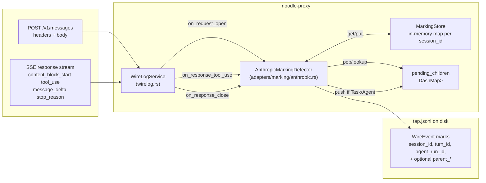
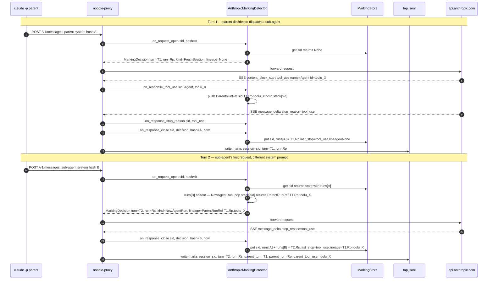

# ADR 049 — Sub-agent lineage on Anthropic round-trips

**Status:** Accepted.
**Supersedes:** the `parent_session_id`-only treatment in ADR 028 §10.
**Refines:** ADR 048 §11 item 0.

A design specification for how noodle reconstructs the
parent → sub-agent tree from a flat sequence of
`api.anthropic.com/v1/messages` round-trips, and propagates the
resulting lineage tags end-to-end through tap → sqlite → OTLP →
viewer.

Every wire fact, file path, and line range is verifiable. The
verification section names the tests and captures the design is
grounded against.

---

## 1. Problem

Claude Code's `Task` tool spawns a sub-agent. The user's mental
model is a tree:

```
parent (claude -p)
└── Task ──► general-purpose sub-agent
              ├── Bash
              ├── Read × N
              └── (returns to parent)
```

At `api.anthropic.com/v1/messages` that tree collapses onto a flat
sequence of HTTP round-trips:

```
#1  POST /v1/messages   parent  ─► response: tool_use(name=Agent, id=toolu_X)
#2  POST /v1/messages   sub-agent  (different system prompt; same header)
…
#K  POST /v1/messages   sub-agent's last turn → end_turn
#K+1 POST /v1/messages  parent resumes with tool_result for toolu_X
```

The data-plane requirement: stamp every round-trip with three
ULIDs (`session_id`, `turn_id`, `agent_run_id`) and, for sub-agent
round-trips, the parent's three ULIDs plus the spawning
`tool_use.id`. Stamping happens at the proxy edge, before any
record lands in `tap.jsonl`.

Two non-negotiables shaped the design:

1. **The detection must work on the live wire**, not on bundled
   transcripts or post-hoc replay. Noodle is in the request path;
   we have one pass at the bytes.
2. **The detection must distinguish parent from sub-agent inside
   one Anthropic session.** Anthropic's session header is shared
   across the tree (verified — §3).

---

## 2. Wire facts the design keys on

Verified by replaying `captures/max/parent-task-subagent.mitm`
through `mitmdump` and inspecting raw event bytes:

### 2.1 Request headers

`x-claude-code-session-id` is constant across parent and sub-agent
inside one `claude -p` invocation. In the
`parent-task-subagent` capture, all 8 round-trips carry
`230b90e5-fb93-49e0-8190-7ff3c5566d64` (`grep -c
"230b90e5-fb93-49e0-8190-7ff3c5566d64"
crates/noodle-adapters/tests/fixtures/adr_048/parent-task-subagent.fixture.json`
→ 8). This rules out the header as a parent/child discriminator.

Header name constant:
`crates/noodle-adapters/src/marking/anthropic.rs:346`:

```rust
pub const SESSION_HEADER: &str = "x-claude-code-session-id";
```

Extractor: `extract_session_id` at `anthropic.rs:496-501`.

### 2.2 Request body — the `system` array

Anthropic admits `system` in two shapes (a JSON string, or a
`Vec<{type, text}>` array of typed blocks). Blocks whose text
starts with `x-anthropic-billing-header` carry per-request cache
metadata and rotate per request; they are stripped before
hashing.

The canonical system text — a stable identifier for "which
agent's brain is on the other side of this header" — is the
defining identity per ADR 023 §2.5.

Algorithm: `canonical_system_text` at `anthropic.rs:472-487`:

```rust
fn canonical_system_text(system: &serde_json::Value) -> Option<String> {
    if let Some(s) = system.as_str() { return Some(s.to_owned()); }
    let arr = system.as_array()?;
    let mut parts = Vec::with_capacity(arr.len());
    for block in arr {
        let Some(text) = block.get("text").and_then(serde_json::Value::as_str) else { continue };
        if text.starts_with(BILLING_HEADER_PREFIX) { continue }
        parts.push(text);
    }
    Some(parts.join("\n"))
}
```

`BILLING_HEADER_PREFIX = "x-anthropic-billing-header"`
(`anthropic.rs:440`). The result is hashed into a `SystemHash`
(`compute_canonical_system_hash` at `anthropic.rs:462-469`;
the proxy hot path uses the combined single-parse
`compute_request_marking_hashes` at `anthropic.rs:385-410`,
which also yields the first-user text fingerprints for the
lineage match).

The parent and the sub-agent inside one session have **different**
canonical `system` texts (the parent carries the user's claude.md
+ agent definitions; the sub-agent carries the dispatched agent's
prompt + tool surface). The `SystemHash` is the in-session
discriminator.

### 2.3 Response SSE — the lineage anchor

The parent's response stream, when it spawns a sub-agent, emits a
`content_block_start` of `type: "tool_use"` with `name: "Task"` or
`name: "Agent"` and a stable, globally-unique `id` (the
`tool_use.id`). The same id later appears as the parent's
following request's `tool_result.tool_use_id` when the sub-agent
returns control.

Sample from `parent-task-subagent.fixture.json` turn #1:

```json
{
  "type": "content_block_start",
  "index": 1,
  "content_block": {
    "type": "tool_use",
    "id": "toolu_012Y8jeMfYYbNWTHPS1Nujbw",
    "name": "Agent",
    "input": {}
  }
}
```

`tool_use.id` (`toolu_012Y8jeMfYYbNWTHPS1Nujbw`) is the lineage
tag the design propagates end-to-end.

### 2.4 Response SSE — the turn boundary

`message_delta.delta.stop_reason ∈ {end_turn, max_tokens,
stop_sequence, tool_use, pause_turn}`. `tool_use` means "the
model wants to call a tool and expects the user to round-trip
with a `tool_result`"; `pause_turn` is the partial-turn
checkpoint emitted while a long-running server-side tool is in
progress; the other values close the turn.

The stop reason is the per-slot turn-boundary signal:
`tool_use` / `pause_turn` → next request continues the current
turn id; anything else → next request mints a fresh turn id.

---

## 3. Design alternative considered, and rejected

**Request-side tracking via the `messages[]` array.**

Anthropic's request body carries the full conversation in
`messages[]`. Each turn appends one or more entries:

```jsonc
{
  "messages": [
    { "role": "user", "content": [...] },
    { "role": "assistant", "content": [{ "type": "tool_use", "id": "toolu_X", ... }] },
    { "role": "user", "content": [{ "type": "tool_result", "tool_use_id": "toolu_X", ... }] },
    { "role": "user", "content": [...] }
  ]
}
```

The structural argument: round-trips that share a `messages[]`
prefix belong to the same turn lineage; sub-agent round-trips
have a disjoint prefix (different system + different first user
message).

**Why this was rejected:**

1. **Compaction breaks the invariant.** Claude Code rewrites
   `messages[]` mid-conversation to keep token budgets in check.
   Two round-trips can belong to the same turn but have
   syntactically divergent prefixes after compaction. Identity
   would require a semantic diff, not a byte equality.
2. **Cost.** `messages[]` grows monotonically (tens of KB to
   hundreds of KB by mid-conversation). Hashing or differencing
   it on every round-trip is per-byte work proportional to
   conversation length. The SSE-side approach is per-byte work
   proportional to one response (typically 1–20 KB).
3. **Wrong direction for lineage.** Even if request-side
   tracking gave clean turn grouping, **lineage requires
   knowing which response spawned a sub-agent.** The spawn
   signal lives in the response (a `tool_use(Task|Agent)`
   block). A request-side approach still has to scan the
   response. The SSE-side approach is the lineage source; the
   turn grouping is a free bonus from `stop_reason` on the same
   stream.
4. **One stream, multiple consumers.** noodle already decodes
   the SSE for tool_use pairing (ADR 030 §4.1), content-block
   surfacing (ADR 030 §2), and token-usage accounting. Adding
   marking-detection to that pass is incremental; adding a
   second parallel pass over `messages[]` is structural.

The chosen approach is **SSE-side detection**: keep state inside
the proxy keyed by the wire session id, read identity from the
canonical `system` hash, and propagate lineage through a
per-session pending-children stack indexed by the parent's
`tool_use.id`.

---

## 4. Components



Per-component responsibilities (file references in §10):

- **`WireLogService`** — Rama HTTP service layer. Owns the
  request/response lifecycle, accumulates the SSE body, calls the
  detector at three fixed points. Stateless w.r.t. lineage.
- **`AnthropicMarkingDetector`** — implements the
  `MarkingDetector` trait. Holds three short-lived in-flight
  DashMaps (one stop, one decision, one pending-children stack)
  plus a reference to the persistent `MarkingStore`.
- **`MarkingStore`** — persistent cache keyed by
  `MarkingSessionId`. One `SessionState` per session, holding a
  `HashMap<Option<SystemHash>, AgentRunState>`. The "per-agent-run
  state" inside one session is what makes parent/sub-agent
  state non-overlapping.
- **`pending_children`** — a per-session LIFO of
  `ParentRunRef { session_id, turn_id, agent_run_id, tool_use_id }`.
  The detector pushes onto it when a parent emits
  `tool_use(Task|Agent)`; it pops from it when the next
  unseen-`SystemHash` request opens (that's the sub-agent's
  first round-trip).

---

## 5. State

### 5.1 Per-session state — persistent

`SessionState` at
`crates/noodle-core/src/marking.rs:250-258`:

```rust
pub struct SessionState {
    pub runs: HashMap<Option<SystemHash>, AgentRunState>,
    pub last_observed_at_unix_ms: u64,
}
```

`AgentRunState` at `marking.rs:185-202`:

```rust
pub struct AgentRunState {
    pub current_turn_id:   TurnId,
    pub agent_run_id:      AgentRunId,
    pub last_stop_reason:  Option<StopReason>,
    pub lineage:           Option<ParentRunRef>,
}
```

`ParentRunRef` at `marking.rs:211-238`:

```rust
pub struct ParentRunRef {
    pub session_id:        MarkingSessionId,
    pub turn_id:           TurnId,
    pub agent_run_id:      AgentRunId,
    pub tool_use_id:       SmolStr,
    pub child_prompt_hash: Option<SystemHash>,
}
```

`runs.get(None)` handles requests with no `system` array (haiku
title-generation side-calls); they live in their own slot,
isolated from the parent's slot.

### 5.2 Per-flow state — transient

Inside `AnthropicMarkingDetector` (`anthropic.rs:45-73`):

| Field | Type | Lifetime |
|---|---|---|
| `in_flight_stop` | `DashMap<session, StopReason>` | open → close on this flow |
| `in_flight_decision` | `DashMap<session, MarkingDecision>` | open → close on this flow |
| `pending_children` | `DashMap<session, Vec<ParentRunRef>>` | persistent across the session — drained as sub-agents arrive |

`pending_children` is the only one that crosses round-trips. Its
size is bounded by the number of in-flight `tool_use(Task|Agent)`
spawns that haven't yet had their child sub-agent open a request.
In practice that's 0–1 per session (Claude Code serialises
sub-agent dispatch).

---

## 6. Algorithms

### 6.1 Canonical system hash

Implemented in `compute_canonical_system_hash` at
`anthropic.rs:346-354`. Determinism rules:

- `system` absent → `None` (the slot is the "no system" slot)
- `system` is a JSON string → hash the string verbatim
- `system` is an array → join the `text` field of every block
  whose text does NOT start with `BILLING_HEADER_PREFIX`,
  separated by `\n`, then hash

The hash is over UTF-8 bytes (`SystemHash::from_bytes`). Two
requests with byte-identical canonical text produce the same
hash; any other property of the request body (model name,
messages, max_tokens) is intentionally not part of identity.

### 6.2 Turn + agent-run decision table

The detector evaluates this table at `on_request_open`
(`anthropic.rs:153-251`). The result is a `MarkingDecision`
containing the `turn_id`, `agent_run_id`, the kind of each, and
the lineage.

| Slot for `request_system_hash` | `last_stop_reason` | Decision |
|---|---|---|
| Whole session absent | — | `FreshSession` — mint fresh `turn_id` + `agent_run_id`; lineage = None |
| Session present, slot absent | — | `NewAgentRun` — mint fresh `turn_id` + `agent_run_id`; lineage = pop pending stack |
| Slot present | `tool_use` | `Continuation` — reuse slot's `turn_id` + `agent_run_id`; lineage = slot's lineage |
| Slot present | `end_turn` / `max_tokens` / `stop_sequence` / `unknown` | `NewTurn` — mint fresh `turn_id`, reuse slot's `agent_run_id`; lineage = slot's lineage |

Two boundary kinds because they vary independently:
`MarkingDecisionKind` (turn boundary, at `marking.rs:360-379`)
and `AgentRunDecisionKind` (agent-run boundary, at
`marking.rs:382-395`).

The lineage column is the §6.3 algorithm.

### 6.3 Lineage propagation — the pending-children stack

The structural problem: the parent's response is observed
*strictly before* the sub-agent's first request. We need to carry
the parent's `(turn_id, agent_run_id, tool_use_id)` forward across
that gap, find it again on the first sub-agent request, and stamp
it onto the new `AgentRunState`.

Three callbacks cooperate (`MarkingDetector` trait at
`marking.rs:403-467`):

| Trigger | Detector method | Action |
|---|---|---|
| Parent's response emits `tool_use(name=Task\|Agent, id=X, input.prompt=P)` | `on_response_tool_use(session, name, id, hash(P))` | Push `ParentRunRef { session, parent.turn_id, parent.agent_run_id, X, child_prompt_hash: hash(P) }` onto `pending_children[session]` |
| Sub-agent's first request opens (a `NewAgentRun` decision) | `on_request_open(session, sub_agent_system_hash, first_user_text_hashes, …)` | Remove the entry whose `child_prompt_hash` matches one of the request's first-user text-block hashes; stamp it onto `MarkingDecision.lineage`. No match ⇒ lineage `None` |
| Flow closes | `on_response_close(session, decision, hash, …)` | Persist the decision's lineage onto the slot's `AgentRunState.lineage` |

Code: push at `anthropic.rs:257-293` (capped at
`MAX_PENDING_CHILDREN = 8`, oldest evicts first); fingerprint
match at `anthropic.rs:224-233`; persist at
`anthropic.rs:322-330`.

**The fingerprint** — the spawn's `input.prompt` text appears
**byte-for-byte** as a text block of the sub-agent's first user
message (verified against
`captures/max/parent-task-subagent.mitm`: the 717-byte prompt of
`toolu_012Y8jeMfYYbNWTHPS1Nujbw` is block #3 of the sub-agent's
first user message on every one of its round-trips; the
interposed side-call carries no such block). Both sides hash via
`SystemHash::from_bytes` — push-side from the decoded
`ContentBlock::ToolUse.input` (`prompt_hash_of_tool_input` at
`anthropic.rs`), open-side from the same single body parse that
computes the canonical system hash
(`compute_request_marking_hashes`). A request that does not carry
the prompt — title-gen, quota probe, compactor — can never match
and therefore can never steal a pending child.

**Filter rule** — `on_response_tool_use` ignores every tool name
except `Task` and `Agent` (`is_sub_agent_spawner` at
`anthropic.rs:114-116`). The proxy passes ALL `tool_use` blocks
to the detector (Bash, Read, Edit, …) — the detector decides
which ones spawn sub-agents.

**Stack discipline** — keyed match, not positional pop. Parents
that dispatch several Tasks concurrently are handled regardless
of child arrival order: each child matches its own spawn's
prompt. Identical prompts are symmetric; the oldest entry wins.

**Continuation invariant** — once the slot is populated,
subsequent `Continuation` / `NewTurn` decisions for that slot
preserve the lineage (`decision.lineage` is read from the
existing slot). Lineage is set once, at the sub-agent's first
round-trip; every subsequent round-trip of that sub-agent stamps
the same lineage on `tap.jsonl`. This is why a viewer reading
any one row of a sub-agent's turn can reconstruct the tree, not
just the first row.

**Unattributed sub-agents** — a `NewAgentRun` with no matching
fingerprint takes lineage `None`. This covers Claude Code's
internal classifier sub-agents (haiku title-gen, the "compact
this conversation" sub-agent), spawns whose `input` carried no
`prompt` string, and prompts rewritten by the harness en route —
all degrade to correct-but-unlinked, never to mis-attribution.

### 6.4 The "previously broken" turn-boundary (context)

Before this design (PR-B in commit history), `SessionState` had
a single `current_turn_id` per session. Replayed against the
8-turn `parent-task-subagent` capture, the sub-agent's
`end_turn` would overwrite the parent's `tool_use` stop, and
the parent's resumption would mint a fresh turn (when it should
have continued the original turn). The per-slot `runs` map is
the structural fix; the lineage stack rides on top of it.

The bug-vs-fix sequence diagram lives at
[`docs/diagrams/adr-048-per-agent-run-sessionstate.md`](../diagrams/adr-048-per-agent-run-sessionstate.md).

---

## 7. Flow diagram — end-to-end



---

## 8. Persistence — wire writes

The detector's `MarkingDecision` flows into a `WireMarks` block
constructed at `crates/noodle-proxy/src/wirelog.rs:542-562`:

```rust
let lineage = decision.lineage.clone();
let marks = WireMarks {
    session_id:    SmolStr::from(session_id.as_str()),
    turn_id:       SmolStr::from(decision.turn_id.as_str()),
    agent_run_id:  SmolStr::from(decision.agent_run_id.as_str()),
    parent_session_id:   lineage.as_ref().map(|p| SmolStr::from(p.session_id.as_str())),
    parent_turn_id:      lineage.as_ref().map(|p| SmolStr::from(p.turn_id.as_str())),
    parent_agent_run_id: lineage.as_ref().map(|p| SmolStr::from(p.agent_run_id.as_str())),
    parent_tool_use_id:  lineage.as_ref().map(|p| p.tool_use_id.clone()),
};
```

The four downstream surfaces, in pipeline order:

| Surface | File | Shape rule |
|---|---|---|
| `WireMarks` (in-memory) | `crates/noodle-core/src/wire.rs:365-394` | Required ids as `SmolStr`; parent ids as `Option<SmolStr>` |
| `TapMarks` (on-disk `tap.jsonl`) | `crates/noodle-tap/src/contract.rs:565-578` | Mirrors `WireMarks` as `String`; every `Option` carries `#[serde(skip_serializing_if = "Option::is_none")]` so top-level rows OMIT `parent_*` rather than emitting `null` |
| `TelemetryRow` (sqlite) | `crates/noodle-embellish-core/src/mapper.rs:77-95` | `Option<String>` columns, populated by `extract_marking_ids` (mapper.rs:229) preferring request marks over response marks |
| `ai_telemetry_v_0_0_2` DDL | `crates/noodle-embellish/src/sqlite.rs:329-332` | 6 nullable `TEXT` columns; `INSERT` placeholders `?66-?71` (sqlite.rs:468-469); `ensure_lineage_columns` (sqlite.rs:528) idempotently `ALTER TABLE ADD COLUMN` for upgrades |
| `RollupsRow` (cursor) | `crates/noodle-shipper/src/cursor.rs:122-127` | `SELECT` positions 40-45 (cursor.rs:348-353) |
| OTLP `/v1/logs` | `crates/noodle-shipper/src/mapping.rs:120-135` | **Dual emission** per row — bare attribute (`parent_session_id`) + `gen_ai.parent.*` (`gen_ai.parent.session.id`) namespace; same for `turn_id` / `agent_run_id` (mapping.rs:113-118) |

The dual OTLP emission lets a `gen_ai`-aware collector consume the
namespaced keys while a generic collector keys on bare names —
no downstream config flag picks between them.

### 8.1 Viewer reconstruction

The viewer reads `tap.jsonl`, decodes `TapMarks` into
`DecodedMarks` (Rust: `crates/noodle-viewer/src/model.rs:233-280`;
TypeScript mirror:
`crates/noodle-viewer/web/src/types.ts:161-181`).

Tree reconstruction is a two-pass walk in
`crates/noodle-viewer/web/src/store/derived/ooda.ts`:

1. `groupIntoAgentRuns` (ooda.ts:292) folds round-trips by
   `agent_run_id`, capturing for each run the `parentRunIndex`
   (ooda.ts:73) — the index into the run array of the parent run,
   resolved by matching the round-trip's
   `parent_agent_run_id` to a prior run's own `agent_run_id`.
2. `flattenRunsForTree` in
   `crates/noodle-viewer/web/src/components/SessionRail.tsx:15`
   does a depth-first walk over `parentRunIndex` and emits
   `{run, depth}[]`. Each entry renders with
   `paddingLeft = 0.6 + depth × 1.1 rem` and a `depth-N` CSS
   class (SessionRail.tsx:140-143). Orphan cycles (a defensive
   case — a run's parent doesn't resolve) fall in at depth 0 in
   source order, never lost.

---

## 9. Design considerations

### 9.1 Double-processing of the SSE body at flow close — known

At response close the proxy walks `accumulated_in` (the buffered
SSE body) **four times** in `emit`
(`wirelog.rs:1376-1456`):

```rust
let stop = extract_stop_reason(accumulated_in)…              // 1403 — byte scan for "stop_reason":"
for (name, id) in extract_tool_uses(accumulated_in) {…       // 1414 — byte scan for "content_block":
let tokens = extract_last_usage(accumulated_in);             // 1440 — byte scan for "usage":{
let (tier, geo) = extract_last_usage_envelope(accumulated_in); // 1441 — byte scan for "usage":{ (different parser)
```

Separately, the streaming inspection engine
(`InspectionEngine`, see `wirelog.rs:90, 1357`) has already
decoded the SSE stream into a typed `Vec<ContentBlock>` —
including every `ContentBlock::ToolUse { id, name, input }`
(definition at
`crates/noodle-adapters/src/provider/anthropic_content_blocks.rs:71-101`).
The accumulator is finished at `wirelog.rs:1473`
(`cb.accumulator.finish()`) and the resulting `content_blocks`
JSON is already used at `wirelog.rs:1507-1528` to populate the
`PendingToolUses` pairing table.

So `extract_tool_uses` is performing the **second** byte-scan of
the same response for the same `tool_use` blocks. The marking
detector could consume the engine's already-decoded list instead.
The current arrangement was kept because the marking detector
predates the engine's content-block decoder; folding them is a
future cleanup, not a correctness issue.

The same observation applies to `extract_stop_reason` vs the
engine's `RoundTripResponse.stop_reason`
(`crates/noodle-core/src/layered.rs:437`) and to the two
`extract_last_usage*` passes (which also walk the same buffer
twice for different fields of the same JSON object).

**Recommendation for a future revision:** consume the engine's
typed output as the source of truth for `stop_reason`,
`tool_use` blocks, and `usage`; delete the four `extract_*`
byte-scanners; on the non-anthropic / non-SSE path, the engine
is `None`, so a fallback scan stays for that case alone. Net
change: O(N) bytes scanned per response goes from 4N to 1N
(streaming) plus 0 (already-decoded structures consumed in
O(1)).

This is flagged as a follow-up; not part of this design's
acceptance.

### 9.2 Session-id collision across providers — not a concern

`MarkingSessionId` is namespaced per `(provider, endpoint)` cell
at the call-site (ADR 028 §5.1). Cross-provider id reuse cannot
cross over into this detector's `runs` map.

### 9.3 Cross-process state — out of scope

`MarkingStore` is a trait; the v1 implementation
(`InMemoryMarkingStore`) is single-process. If noodle ever runs
multiple proxy replicas in front of one claude-code instance,
the store needs a Redis/DynamoDB adapter so a sub-agent's first
request can find a `pending_children` entry pushed by a parent
response that landed on a different replica. Trait shape is
already cross-process-friendly (`Send + Sync + 'static`, atomic
`get`/`put`).

### 9.4 Stack-empty `NewAgentRun` — intentional design

A `NewAgentRun` with an empty `pending_children` stack stamps
`lineage = None` rather than erroring. This handles two real
cases without special casing:

1. **Claude Code's internal harness sub-agents** (haiku title-gen
   when a session is named, the conversation-compactor) open
   their own `(api.anthropic.com, session_id)` round-trips with a
   distinct `system` hash. They have no `tool_use(Task|Agent)`
   ancestor — they're spawned by the harness, not by the user's
   agent.
2. **The very first parent round-trip** would otherwise need a
   special-case before the table even existed.

Treating "no anchor" as "no lineage" is the right default; the
viewer renders these as top-level runs with `depth=0`. The
classification of unattributed vs root is left to the consumer.

### 9.5 Stack depth > 1 — handled by the fingerprint match

If a parent emits N `tool_use(Task)` blocks in one response
before any of the N children opens, the stack carries N entries
(capped at `MAX_PENDING_CHILDREN = 8`, oldest evicted first).
Children match their own spawn's `input.prompt` fingerprint
regardless of arrival order, so concurrent Task dispatch
attributes correctly without positional assumptions. Identical
prompts are symmetric; the oldest entry wins
(`out_of_order_children_attribute_to_their_own_spawns` in
`crates/noodle-adapters/tests/adr_048_sub_agent_state.rs` pins
the out-of-order case).

---

## 10. Code reference

| Concern | File:lines |
|---|---|
| Wire-side session header constant | `crates/noodle-adapters/src/marking/anthropic.rs:346` |
| Billing-header strip prefix | `crates/noodle-adapters/src/marking/anthropic.rs:440` |
| Canonical system hash | `crates/noodle-adapters/src/marking/anthropic.rs:462-469` |
| Canonical system text | `crates/noodle-adapters/src/marking/anthropic.rs:472-487` |
| Combined request fingerprints (`compute_request_marking_hashes`) | `crates/noodle-adapters/src/marking/anthropic.rs:385-410` |
| Spawn-prompt fingerprint (`prompt_hash_of_tool_input`) | `crates/noodle-adapters/src/marking/anthropic.rs:356-362` |
| Session-id header extractor | `crates/noodle-adapters/src/marking/anthropic.rs:496-501` |
| `AnthropicMarkingDetector` struct | `crates/noodle-adapters/src/marking/anthropic.rs:45-73` |
| Sub-agent spawner filter | `crates/noodle-adapters/src/marking/anthropic.rs:114-116` |
| `on_request_open` (decision table + fingerprint match) | `crates/noodle-adapters/src/marking/anthropic.rs:153-251` |
| `on_response_stop_reason` | `crates/noodle-adapters/src/marking/anthropic.rs:253-255` |
| `on_response_tool_use` (push, capped) | `crates/noodle-adapters/src/marking/anthropic.rs:257-293` |
| `on_response_close` (persist) | `crates/noodle-adapters/src/marking/anthropic.rs:295-333` |
| `SessionState`, `AgentRunState`, `ParentRunRef` | `crates/noodle-core/src/marking.rs:185-258` |
| `MarkingDecision` | `crates/noodle-core/src/marking.rs:338-357` |
| `MarkingDecisionKind` enum | `crates/noodle-core/src/marking.rs:360-379` |
| `AgentRunDecisionKind` enum | `crates/noodle-core/src/marking.rs:382-395` |
| `MarkingDetector` trait | `crates/noodle-core/src/marking.rs:403-467` |
| `WireMarks` struct | `crates/noodle-core/src/wire.rs:365-394` |
| `TapMarks` struct (`From<&WireMarks>`) | `crates/noodle-tap/src/contract.rs:565-578` |
| Proxy call-sites: open, stream, close | `crates/noodle-proxy/src/wirelog.rs:536-541, 1403-1416, 1423-1424` |
| `WireMarks` construction from decision | `crates/noodle-proxy/src/wirelog.rs:542-562` |
| `extract_tool_uses` SSE byte scanner | `crates/noodle-proxy/src/wirelog.rs:1672-1699` |
| `extract_stop_reason` SSE byte scanner | `crates/noodle-proxy/src/wirelog.rs:1632-…` |
| `ContentBlock::ToolUse` typed shape | `crates/noodle-adapters/src/provider/anthropic_content_blocks.rs:71-101` |
| Streaming content-block accumulator finish | `crates/noodle-adapters/src/provider/anthropic_content_blocks.rs:327-333` |
| `TelemetryRow` lineage columns | `crates/noodle-embellish-core/src/mapper.rs:77-95` |
| `extract_marking_ids` (req-marks-preferred) | `crates/noodle-embellish-core/src/mapper.rs:229-…` |
| `ai_telemetry_v_0_0_2` DDL (lineage cols) | `crates/noodle-embellish/src/sqlite.rs:329-332` |
| `INSERT` placeholders 66-71 | `crates/noodle-embellish/src/sqlite.rs:468-469` |
| `ensure_lineage_columns` migration | `crates/noodle-embellish/src/sqlite.rs:520-528` |
| `RollupsRow` lineage columns | `crates/noodle-shipper/src/cursor.rs:122-127` |
| Cursor `SELECT` positions 40-45 | `crates/noodle-shipper/src/cursor.rs:348-353` |
| OTLP attribute emission (bare + `gen_ai.*`) | `crates/noodle-shipper/src/mapping.rs:113-135` |
| Viewer `DecodedMarks` (Rust) | `crates/noodle-viewer/src/model.rs:233-280` |
| Viewer `DecodedMarks` (TypeScript) | `crates/noodle-viewer/web/src/types.ts:161-181` |
| Viewer `AgentRun.parentRunIndex` | `crates/noodle-viewer/web/src/store/derived/ooda.ts:73, 292-…` |
| Viewer `flattenRunsForTree` (DFS, padding-by-depth) | `crates/noodle-viewer/web/src/components/SessionRail.tsx:15-, 140-143` |

---

## 11. Verification

| Layer | Location | Asserts |
|---|---|---|
| Pure state machine | `crates/noodle-core/src/marking.rs` test module | Empty stack push/pop, multiple pushes, slot lookup by hash, `MarkingDecisionKind` for each (cache, slot, last_stop) triple |
| Capture-driven detector | `crates/noodle-adapters/tests/adr_048_sub_agent_state.rs` (8 tests) | Replay each fixture; assert parent #1's and #8's `turn_id`/`agent_run_id` match; sub-agent's lineage matches parent's `tool_use.id`; etc. |
| SSE byte-scanner correctness | `wirelog.rs::extract_tool_uses_tests` (7 tests) | Brace-balanced JSON in SSE bodies, non-`tool_use` blocks ignored, empty body returns empty vec |
| OTLP attribute parity | `mapping.rs::marking_and_lineage_attrs_emit_with_dual_namespace` + `marking_and_lineage_attrs_absent_when_unset` | Both bare keys and `gen_ai.*` keys emit when set; both absent when unset |
| Live deploy | rancher-desktop noodle-gateway pod | After deploy: `claude -p` Task-tool prompt → marks in `tap.jsonl` → rows in `ai_telemetry_v_0_0_2` → attributes on OTLP body at the sink |

### Fixture corpus

`.mitm` captures live in `captures/max/` (gitignored — they carry
bearer tokens). They are sanitised by
`tools/extract_capture_fixture.py` into
`crates/noodle-adapters/tests/fixtures/adr_048/*.fixture.json`
(committed). The fixtures preserve every wire fact this design
depends on: request headers, request body, response SSE event
stream, and response stop reason.

### Sample of an emitted sub-agent marks block

From a live run against the rancher-desktop deployment
(`parent-task-subagent` workflow, 2026-06-08):

```json
{
  "session_id":          "29524fe8-a8d3-4b74-9505-c09c573f50df",
  "turn_id":             "01KTM8VA5WJ56S0EAPBNT4VC45",
  "agent_run_id":        "01KTM8VA5W0A343ASA61Y3Q3NX",
  "parent_session_id":   "29524fe8-a8d3-4b74-9505-c09c573f50df",
  "parent_turn_id":      "01KTM8V3GYM83DPXY7RK95S36Y",
  "parent_agent_run_id": "01KTM8V3GYS4XV2NXPN27ETCWK",
  "parent_tool_use_id":  "toolu_01FkayMarXnofYT19kWJLKQf"
}
```

The same row's OTLP attributes (from the `noodle-otlp-sink`
pod's `/tmp/otlp-bodies/*.json`, filtered to lineage keys):

```json
{
  "agent_run_id":               { "stringValue": "01KTM8VA5Z5X9GQA07MYVM8CWR" },
  "turn_id":                    { "stringValue": "01KTM8VA5ZFZ27HWWX8GCS5D8C" },
  "parent_session_id":          { "stringValue": "29524fe8-a8d3-4b74-9505-c09c573f50df" },
  "parent_turn_id":             { "stringValue": "01KTM8V3GYM83DPXY7RK95S36Y" },
  "parent_agent_run_id":        { "stringValue": "01KTM8V3GYS4XV2NXPN27ETCWK" },
  "parent_tool_use_id":         { "stringValue": "toolu_01FkayMarXnofYT19kWJLKQf" },
  "gen_ai.agent_run.id":        { "stringValue": "01KTM8VA5Z5X9GQA07MYVM8CWR" },
  "gen_ai.turn.id":             { "stringValue": "01KTM8VA5ZFZ27HWWX8GCS5D8C" },
  "gen_ai.parent.session.id":   { "stringValue": "29524fe8-a8d3-4b74-9505-c09c573f50df" },
  "gen_ai.parent.turn.id":      { "stringValue": "01KTM8V3GYM83DPXY7RK95S36Y" },
  "gen_ai.parent.agent_run.id": { "stringValue": "01KTM8V3GYS4XV2NXPN27ETCWK" },
  "gen_ai.parent.tool_use.id":  { "stringValue": "toolu_01FkayMarXnofYT19kWJLKQf" }
}
```
