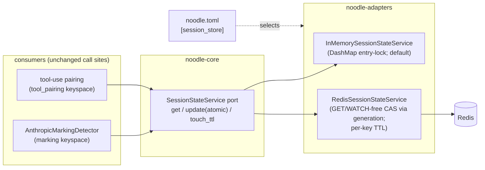
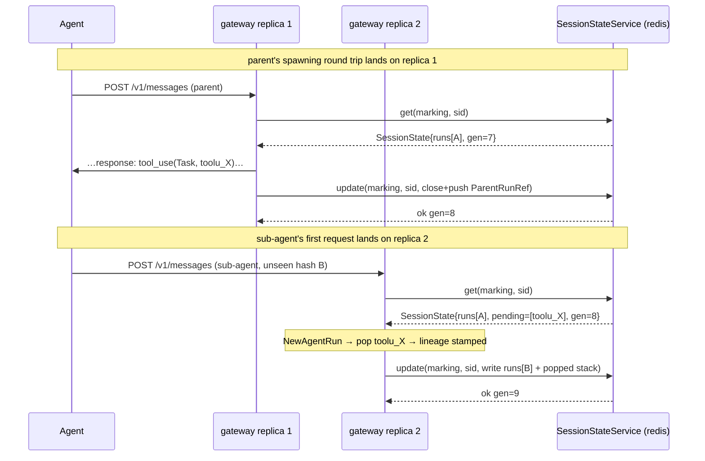
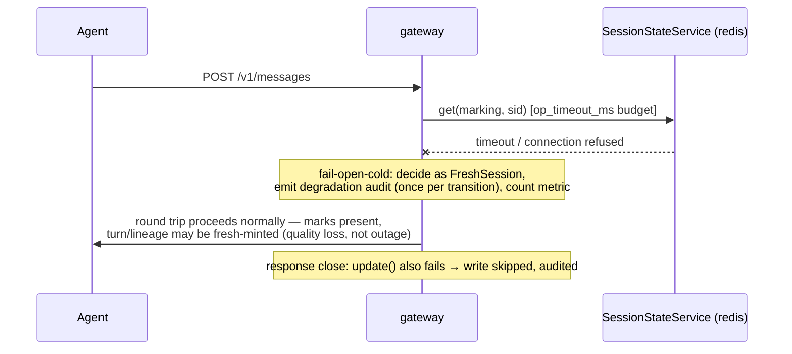

# ADR 050 — Session-state service: one port, pluggable backends

**Status:** proposed.
**Related:** ADR 028 (`SessionStore` + marking detector — the state this
service hosts), ADR 044 (data-plane & cluster architecture — the
multi-replica deployment that motivates it), ADR 048 §10 ("state is
in-memory and per-process" — the accepted limitation this lifts),
ADR 049 §9.3 (cross-process state named as the open seam this ADR
fills).

---

## 1. Problem

### 1.1 The problem in domain terms

Turn and lineage reconstruction is **stateful across round trips**:
deciding whether a request continues a turn requires the stop reason
of the previous round trip in the same agent run, and attributing a
sub-agent to its parent requires remembering a spawn observed on an
earlier response. That memory lives in the proxy process. Two facts
of the deployment environment break that:

1. **Replicas.** A gateway deployment scales `noodle-gateway`
   horizontally. Round trips of one session are load-balanced across
   replicas, so the replica seeing the sub-agent's first request may
   not be the replica that saw the parent's spawning response. With
   per-process state, that sub-agent gets no lineage and the parent's
   turn boundary resets — silently wrong telemetry, not an error.
2. **Restarts.** A proxy restart (deploy, OOM, node drain) loses all
   in-flight session memory; every active session resumes as if cold.

### 1.2 Glossary

| Term | Definition |
|---|---|
| **session state** | The per-session value the marking detector reads at request open and writes at response close: per-agent-run slots (turn id, agent-run id, last stop reason, lineage) plus the pending-children spawn stack. |
| **keyspace** | A named family of keys inside the service (e.g. `marking`, `tool_pairing`). Keyspaces isolate consumers; one backend hosts many. |
| **atomic update** | A read-modify-write applied as one unit: concurrent updates to the same key never lose each other's writes. |
| **generation** | A monotonic per-key version used for optimistic concurrency; an update conditioned on the generation it read. |
| **fail-open-cold** | The degraded mode when the backend is unreachable: the consumer behaves as if the key were absent (cold session) and the proxy keeps serving. Telemetry quality degrades; traffic never does. |
| **TTL** | Time-to-live after the last write, after which a key is evicted. Sessions end without a close signal, so eviction is the only cleanup. |

### 1.3 Invariants (hold regardless of backend)

- **I1 — No lost updates.** Two round trips of one session closing
  concurrently must both land their slot writes. (The current
  `get → mutate → put` is not transactional; with two concurrent
  closes, last-writer-wins can erase the other's slot.)
- **I2 — Read-your-session-writes.** A round trip opening after an
  earlier round trip of the same session closed must observe that
  close's write, regardless of which replica served each.
- **I3 — Traffic is never blocked on state.** Backend slowness or
  unavailability degrades to fail-open-cold within a bounded
  timeout; the proxy never stalls or errors a customer request
  because of the state service.
- **I4 — Bounded memory.** Every key has a TTL refreshed on write;
  abandoned sessions are evicted on every backend.

### 1.4 Current state inventory — what exists and what bypasses it

Four holders of cross-request state exist; only one sits behind a
port, and none satisfies I1 or I2:

| State | Holder | Scope | Needs cross-replica? |
|---|---|---|---|
| `SessionState` (runs map: turn/agent-run/lineage per slot) | `MarkingStore` port (`crates/noodle-core/src/marking.rs:311-318`) → `InMemoryMarkingStore` DashMap (`crates/noodle-adapters/src/marking/in_memory_store.rs:26`), constructed at `crates/noodle-proxy/src/main.rs:136` | session, cross-RT | **yes** |
| `pending_children: Vec<ParentRunRef>` (spawn stack) | private DashMap **inside** `AnthropicMarkingDetector` (`crates/noodle-adapters/src/marking/anthropic.rs:65`) — bypasses the port | session, cross-RT (spawn → child's first request) | **yes** |
| `PendingToolUses` (`tool_use_id → request_id`, bounded FIFO) | `crates/noodle-proxy/src/pending_tool_uses.rs` — no port | session-ish, cross-RT (S11 pairing) | **yes** |
| `in_flight_stop` / `in_flight_decision` | private DashMaps inside the detector (`anthropic.rs:50,57`) | one round trip (open → close on one connection) | no — request and response of one round trip are served by one process |
| `Session { directive_injected: AtomicBool, … }` | `SessionStore` port (`crates/noodle-core/src/store.rs:7`, `get_or_init → Arc<Session>`) | session, cross-RT | yes, but the `Arc` + atomics shape is shared-memory-only (see §3.3) |

The `MarkingStore` trait is already the right *kind* of seam — ADR 028
anticipated "Redis / DynamoDB / etc. arriving later when
cross-process proxies do." What it lacks: atomic update (I1), async
operation (a remote backend cannot block the hot path behind a sync
call), TTL as part of the contract (I4), and coverage of the state
that grew up outside it (`pending_children`, `PendingToolUses`).

---

## 2. Solution

### 2.1 Shape

One service abstraction in `noodle-core`, namespaced by keyspace,
with pluggable backends selected by configuration:



The port (signatures normative, names illustrative):

```rust
/// noodle-core. Async because remote backends exist; the in-memory
/// impl resolves immediately.
#[async_trait]
pub trait SessionStateService: Send + Sync + 'static {
    /// Read the current value (None = cold key).
    async fn get(&self, ks: Keyspace, key: &str) -> StateResult<Option<VersionedValue>>;

    /// Atomic read-modify-write: load, apply `f`, store — as one
    /// unit (I1). `f` may run more than once (CAS retry); it must be
    /// pure over its input. Returns the value written.
    async fn update(
        &self,
        ks: Keyspace,
        key: &str,
        f: &(dyn Fn(Option<Value>) -> Value + Send + Sync),
    ) -> StateResult<Value>;
}

/// Value = schema-versioned bytes; serialization is the consumer's
/// concern (serde), opacity is the service's (it stores bytes).
pub struct VersionedValue { pub bytes: Bytes, pub generation: u64 }
```

`StateResult` carries one error family; **every consumer maps every
error to fail-open-cold** (I3). There is no retry-until-success path
on the hot path.

### 2.2 Problem → solution mapping

| Problem concept | Owned by | Representation |
|---|---|---|
| session state (marking) | `marking` keyspace | `SessionState` (gains `pending_children`, serde + `schema_version`) |
| spawn stack | folded **into** `SessionState` | `SessionState.pending_children: Vec<ParentRunRef>` — rides the same atomic value, so spawn-push and child-pop are serialized with slot updates |
| tool-use pairing | `tool_pairing` keyspace | existing `tool_use_id → request_id` entries, TTL'd |
| atomic update (I1, I2) | the port's `update` | backend-native: DashMap entry lock in memory; generation-CAS loop on Redis |
| eviction (I4) | the port contract | TTL refreshed on every `update`; Redis `PEXPIRE`, in-memory sweep (existing `evict_older_than`, `in_memory_store.rs:53`) |
| degraded mode (I3) | consumers, uniformly | fail-open-cold + one audit event per transition (rate-limited), counter metric |
| per-flow scratch (`in_flight_*`) | **stays process-local** | unchanged — one round trip never crosses replicas |

Two deliberate exclusions:

- **`Session`/`SessionStore` (`store.rs:7`) is not migrated.** Its
  `Arc<Session>` + `AtomicBool` shape is shared-memory semantics that
  cannot be remoted; its main consumer (`directive_injected`, the
  OpenAI-path injector gate) is due for redesign under ADR 048 item 5
  anyway. The port can host it later as a third keyspace once its
  consumer has value semantics. Migrating it now couples this ADR to
  an injector redesign.
- **Brain/embellish state is out of scope** — it lives downstream of
  `tap.jsonl`, off the hot path, with its own durability story
  (SQLite).

### 2.3 Backend implementations

**In-memory (default).** Wraps a `DashMap<(Keyspace, SmolStr),
VersionedValue>`; `update` holds the entry lock across `f` — I1 by
mutual exclusion, zero new dependencies, identical performance
profile to today. Single-process deployments see no behavioral
change except the I1 fix.

**Redis.** One logical key per `(keyspace, session)`:
`noodle:{ks}:{key}` → `bytes` + `generation` (a Redis hash with
`gen` and `val` fields). `update` runs a bounded CAS loop (§4). TTL
via `PEXPIRE` on every write. Values are `postcard`-serialized
`SessionState` prefixed with a `schema_version` byte — unknown
versions are treated as cold (fail-open on schema skew during
rolling deploys).

**Why CAS-by-generation rather than the alternatives:**

- *Server-side merge (Lua)* is rejected because the merge logic is
  the marking state machine itself; duplicating it in Lua creates a
  second implementation that drifts.
- *Sticky session routing* (pin a session to a replica at the LB) is
  rejected as the primary mechanism because it requires L7 affinity
  on a custom header in every deployment environment and still loses
  state on restart. It remains a useful latency optimization on top
  of this design, never a substitute.
- *Single-writer actor per session* is in-process only; it cannot
  satisfy I2 across replicas.

### 2.4 Configuration

`[session_store]` section in `~/.noodle/noodle.toml` (same file,
sectional convention per ADR 048 §8):

```toml
[session_store]
backend = "memory"        # "memory" (default) | "redis"
ttl_seconds = 14400       # I4 — refreshed on write
# Redis-only:
url = "redis://noodle-redis:6379"
op_timeout_ms = 50        # I3 — per-operation budget before fail-open-cold
cas_max_retries = 4       # §4 — then fail-open (write skipped, audited)
```

Absent section ⇒ in-memory with the defaults above. Fail-fast
validation at startup (unreachable Redis at boot is a startup error
under `backend = "redis"`, not a silent fallback — operators choose
the degraded posture explicitly, they don't discover it).

---

## 3. Key flows

### 3.1 Round trip across two replicas (the motivating case)



With per-process state, replica 2 sees nothing at step `get` and the
sub-agent loses lineage. With the service, the decision is identical
to the single-process case.

### 3.2 Failure flow — backend unavailable (I3)



The degraded output is exactly what a proxy restart already produces
under the accepted ADR 048 §10 posture — the service makes that mode
rarer, not the failure mode worse.

---

## 4. Critical algorithm — atomic update via generation CAS

**Contract.** Inputs: keyspace, key, pure closure
`f(Option<Value>) -> Value`. Output: the stored value, or a typed
error. Preserves I1 (no lost updates) and I2 (a successful update is
visible to every subsequent `get` on any replica). `f` may execute
multiple times and must not side-effect.

**Pseudocode (Redis backend):**

```text
update(ks, key, f):
  for attempt in 0..cas_max_retries:
    (val, gen) = GET noodle:{ks}:{key}            # absent → (None, 0)
    new = f(deserialize(val))                      # local, pure
    ok = atomically:                               # single Lua call:
           if current_gen == gen:                  #   compare …
             SET val=serialize(new), gen=gen+1     #   … and swap
             PEXPIRE ttl                           #   refresh TTL (I4)
             return true
           else return false
    if ok: return new
    backoff(jitter, attempt)                       # contention is rare:
                                                   # ≤ a few concurrent RTs
                                                   # per session
  emit audit(cas_exhausted); return Err(Contended) # consumer → fail-open
```

The compare-and-swap step is the only Lua on the backend — a
five-line guard, not business logic. The in-memory backend implements
the same contract with the DashMap entry lock (no retry loop needed).

**Complexity.** Two backend round trips per proxy round trip (one
`get` at request open, one `update` at response close); CAS retries
add round trips only under same-session write contention, which is
bounded by the agent's own concurrency (Claude Code today: parent +
occasionally one sub-agent ⇒ contention windows are rare and short).
State size: `SessionState` with a handful of agent-run slots
serializes to low single-digit KB.

**Edge cases.**

- *Empty/absent key*: `f(None)` is the FreshSession path — identical
  code as cold cache; no special case.
- *Schema skew during rolling deploy*: unknown `schema_version` ⇒
  treat as `None` (fail-open-cold for that session), never a parse
  error surfacing to traffic.
- *CAS exhaustion*: skip the write, audit. The next round trip
  re-derives from whatever state won — the same self-healing the
  turn-boundary rules already exhibit after a restart.
- *Clock*: TTL uses backend-local time only; no cross-replica clock
  comparison anywhere (generations order writes, not timestamps).
- *Two replicas pop the same spawn concurrently*: impossible by
  construction once `pending_children` lives inside the CAS'd value —
  one pop wins the generation race, the other retries against the
  popped state.

**Latency budget.** Not yet measured; expected range for on-cluster
Redis is sub-millisecond per op against multi-second model round
trips, but per the project's measurement discipline this ships with a
bench (criterion harness on the port; e2e p95 delta on the gateway)
before the Redis backend is defaulted anywhere. The in-memory default
keeps the no-Redis path at today's cost.

---

## 5. Risks and accepted constraints

| Risk | Posture |
|---|---|
| Redis becomes a hot-path dependency | It does not become a *traffic* dependency: I3 caps every op with `op_timeout_ms` and degrades to cold-state semantics. The dependency is on telemetry quality only. |
| Serialization drift between replicas mid-deploy | `schema_version` byte; unknown ⇒ cold. Additive field evolution via serde defaults. |
| CAS livelock under pathological contention | Bounded retries + jitter + audited fail-open. Contention is per-session and agent-bounded. |
| In-memory ↔ Redis behavioral divergence | One conformance test suite runs against both backends through the port (same crate-level tests, parameterized) — the in-memory impl is the executable spec. |
| Detector-internal `in_flight_*` maps left local | Correct by scoping: one round trip is one connection on one replica. Documented here so it isn't "discovered" later. |

---

## 6. Implementation plan

0. **Serde + schema version on `SessionState`** (and `ParentRunRef`)
   — pure derive work, no behavior change; fold `pending_children`
   into `SessionState`.
1. **Port + in-memory backend.** `SessionStateService` in
   `noodle-core`; in-memory impl; migrate the detector from
   `MarkingStore::get/put` + private stack to `get`/`update`. The
   existing `MarkingStore` trait is retired with its call sites in
   the same change (two-port coexistence is churn with no payoff).
   Conformance suite lands here. **Fixes I1 even single-process.**
2. **Config section** `[session_store]` + startup validation +
   selection wiring in `main.rs`.
3. **Redis backend** behind a feature flag; conformance suite green
   against a real Redis (compose/testcontainer in CI e2e lane);
   latency bench (§4) recorded in `docs/operations/`.
4. **Cluster validation** on rancher-desktop: 2-replica
   `noodle-gateway` + Redis, the §3.1 capture replayed across
   replicas, lineage asserted end-to-end; kill-Redis drill asserting
   the §3.2 degradation (traffic unaffected, audit emitted).
5. *(deferred)* `tool_pairing` keyspace migration of
   `PendingToolUses`; `Session`/`directive_injected` keyspace after
   ADR 048 item 5 gives it value semantics.
