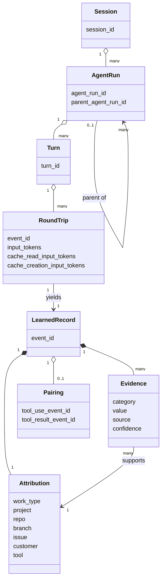
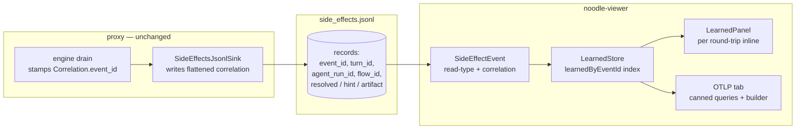
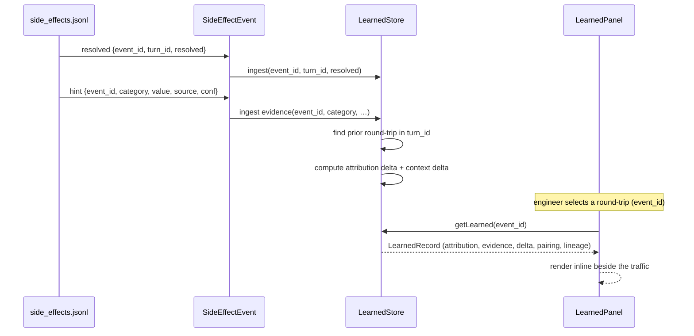
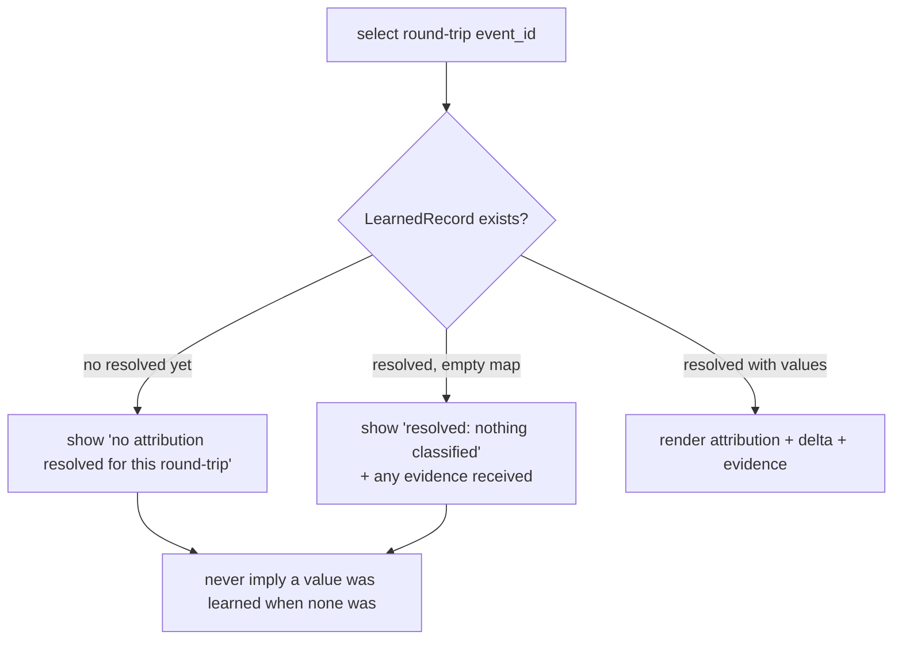

# ADR 051 — The viewer "LEARNED" reveal and debugger information architecture

## Purpose

The noodle viewer is a **debugger for AI traffic**: it exists so an engineer can
watch every round-trip between an agent and a model, see what noodle extracted
from it, and reason about context, cost, and usage patterns. This document
defines the **LEARNED** surface — the per-round-trip view of the knowledge
noodle derived from a round-trip's bytes — and the information architecture that
places each debugging signal on the tab that serves it.

## The problem (in domain terms)

A round-trip carries two things: the **traffic** (request and response bytes)
and the **knowledge** noodle derived from it (the resolved attribution, the
evidence that produced it, the lineage, the tool pairing, the context-size
delta). The traffic is visible per round-trip. The knowledge is not: it is
collapsed to a per-**session** summary that answers "what did this whole session
resolve to" and discards "what did *this* round-trip teach us, and how did it
change from the last." A debugger needs the second question. The session
summary answers an analytics question and belongs where analytics live.

The knowledge is not missing — it is computed per round-trip and written to the
feed keyed by the round-trip's identity. It is only the viewer's read model and
presentation that flatten it to session grain.

## Glossary (ubiquitous language)

| Term | Definition |
|---|---|
| **Round-trip** | One request paired with its response, identified by `event_id` (the proxy-minted `nl-N` request id). The atomic unit of the debugger. |
| **Turn** | A maximal run of round-trips the model treats as one continued exchange, identified by `turn_id`. A turn ends on a terminal `stop_reason`; `tool_use` and `pause_turn` continue it. |
| **Agent run** | One agent persona within a session, identified by `agent_run_id`. A parent agent and a spawned sub-agent share one wire `session_id` but are distinct agent runs. |
| **Flow** | The engine's processing of one round-trip's response stream, identified by `flow_id`. Side-effects are emitted within a flow. |
| **Attribution** | The resolved classification of a round-trip: `work_type`, `project`, `repo`, `branch`, `issue`, `customer`, `tool`. One resolved value set per round-trip. |
| **Evidence** | The `Hint` and `Artifact` side-effects that produced an attribution value, each carrying a source (`marker`, `user_agent`) and confidence. |
| **Lineage** | A round-trip's parent agent run — `parent_session_id` / `parent_turn_id` / `parent_agent_run_id` / `parent_tool_use_id` — populated for sub-agent round-trips. |
| **Pairing** | The cross-round-trip link between a `tool_use` (emitted on one response) and the `tool_result` that answers it (arriving on a later request). |
| **Context delta** | The change in token counts (`input_tokens`, `cache_read_input_tokens`, `cache_creation_input_tokens`) from the previous round-trip in the same turn — the context growth/shrink signal. |
| **LEARNED record** | The assembled per-round-trip knowledge: attribution + evidence + lineage + pairing + context delta, keyed by `event_id`. |

## Domain model



## Invariants

1. **A LEARNED record is keyed by exactly one `event_id`.** It is the knowledge
   of one round-trip, never an aggregate.
2. **Request and response of one round-trip share an `event_id`.** The resolved
   attribution is computed on the response flow but stamped with the request's
   `event_id`, so it keys back to the same round-trip the traffic shows.
3. **Every attribution value traces to at least one piece of evidence.** A
   resolved `work_type=research` exists because a `marker` hint or artifact
   carried it; a value with no evidence is a defect, not a display state.
4. **A context delta is defined only within a turn.** The "previous round-trip"
   is the prior round-trip sharing the same `turn_id`; the first round-trip of a
   turn has no delta.
5. **Aggregates are derived, never primary.** "This session was 60% research" is
   a query over per-round-trip LEARNED records, computed in the analytics
   surface — never stored as a first-class debugger row.

## Solution

### Component diagram



| Component | Responsibility (one phrase) |
|---|---|
| `SideEffectEvent` read-type | Deserialize the correlation ids already on each feed record |
| `LearnedStore` index | Assemble per-`event_id` LEARNED records and per-turn deltas |
| `LearnedPanel` | Render one round-trip's LEARNED knowledge inline with its traffic |
| OTLP tab | Run session/turn aggregate queries over the rollup table |

### Problem → solution mapping

| Problem concept | Owned by | Representation |
|---|---|---|
| Round-trip knowledge | `LearnedStore` | `LearnedRecord` keyed by `event_id` |
| Attribution + evidence | `LearnedPanel` | resolved chips + evidence rows |
| Lineage (parent/child) | OODA tree + `LearnedPanel` | `parent_*` ids rendered as a lineage line |
| Pairing (tool_use ↔ tool_result) | `LearnedPanel` | back/forward `event_id` links |
| Context growth/shrink | `LearnedStore` | per-turn token delta |
| Session/turn aggregates | OTLP tab | query results, not debugger rows |

### Interfaces and data at rest

**No backend change.** `side_effects.jsonl` already carries the round-trip
identity on every record: `noodle-sinks` flattens a `correlation` block
(`event_id`, `turn_id`, `session_id`, `agent_run_id`) onto each `Hint` /
`Artifact` / `Audit` / `Resolved` line, and the proxy stamps
`Correlation.event_id = request_id` on both the request drain and the response
flow. The feed is sufficient as-is.

**Viewer read-type — the one contract surface.** The viewer's `SideEffectEvent`
declares the correlation fields present on every feed record, so deserialization
retains them:

```
SideEffectEvent::Resolved  { event_id, turn_id, agent_run_id, session_prefix, flow_id, resolved, at_unix_ms }
SideEffectEvent::Hint      { event_id, turn_id, agent_run_id, category, value, source, confidence }
SideEffectEvent::Artifact  { event_id, turn_id, agent_run_id, name, value, source_transform, flow_id }
```

All correlation fields are optional (`#[serde(default)]` / `?`) so records
produced outside an inspectable flow (e.g. cert-mint audits) still parse. The
TypeScript `SideEffectEvent` mirrors the same optional fields.

**LEARNED record (viewer-derived, in memory):**

```
LearnedRecord {
  event_id
  turn_id, agent_run_id, parent_agent_run_id
  attribution: { category -> { value, source, confidence } }
  delta:       { category -> previous_value }   // vs prior round-trip in turn
  context:     { input_tokens, cache_read, cache_creation, delta_vs_prev }
  pairing:     { closes_tool_use_in_event_id?, resolved_by_event_id? }
}
```

### Tradeoffs considered

- **Per-round-trip keying rather than per-session grouping** because the
  debugger's question is "what did this call teach us, and how did it change,"
  which a session headline cannot answer. Session grouping is retained only as a
  derived query in the analytics surface.
- **Viewer read-type addition rather than a backend feed change** because the
  feed already carries the correlation ids; widening the producer would be
  redundant work and a needless compatibility risk.
- **Evidence shown inline rather than behind a drill-down** because "why did it
  conclude X" is the debugging act itself, not an advanced detail.

## Key flows

### Assembling and revealing a round-trip's LEARNED record



### Failure flow — a round-trip with no resolved record



The empty and missing states are distinct and both explicit: a round-trip that
resolved nothing is not the same as one whose resolution has not arrived, and
neither is rendered as a silent blank.

## Critical algorithm — per-turn LEARNED assembly

**Contract.** Given the stream of side-effect records (each carrying `event_id`,
`turn_id`, and a payload), produce for each `event_id` a `LearnedRecord` whose
`delta` compares its attribution and context tokens against the immediately
prior round-trip in the same `turn_id`. Preserves invariants 1, 3, 4.

**Pseudocode.**

```
on side_effect(rec):
    lr = learned[rec.event_id] ||= LearnedRecord(event_id=rec.event_id,
                                                 turn_id=rec.turn_id,
                                                 agent_run_id=rec.agent_run_id)
    match rec.kind:
        resolved: lr.attribution = merge(lr.attribution, rec.resolved)   # value per category
        hint | artifact: lr.evidence.push({category, value, source, confidence})
    # maintain per-turn order
    order = turnOrder[rec.turn_id] ||= []
    if rec.event_id not in order: order.push(rec.event_id)

getLearned(event_id):
    lr = learned[event_id]; if !lr: return MISSING
    order = turnOrder[lr.turn_id]
    prev  = element before event_id in order        # None for first in turn
    if prev:
        lr.delta   = diff(learned[prev].attribution, lr.attribution)   # changed categories
        lr.context.delta_vs_prev = tokens(lr) - tokens(learned[prev])
    return lr
```

**Complexity.** O(1) amortized per record (hash insert + append). `getLearned`
is O(k) where k = round-trips in the turn to find the predecessor (k is small —
tens, not thousands). Space O(R) over R round-trips held in the live session.

**Edge cases.**
- *First round-trip of a turn:* no predecessor → `delta` empty, not zero-valued.
- *Resolved arrives before hints (or vice versa):* the record is built
  incrementally; order of side-effects within a flow does not change the result.
- *Same category resolved twice in one round-trip:* last value wins (matches the
  engine's own resolution semantics); evidence retains both.
- *Out-of-order turns across reconnect:* `turnOrder` is arrival-ordered; a
  late-arriving earlier round-trip appends after its successors. Predecessor
  lookup uses arrival order, accepting that a reconnect backfill can momentarily
  mis-order a delta until the turn is fully received. Acceptable for a live
  debugger; the OTLP tab is the authority for settled history.

## Information architecture — which tab serves which signal

| Debugger signal | Tab | Surface |
|---|---|---|
| Round-trips ↔ turn ↔ parent/child | **OODA** | lineage tree (existing) |
| Context for a `tool_use` + its round-trips | **HTTP / OODA** | LEARNED pairing links |
| Context growth / shrink | **HTTP / OODA** | LEARNED context delta |
| What the LLM says about context + how it changes | **HTTP / OODA** | LEARNED attribution + delta |
| Repeated work (tool frequency / dedup) | **OTLP** | aggregate query |
| Session / turn rollups, cost | **OTLP** | canned queries + query builder |

The **HTTP** and **OODA** tabs are the debugger: per-round-trip traffic and its
LEARNED record. The **OTLP** tab is the analytics surface: aggregates and
queries over the rollup table. The session-grouped attribution panel is retired
— its per-round-trip content moves inline to LEARNED, and its aggregate intent
moves to OTLP.

## Security considerations

- **Exposure:** the LEARNED surface renders data already present on
  `side_effects.jsonl` (attribution, evidence, lineage). It adds no new data
  source and no new egress; it is a re-keying and re-rendering of an existing
  local feed served to localhost.
- **Access:** the viewer binds loopback (`127.0.0.1:9092`) and reads local
  files; no authentication boundary changes.
- **Leakage:** attribution values can echo prompt-derived strings (e.g. a branch
  or issue id). They are already on the feed and on `tap.jsonl`; LEARNED does not
  widen what is stored, only what is shown in the debugger pane. No secret is
  introduced into the view that the wire log does not already hold.

## What this does not change

- The proxy, the engine drain, and `noodle-sinks` serialization are untouched —
  the correlation ids are already emitted.
- The embellish rollup grain stays per round-trip (one row per request/response
  pair). A per-turn rollup grain is a separate decision (gap-review R5) and is
  not required for LEARNED, which derives turn deltas in the viewer.
- The OTLP/rollup query surface (canned queries + query builder) is named here
  as the home for aggregates; its construction is its own slice.
