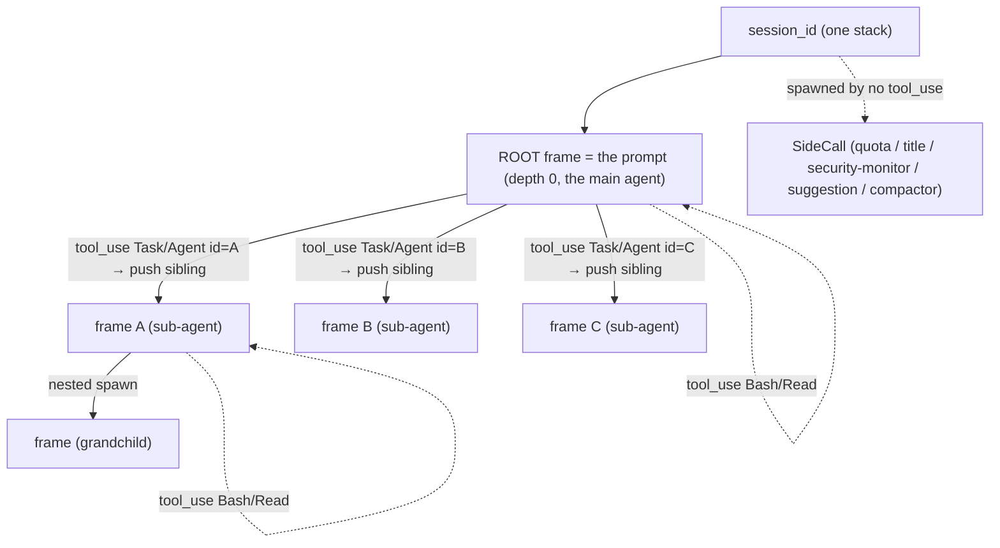

# ADR 052 — Turn, agent run, and lineage: the per-session `tool_use` frame tree

**Status:** Proposed — architecture/design requirements. This is the single,
canonical, **self-contained** ADR 052.

**Supersedes the identity + turn model of:** ADR 028 §1.1–§4 and ADR 049
§5–§6.
**Grounded on** five mitmproxy captures read with `mitmdump 12.2.3`:
`captures/max/parent-bash-loop.mitm`, `parent-task-subagent.mitm` (sequential,
one sub-agent), `parent-parallel-subagents.mitm` (three concurrent sub-agents,
re-recorded 2026-06-13 on `claude-opus-4-8`), `quota-and-title.mitm`, and
`long-session-compaction.mitm`. Every requirement traces to an observed wire
fact, reproduced by the standalone replay tools in `tools/` (§9); nothing is
inferred from prompt content. The algorithm's verified scope and its **unproven
branches** are stated plainly in §9 — do not read past it.

---

## 1. Why this exists

Turn and parent/child tracking is the foundation of noodle: token rollup
**by turn** and attribution land on the wrong unit unless we can say, with
certainty, "these round-trips are one turn" and "this run is the child of
that run." The captures show two facts the shipped model gets wrong:

- **The shipped turn boundary is per agent run.** It mints a new `turn_id`
  whenever an agent run returns a terminal `stop_reason`. So a sub-agent's
  `end_turn` (an inner *return*) starts a spurious new turn.
- **The shipped run identity is the prompt content.** Three parallel
  sub-agents of the same type are byte-identical in everything but their spawn
  prompt, so content keying **merges three runs into one.**

The wire is a **stack** scoped to one session, and — because Claude Code
dispatches sub-agents in parallel — that stack is really a **tree** of
agent-run frames, each frame identified by the `tool_use.id` that spawned it,
routed by the spawn prompt.

---

## 2. Current design — reviewed

| Element | Shipped (ADR 028/049) | Verdict |
|---|---|---|
| Identity of an agent run | the request's prompt content | **wrong** — collides for parallel same-type agents |
| `turn_id` minting | per agent-run slot, on that run's terminal `stop_reason` | **wrong** — an inner sub-agent return mints a false turn |
| Lineage | `pending_children` + spawn-prompt fingerprint | **keep the fingerprint**, drop the slot map |
| Stamping | proxy edge, one wire pass, onto `tap.jsonl` marks | **keep** — proxy is the single source of truth |
| Marks fields | `session_id, turn_id, agent_run_id, parent_{session,turn,agent_run,tool_use}_id` | **reshape** (see §5) |
| Viewer | re-derives the tree client-side (`ooda.ts`) in parallel with the proxy marks | **wrong** — two sources; viewer must render, not derive |

What survives: the proxy-edge single-pass stamping, the spawn-prompt
fingerprint, and the `tool_result` pairing already decoded on the response.
What changes: the **identity** (→ `tool_use.id`), the **turn boundary** (→ the
top-level terminal), the **shape** (slot map → frame tree), and the **viewer**
(derive → render).

---

## 3. The model (validated on the wire)



- **Session** (`x-claude-code-session-id`) is the stack's container.
- **Frame** = one agent run. Its identity is the spawning **`tool_use.id`**
  (`ROOT` for the prompt). A frame is never identified by prompt content.
- **Push** = a response emits `tool_use(name ∈ {Task, Agent})`. **N such blocks
  in one response open N sibling frames** under the emitter — not an N-deep
  chain (the parallel capture proves siblings, not nesting).
- **Route** = a sub-agent's round-trip is assigned to its frame by matching its
  first-request text blocks to a pending spawn's `tool_use.input.prompt`. This
  is the **only** signal that separates parallel same-type siblings
  (`parent-parallel-subagents`: three `Explore` agents, separable only by
  `crates/` vs `docs/adrs/` vs `tools/`).
- **Pop** = the emitter's `tool_result` for the spawning `tool_use.id`. Tool
  recursion (`Bash`/`Read`) pushes and pops within its own caller and never
  changes the frame.
- **Turn** = one user prompt and the model's complete response: the whole
  recursion from a depth-0 genuine-user round-trip until the **depth-0
  (top-level) terminal `stop_reason`**. Inner agents' `end_turn`s are returns,
  not turn ends. (`parent-task-subagent`: RT1→RT8 is one turn;
  `parent-parallel-subagents`: RT3→RT15 is one turn.)
- **Side-call** = a round-trip that is neither a tree round-trip (CHAIN/SPAWN)
  nor a genuine main-thread round-trip. Off-tree; not an agent run; not part of
  any turn. Two kinds, both observed: **preamble** (quota, title-gen — appear
  before ROOT, do not extend the main thread) and **postamble** (security
  monitor, suggestion-mode — may even *extend* the main thread; see §6/§9-G3).

---

## 4. Functional requirements

**FR1 — Frame identity.** Stamp every `/v1/messages` round-trip with the
`tool_use.id` of the frame it belongs to (`ROOT` for the main agent), and the
parent frame's id. Identity is the `tool_use.id` only.

**FR2 — Parallel siblings.** N agent spawns in one response produce N sibling
frames under the emitter. Their round-trips, however interleaved on the wire,
are each routed to the correct sibling by spawn-prompt fingerprint.

**FR3 — Turn = top-level span.** A turn opens at a depth-0 round-trip that
carries genuine new user input and closes at the next depth-0 terminal
`stop_reason`. Every round-trip in the recursion between — including all nested
sub-agents — carries that one `turn_id`. Inner returns never close or open a
turn. **A session has N turns for N user prompts** (the draft's one-shot ROOT
seed was wrong; see §6).

**FR4 — Side-call classification.** A round-trip that is neither a tree
round-trip nor a genuine main-thread round-trip is a side-call: role
`side_call`, no `turn_id`, no place in the tree. (quota, title-gen,
security-monitor, suggestion-mode, compactor.)

**FR5 — Token rollup by turn and by frame.** Per-round-trip token usage must
roll up two ways: `GROUP BY turn_id` (the user-facing cost of one turn, summing
every sub-agent inside it) and `GROUP BY frame_id` (cost per agent run).
Side-calls roll up separately and never inflate a turn.

**FR6 — Single source of truth.** The proxy computes the tree on the wire and
stamps authoritative marks. Downstream (sqlite, OTLP, viewer) **renders** those
marks; no consumer re-derives turn/run/lineage.

---

## 5. Data contract — marks per round-trip

```
marks {
  session_id        : string         # the stack container
  role              : main | sub_agent | side_call
  frame_id          : string         # the spawning tool_use.id; "ROOT" for main; own id for side_call
  parent_frame_id   : string?        # the frame that spawned this one; null for ROOT and side_call
  depth             : int            # 0 = main; 1+ = sub-agent nesting
  turn_id           : string?        # the top-level turn this RT belongs to; null for side_call
}
```

- `agent_run_id` is **replaced by** `frame_id` (= the `tool_use.id`).
- The four `parent_*` fields collapse to `parent_frame_id` (the parent is a
  frame in the same session; cross-session parents are out of scope — none
  observed).
- `turn_id` is stable across the **entire** recursion of one turn, not per
  agent run.
- Token usage already stamped per round-trip (`usage.tokens.*`) is the rollup
  input for FR5; no change to its shape.

---

## 6. Reconstruction algorithm (proxy-side, on the wire, in order)

The tree is the **connected component formed by the `tool_use` → `tool_result`
chain.** Per session maintain: `frames` (id → {parent, depth}), `pending_tu`
(every unanswered `tool_use.id` → the frame that emitted it), `pending_spawn`
(each unopened `Task/Agent` spawn → `{prompt_fingerprint, parent_frame}`),
`root_sig` (the structural signature of the ROOT thread's last request; `None`
until seeded), and the open turn (`in_turn`, `turn`).

This is the **corrected** algorithm. The draft seeded ROOT exactly once (a
one-shot guard) and opened a turn on *any* ROOT round-trip — which makes the
2nd user turn in a session impossible (it is misclassified as a side-call), and
cannot reject a side-call that clones and extends the main thread (suggestion
mode). The correction is three ordered classifiers plus three predicates.

### Classifiers (applied in order)

| order | classifier | wire basis |
|---|---|---|
| 1. CHAIN | request answers a pending `tool_use` → the emitting frame | every mid-frame RT carries the `tool_result`; verified RT3–RT6, RT8 (task), RT2–4 (bash), RT7/8/11/13, RT15 (parallel) |
| 2. SPAWN | first RT of a sub-agent matches a pending `Task/Agent` prompt; consumed on match | three parallel Explore agents separable only by `crates/docs/tools` prompt |
| 3. ROOT | chain-less, spawn-less RT that is **not a harness wrapper** and either **seeds** ROOT (first turn) or **re-enters** ROOT via thread extension (turn 2..N) | RT1/RT3 seed; RT15 would re-enter but is held by CHAIN; quota/title/monitor/suggestion are wrappers |
| else | SIDE-CALL | connected to nothing the above accepts; does not touch `root_sig` |

### Predicates

- **`extends_root(rt)`** — *structural, no system content.* The ROOT thread is
  the one conversation that grows monotonically: each ROOT request contains the
  previous ROOT request's `messages` as a prefix. `root_sig` is a hash-chain
  over the ROOT request's message identities (role + content hash; for tool
  blocks, the `tool_use`/`tool_result` id). True iff `root_sig` is a prefix of
  `rt`'s message signature. Positively selects the main thread; rejects
  standalone side-calls (quota `nmsgs=1`, title `nmsgs=1`, monitor `nmsgs=2` —
  none extend the thread).
- **`is_harness_wrapper(rt)`** — *the irreducible content dependency.* The
  trailing user message text matches a known harness template. Verified
  catalog: `mt==1` (quota), leading `<session>` (title-gen), leading
  `<transcript>` (security-monitor), leading `[SUGGESTION MODE` (suggestion).
  Required because the suggestion-mode call is otherwise a byte-identical,
  thread-extending clone of a real turn (§9-G3). This single predicate does
  **double duty**: the preamble exclusion the draft did inline
  (`max_tokens!=1`, `<session>`) *and* the new postamble cases.
- **`genuine_user_text(rt)`** — true if any trailing-user text block is
  non-empty and not a wrapper prefix. Scans **all** trailing-user text blocks
  because a real prompt is often preceded by a `<system-reminder>` block (RT3
  proves this).

### The loop

```text
# state: frames, pending_tu, pending_spawn, root_sig=None, in_turn=False, turn=0
on round_trip rt (in wire order):
  frame = None

  # 1. CHAIN FIRST — answers a pending tree tool_use → the emitting frame.
  #    (a Bash result → same frame; a sub-agent's tool_result → the parent
  #    frame resumes / pops the child)
  answered = [tu for tu in rt.request.tool_result_ids if tu in pending_tu]
  if answered: frame = pending_tu[answered[0]]

  # 2. OPEN a new sub-agent — fingerprint applies only here and is CONSUMED on
  #    match. A child's first request carries its spawn prompt and no
  #    tool_result. Consuming the spawn means a later side-call that merely
  #    QUOTES the prompt cannot claim the already-open frame.
  if frame is None:
      for P in pending_spawn where P.fingerprint in rt.request.user_text:
          frame = open Frame(id=P.tool_use_id, parent=P.parent_frame,
                             depth=P.parent.depth + 1)
          pending_spawn.remove(P); break

  # 3. ROOT — seed OR re-enter. One-shot guard removed (the G1 fix).
  if frame is None and not is_harness_wrapper(rt):
      if root_sig is None and genuine_user_text(rt):
          frame = open Frame(id=ROOT, parent=None, depth=0)   # first turn
      elif root_sig is not None and extends_root(rt):
          frame = ROOT                                        # turn 2..N

  # 4. SIDE-CALL — connected to nothing in the tree; do NOT touch root_sig
  if frame is None:
      emit rt as side_call (role=side_call, no turn_id); continue

  # 5. ROOT bookkeeping — keep the thread current; open a turn ONLY on genuine
  #    new user input (not on any ROOT round-trip)
  if frame is ROOT:
      root_sig = signature(rt.request.messages)
      if not in_turn and genuine_user_text(rt): turn = new Turn(); in_turn = true
  rt.turn = turn

  # 6. PUSH — register this response's tool_uses; Task/Agent also register a
  #    spawn fingerprint under this frame
  for tu in rt.response.tool_uses: pending_tu[tu.id] = frame
  for tu in rt.response.tool_uses where tu.name in {Task, Agent}:
      pending_spawn.add({tu.id, hash(tu.input.prompt), frame})
  for tu in answered: pending_tu.remove(tu)

  # 7. CLOSE — only a depth-0 terminal with no open children closes the turn
  if frame is ROOT and rt.response.stop_reason is terminal
     and no pending_tu under the tree:
      turn.close(); in_turn = false

  stamp marks(rt): session_id, role, frame_id=frame.id,
                   parent_frame_id=frame.parent, depth=frame.depth, turn_id=rt.turn
```

### Delta from the draft §6 (only steps 3 and 5 change)

Steps 1, 2, 4, 6, 7 are unchanged from the draft. The correction is:

- **Step 3:** drop the one-shot `ROOT not opened` guard; replace the two inline
  preamble checks with `is_harness_wrapper`; add the `extends_root` **re-entry**
  branch (turn 2..N).
- **Step 5:** persist `root_sig` on every ROOT round-trip; open a turn only when
  `genuine_user_text(rt)` (not on any ROOT round-trip).

One sentence: *the draft opens ROOT once and starts a turn on any ROOT
round-trip; the corrected loop lets ROOT persist and re-enter by structural
thread-extension, opens a turn only on genuine new user text, and rejects
thread-extending side-calls via the wrapper catalog.*

### Notes

- **Consume-on-match — not the ordering — is the safeguard.** A sub-agent's
  *first* request is the only one with no `tool_result` to chain, so it is the
  sole place the fingerprint must open a frame (step 2); the spawn is consumed
  there. Because the spawn is spent on open, a later side-call that merely
  *quotes* the prompt (security monitor RT10) finds no pending spawn to match —
  regardless of whether CHAIN or SPAWN is checked first. **Verified on the
  wire:** running the loop CHAIN-first vs SPAWN-first (both with consume-on-match)
  over `parent-task-subagent` and `parent-parallel-subagents` yields **0
  differing round-trips** (`tools/order_compare.py`). So the corpus does **not**
  demonstrate that the precedence is load-bearing — consume-on-match does. The
  order would only matter for a round-trip that simultaneously answers a pending
  `tool_use` *and* carries an **unconsumed** spawn fingerprint in its user text;
  no such round-trip exists in the corpus (the lone quoter, RT10, arrives after
  its spawn is consumed). So "the order is load-bearing" is unsupported by the
  captures; chain-first is retained as a safe convention, not a proven necessity.
- **`extends_root` is only consulted for the turn-2 chain-less first RT.** A
  ROOT *resume* mid-turn (a `tool_result`) is held by CHAIN (step 1) before the
  ROOT branch runs. On the current corpus, every ROOT landing is a seed or a
  CHAIN, so the re-entry branch never fires — see §9.
- **Complexity:** O(1) per round-trip plus the fingerprint check and the
  `root_sig` prefix compare (O(messages) worst case, amortizable via a rolling
  hash), bounded by concurrently-unopened spawns.

---

## 7. Invariants (the guarantees these requirements must hold)

1. **One turn = one user prompt's full recursion**, bounded by the depth-0
   terminal. A round-trip is never a turn; an inner `end_turn` is a return.
2. **Exactly one depth-0 ROOT (main agent) per session**, persistent across all
   its turns. Everything that is neither a tree round-trip nor a genuine
   main-thread round-trip is a side-call, never main.
3. **Frame identity is the `tool_use.id`.** N parallel same-type sub-agents are
   N frames.
4. **A frame's parent is the frame holding the spawning `tool_use`**, matched by
   spawn-prompt fingerprint — never inferred from ordering, depth, or content
   similarity.
5. **`Σ tokens GROUP BY turn_id`** equals the cost of that user turn, including
   every nested sub-agent; side-calls are excluded.
6. **The proxy marks are authoritative.** A consumer that disagrees with the
   marks is a rendering bug, not a derivation choice.

Each invariant is a test that fails when violated (§9).

---

## 8. Out of scope / not yet observed

- **Preamble + postamble side-call catalog.** ROOT classification excludes
  harness calls by `is_harness_wrapper`: quota (`mt==1`), title-gen
  (`<session>`), security-monitor (`<transcript>`), suggestion
  (`[SUGGESTION MODE`). This catalog is the **one irreducible content
  dependency** (a postamble call can be a byte-identical, thread-extending clone
  of a real turn — §9-G3). New wrapper types are added here as captured.
- **Compactor side-call — not positively classified.** The compactor appears
  only in `long-session-compaction.mitm` (RT3: `mt=None`, non-streaming,
  `'# Documentation…'`). It is currently marked `side_call` **by fallback**
  (it matches no chain/spawn and ROOT is already seeded), **not** by any
  positive signal. FR4 must not be claimed for the compactor until a positive
  signal lands (candidate: `mt==None` + non-streaming). FR4 is validated for
  quota/title/monitor/suggestion only.
- **Multi-turn sessions.** The corpus contains **no** session with a 2nd
  genuine user turn (§9). The ROOT re-entry branch (step 3) is therefore
  **unvalidated on the wire**; a `parent-multiturn.mitm` capture is the
  precondition for proving FR3/FR5 across turns.
- **Per-session partitioning — unimplemented in the oracle.** The model is
  per-session (§3/§6), but `tools/validate_frame_tree.py` keeps one global
  state and never reads `x-claude-code-session-id`. `long-session-compaction.mitm`
  spans **two** session ids (`790d7283` for the quota RT1, `d8df40a6` for
  RT2/RT3); the three validated captures are each single-session, so the
  cross-session bug — a later session's ROOT stolen by the persistent ROOT
  state, or `pending_tu`/`pending_spawn` matching across sessions — is **latent
  and untested**. The shipped detector must key all state by `session_id`.
- **Cross-session parents.** Every spawn observed shares the parent's
  `session_id`; `parent_frame_id` stays in-session until a cross-session spawn
  is captured.
- **Identical concurrent prompts.** Two parallel spawns with byte-identical
  prompts are indistinguishable by fingerprint; resolve oldest-pending-first and
  flag — not observed in the corpus.
- **Multi-replica state.** The tree state is per-process; a sharded proxy needs
  shared state so a child's first request can find its parent's pending spawn
  (ADR 049 §9.3).

---

## 9. Verification — honest scope

Validated by standalone replay over the corpus with `mitmdump`:
`tools/validate_frame_tree.py` (the loop), `tools/analyze_052.py` (the loop with
per-RT classifier provenance + predicate toggles), `tools/order_compare.py`
(chain-first vs spawn-first), cross-checked with `tools/dump_struct.py` /
`tools/clone_check.py`. **Read both columns.**

| Asserts | Fixture | Result |
|---|---|---|
| `Bash` loop = one ROOT frame, one turn (RT1–RT4) | `parent-bash-loop` | ✅ reproduced |
| RT1→RT8 one turn; sub-agent `toolu_012Y…` under ROOT; RT6 `end_turn` is a return; **RT7 monitor = side_call**; turn closes at RT8 | `parent-task-subagent` | ✅ reproduced |
| RT1/RT2 preamble side-calls; **RT3 opens three sibling frames** (`toolu_01Bg/01PV/014J`) routed by `docs/tools/crates` prompt; **all monitor RTs (RT9/10/12/14) = side_call**; **RT16 suggestion = side_call**; **RT3→RT15 one turn** | `parent-parallel-subagents` | ✅ reproduced |
| `is_harness_wrapper` catalog for quota/title/monitor/suggestion present and excluded | `parent-parallel-subagents` (quota RT1, title RT2, monitor RT9/10/12/14, suggestion RT16) + monitor RT7 (task) | ✅ reproduced |
| `turn_id` stable across the whole recursion; not minted per agent run | both sub-agent captures | ✅ reproduced (within turn 1) |
| **G3** — suggestion postamble (`[SUGGESTION MODE`) is a thread-extending clone of a real turn; only the wrapper branch keeps it off-turn | `parent-parallel-subagents` RT15/RT16 | ✅ verified (see below) |
| **Consume-on-match** defeats the prompt-quoting monitor (RT10 quotes the `crates/` spawn) | `parent-parallel-subagents` | ✅ verified — load-bearing (chain-first is **not**, see §6 note) |
| **G1** — ROOT re-entry across turns (`extends_root` + turn-N opening) | — | ❌ **0 captures; the re-entry branch fires 0×** |
| FR3/FR5 **across turns** (≥2 user turns in one session) | — | ❌ **unexercised; no multi-turn capture** |
| **FR4 compactor** — positive side-call signal | `long-session-compaction` | ❌ caught by **fallback only** (`mt=None`, non-streaming); no positive signal; this capture is otherwise excluded from the set above |
| **Per-session partitioning** (model is per-session, §3/§6) | `long-session-compaction` (2 session ids `790d7283`/`d8df40a6`) | ❌ oracle keeps one global state, never reads `x-claude-code-session-id`; cross-session bug **latent, untested** |
| `quota-and-title.mitm` is a useful fixture | `quota-and-title` | ❌ **misnamed** — its lone `/v1/messages` flow is `mt=64000`, `<system-reminder>` body, neither quota nor title; the real quota (`mt=1`) and title (`<session>`) probes live in `parent-parallel-subagents` RT1/RT2 |
| Viewer renders the marks verbatim (no client re-derivation) | viewer integration | pending build |

**G3 (verified).** `parent-parallel-subagents` RT15 (genuine ROOT) and RT16
(suggestion side-call) are byte-identical once the per-request
`x-anthropic-billing-header` line is stripped (`sys_sha=c9230c0d42f2` for
RT3==RT15==RT16): same system prompt, 10 tools, model, `max_tokens`, metadata —
**and RT16 extends the thread** (`ext=True`). Neither system content nor
thread-continuity separates it from a real turn; only the trailing-text wrapper
does. Toggling off **only** the suggestion branch flips RT16 to a false
`turn=1 main` via `ROOT-reenter` — so the branch is load-bearing.

**Scope of what the corpus proves, stated plainly:**

- ✅ The **single-turn, single-session** algorithm — CHAIN + SPAWN
  reconstruction, parent/depth links, the quota/title/monitor/suggestion wrapper
  catalog, the RT15/RT16 clone, the G3 postamble exclusion, and the
  consume-on-match prompt-quoter defense — is reproduced RT-for-RT on the three
  sub-agent captures (+ the quota fixture).
- ❌ The **G1 multi-turn correction** (`extends_root`, ROOT re-entry, turn-N
  opening) is **not** validated on the wire: it fires **0 times**. On a
  *constructed* two-turn sequence (`tools/probe_second_turn.py`) the draft's
  one-shot guard demonstrably drops turn-2 to a side-call and the corrected loop
  fixes it — but a constructed sequence is not the product. The turn-2 path is
  **correct by construction, unproven by capture.**
- ❌ **Per-session scoping** (cross-session partitioning) and the **compactor**
  positive side-call signal are **unexercised** — their only fixture
  (`long-session-compaction`, two session ids) is outside the validated set and
  the oracle has no session partitioning.
- Note: neither `extends_root` nor chain-first precedence is load-bearing for
  any *captured* RT. RT15 (the only re-entry candidate) is held by CHAIN; and
  chain-first vs spawn-first gives 0 differing round-trips given consume-on-match
  (`tools/order_compare.py`). Both are correct-by-design conventions, not
  capture-proven necessities.

The product change (marking-detector rewrite + marks reshape) is gated on this
replay passing. **The honest scope of §9 is: single-turn, single-session, three
captures.** FR3/FR5 (multi-turn), per-session partitioning, and the compactor
FR4 signal must not be marked validated until `parent-multiturn.mitm` and a
multi-session capture (§10) land.

---

## 10. Closing the gaps — sequencing

1. **Record `captures/max/parent-multiturn.mitm`** — `mitmdump -w …` driving
   `claude` through ≥3 user turns in one session: turn 1 (Bash + one sub-agent),
   turn 2 (same session, new prompt, tool use), turn 3 (two parallel
   sub-agents). Let quota / title-gen / security-monitor / **suggestion-mode**
   side-calls interleave — the postamble (G3) must be present.
2. **Golden it as fail-before** — `tools/expected_marks/<capture>.json` per
   round-trip (`role`, `frame_id`, `parent_frame_id`, `depth`, `turn_id`):
   distinct `turn_id` per turn, one `session_id`, ROOT persists, every side-call
   excluded. Red against today's detector; green after the §6 loop lands.
3. **Implement §6 in the proxy marking detector** — emit the §5 marks onto
   `tap.jsonl`; retire per-`stop_reason` turn minting, system-hash slots,
   `pending_children`. **Partition all state by `x-claude-code-session-id`**
   (the oracle's missing piece — §8); add a multi-session capture (or reuse
   `long-session-compaction`, 2 session ids) to its goldens so cross-session
   isolation is asserted, not assumed.
4. **Positive compactor classification** — add a positive side-call signal for
   the compactor (candidate: `mt==None` + non-streaming) so FR4 stops relying on
   the fallback, and golden `long-session-compaction` RT3 against it.
5. **Turn the oracle into an assertion** — `tools/validate_frame_tree.py`
   asserts each RT against its golden and exits non-zero on drift (deterministic,
   no auth). Runnable by any third party:
   ```
   for c in parent-bash-loop parent-task-subagent parent-parallel-subagents parent-multiturn; do
     mitmdump -nq -r captures/max/$c.mitm -s tools/validate_frame_tree.py
   done
   ```
6. **Rust golden-replay gate** — drive the same recorded bytes through the
   shipped `AnthropicMarkingDetector` in-process and assert the same goldens.
   This guards the product, not just the Python oracle. Keep `#[ignore]`
   live-`claude` tests as fidelity checks, never the CI gate.
7. **Re-record or rename `quota-and-title.mitm`** — independent cleanup.

Downstream consumers re-bind to the §5 marks and do not change the design
above: the viewer must **delete** its client-side re-derivation (the corrupted
`ooda.ts` heuristic) and render `frame_id`/`parent_frame_id`/`depth`/`role`
verbatim; `noodle-embellish` adds the FR5 `GROUP BY turn_id` / `GROUP BY
frame_id` rollups (side-calls bucketed apart); the LEARNED panel re-binds its
turn-delta and lineage line to the depth-0 `turn_id` and `parent_frame_id`
(§11). Each is guarded by the same golden marks (§9).

---

## 11. Impact on prior work (ADR 049 / 050 / 051)

### ADR 049 — sub-agent lineage — **superseded (high impact)**

049 *is* the design this replaces; its shipped marking detector implements it.
What dies:

- **Identity by canonical system prompt** → frame = `tool_use.id`.
- **Per-agent-run turn minting** (049 §6.2) → turn = the **depth-0** terminal
  span. A sub-agent's `end_turn` must stop minting a turn.
- **The `pending_children` slot map + pop-on-child-open** (049 §6.3) → a frame
  **tree** routed by **persistent** spawn-prompt match. 049's §9.5 claim that
  concurrent dispatch "attributes correctly" was **never validated against a
  parallel capture and is false** — three same-type sub-agents collapse into one
  prompt-content slot.

What survives and is re-verified: the wire facts (049 §2 — shared session
header, `tool_use(Task|Agent)` spawn, `stop_reason` boundary, the byte-exact
spawn-prompt fingerprint), the proxy-edge single-pass stamping, and the pipeline
plumbing (049 §8) — but with the **reshaped marks** of §5. The marking detector
is a rewrite, not a patch.

### ADR 050 — session-state service — **low impact (not landed)**

050 (draft, PR #135, not on `main`) decouples the marking store into a pluggable
in-memory/Redis service. That abstraction — get/put, CAS, fail-open — is
**independent of the state shape** and survives intact. The only change: the
stored value is the **frame tree + pending spawns + `root_sig`** (§3/§6), not
049's `HashMap<Option<SystemHash>, AgentRunState>`. The cross-replica need is
unchanged (a child's first request must find its parent's pending spawn in
shared state).

### ADR 051 — viewer LEARNED reveal — **medium impact (landed)**

The LEARNED core survives: per-round-trip attribution + evidence keyed by
`event_id` is unaffected. What must change where 051 consumes the marks:

- **Turn definition.** 051's glossary turn ("ends on a terminal `stop_reason`")
  is the per-agent-run reading; it must adopt the **depth-0** turn. Consequence:
  the per-turn context/attribution delta now compares round-trips across the
  *whole recursion* — parent and its sub-agents share one turn. This **improves**
  the token-by-turn rollup (a turn's cost now correctly sums its sub-agents).
- **Agent-run identity** (`agent_run_id`) → `frame_id`; **lineage** (the four
  `parent_*` fields) → `parent_frame_id`.
- **Marks/`SideEffectEvent` correlation fields** reshape to carry `frame_id` and
  the depth-0 `turn_id`.

Net: LEARNED keeps working per round-trip; its turn-grouping, delta, and lineage
line re-bind to the §5 marks. The session-grouped panel and the OODA tree are
re-rendered from the §3 tree, not re-derived.

### Cross-cutting

The marks contract (§5) is the single change that ripples through every prior
surface: `tap.jsonl` → sqlite DDL → OTLP attributes → viewer `DecodedMarks`. 049
§8 and 051 both read it; both re-bind to the new shape in one migration.
