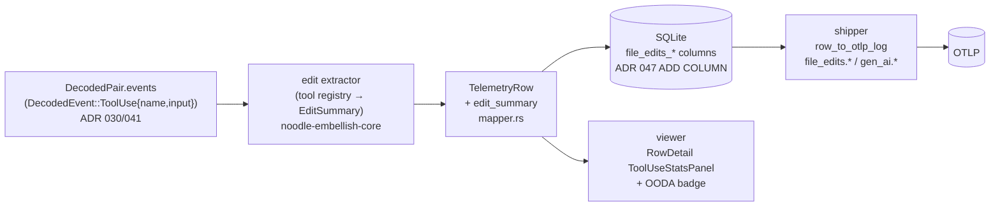

# ADR 055 — File-edit tracking per round trip

**Status:** proposed.
**Related:** ADR 030 (tap.jsonl decoded layer — the `DecodedEvent::ToolUse`
stream this reads), ADR 041 (L5 `tool_use` accumulation — where tool calls
first become structured), ADR 047 (idempotent ADD COLUMN migration pattern
reused here), ADR 023 (round-trip records + correlation IDs — the grain edits
attach to), ADR 046 (telemetry viewer surface), ADR 051 (viewer LEARNED reveal —
the panel family this metric joins).

---

## 1. Problem

### 1.1 The problem in domain terms

An agent's most consequential actions are the files it changes. A round
trip that writes ten files is qualitatively different from one that reads
ten — but today both look the same in the telemetry: a count of
`tool_use` blocks with no notion of *which were edits*, *what they
touched*, or *how many edits landed*. An operator watching the viewer
cannot answer "how much code did this session change, and where" without
reading raw request bodies.

The data is already on the wire and already decoded. An assistant
response that edits a file emits a `tool_use` block whose `input` names
the file and (for `MultiEdit`) enumerates the edits. noodle decodes those
blocks into `DecodedEvent::ToolUse { tool_name, input }` with the input as
parsed JSON (ADR 030/041). What is missing is the small interpretation
step — *this tool name means an edit; this field is the path; this is the
edit count* — and the plumbing to carry the result through the existing
telemetry pipeline to the viewer.

### 1.2 What "edits" are on the Anthropic wire

There is **no top-level `edits` field** in an Anthropic request. Edits
are `tool_use` blocks in the **assistant response**; the agent (Claude
Code, OpenCode, …) defines the editing tools and the model invokes them.
The recognized shapes:

| Tool name | Path field | Edit count | Kind |
|---|---|---|---|
| `Edit` | `file_path` | 1 | modify |
| `Write` | `file_path` | 1 | create/overwrite |
| `MultiEdit` | `file_path` | `edits.len()` (the `edits` array) | modify |
| `NotebookEdit` | `notebook_path` | 1 | modify |
| `str_replace_based_edit_tool` / `text_editor_*` (Anthropic built-in) | `path` | 1 per `command` ∈ {`str_replace`, `create`, `insert`} | modify/create |

`view` / `undo_edit` commands and read-only tools (`Read`, `Grep`, `Bash`,
…) are **not** edits. The `edits` array on `MultiEdit` is the field the
operator intuition ("the edits field") points at — it lives inside one
tool's input, not at the request top level.

### 1.3 Glossary

| Term | Definition |
|---|---|
| **edit** | One mutating file operation requested by the model via a recognized editing `tool_use` block. A `MultiEdit` with N entries is N edits on one file. |
| **edit kind** | `modify` (changes existing content) or `create` (`Write`, `text_editor` `create`). |
| **requested vs applied** | A `tool_use` block is the model *requesting* an edit; the edit executes in the agent, and its success returns as a `tool_result` in the *next* request. noodle observes requests directly; applied/errored status is recoverable later via `tool_use_id` pairing (§4.3). |
| **edit summary** | The per-round-trip rollup: total edits, distinct files, per-file breakdown. The value this ADR adds end to end. |
| **tool registry** | The small `tool_name → (path_field, count_strategy, kind)` table that makes recognition data-driven and agent-extensible. |

### 1.4 Invariants

- **I1 — Attribute to the requesting round trip.** An edit is counted on
  the round trip whose **response** emitted the `tool_use` block
  (`DecodedEvent::ToolUse.request_id`), not the later round trip carrying
  the `tool_result`. This matches how usage and `tool_use` counts already
  attribute.
- **I2 — Off the hot path.** Recognition and counting happen in the
  embellisher, downstream of `tap.jsonl`, never in the proxy request
  path. Traffic is never gated on edit accounting.
- **I3 — Unknown tools are invisible, not errors.** A tool name not in
  the registry contributes zero edits and never fails the row. New agent
  tooling degrades to "no edit signal," never to a parse error.
- **I4 — Honest grain.** What is reported is *edits requested by the
  model on this round trip*. The metric name and docs say so; applied
  counts are a named later rung, not silently conflated.

---

## 2. Solution

### 2.1 Shape

A pure extraction step in the embellisher consumes the already-decoded
tool-use events, produces an `EditSummary`, and rides the existing
`TelemetryRow → SQLite → shipper → OTLP` and `viewer` paths — the same
spine ADR 047's `brain.*` used.



### 2.2 Data model

```rust
/// noodle-embellish-core. One per round trip; None when no editing
/// tool_use blocks were present.
pub struct EditSummary {
    pub total_edits: u32,            // Σ edit operations (MultiEdit counts its array)
    pub files: Vec<FileEdits>,       // distinct files, in first-seen order
    pub tool_use_total: u32,         // all tool_use blocks (edit + non-edit) — a free general metric
}

pub struct FileEdits {
    pub path: String,
    pub edits: u32,
    pub kind: EditKind,              // modify | create (create wins if mixed)
}
```

`files.len()` is the distinct-file count; `total_edits` is the headline
metric. Serialized to `postcard`/JSON for storage; the per-file map
serializes as `{ "path": {"edits": n, "kind": "modify"} }`.

### 2.3 Tool registry (recognition is data, not code)

```rust
struct EditTool { path_field: &'static str, count: CountStrategy, kind: EditKind }
enum CountStrategy { One, ArrayLen(&'static str) /* e.g. "edits" */, TextEditorCommand }
```

A static table maps the §1.2 tool names to `EditTool`. Adding a new
agent's editing tool (OpenCode, a custom harness) is a one-row change,
not new control flow — and unknown names hit I3 (zero, no error). The
registry is the *only* place tool-specific knowledge lives; the codec
(ADR 041) stays provider-generic.

### 2.4 Persistence — new SQLite columns (ADR 047 pattern)

Added via the proven idempotent `ensure_columns()` ADD COLUMN scan
(`crates/noodle-embellish/src/sqlite.rs`), so existing databases migrate
forward on open with no rebuild:

| Column | Type | Meaning |
|---|---|---|
| `file_edits_count` | INTEGER | `total_edits` |
| `file_edits_file_count` | INTEGER | distinct files |
| `file_edits_by_file_json` | TEXT | the per-file map |
| `tool_use_count` | INTEGER | `tool_use_total` (general, useful beyond edits) |

All nullable; a non-Anthropic or non-`/v1/messages` row leaves them
`NULL` (no edit semantics), exactly as the `brain_*` columns do.

### 2.5 OTLP attributes (existing naming conventions)

Following the shipper's three-layer convention
(`crates/noodle-shipper/src/mapping.rs`): a bare namespace for noodle's
own facts plus the `gen_ai.*` semantic-convention alias.

| Attribute | Source | Emitted when |
|---|---|---|
| `file_edits.count` | `file_edits_count` | `> 0` |
| `file_edits.file_count` | `file_edits_file_count` | `> 0` |
| `file_edits.by_file` (JSON string) | `file_edits_by_file_json` | non-empty |
| `gen_ai.tool.edit_count` | `file_edits_count` | `> 0` |
| `gen_ai.tool.invocation_count` | `tool_use_count` | `> 0` |

These are log/span attributes on the existing round-trip record. A true
OTLP **metric** (counter `file_edits_total` by `file`/`kind`) is a later
rung once a metrics exporter exists — today the shipper emits records,
not metrics, and inventing a metrics path here is out of scope.

### 2.6 Viewer surface

- **HTML RowDetail (top-level value expansion).** A `ToolUseStatsPanel`
  sits beside the existing `UsagePanel` in
  `crates/noodle-viewer/web/src/components/RowDetail.tsx`: a headline
  ("**7 edits across 3 files**") that expands to the per-file list with
  edit counts and kind. Fed by a new `edit_summary` field on the decoded
  exchange read-type (`crates/noodle-viewer/src/model.rs` +
  `web/src/types.ts`).
- **OODA/UDA badge.** A compact edits chip on the round-trip row (next to
  the turn/usage chips) so edits are scannable without expanding —
  `0` renders nothing (no badge noise on read-only turns).

---

## 3. Key flow — a MultiEdit round trip

```mermaid
sequenceDiagram
    participant M as Model (response)
    participant T as tap.jsonl
    participant D as decoder (ADR 030/041)
    participant E as edit extractor
    participant R as TelemetryRow / SQLite
    participant V as viewer

    M->>T: response: tool_use(MultiEdit, {file_path:"a.rs", edits:[e1,e2,e3]})
    T->>D: decode response
    D->>E: DecodedEvent::ToolUse{name:"MultiEdit", input}
    Note over E: registry: MultiEdit → ArrayLen("edits") → 3 edits, file a.rs, modify
    E->>R: EditSummary{total_edits:3, files:[{a.rs,3,modify}], tool_use_total:1}
    R->>R: file_edits_count=3, file_edits_file_count=1, by_file_json={...}
    R->>V: row carries edit_summary
    V->>V: badge "3 edits"; RowDetail panel expands a.rs ×3
```

---

## 4. Critical algorithm — edit extraction

**Contract.** Input: a `DecodedPair`'s `events` (the round trip's decoded
`tool_use` blocks). Output: `Option<EditSummary>` — `None` when no
editing tools fired. Pure; no I/O; never errors (I3).

```text
extract(events):
  summary = EditSummary::empty()
  for ev in events where ev is ToolUse:
    summary.tool_use_total += 1
    tool = REGISTRY.get(ev.name)            # absent → not an edit; continue
    if tool is None: continue
    path = ev.input[tool.path_field].as_str()   # absent/non-str → skip (I3)
    if path is None: continue
    n = match tool.count:
          One               => 1
          ArrayLen(field)    => ev.input[field].as_array().len_or(0)
          TextEditorCommand  => 1 if ev.input["command"] in {str_replace,create,insert} else 0
    if n == 0: continue
    summary.upsert(path, n, tool.kind)       # sum per path; kind: create beats modify
    summary.total_edits += n
  return summary.is_empty() ? None : Some(summary)
```

**Complexity.** O(blocks per round trip) over data already parsed; no new
round trips, no allocation beyond the summary. Runs in the embellisher's
existing per-pair pass.

**Edge cases.**

- *Malformed input* (path missing, `edits` not an array): skip that
  block, count nothing — never a parse error on the row (I3).
- *Same file edited by multiple blocks in one round trip*: summed under
  one `FileEdits` entry (upsert by path).
- *Mixed kind on one path* (a `Write` then an `Edit`): record `create`
  (the stronger signal — the file was authored this round trip).
- *Non-Anthropic / non-`/v1/messages` row*: extractor not invoked;
  columns stay `NULL`.
- *Unknown future edit tool*: zero edits, `tool_use_total` still
  increments — the row honestly shows "tools ran, none recognized as
  edits," and the fix is a registry row.

### 4.3 Requested vs applied (named later rung, not v1)

A `tool_use` is a request; the `tool_result` in the next request carries
`is_error`. The existing `tool_use_id → request_id` pairing
(`crates/noodle-proxy/src/pending_tool_uses.rs`) can later back-annotate
each edit as `applied` / `errored`, splitting `file_edits_count` into
requested vs applied. v1 reports **requested** edits (I4) and says so;
the pairing-based applied count is additive and deferred.

---

## 5. Risks and accepted constraints

| Risk | Posture |
|---|---|
| Tool-name drift across agents/versions | Registry is data; unknown names degrade to zero (I3). A drift shows as "tool_use_total > 0, edits 0," a visible, debuggable signal. |
| "Edits" misread as "lines changed" | It is **operations**, not lines: `MultiEdit` of 3 hunks = 3, regardless of line span. Documented in the glossary and the viewer tooltip. |
| Requested ≠ applied | I4: v1 is explicitly *requested*; applied is the §4.3 rung. The metric name carries the qualifier. |
| Path is a client-absolute string | Stored verbatim; no normalization or PII assumptions beyond what the agent already put on the wire. The viewer may basename-shorten for display only. |
| Column growth on the rollup table | Four nullable columns via the same ADD COLUMN scan ADR 047 validated; no rebuild, forward-compatible on old DBs. |

---

## 6. Implementation plan

1. **`EditSummary` + tool registry + extractor** in
   `noodle-embellish-core` (pure, unit-tested against captured
   `MultiEdit`/`Edit`/`Write`/`text_editor` tool_use fixtures from
   `tap.jsonl`). No wiring yet — the function and its tests stand alone.
2. **Mapper integration**: call the extractor in
   `crates/noodle-embellish-core/src/mapper.rs`; add `edit_summary` to
   `TelemetryRow`.
3. **SQLite columns** via `ensure_columns()` (the §2.4 four), idempotent
   on existing DBs; write path populates them.
4. **Shipper**: add the fields to `RollupsRow`
   (`crates/noodle-shipper/src/cursor.rs`) and the §2.5 attribute emits
   in `row_to_otlp_log` (`mapping.rs`).
5. **Viewer**: `edit_summary` on the decoded read-type
   (`noodle-viewer/src/model.rs` + `web/src/types.ts`); `ToolUseStatsPanel`
   in `RowDetail.tsx`; OODA row badge. Delete no existing surface.
6. *(deferred)* applied/errored split via `tool_use_id` pairing (§4.3);
   OTLP counter metric once a metrics exporter exists.

Each step is independently verifiable against real `tap.jsonl` capture —
fail-before/pass-after at the unit layer (1), then a captured edit
session replayed end to end to the viewer (5).
