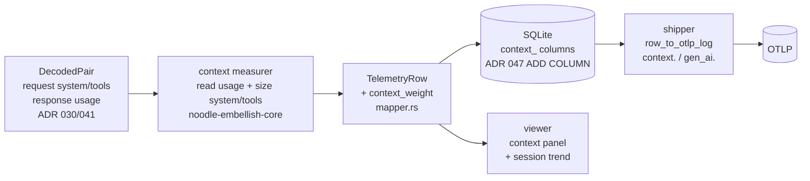
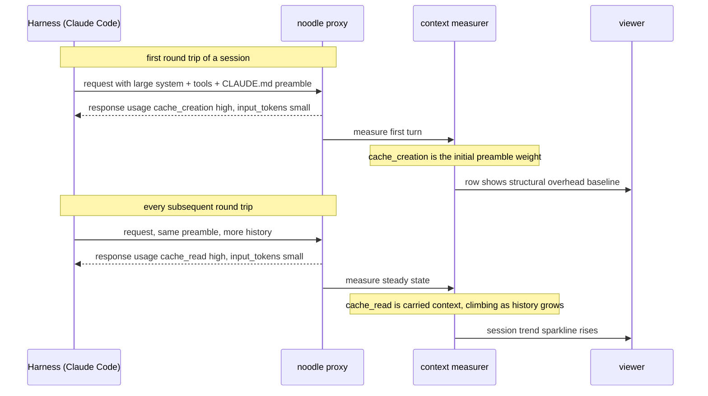

# ADR 056 — Context weight and preamble cost per round trip

**Status:** proposed.
**Related:** ADR 055 (file-edit cost — the sibling metric; shares the
derived-cost philosophy and the `model → price` table), ADR 041 (L5
`usage` accumulation — the token block this reads), ADR 023 (round-trip
record + correlation IDs — the grain), ADR 047 (idempotent ADD COLUMN
migration pattern), ADR 030 (decoded layer — the request/response this
inspects), ADR 046 (fleet viewer — where the session trend lands).

---

## 1. Problem

### 1.1 The problem in domain terms

A coding agent re-presents a large block of **fixed context** on every
round trip: the system prompt, the tool/MCP schemas, and the
project rules (`CLAUDE.md`, `AGENTS.md`, injected `<system-reminder>`
blocks) that the harness stuffs into the first user turn. None of it is
the user's actual prompt — it is overhead carried so the model stays
oriented. With prompt caching it is *cache-read* rather than re-sent,
but it is still billed on every round trip.

That overhead is invisible in today's telemetry. The round-trip record
shows `input_tokens`, but does not separate *the marginal new prompt*
from *the fixed context carried alongside it*. So an operator cannot
answer: "what fraction of my spend is context I could trim?" or "how
fast is my context growing?" — and cannot catch an over-eager
`CLAUDE.md` author or a pile of rarely-used MCP servers before the bill
arrives.

The scale is not hypothetical. In real captured traffic the cached
prefix reaches **244,329 tokens carried per round trip** — a
quarter-million tokens of context billed on every turn. At thousands of
round trips per month, fixed context, not prompting, dominates spend.

The data is already on the wire. The response `usage` block reports the
cached, created, and marginal input token counts; the request carries
the `system` and `tools` fields whose sizes are the *structural*
overhead. What is missing is the decomposition — splitting carried
context from new prompt — and the plumbing to carry it to the viewer and
watch it grow.

### 1.2 What the Anthropic payload exposes (data sources)

| Signal | Payload location | Meaning |
|---|---|---|
| **cached-prefix tokens** | response `usage.cache_read_input_tokens` | fixed context re-presented this round trip (preamble + accumulated history) — billed at the model's reduced cache-read rate |
| **cache-creation tokens** | response `usage.cache_creation_input_tokens` | newly cacheable content written this round trip; on the first turn this is the initial preamble |
| **marginal input tokens** | response `usage.input_tokens` | the uncached input — the actual new prompt/delta, *not* carried context |
| **output tokens** | response `usage.output_tokens` | generation |
| **system size** | request `system` (string or content-block array) | system-prompt bytes — structural overhead |
| **tools size + count** | request `tools[]` | tool/MCP schema bytes and count — the MCP-bloat signal |
| **preamble** | request `messages[0]` (first user turn) | where the harness injects `CLAUDE.md` / env / `<system-reminder>` |
| **cache breakpoints** | request `cache_control` markers | where the cached prefix ends |
| **model** | request `model` | price-table key for the dollar derivation |

**The decomposition that matters.** Anthropic reports input in three
parts: `input_tokens` (marginal, uncached) + `cache_read_input_tokens`
(carried) + `cache_creation_input_tokens` (newly cached). The portion
*"not related to the prompt"* the operator wants to see is
`cache_read` — context carried turn after turn. A high
`cache_read ÷ total-input` ratio means most of the spend is hauling
context, not prompting.

**Structural vs accumulated.** `cache_read` conflates two things: the
fixed preamble (`CLAUDE.md`, tools, system) and the conversation history
that grows on top of it. To isolate the *fixable* structural bloat, the
request-side `system` bytes and `tools` bytes/count are measured
directly. On the first round trip — before history accumulates —
`cache_creation` is a clean proxy for the initial preamble weight.

### 1.3 Glossary

| Term | Definition |
|---|---|
| **fixed context / preamble** | The block re-presented every round trip independent of the prompt: system prompt, tool/MCP schemas, and injected project rules (`CLAUDE.md`, `<system-reminder>`). |
| **structural overhead** | The portion of fixed context that is configuration, not history — `system` + `tools`. The part an operator can trim. |
| **carried context** | All reused input on a round trip — structural overhead plus accumulated conversation history. Equals `cache_read_input_tokens` when caching is on. |
| **context overhead ratio** | `cache_read ÷ (input_tokens + cache_read + cache_creation)` — the share of presented input that is carried, not new. |
| **context weight** | The token size of carried context on a round trip; its growth across a session is the headline trend. |
| **context-only cost** | The per-round-trip dollar cost of *carried* context — `cache_read × cache-read rate` (+ `creation × write rate`) — excluding the new prompt's input and the response output. Derived (§2.6), never stored. |
| **carry tax / cumulative carry cost** | The running sum of context-only cost across a session. Grows turn over turn because the cached prefix grows; the mechanism behind runaway spend. |

### 1.4 Invariants

- **I1 — Attribute to the reporting round trip.** Context weight is
  recorded on the round trip whose **response** carried the `usage`
  block, matching how tokens already attribute (ADR 041).
- **I2 — Off the hot path.** Measurement happens in the embellisher,
  downstream of `tap.jsonl`; traffic is never gated on it.
- **I3 — Trust vendor-reported tokens; never re-tokenize.** Token counts
  come from the `usage` block (the billing truth). noodle does not run a
  tokenizer to invent token numbers — that would be a fabricated metric.
- **I4 — Bytes for request-side structure; tokens labeled approximate.**
  `system`/`tools` sizes are measured exactly in **bytes**; any
  token estimate for them is labeled approximate and never mixed with
  vendor-reported token facts.
- **I5 — Cost is derived, never stored.** Dollars and ratios are
  computed at the surface from stored facts, reusing ADR 055's
  `model → price` table.

---

## 2. Solution

### 2.1 Shape

A pure measurement step in the embellisher reads the `usage` block and
the request `system`/`tools` sizes from the already-decoded pair,
produces a `ContextWeight`, and rides the existing
`TelemetryRow → SQLite → shipper → OTLP` and `viewer` spine — the same
path ADR 055 and ADR 047 use. No registry, no per-tool logic: it is
field reads plus arithmetic.



### 2.2 Data model

```rust
/// noodle-embellish-core. One per round trip; None when the response
/// carried no usage block (non-SSE error, codec miss).
pub struct ContextWeight {
    // Vendor-reported token facts (I3) — the billing truth.
    pub input_tokens: u32,            // marginal, uncached input (the new prompt)
    pub cache_read_tokens: u32,       // carried context re-presented this round trip
    pub cache_creation_tokens: u32,   // newly cached content (first-turn preamble shows here)
    pub output_tokens: u32,           // generation

    // Request-side structural sizes, in bytes (I4).
    pub system_bytes: u32,            // system prompt size
    pub tools_bytes: u32,             // serialized tool/MCP schema size
    pub tools_count: u16,             // number of tools/MCP functions offered
    pub preamble_bytes: u32,          // first user-turn block (CLAUDE.md / reminders land here)
}
```

`context_overhead_ratio`, dollar cost, and any token estimate for
`system`/`tools` are **derived at the surface**, not stored (I5; §2.6).

### 2.3 Persistence — new SQLite columns (ADR 047 pattern)

Added via the proven idempotent `ensure_columns()` ADD COLUMN scan
(`crates/noodle-embellish/src/sqlite.rs`); existing databases migrate
forward on open with no rebuild.

| Column | Type | Meaning |
|---|---|---|
| `context_input_tokens` | INTEGER | marginal uncached input |
| `context_cache_read_tokens` | INTEGER | carried context this round trip |
| `context_cache_creation_tokens` | INTEGER | newly cached content |
| `context_output_tokens` | INTEGER | generation |
| `context_system_bytes` | INTEGER | system-prompt size |
| `context_tools_bytes` | INTEGER | tool/MCP schema size |
| `context_tools_count` | INTEGER | tool/MCP count |
| `context_preamble_bytes` | INTEGER | first user-turn block size |

All nullable; rows without a usage block leave them `NULL`. Some overlap
the existing `input_tokens`/`output_tokens` columns (ADR 041) — the
`context_*` set is kept self-contained so the context view is one
coherent family; the duplication is two integers, not a normalization
concern.

### 2.4 OTLP attributes (existing naming conventions)

Bare `context.*` facts plus `gen_ai.*` aliases, per the shipper's
convention (`crates/noodle-shipper/src/mapping.rs`).

| Attribute | Source | Emitted when |
|---|---|---|
| `context.cache_read_tokens` | `context_cache_read_tokens` | `> 0` |
| `context.cache_creation_tokens` | `context_cache_creation_tokens` | `> 0` |
| `context.input_tokens` | `context_input_tokens` | `> 0` |
| `context.system_bytes` | `context_system_bytes` | `> 0` |
| `context.tools_bytes` / `context.tools_count` | `context_tools_*` | `> 0` |
| `gen_ai.usage.cache_read_input_tokens` | `context_cache_read_tokens` | `> 0` |

The `context_overhead_ratio` is left for dashboards to compute from
emitted facts; the shipper may emit one clearly-named convenience
attribute `context.overhead_ratio`.

### 2.5 Viewer surface

- **HTML RowDetail panel.** Beside the usage panel: a stacked bar
  splitting presented input into **carried (cache-read) / new (input) /
  created**, the **overhead ratio** ("92% carried"), a **structural
  readout** ("system 18 KB · 47 tools, 96 KB"), and a derived **cost
  line** ("≈ $0.07 carried this turn") when a price map is configured.
- **OODA/UDA badge.** Compact carried-context chip — **"ctx 244K · 92%"** —
  so context-heavy turns are scannable.
- **Session trend (the headline).** Two curves across the session's
  round trips: `cache_read_tokens` (carried context weight) and the
  cumulative **carry cost** (§2.6). Together they expose an over-eager
  `CLAUDE.md` or accreting MCP tooling and show the dollars it compounds
  to. This is the per-session rollup ADR 055 §2.7 defers; here it is the
  primary surface and aligns with the fleet viewer (ADR 046).

### 2.6 Cost derivation (shared with ADR 055)

Dollars reuse ADR 055's `model → price` table, extended with the four
rates Anthropic bills separately: input, cache-read (a reduced multiple
of input), cache-write (a premium over input), and output.

**Three costs per round trip, all derived at the surface (I5):**

```
context_only_cost = cache_read_tokens     × price[model].cache_read
                  + cache_creation_tokens × price[model].cache_write
new_input_cost    = input_tokens          × price[model].input
output_cost       = output_tokens         × price[model].output
round_trip_cost   = context_only_cost + new_input_cost + output_cost
```

`context_only_cost` is the answer to "what did it cost just to *carry
the conversation*, before any new prompting or generation" — the carry
tax on a turn.

**The carry tax compounds.** A conversation grows monotonically: every
prior turn's prompt and response becomes part of the cached prefix the
next turn reads. So `cache_read_tokens` climbs turn over turn, and a
token introduced at turn *k* is re-paid (at the cache-read rate) on
every turn *k+1 … N*. The session's cumulative carry cost is the running
sum:

```
session_carry_cost(n) = Σ_{i=1..n} context_only_cost(i)
```

This is the mechanism behind a runaway bill: a heavy preamble (an
over-eager `CLAUDE.md`, a wall of MCP tools) is not paid once — it is
paid, at the cache-read rate, on every round trip of every session, and
the per-turn carry only grows as history accumulates on top of it. A
token introduced at turn *k* is paid once at its introduction rate
(input or output), then re-paid at the cache-read rate on every later
turn — so carry cost grows roughly **quadratically** with turn count.
The session trend (§2.5) plots `session_carry_cost(n)` so the
compounding curve, not just the instantaneous weight, is visible.

**The cache-miss cliff.** Carried tokens bill at the cheap cache-read
rate *only while the cache is warm*. Claude's prompt cache has a short
TTL refreshed on each call; if a turn arrives after it expires — a user
steps away, a long tool runs — the entire prefix is re-billed at the
full input rate and re-written (`cache_creation`), a step change of
roughly 10× on that turn. The decomposition surfaces this directly: a
mid-session turn with large `cache_creation` and near-zero `cache_read`
is a cache miss, not new content — a signal worth flagging in the
viewer.

Computed at the surface, never stored (I5). Absent a price table, the
viewer shows tokens only — never a fabricated dollar figure.

---

## 3. Key flow — first turn vs steady state



---

## 4. Critical computation — context measurement

**Contract.** Input: a `DecodedPair` (decoded request + response).
Output: `Option<ContextWeight>` — `None` when the response carried no
`usage` block. Pure; no I/O; never errors; never re-tokenizes (I3).

```text
measure(pair):
  usage = pair.response.usage          # None -> return None (I1, no usage)
  if usage is None: return None
  w.input_tokens          = usage.input_tokens or 0
  w.cache_read_tokens     = usage.cache_read_input_tokens or 0
  w.cache_creation_tokens = usage.cache_creation_input_tokens or 0
  w.output_tokens         = usage.output_tokens or 0
  # request-side structural sizes (bytes, exact) — I4
  w.system_bytes   = byte_len(pair.request.system)        # string or Σ blocks; 0 if absent
  w.tools_bytes    = byte_len(serialize(pair.request.tools))  # 0 if absent
  w.tools_count    = len(pair.request.tools or [])
  w.preamble_bytes = byte_len(first_user_text(pair.request)) # 0 if absent
  return Some(w)
```

**Complexity.** O(size of system + tools) for the byte measurement —
data already in memory; no new parsing of `tap.jsonl`. One pass in the
embellisher's existing per-pair loop.

**Edge cases and failure modes.**

- *No usage block* (non-SSE error, codec miss): return `None`; columns
  stay `NULL`. Same posture as ADR 055.
- *Caching disabled / no `cache_control`*: `cache_read` and
  `cache_creation` are 0; all input lands in `input_tokens`. The
  decomposition still holds (overhead ratio = 0), just without a cache
  split.
- *`system` as a content-block array vs a plain string*: byte-measure
  both shapes; never assume one.
- *Streaming-truncated request* (the ADR 041 §2.1 256 KiB accumulation
  cap): `system`/`tools` byte sizes are floored at what was captured and
  flagged, never errored. Vendor token counts are unaffected (they come
  from `usage`, not from our buffer).
- *Non-Anthropic provider*: usage shape differs; the measurer is
  Anthropic-scoped today and returns `None` elsewhere (a registry of
  provider usage shapes is a later rung, not v1).

---

## 5. Security considerations

| Concern | Trust boundary / posture |
|---|---|
| **Sensitive content in `system` / `tools`** (proprietary prompts, internal tool schemas) | noodle stores **sizes only** — bytes, counts, token totals — never the `system` or `tools` *bodies*. The context panel shows magnitudes, not content. No new content is persisted or logged. |
| **Token counts are vendor-reported** | `usage` is treated as billing truth from the upstream (a trusted boundary already crossed by the proxy). noodle does not recompute or attest tokens. |
| **Dollar figures leaking pricing terms** | The price table is operator-supplied config, not embedded; the viewer shows derived dollars only where that config exists. |
| **No new external surface** | The measurer is in-process in the embellisher; it adds no endpoint, no network call, no new sink. Attack surface is unchanged from ADR 055. |

The single STRIDE-relevant finding is **information disclosure** via
stored context content — mitigated by construction: only sizes are
stored, never bodies.

---

## 6. Test approach

| Level | What it proves |
|---|---|
| **Unit (measurer)** | Against captured `tap.jsonl` pairs: a turn with high `cache_read` yields the carried-token count; a first turn yields `cache_creation`; `system` array vs string both byte-measure; missing usage → `None`; caching-off → ratio 0. The 244,329-token capture is a fixture. |
| **Unit (cost)** | Given a price table, `context_cost` arithmetic; absent the table, tokens-only (no dollar). |
| **Migration** | `ensure_columns()` adds the eight `context_*` columns idempotently to a pre-existing DB; second open is a no-op. |
| **Shipper** | `context.*` and `gen_ai.usage.*` attributes emitted when `> 0`, absent otherwise. |
| **End to end** | A captured multi-turn session replayed through embellish → SQLite → viewer; the session trend sparkline rises across turns; the structural readout matches the request `system`/`tools` sizes. |

The risky surface is the usage-field decomposition (which token bucket
is which) and the `system`-shape handling — both pinned by fixtures from
real capture, not synthetic bytes.

---

## 7. Alternatives considered

- **Re-tokenize `system`/`tools` ourselves for exact token overhead.**
  Rejected (I3): it requires the model's tokenizer, drifts from billing,
  and fabricates a number when the authoritative one
  (`cache_read_input_tokens`) is already on the response. Bytes +
  vendor tokens are honest; our own token math is not.
- **Store the derived overhead ratio and dollar cost as columns.**
  Rejected (I5): ratios denormalize facts already stored and go stale;
  dollars bake in a price that changes. Derive at the surface.
- **Parse `CLAUDE.md` out of the preamble to label its tokens exactly.**
  Rejected for v1: the rules land in different places (system vs first
  user turn) and formats across harnesses; `system_bytes` +
  `preamble_bytes` capture *where the bloat lives* without brittle
  content parsing. Content-level attribution is a later rung.
- **A standalone context-cost service.** Rejected: the data is one
  `usage` read on the existing per-pair pass; a service is cost without
  value at this grain.

---

## 8. Open questions

- **Provider generalization.** v1 is Anthropic-scoped (its `usage`
  cache fields). OpenAI and others report cached tokens differently; a
  provider-keyed usage-shape map is the generalization path — deferred
  until a second provider is in scope.
- **Session-trend storage.** The sparkline reads per-round-trip rows for
  a session at view time. If that read grows expensive at fleet scale, a
  per-session rollup table (aligned with ADR 046 / ADR 044) is the
  answer — not needed at single-viewer scale.
- **Actionable attribution.** Showing *that* context is heavy is v1.
  Pointing at *which* `CLAUDE.md` or *which* MCP server to trim needs
  content-level parsing (above) — a high-value but separate rung.

---

## 9. Implementation plan

1. **`ContextWeight` + measurer** in `noodle-embellish-core` — pure,
   unit-tested against captured pairs (including the 244 K cache-read
   fixture). No wiring; the function and tests stand alone.
2. **Mapper integration**: call the measurer in
   `crates/noodle-embellish-core/src/mapper.rs`; add `context_weight` to
   `TelemetryRow`.
3. **SQLite columns** via `ensure_columns()` (the §2.3 eight),
   idempotent on existing DBs; write path populates them.
4. **Shipper**: add fields to `RollupsRow`
   (`crates/noodle-shipper/src/cursor.rs`) and the §2.4 attribute emits
   in `row_to_otlp_log` (`mapping.rs`).
5. **Viewer**: `context_weight` on the decoded read-type
   (`noodle-viewer/src/model.rs` + `web/src/types.ts`); the RowDetail
   panel, the OODA badge, and the **session trend sparkline**. Delete no
   existing surface.
6. *(deferred)* content-level attribution (which rule/tool); provider
   generalization; per-session rollup table for fleet scale.

Each step is independently verifiable against real `tap.jsonl` capture —
fail-before/pass-after at the unit layer (1), then a captured multi-turn
session replayed end to end to the viewer (5).
