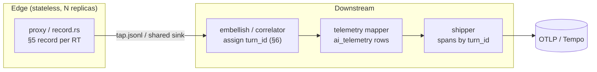
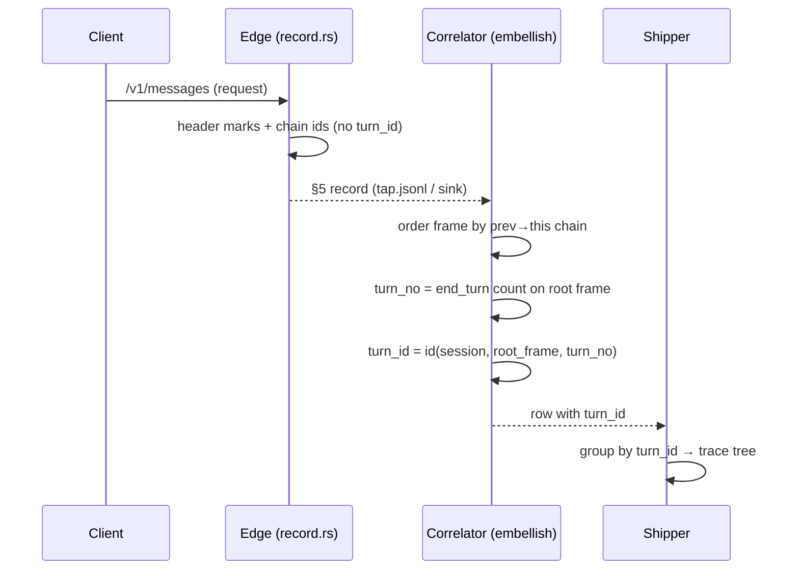

# ADR 058 — Turn identity is derived downstream, not minted at the edge

**Status:** Proposed.
**Related:** ADR 052 (turn/frame model + §5 record / §6 correlation — this ADR
makes §6 the authority for `turn_id` and supersedes §6's edge-minting note),
ADR 050 (session-state service — reduced in scope by this ADR), ADR 057 (OTel
trace export — the primary `turn_id` consumer), ADR 044 (shared data plane —
where records converge at scale). **Dissolves:** feature 063 (mid-stream-attach
turn recovery).

---

## 1. Context

### 1.1 The problem in domain terms

A coding-agent session is a sequence of **turns**; each turn is one user prompt
and the agent's full response to it (one or more round-trips, plus any sub-agent
frames it spawns). Telemetry groups round-trips by turn so cost and traces roll
up per prompt — `turn_id` is the grouping key, and ADR 057 makes **one trace per
turn**.

`turn_id` is assigned today by the **proxy edge** (`crates/noodle-adapters/src/marking/frame_tree.rs`),
which mints a random ULID at turn-open and holds it in per-session in-memory
state (`in_turn`, a turn ordinal, `current_turn_id`) so every later round-trip
of the turn can be stamped with the same id. Frame identity (`role`,
`frame_id`, `parent_frame_id`, `depth`) is read straight off request headers and
is already stateless.

### 1.2 Why edge-minting is the wrong place

Minting at the streaming edge has three coupled consequences:

1. **The edge is stateful.** It cannot be replicated without sharing the minted
   `turn_id` — a continuation handled by a second replica cannot reproduce a
   random ULID it never saw.
2. **It is fragile across restarts.** A proxy restart or late attach loses the
   in-memory turn state, so in-flight round-trips orphan (`turn_id = None`) or
   open a spurious fresh turn. (This is the entire premise of feature 063.)
3. **It mints what is actually derivable.** Turn identity is a *pure function*
   of the ordered per-session record set: a turn boundary is an `end_turn`
   terminal on the main frame (ADR 052 §6, proven in `scripts/tap_correlate.py`).
   The edge mints a random id only because, mid-stream, it cannot see the whole
   ordered set — not because the identity is inherently random.

### 1.3 The deciding constraint

`turn_id` is consumed **only downstream and never in-path**: the shipper groups
spans by it (ADR 057), the SQLite rollups `GROUP BY turn_id`, and the viewer
renders it. No in-path request decision reads `turn_id`. It is critical for
trace↔span correlation, which is itself a downstream/batch concern.

Given that, minting it at the edge buys nothing the edge needs and costs the edge
its statelessness.

---

## 2. Decision

1. **The edge is stateless.** The proxy emits one content-free §5 record per
   round-trip and mints nothing. It still stamps the header-derived marks
   (`role`, `frame_id`, `parent_frame_id`, `depth`) — those are pure functions of
   the request and need no state.
2. **Turn identity is derived downstream by deterministic §6 correlation.** A
   correlator stage in `noodle-embellish` reconstructs `session → turn → frame`
   from the §5 records and assigns `turn_id`. The algorithm is the ADR 052 §6
   reference (`scripts/tap_correlate.py`), ported to Rust.
3. **`turn_id` becomes deterministic, not random.** It is
   `id(session_id, root_frame_id, turn_no)` where `turn_no` is the count of
   `end_turn` terminals seen on the root frame before this round-trip. Re-running
   the correlator over the same records yields identical ids (pure and
   replayable, ADR 052 §6).
4. **Ordering is causal, not positional.** Within a frame, records order by the
   `prev_message_id → this_message_id` chain (falling back to timestamp). The
   chain is replica-independent, so the ordering — and therefore the derived
   `turn_id` — is the same regardless of which edge replica observed each
   round-trip.

This makes horizontal edge scale fall out for free, and turn identity is born
where it is consumed.

---

## 3. Domain model

### 3.1 Glossary

| Term | Meaning |
|---|---|
| **Round-trip (RT)** | One request/response to `/v1/messages`. The atom of capture. |
| **§5 record** | The content-free, per-RT fact emitted at the edge: ids, hashes, enums, token counts. Holds no cross-RT state. |
| **Frame** | An agent context within a session. The main agent is the `ROOT` frame; a sub-agent (`x-claude-code-agent-id`) is a child frame. Header-derived, stateless. |
| **Turn** | One user prompt and the agent's full response — a contiguous run of a root frame's RTs ending at an `end_turn` terminal. Sub-agent RTs inherit the spawning turn. |
| **Side-call** | An RT driven by no user prompt (quota probe, harness wrapper, compaction recap). Off-tree: no turn, no frame. |
| **§6 correlation** | The downstream reconstruction of `session → turn → frame → RT` from §5 records, assigning `turn_id`/`role`/`turn_no`. |
| **Opener** | The first RT of a turn — genuine leading user text (`open_fp` set) and no `prev_message_id`. |

### 3.2 Invariants

- **I1 — Turn identity is a function of records, not of observation order across
  replicas.** Any correlator over the same record set assigns the same `turn_id`.
- **I2 — A turn is bounded by `end_turn` on the root frame.** `max_tokens` /
  `stop_sequence` are terminals too; side-calls never advance the count.
- **I3 — Sub-agent RTs share their spawning turn's `turn_id`** (depth-1 for
  Claude Code; arbitrary depth for OpenCode via `x-parent-session-id`).
- **I4 — Side-calls carry no `turn_id`** and never appear as spans (ADR 057).
- **I5 — Frame identity is header-derived** and independent of any state.

---

## 4. Solution architecture

### 4.1 Components

| Component | Single responsibility |
|---|---|
| **Edge emitter** (`marking/record.rs` in `noodle-proxy`) | Produce one §5 record per RT from one request/response — header-derived marks + chain ids + token counts. No state. |
| **Correlator** (new stage in `noodle-embellish`) | Reconstruct turns/frames from a session's §5 records and assign `turn_id`/`role`/`depth`. Pure over the record set. |
| **Telemetry mapper** (`noodle-embellish`, existing) | Write the correlated rows to the `ai_telemetry_v_0_0_2` SQLite table. |
| **Shipper** (`noodle-shipper`, unchanged) | Group rows by `turn_id`, build the OTLP trace tree (ADR 057). |

The edge emitter and correlator split what `frame_tree.rs` does today: the
stateless half (header marks) stays at the edge; the stateful half (turn
minting) becomes the correlator's derivation.

### 4.2 Problem → solution mapping

| Problem concept | Owned by | Representation |
|---|---|---|
| §5 record | Edge emitter | `CaptureRecord` (`record.rs`) → `tap.jsonl` |
| Frame identity | Edge emitter | `role`/`frame_id`/`parent_frame_id`/`depth` marks |
| Turn boundary / `turn_no` | Correlator | `end_turn` count per root frame |
| `turn_id` | Correlator | `id(session_id, root_frame_id, turn_no)` |
| Side-call off-tree | Correlator | `role = side_call`, `turn_id = None` |
| Trace = turn | Shipper | `trace_id = hash(turn_id)` (ADR 057, unchanged) |

### 4.3 Pipeline (before → after)



Today the minting box sits inside `P` and the marks ride through `M`
untouched; this ADR moves `turn_id` assignment into `C`.

### 4.4 Record convergence (the scale boundary)

The correlator must see **all of a session's records** to count terminals
correctly (I2). The convergence point differs by topology and is the only
infrastructure question:

- **Single pod (today):** one `embellish` tails the one `tap.jsonl` the proxy
  writes — the whole session is already local. No new infrastructure.
- **N replicas (ADR 044):** records converge in the shared data plane (the ADR
  044 sink) before correlation; the correlator runs over the converged set.
  Convergence is a **batch/data-plane** property, not a low-latency store.

This is what reduces ADR 050: there is no hot, per-RT shared session-state to
read on the request path — only an eventual record-set convergence the
correlator consumes.

---

## 5. Key flow — assigning a turn



---

## 6. Critical algorithm — §6 turn correlation

This is where the logic *is* the risk; it must reproduce
`scripts/tap_correlate.py` field-for-field.

### 6.1 Contract

- **In:** the §5 records of one session (`session_id`, `frame_id`,
  `parent_frame_id`, `prev_message_id`, `this_message_id`, `stop_reason`,
  `open_fp`, `spawn_fps`, `side_call`, `tokens`).
- **Out:** each record annotated with `role ∈ {main, sub_agent, side_call}`,
  `turn_no` (or `None`), and `turn_id` (or `None`).
- **Preserves:** I1–I5.

### 6.2 Pseudocode

```
correlate(records):                          # one session
  by_frame = group records by (session_id, frame_id)
  for each frame: order by prev→this chain, else timestamp   # Step 2
  edges = spawn edges: child.parent_frame_id → parent frame  # Step 3
  roots = frames with no parent                              # Step 4

  for root in roots:                                         # Step 5 — segment
    n_end = 0
    for r in by_frame[root] (in order):
      if r.side_call: r.role="side_call"; r.turn_no=None; continue
      r.role = "main"; r.turn_no = n_end + 1
      if r.stop_reason in TERMINAL: n_end += 1               # end_turn/max_tokens/stop_sequence

  for (child, parent) in edges:                              # sub-agents inherit
    t = first turn_no of parent frame
    for r in by_frame[child]: r.role="sub_agent"; r.turn_no = t

  for r in records where r.turn_no is not None:
    r.turn_id = id(r.session_id, root_of(r), r.turn_no)
```

### 6.3 Complexity

`O(R log F_r)` for R records, dominated by the per-frame chain sort
(`F_r` = records per frame, typically < 50). Memory `O(R)` per session. At real
volumes (hundreds of RTs/session) this is microseconds — correlation is not a
latency concern because it runs downstream.

### 6.4 Edge cases and failure modes

| Case | Handling |
|---|---|
| **Side-call first / interleaved** | `turn_no=None`, off-tree; never advances `n_end` (I4). |
| **Sub-agent before parent in stream** | Two-pass: roots segmented first, then children inherit; order within the merged stream does not affect the inherited `turn_no`. |
| **Partial record set** (correlator missing earlier records) | `turn_no` counts from the first record seen → off by the number of missed terminals. Mitigated by convergence (§4.4): correlate only over a converged session set. This replaces 063's "recover edge state" with "ensure record convergence." |
| **Cross-replica ordering** | Order by the `prev→this` chain (causal, replica-independent), timestamp only as tiebreak. Avoids dependence on any per-replica sequence counter. |
| **Re-run / concurrent correlation** | Pure function → identical output; idempotent write (last-writer-wins on an identical value). |
| **Missing `stop_reason`** (SSE not fully parsed) | Treated as non-terminal — the turn stays open until the next observed terminal; a dropped terminal merges two turns (visible, not silent). |

---

## 7. What this dissolves

- **Feature 063 (mid-stream-attach recovery):** closed as *dissolved by design*.
  Orphaned turns are an artifact of edge-minting; a stateless edge has no turn
  state to lose. The replacement concern — record convergence — lives at the
  correlator (§4.4), not the edge.
- **ADR 050 (session-state service):** reduced from a hot, per-RT shared store
  (Valkey on the request path) to an eventual record-set convergence the
  correlator reads. Valkey is no longer required for `turn_id`. ADR 050 remains
  relevant only if a future in-path consumer needs synchronous session state.
- **`record.rs` vs `frame_tree.rs` keeper decision:** resolved. `record.rs` (the
  stateless §5 extractor) becomes the edge; `frame_tree.rs`'s turn-state machinery
  (`in_turn`, ordinal, `current_turn_id`, `mint_turn`) is retired; its header-
  derived classification moves into the §5 emitter.

---

## 8. Security considerations

- **Trust boundary:** the §5 record is **content-free by construction** — ids,
  hashes (`open_fp`, `spawn_fps`), enums, token counts only; no prompt or
  response text (ADR 052 §5, ADR 003). Moving correlation downstream does not
  widen what is persisted: the same fields already ride `tap.jsonl`.
- **No new exposure:** the correlator reads the records the edge already emits
  and writes the table the mapper already writes. No new network surface on the
  request path (the edge gains *no* dependency — it loses one).
- **Tampering / integrity:** `turn_id` is derived, so a corrupted record yields a
  visibly wrong tree (mis-segmented turn), never a silent cross-session leak —
  `session_id` scopes every id (I1).
- **At scale:** the convergence sink (ADR 044) inherits that ADR's access
  controls; records remain content-free there.

---

## 9. Test approach

| Level | Proves |
|---|---|
| **Unit — correlator** | The §6 algorithm against the committed `adr_052` fixtures + `claude-parallel-subagents`: turn counts, frame tree, side-call off-tree, sub-agent inheritance. Oracle parity with `scripts/tap_correlate.py`. |
| **Property — determinism** | Shuffling record arrival order (simulating multi-replica interleaving) yields identical `turn_id` assignment (I1). Re-run idempotence. |
| **Unit — edge emitter** | One §5 record per RT, header-derived marks, no `turn_id`, no cross-RT state (the `record.rs` tests, already present). |
| **Integration — pipeline** | Records → correlator → rows → shipper spans: same trace tree the edge-minting path produced (regression against the story-060 corpus wiremock test). |
| **Edge matrix** | Partial set, side-call-first, missing `stop_reason`, sub-agent-before-parent (§6.4). |

The fail-before/pass-after gate: replay a capture split mid-turn through the
correlator and assert turn assignment matches an unsplit run (the old 063
acceptance, now a correlator property rather than an edge-recovery test).

---

## 10. Consequences and tradeoffs

- **Edge scales horizontally with no coordination** — the headline win. N proxy
  replicas, no shared store, no session affinity required for correctness.
- **`turn_id` is deterministic and replayable** — re-running correlation is a
  consistency check, and traces are stable across re-derivation.
- **Live viewer turn_id moves ~250 ms downstream.** The OODA viewer's live feed
  reads `turn_id` from the marks SSE today; under this design it reads the
  *correlated* stream (embellish), behind by the tail/poll interval. Acceptable
  for a debugger view; called out because it changes the live `turn_id` source.
- **Loses edge-time `turn_id`.** If a future in-path consumer (e.g. ADR 045
  Watchtower policy gating) needs turn context *at decision time*, it cannot read
  a downstream-derived id. That case would reopen ADR 050 (a synchronous store)
  or session-affinity routing — chosen rather than carrying that cost now, when
  no in-path consumer exists.
- **Correlator owns a real responsibility** — `embellish` graduates from mapper
  to correlator+mapper. Justified: it already sees the whole session stream
  single-pod, and it is the natural place the §6 algorithm lives.

---

## 11. Delivery (handoff)

Sequenced so each slice is provable on the substrate that exists:

1. **Correlator in `embellish`, single-pod.** Port §6 from `tap_correlate.py`;
   `embellish` assigns `turn_id` from the §5 records instead of trusting the
   edge mark. Edge still mints in parallel — assert correlator output equals the
   edge's on real captures (parity gate). No infra change.
2. **Flip the source of truth.** Shipper/rows read the correlator's `turn_id`;
   edge stops minting (`frame_tree` turn-state removed, `record.rs` becomes the
   emitter). Viewer live feed reads the correlated stream.
3. **Multi-replica convergence (with ADR 044).** Records converge in the shared
   sink; correlator runs over the converged set. Only now does edge replication
   turn on.

Slice 1 is the first increment and needs no new infrastructure.
