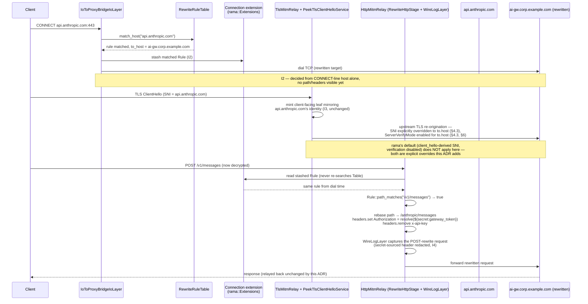

# ADR 059 — Rewrite rules: config-driven destination and header rewriting

**Status:** Proposed.

**Related:** ADR 011 (TLS MITM and CA — the trust model this must not
weaken), ADR 015 (layered codec engine — why this doesn't fit any
existing `Layer` variant), ADR 019 (endpoint-routed capability
dispatch — `CellKey` classification vs. rewrite), ADR 024 (fail-open
and bypass — distinct from this ADR's `on_error`), ADR 025 (dispatch
table — the glob/matcher primitives and TOML conventions reused
here), ADR 027 (tap.jsonl boundary format — redaction this ADR must
extend), ADR 034 (enterprise CA and external signing — the
pluggable-backend precedent `SecretService` follows), ADR 038
(side-effects wire format), ADR 043 (Kubernetes gateway deployment —
where `SecretService`'s non-macOS backend matters).

---

## 1. Context

noodle is an inspection MITM proxy: it terminates a client's TLS
connection to an upstream (`api.anthropic.com`) and mirrors the
upstream's real certificate back to the client, so the client's own
TLS trust is never disturbed while noodle observes and enriches
traffic in the middle (ADR 011).

The ask here is a different, additive capability: **route some or all
of that traffic to a *different* upstream than the client asked for**,
rewriting the path and headers as it goes — the way an nginx
`location` block or an Envoy route action does. The motivating case is
routing through a corporate AI gateway: a client still points at
`api.anthropic.com` (zero client-side config beyond trusting noodle's
CA and using it as a proxy), but noodle actually dials
`ai-gw.corp.example.com`, rebases the path, strips the client's own
`x-api-key`, and injects a gateway-issued credential instead.

This must ship as a genuine **add-on**: `enabled: false` by default,
fully inert when off, and — critically — it must not weaken the trust
model ADR 011 already established. A MITM proxy that can silently
redirect traffic and swap credentials is real attack surface if this
is designed carelessly; §7 treats that as a first-class concern, not
an afterthought.

### 1.1 The config sketch, translated to this repo's format

The requesting brief sketched the shape in YAML. **This codebase's
config is TOML** (`noodle.toml` — see
[`../guides/noodle-toml-config.md`](../guides/noodle-toml-config.md)
and the existing `[[context.enhancements]]` array-of-tables in
`default-noodle.toml`), and ADR 025's dispatch table already
establishes the TOML conventions a routing-policy table in this repo
should follow (`[[cells]]`-style arrays of tables, snake_case fields,
glob strings as plain data). §4.2 below is the same schema rendered in
that idiom — same fields, same semantics, no content changed.

---

## 2. Decision

1. **`rewrite_rules` is a new, independent routing table — not an
   extension of ADR 025's dispatch table.** The dispatch table
   answers "which `Codec`/`Transform` chain runs for this cell";
   `rewrite_rules` answers "which upstream do we actually dial, and
   what does the request look like when it gets there." Different
   questions, different evaluation points in the pipeline (§4.3),
   evaluated independently. Reuse the matcher *primitive*
   (`HostMatch`, `PathMatch` in `crates/noodle-core/src/endpoint.rs`),
   not the dispatch table itself.

   **Scope correction on glob parity — verified, not assumed.**
   `match.host` accepting "the same glob forms the dispatch table
   accepts" was the request's stated bar. Checked both sides of that
   claim directly: `HostMatch` today has exactly three variants —
   `Any`, `Exact(String)`, `Suffix(String)` — no `*`-single-label or
   `**`-multi-label glob variant exists. And the dispatch table itself
   doesn't have that capability to inherit from either: there is no
   dispatch-table loader anywhere in the tree (`find crates -iname
   "*dispatch*"` returns nothing), and ADR 000's own ledger tracks ADR
   025 as `◐` — "in-code dispatch live; runtime/config-file
   externalization deferred." ADR 025 §3.3's `*`/`**` grammar is
   designed, not shipped, on either side of this reuse.

   **v1 decision:** `rewrite_rules.match_host` ships against what
   `HostMatch` actually supports today — `Exact` and `Suffix` (the
   latter covers the common `*.anthropic.com`-style case, since a
   plain string-suffix check is already how `Suffix` behaves; it just
   can't distinguish "exactly one label" from "one or more"). Full
   `*`/`**` parity is a real, stated dependency on ADR 025 landing its
   own glob parser — not something to build speculatively inside this
   ADR for a single caller. If ADR 025's parser lands first, this
   feature inherits it for free by construction (same `HostMatch`
   type); if this feature needs it first, that's new work against ADR
   025, tracked there, not silently absorbed here.

2. **Destination rewriting is a two-phase capability, forced by where
   TLS re-origination actually happens (§4.3) — not a design
   preference.** `match.host` (host-only, no path or headers) decides
   the *dial target* at CONNECT time, before any TLS or HTTP byte is
   visible. `match.path_prefix` and `headers.{set,remove}` apply
   *after* TLS termination and HTTP parsing, once the request is
   readable, as a second stage that never changes the dial target —
   only the path and header set forwarded across the
   already-established upstream connection. A rule whose `match.host`
   matched but whose `match.path_prefix` doesn't match at HTTP time
   still dialed the rewritten `to.host` (the dial already happened);
   it just skips the path/header rewrite. This asymmetry is
   unavoidable given rama's `TlsMitmRelay` + `IoToProxyBridgeIoLayer`
   coupling (§4.3) and must be documented plainly for whoever
   configures rules, not hidden.

   **The rule that wins the dial is the only rule that can govern that
   connection's HTTP-time rewrite — never independently re-derived.**
   Two rules can legitimately share the same `match.host` with
   different `match.path_prefix` values (e.g. routing
   `api.anthropic.com`'s `/v1/messages` and `/v1/complete` to different
   gateways). Because HTTP/1.1 keep-alive and HTTP/2 multiplexing both
   mean a single dialed connection carries many requests over its
   lifetime, an HTTP-time stage that *independently* re-searches the
   rule table by `(host, path)` could select a different rule than the
   one that already won the dial — sending that rule's headers/secret
   to a connection that's actually talking to a different rule's
   `to.host`. The dial-time hook stashes the matched `Rule` (an index
   or `Arc<Rule>`, not a fresh lookup key) on a connection-scoped
   extension — the same `rama::Extensions` mechanism `ProxyTarget`
   already rides through this pipeline (`service.rs`'s
   `input.extensions().get_ref::<ProxyTarget>()`). `RewriteHttpStage`
   reads that extension and checks only whether *that* rule's
   `match.path_prefix` also matches the live request — it never calls
   an independent host+path search. No stashed rule (dial wasn't
   rewritten) means the HTTP-time stage is a pure no-op.

3. **The client-facing certificate identity never changes.** Rewriting
   `to.host` changes what noodle dials and what `Host`/SNI it presents
   *upstream*. It never changes what cert noodle mirrors *to the
   client* — that stays keyed on the original SNI the client asked
   for (`match.host`, effectively `api.anthropic.com`). Minting a leaf
   claiming to be `to.host` to the client would be a real trust
   violation and is an explicit non-goal (§6).

4. **`SecretService` is new and deliberately narrow.** A port +
   pluggable backends resolving `${secret:name}` references in config
   values, scoped to exactly what this feature needs — credential
   injection into rewritten headers. Not a general secrets platform.
   Two backends given noodle's two real deployment topologies:
   `KeychainSecretBackend` (macOS endpoint product) and a
   file/env-staged backend (Kubernetes gateway — same initContainer
   staging pattern `deploy/k8s/deployment.yaml` already uses for the
   CA Secret). A `VaultSecretBackend` is a natural third, reusing
   `crates/noodle-cert-external`'s existing Vault integration
   (`vault.rs`), but is not required for v1.

5. **`on_error: passthrough | fail` is per-rule request-time
   degradation, not ADR 024's fail-open contract.** ADR 024 is the
   proxy's own health-driven self-protection (binary, across all
   flows, driven by a health probe). `on_error` here is scoped to one
   rule failing for one request (secret didn't resolve, rewritten
   upstream's TLS didn't validate) — `passthrough` forwards the
   request to its *original*, unrewritten destination with the
   client's *original* headers; `fail` returns an error to the client.
   Conflating the two would be wrong: a broken rewrite rule is a
   config problem, not a proxy-health problem.

6. **Rewritten headers get the same tap.jsonl redaction as any other
   sensitive header — extended to cover secret-sourced values by
   origin, not by a fixed name list.** ADR 027 §9's default redaction
   list (`Authorization`, `X-Api-Key`, …) is name-based. A rewrite
   rule can inject a secret into *any* header name
   (`headers.set.Authorization` in the example, but nothing stops
   `headers.set.X-Gateway-Token`). Any header value that came from
   `${secret:...}` interpolation is redacted in `tap.jsonl`
   regardless of header name — origin-based, not name-based. See §5.4.

---

## 3. Domain model

### 3.1 Glossary

| Term | Meaning |
|---|---|
| **Rewrite rule** | One `[[rewrite_rules.rules]]` entry: a match predicate, a destination, a header transform, and an error policy. |
| **Dial target** | The `(host, port)` noodle's `IoToProxyBridgeIoLayer` actually connects to. Normally the CONNECT-line host; a matched rule's `to.host` overrides it. |
| **Client-facing identity** | The hostname the client believes it's talking to — the SNI it sent, and the subject/SANs of the cert noodle mirrors to it. Never rewritten. |
| **Path rebase** | Replacing `match.path_prefix` with `to.path_prefix` on the forwarded request path. HTTP-time only (§2.2). |
| **Secret reference** | A `${secret:name}` token in a config string value, resolved by `SecretService` before the header is set. |
| **Rule table** | The ordered list of rules under `rewrite_rules.rules`, evaluated top-to-bottom, first match wins — same evaluation contract as ADR 025's dispatch table. |

### 3.2 Invariants

- **I1 — First match wins, deterministic.** Rules evaluate in file
  order; the first whose `match` predicate accepts the flow governs.
  No rule after it is considered, even if it would also match.
- **I2 — Host-only matching decides the dial; nothing else can.**
  `match.path_prefix` never influences *which* upstream gets dialed
  (§2.2) — only whether the HTTP-time rewrite applies once the
  dial has already happened against `match.host`'s rule. **The rule
  that decides the dial is carried forward as connection state and is
  the only rule ever consulted for that connection's HTTP-time
  rewrite** — a fresh independent `(host, path)` search at HTTP time
  is explicitly disallowed, because it could select a different rule
  than the one the dial already committed to (§2.2).
- **I3 — Client-facing TLS identity is invariant under rewrite.** No
  code path in this design mints or selects a client-facing leaf cert
  keyed on `to.host`. If this invariant cannot hold for some future
  extension, that extension needs its own ADR, not a quiet change
  here.
- **I4 — Secrets are never plaintext in `tap.jsonl` or
  `side_effects.jsonl`,** regardless of which header they populate
  (§3.1's origin-based redaction, not ADR 027's fixed list).
- **I5 — `enabled: false` (the default) means zero behavior change.**
  No dial interception, no HTTP rewrite stage inserted into the
  pipeline, no `SecretService` construction attempted. An add-on that
  isn't configured must cost nothing.

---

## 4. Solution architecture

### 4.1 Components

| Component | Single responsibility | Crate |
|---|---|---|
| `RewriteRuleTable` | Parses `rewrite_rules` from `noodle.toml`; exposes `match_host(host) -> Option<(RuleId, &Rule)>` — host-only, first-match-wins, the *only* table search this feature ever performs. | `noodle-core` (types + matching, no I/O) |
| `Rule::path_matches(path) -> bool` | Validates whether the *already-selected* rule's `match.path_prefix` (if any) accepts the live request path. Not a table search — a check against one specific, already-resolved rule. | `noodle-core` (method on `Rule`, not `RewriteRuleTable`) |
| Dial-target hook | Reads the CONNECT-line host, consults `RewriteRuleTable::match_host`, overrides the extension `IoToProxyBridgeIoLayer::extension_proxy_target` reads before it dials, and — when a rule matched — stashes that rule (`RuleId`/`Arc<Rule>`) on a connection-scoped `rama::Extensions` entry (§2.2; same mechanism `ProxyTarget` already uses). | `noodle-proxy` (the only crate that touches rama's transport layer) |
| `RewriteHttpStage` | New HTTP-time middleware, sibling to the existing enhancer/`WireLogLayer` stack in `mitm.rs`'s `http_mitm_relay` chain: reads the stashed rule from the connection extension (never re-searches), calls `Rule::path_matches`, and if it holds: rebase path, apply `headers.set`/`remove`, resolve `${secret:...}` via `SecretService`. No stashed rule ⇒ no-op. | `noodle-adapters` (concrete impl over `noodle-core` traits) |
| `SecretService` (port) + backends | `trait SecretBackend { fn resolve(&self, name: &str) -> Result<Secret, SecretError>; }`. Impls: `KeychainSecretBackend`, a file/env-staged backend, optionally `VaultSecretBackend`. | port in `noodle-core`; impls in a new module (§6) |

### 4.2 Config schema (TOML, ADR 025 conventions)

```toml
# ─── Rewrite rules — off by default ──────────────────────────────

[rewrite_rules]
enabled = false

[[rewrite_rules.rules]]
match_host        = "api.anthropic.com"    # exact or suffix (HostMatch); *./**. glob deferred to ADR 025 (§2.1)
match_path_prefix = "/v1/"                 # optional; HTTP-time only (§2.2)

to_host           = "ai-gw.corp.example.com"
to_path_prefix    = "/anthropic/"          # optional rebase

[rewrite_rules.rules.headers.set]
Authorization = "${secret:gateway_token}"

rewrite_rules.rules.headers.remove = ["x-api-key"]

on_error = "passthrough"                   # passthrough | fail
```

Field-for-field equivalent to the requesting brief's YAML sketch;
`match.host`/`match.path_prefix` flatten to `match_host`/
`match_path_prefix` and `to.host`/`to.path_prefix` to `to_host`/
`to_path_prefix` to keep each rule a single flat table (matches how
`[[cells]]` in ADR 025 is flat, not nested) — `headers` stays a
sub-table since it's genuinely structured (a `set` map and a `remove`
list).

### 4.3 Where this hooks into the existing pipeline — the crux

`crates/noodle-proxy/src/mitm.rs` (`build_mitm_service_with_issuer`)
composes, outermost to innermost:

```
ConsumeErrLayer
  → IoToProxyBridgeIoLayer::extension_proxy_target(exec)   # dials egress TCP HERE
      → PeekTlsClientHelloService                          # peeks ClientHello SNI
          → TlsMitmRelay::new_with_cached_issuer(issuer)    # terminates client TLS,
          |                                                  # re-originates upstream TLS
          |                                                  # over the ALREADY-DIALED
          |                                                  # connection from the layer above,
          |                                                  # mints a client-facing leaf
          |                                                  # mirroring the upstream's cert
          → HttpPeekRouter → HttpMitmRelay                  # HTTP middleware (WireLogLayer, etc.)
```

`IoToProxyBridgeIoLayer::extension_proxy_target` dials the raw TCP
egress connection **before any TLS byte is even peeked**, from an
extension `UpgradeLayer` populated straight off the CONNECT line
(`CONNECT api.anthropic.com:443`). No HTTP path or header exists at
this point — CONNECT carries only `host:port`. This is why I2 (§3.2)
isn't a design choice, it's a hard constraint: **by the time
`match.path_prefix` could possibly be evaluated (after HTTP parsing,
several layers further in), the TCP dial — and the TLS re-origination
built on top of it — has already committed to a destination.**

The rewrite hook is therefore: intercept the CONNECT-target extension
*before* `IoToProxyBridgeIoLayer` reads it, consult
`RewriteRuleTable::match_host` against the CONNECT-line host, and
substitute `to.host` if a rule matched — also stashing the matched
rule on a connection-scoped extension (§2.2) for `RewriteHttpStage` to
read later. `TlsMitmRelay` then re-originates TLS against the
(possibly rewritten) already-dialed connection while
`PeekTlsClientHelloService` still saw the *client's* original
ClientHello SNI — those are two independent signals today, which is
what makes I3 (client-facing identity invariant) hold without new
plumbing on the client-facing side.

**Upstream SNI — resolved by reading rama's source directly, not
assumed.** `rama-tls-boring/src/proxy/mitm/service.rs`'s
`TlsMitmRelayService` (the `InputWithClientHello` impl noodle actually
uses, wrapped by `PeekTlsClientHelloService`) builds the egress
connector data with:

```rust
let maybe_connector_data = TlsConnectorDataBuilder::try_from(client_hello)
    .unwrap_or_default()
    .with_server_verify_mode(ServerVerifyMode::Disable)
    .build()...
```

**Confirmed: the upstream/egress SNI is derived from the *client's*
original ClientHello (`client_hello`), not from the dial target.**
Rewriting the dial target alone is *not* sufficient — noodle would
dial `to.host` but present a ClientHello SNI claiming
`match.host` (e.g. dial `ai-gw.corp.example.com` while announcing SNI
`api.anthropic.com`), which breaks against any destination that does
SNI-based routing or vhosting. The dial-target hook must therefore
also construct its own `TlsConnectorData` with SNI = `to.host` when a
rule fires, passed through in place of the default
`try_from(client_hello)` path — a real, scoped piece of implementation
work, not something that falls out for free.

**Second finding from the same read, more consequential: upstream TLS
verification is disabled unconditionally.** The same builder call sets
`ServerVerifyMode::Disable` — in both `TlsMitmRelayService` code paths,
not just the ClientHello-less one. Checked `crates/noodle-proxy/src/*.rs`
for any override: none exists. **Noodle does not validate the upstream
certificate chain today, full stop** — it mirrors whatever cert the
egress peer presents, unconditionally. That's plausibly an accepted
property of the existing mirror-not-validate design for the *real*
upstream (DNS/network already got the connection there). It is not
acceptable, unexamined, for a rewrite destination: `to.host` is
operator-configured and — per §5 — is where a real credential gets
deliberately sent. **Decision: `RewriteHttpStage`'s dial path
constructs `TlsConnectorData` with `ServerVerifyMode` at its normal
(enabled) setting for `to.host` specifically**, diverging from the rest
of noodle's MITM posture for this one connection class, justified by
the stakes (§6 carries the full reasoning). A validation failure here
is an `on_error` case, same as any other rewrite-time failure (§2.5).

### 4.4 Pipeline diagram



---

## 5. `SecretService`

### 5.1 Port shape

```rust
pub trait SecretBackend: Send + Sync {
    /// Resolve a named secret. Never logs the value; callers own
    /// keeping it out of anything that gets persisted unredacted.
    fn resolve(&self, name: &str) -> Result<Secret, SecretError>;
}

pub struct Secret(/* zeroize-on-drop wrapper, not a bare String */);
```

Modeled directly on `crates/noodle-cert-external`'s
`ExternalSignerBackend` trait shape (`lib.rs:153`) — same "narrow
trait, pluggable backend, `Arc<dyn Backend>` at the call site"
pattern already proven in this codebase for BYOCA-static/Vault CA
signing.

### 5.2 Backends

| Backend | Topology | Source |
|---|---|---|
| `KeychainSecretBackend` | macOS endpoint product | macOS Keychain Services, scoped to the noodle process's own keychain access group — same trust boundary the CA private key already relies on (`apps/noodle-macos` / `noodle-macos-tproxy`). |
| File/env-staged backend | Kubernetes gateway | Same shape as `deploy/k8s/deployment.yaml`'s existing `ca-prep` initContainer: a Secret mounted root-owned, staged into an `emptyDir` at 0400 owned by uid 65532 (the nonroot proxy's uid) by an initContainer, then read from a fixed path — not a live Secret-API call from inside the nonroot proxy. |
| `VaultSecretBackend` (later, not required for v1) | Org already running Vault for CA (ADR 038) | Reuses `crates/noodle-cert-external/src/vault.rs`'s client wiring rather than a fresh Vault integration. |

### 5.3 Resolution

`${secret:name}` is resolved once at config load (or on first use,
cached) — not per-request. A rewrite rule referencing an unresolvable
secret name is a config error surfaced at startup, not a per-request
`on_error` case; `on_error` covers *runtime* failure (upstream TLS
validation, connect timeout), not a broken config. Rotation/refresh
semantics are explicitly deferred — out of scope for this ADR, flagged
in §9.

### 5.4 Redaction (I4)

Every header value produced via `${secret:...}` interpolation is
tagged at resolution time (not by header name) so the tap.jsonl
writer redacts it the same way ADR 027 §9 already redacts
`Authorization`/`X-Api-Key` — prefix-preserving where the destination
credential format warrants it, full opacity otherwise. This closes the
gap ADR 027's fixed name-list can't: a rule can set a secret into any
header name.

---

## 6. Security considerations

This is a MITM proxy gaining the ability to silently redirect traffic
and swap credentials — real attack surface, not a formality section.

- **Client-facing trust is structurally unchanged (I3).** No code
  path in this design lets `to.host` influence what cert the client
  sees. This is the load-bearing mitigation for "does this weaken
  ADR 011" — it doesn't, by construction, not by policy.
- **Original-credential forwarding to a rewritten destination is
  allowed, deliberately, not a gap.** A rule can rewrite `to.host`
  without touching the client's own `Authorization`/`x-api-key` —
  **resolved, not left open:** `rewrite_rules` does not mandate
  stripping the inbound credential. A common, entirely legitimate
  pattern is a corp gateway that *uses* the client's original
  credential to identify the caller and map it to a virtual key
  server-side — forcing a strip would break exactly that case. This is
  operator-owned config data (see the `rewrite_rules` bullet below),
  same trust posture as every other header the operator chooses to
  forward or not; it is not this ADR's job to second-guess a
  deliberate `headers` configuration.
- **Upstream TLS validation on the rewritten destination — corrected
  claim, verified against rama source.** rama's `TlsMitmRelayService`
  sets `ServerVerifyMode::Disable` unconditionally for the egress
  connector (`rama-tls-boring/src/proxy/mitm/service.rs`), and noodle
  has no override anywhere in `crates/noodle-proxy`. **Noodle does not
  validate the upstream certificate chain today** for the real,
  unrewritten upstream either — an existing, accepted property of the
  mirror-not-validate MITM design, not something this ADR introduces.
  It is not acceptable left as-is for `to.host` specifically, because
  §5's secret gets sent there deliberately and validating that the
  destination is who the operator configured it to be is exactly what
  stands between "gateway token goes to the corp gateway" and "gateway
  token goes to whoever answered on that IP." **Decision (§4.3):**
  `RewriteHttpStage`'s dial path re-enables standard verification for
  `to.host` specifically — a deliberate divergence from the rest of
  noodle's MITM posture, scoped to this one connection class. A
  validation failure is an `on_error` case — `passthrough` (fall back
  to the original, unrewritten destination) or `fail` (error to the
  client) — not silently ignored.
- **Rule-selection consistency across the dial/HTTP-time split (§2.2)
  is itself a credential-safety property, not just a correctness
  one.** Without the connection-scoped extension carrying the
  dial-time-selected rule forward, an independently re-derived
  HTTP-time match on a connection carrying multiple rules with
  overlapping `match.host` could apply one rule's secret/headers to a
  connection actually talking to a *different* rule's `to.host` —
  sending a real credential to the wrong destination. I2's "carried,
  never re-derived" requirement exists specifically to close this.
- **`rewrite_rules` is operator-owned data, not executable code** —
  same posture ADR 025 §8 already established for the dispatch table.
  It ships in the same trust boundary as `noodle.toml` generally: if
  an attacker can edit `noodle.toml`, redirecting traffic via
  `rewrite_rules` is one of many things they could already do (inject
  a malicious `Codec`/`Transform` chain is not possible since those
  are compiled Rust, but the dispatch table itself is exactly this
  kind of config-level routing risk already, per ADR 025's own
  security section).
- **Secrets never in logs (I4, §5.4).** Extends, doesn't duplicate,
  ADR 027 §9.
- **`enabled: false` is a real off-switch (I5),** not merely
  "no rules configured." No dial-hook installed, no `SecretService`
  constructed, when the feature is off — verified by a test asserting
  zero behavioral difference with `rewrite_rules` entirely absent from
  config vs. present-but-`enabled = false`.

---

## 7. Test approach

| Level | Proves |
|---|---|
| **Unit — `RewriteRuleTable`** | First-match-wins ordering (I1); `match_host` is exact/suffix only, matching `HostMatch`'s actual variants today (§2.1 scope decision) — reuse `HostMatch` test fixtures from `crates/noodle-core/src/endpoint.rs`, don't re-derive. |
| **Unit — `Rule::path_matches`** | Validates against one already-resolved rule, not a table search — no `RewriteRuleTable` reference in scope for this call at all (enforces I2 at the type level). |
| **Unit — `SecretService`** | Each backend resolves a known-good secret; missing-secret is a config-time error, not a panic or silent empty string. |
| **Integration — dial rewrite** | A CONNECT to a matched host actually dials `to.host` (assert on the egress connection's peer, not just the config parse), and the egress TLS ClientHello's SNI is `to.host`, not the client's original SNI (§4.3 — the override this ADR adds over rama's default). |
| **Integration — rule pinning across the dial/HTTP split (I2, the Finding-1 case)** | Two rules share `match.host` with different `match.path_prefix` pointing at different `to.host`. Assert the rule that won the dial is the *only* one whose headers/secret/path-rebase ever apply on that connection — even when a request's actual path would, under an independent search, match a *different* rule. This is the regression test for the credential-to-wrong-host failure mode §6 describes. |
| **Integration — HTTP rewrite** | Path rebase + header set/remove observed on the forwarded request; original `Authorization`/`x-api-key` present or absent purely per the configured `headers.remove` list — no implicit stripping (§6, #2 resolved). |
| **Integration — upstream cert validation on `to.host`** | A rewritten destination presenting an invalid/self-signed cert triggers `on_error`, not a silent successful connection — proves the explicit-verification override (§4.3, §6) actually took effect and didn't inherit rama's default-disabled verify mode. |
| **Integration — redaction** | A secret-sourced header value never appears unredacted in `tap.jsonl` (I4) — the specific gap this ADR closes over ADR 027's name-based list. |
| **Integration — `on_error`** | `passthrough` forwards to the *original* destination with *original* headers on a simulated upstream TLS failure; `fail` returns an error and does not forward anywhere. |
| **Regression — disabled** | `rewrite_rules.enabled = false` (or section absent) produces byte-identical proxy behavior to a build with the feature compiled out — no dial hook, no `SecretService` construction attempted (I5). |

---

## 8. Consequences and tradeoffs

- **Two-phase rewrite (host-only at dial time, path/headers at HTTP
  time) is accepted complexity, not a simplification opportunity.**
  It's forced by rama's TLS relay coupling (§4.3); a design that
  pretended path-based routing could gate the dial target would be
  wrong, not simpler.
- **New attack surface, mitigated but not eliminated** — see §6.
  Genuinely security-sensitive; review should weight this section
  heavily before any implementation lands.
- **`SecretService` is new infrastructure** with only this feature as
  a consumer today. Scoped deliberately narrow (§2.4) rather than
  building a general secrets platform speculatively — if a second
  consumer appears later, broadening the port is cheap; over-building
  it now for a single caller is not justified.
- **Opt-in, zero-cost when off (I5)** — the add-on framing the request
  asked for is structural, not just a config flag wrapping always-on
  code.
- **WebSocket-carried providers (e.g. a future OpenAI Realtime rule)
  are an explicit non-goal for v1, not an oversight.** Dial-level
  rewrite (`match.host` → `to.host`) is fully protocol-agnostic — it
  operates below TLS, before any HTTP or WS byte is visible, so it
  works identically whether what follows is a normal HTTP exchange or
  a WS upgrade. But this codebase has **no WebSocket inspection of any
  kind today**: `docs/features/009-websocket-adapter.md` was never
  built, `provider::websocket` in `noodle-adapters/src/lib.rs` is an
  empty v1-era placeholder, and ADR 000's ledger doesn't carry it as a
  tracked row. Full parity (turn/frame marking, telemetry) for a
  WS-based provider is a separate, materially larger effort (story
  009) and is not in scope here. If `rewrite_rules` v1 ships before
  009, WSS traffic to a matched host still gets dial-level rerouting;
  it just gets none of the request-head rewrite (a WS upgrade's
  header rewrite would need its own verification against
  `HttpMitmRelay`'s upgrade handling, which this ADR has not done and
  does not claim).
- **HTTP/2 + SSE — the actual primary target — is low-risk precisely
  because it isn't new integration territory.** `RewriteHttpStage`
  sits sibling to `WireLogLayer` in the same `http_mitm_relay` chain
  position that already runs, proven, against real Anthropic HTTP/2
  SSE traffic in production. The rewrite touches only the request
  head (method/URI/headers) — never a body in either direction — so
  it's structurally orthogonal to response streaming; the response
  flows back through the existing SSE codec path untouched by this
  ADR. Protocol version (h1/h2) is negotiated against whichever host
  actually got dialed (`to.host`), via `TlsMitmRelay`'s existing
  `TargetHttpVersion` stamping — no new negotiation logic needed.

---

## 9. Open questions — deliberately not decided here

Two items from the original list are resolved and folded into the
sections above rather than left here: rama's upstream-SNI coupling
(confirmed, §4.3) and whether cross-host rewrite should mandate
stripping the client's auth header (resolved — no, §6).

1. **`SecretService` rotation/refresh.** Resolve-once-at-load (§5.3)
   is the simplest correct starting point; live rotation without a
   proxy restart is out of scope here. Confirmed as the right v1
   scope, not just a placeholder.
2. **Should `on_error: fail` emit an `AuditEvent` (ADR 038) for
   operator visibility?** Likely yes, given every other noodle
   decision point does; not fully specced in this ADR.
3. **Vault backend timing** — bundle with v1, or defer to when an org
   actually asks for it? Leaning defer (§5.2), not decided.
