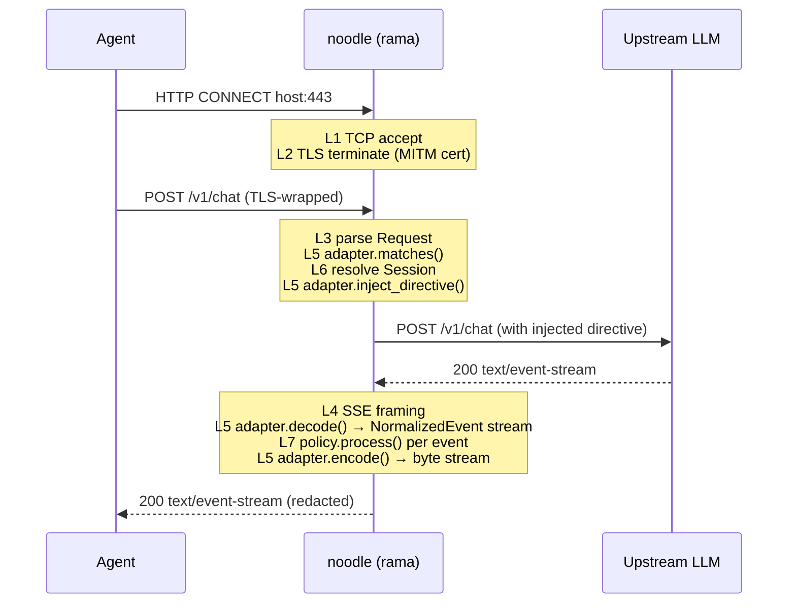

# noodle architecture

> **As-built narrative.** Describes the system's layered model and core
> abstractions. Predates the numbered ADR series (`docs/adrs/`); some
> v1-era specifics (port numbers, crate split, header names) have drifted
> from the shipped code and are pending a freshness pass against the
> current crates. The ADRs are authoritative where they conflict.

**Status:** living (freshness pass pending)
**Author:** Joe Barnett
**Last updated:** 2026-05-09

## 1. Context

Agents in our stack invoke LLM inference over a handful of transports:

- **HTTP request/response** — single round trip, response received whole.
- **Server-Sent Events (SSE)** — streamed token deltas over HTTP/1.1 or HTTP/2.
- **WebSocket** — bidirectional streaming, sometimes used by hosted LLM
  providers and some agent frameworks.
- Occasional vendor-specific framings (AWS event-stream, gRPC streaming, etc.)
  that we will accommodate but not optimize for in v1.

Two operational goals drive the design:

1. **Inject** a tagging directive into the system prompt at the start of a
   session, so the LLM emits a known marker at the end of each turn that can
   be used for attribution downstream.
2. **Extract** those markers from responses on the way back, and **redact**
   them from the bytes the agent ultimately sees — markers must not leak
   into application content. Extraction must work mid-stream, before the
   agent observes the tagged region.

The HTTP round-trip case is straightforward: read the body, parse, redact,
re-emit. The streaming cases (SSE, WS) are the hard ones — we are mutating a
live byte stream that the upstream did not author with us in mind. Done
poorly, this couples protocol parsing, provider quirks, and business policy
into one unmaintainable blob.

## 2. Goals and non-goals

### Goals

- **Single architecture for streaming and non-streaming.** A non-streaming
  HTTP response is the degenerate case of a stream of one event.
- **Provider-agnostic policy.** Adding OpenAI, Anthropic, Bedrock, or a
  vendor-X adapter must not require touching tag-extraction or session logic.
- **Correctness-preserving stream rewrite.** Bytes we don't redact pass
  through unchanged, byte-for-byte.
- **Resilience to provider drift.** When a provider changes their event
  shape, blast radius is one adapter file.
- **Testability.** Each layer must be unit-testable without running TLS,
  TCP, or the full stack.

### Non-goals (v1)

- Full transparent (L4 TPROXY / NetworkExtension) interception.
  We start as a forward proxy with HTTP CONNECT; transparent mode is a later
  story (see [`features/011`](../features/011-transparent-mode.md)).
- High-throughput multi-tenant SaaS posture (rate limits, quota, billing
  hooks). Out of scope until the inspection model is proven.
- Replaying historical sessions, audit storage at rest, or analytics UI.
  v1 emits structured logs; downstream systems own retention.
- LLM proxy features unrelated to attribution (caching, model fallback,
  prompt templates, RAG injection).

## 3. Architectural model

Seven layers, modeled loosely on OSI but adapted for the actual concerns.
The two boundaries that matter are marked.

```
┌───────────────────────────────────────────────────────────────┐
│ L7  Attribution / policy        Tag spec, redaction, audit     │  business
│                                  (provider-agnostic)            │  logic
├───────────────────────────────────────────────────────────────┤
│ L6  Session / turn state        TurnStart → Tokens → TurnEnd   │
├───────────────────────────────────────────────────────────────┤
│ L5  Provider adapter            OpenAI / Anthropic / Bedrock   │ ◄─ volatile
│     (decode → normalize → re-encode)                            │     boundary
├───────────────────────────────────────────────────────────────┤
│ L4  Stream framing              SSE EventStream / WS Message    │
├───────────────────────────────────────────────────────────────┤
│ L3  HTTP                        Request/Response, h1+h2         │
├───────────────────────────────────────────────────────────────┤
│ L2  TLS                         Termination + re-origination    │ ◄─ trust
│                                  (MITM cert)                    │     boundary
├───────────────────────────────────────────────────────────────┤
│ L1  Transport                   TCP (forward proxy v1; TPROXY  │
│                                  / NetworkExtension later)      │
└───────────────────────────────────────────────────────────────┘
```

**The L5/L6 boundary is the design's load-bearing contract.** Below it, code
deals in bytes, frames, and provider JSON shapes. Above it, code deals only
in `NormalizedEvent`. Adding a new provider means writing one
`LlmAdapter`. Changing the tagging policy means editing one `TagPolicy`.
The two never have to know about each other.

## 4. Core abstractions

```rust
// L5 — the only place provider-specifics live.
pub trait LlmAdapter: Send + Sync + 'static {
    /// Cheap predicate for routing. Must not consume the request.
    fn matches(&self, req: &Request) -> bool;

    /// Mutate the outbound request to include the attribution directive.
    /// Idempotent on follow-up requests within the same session.
    fn inject_directive(&self, session: &Session, req: &mut Request);

    /// Decode a response body into a stream of normalized events.
    /// SSE, WS, and "one big body" all collapse to a Stream here.
    fn decode(
        &self,
        parts: ResponseShape,
        body: BoxBody,
    ) -> BoxStream<'static, Result<NormalizedEvent, BoxError>>;

    /// Re-encode a (possibly modified) event stream back into a body.
    /// MUST be byte-faithful for events the policy did not modify
    /// (each NormalizedEvent carries the original raw bytes).
    fn encode(
        &self,
        parts: ResponseShape,
        events: BoxStream<'static, Result<NormalizedEvent, BoxError>>,
    ) -> BoxBody;
}

// L7 — provider-agnostic; talks only in NormalizedEvent.
pub trait TagPolicy: Send + Sync + 'static {
    fn process(
        &self,
        session: &Session,
        ev: NormalizedEvent,
    ) -> SmallVec<[NormalizedEvent; 1]>;  // 0..n out: drop, pass, or split
}

pub enum NormalizedEvent {
    TurnStart { turn_id: TurnId, role: Role },
    Token { text: String, raw: ProviderChunk },
    ToolCall { call_id: String, name: String, args: Value, raw: ProviderChunk },
    TurnEnd { turn_id: TurnId, finish: FinishReason },
    Metadata(Bytes),
}
```

**The `raw: ProviderChunk` field is the byte-fidelity trick.** When the
policy returns the event unchanged, the adapter emits the original bytes.
Only redacted events are rebuilt from scratch, so we never produce malformed
SSE or break a streaming format we don't fully own.

### Session model

Sessions are a noodle construct. LLM APIs are largely stateless; the agent
or proxy invents the session boundary. We pin one canonical key — auth
credential plus a required `x-noodle-session` header — at L6, and refuse to
let L5 or L7 invent their own. Cross-request state lives in a
`SessionStore` (in-memory `DashMap` for v1; pluggable for later).

```rust
pub trait SessionStore: Send + Sync + 'static {
    fn get_or_init(&self, key: &SessionKey) -> Arc<Session>;
}

pub struct Session {
    pub id: SessionId,
    pub directive_injected: AtomicBool,
    pub turns: Mutex<TurnLog>,
    // policy-private state lives behind a typed extension map
    pub ext: Extensions,
}
```

## 5. Request lifecycle



The pipeline is symmetric: every layer operates on the same data type going
in and coming out, just at progressively higher levels of abstraction.

## 6. Mapping to rama

| layer | rama building blocks |
|-|-|
| L1 | `TcpListener` (v1); `linux_tproxy_tcp` / `rama-net-apple-networkextension` (later) |
| L2 | `tls::boring::TlsAcceptorLayer` + `PeekTlsClientHelloService` for SNI/ALPN mirroring |
| L3 | `HttpServer::auto`, `UpgradeLayer` for CONNECT, `EasyHttpWebClient` for egress |
| L4 | `body::sse::EventStream` (parser), `body::sse::server` (re-encoder), WS `Message` |
| L5 | noodle: `LlmAdapter` impls per provider |
| L6 | noodle: `SessionStore` + extension-injected `Session` |
| L7 | noodle: `TagPolicy` |

The composed rama service:

```rust
let proxy = (
    TraceLayer::new_for_http(),
    ConsumeErrLayer::default(),
    ProxyAuthLayer::new(creds),
    UpgradeLayer::new(exec.clone(), MethodMatcher::CONNECT,
        DefaultHttpProxyConnectReplyService::new(),
        mitm_inner_service),    // wraps the stack below
).into_layer(plain_pass_through);

let mitm_inner_service = (
    AddInputExtensionLayer::new(session_store.clone()),
    DecompressionLayer::new().with_insert_accept_encoding_header(false),
    LlmInspectionLayer::new(adapters, policy),  // L5+L6+L7, the noodle bit
    MapResponseBodyLayer::new_boxed_streaming_body(),
).into_layer(EasyHttpWebClient::default());
```

`LlmInspectionLayer` is the only meaningful new layer noodle adds. Internally:

1. `let adapter = adapters.iter().find(|a| a.matches(&req))?;`
2. `let session = session_store.get_or_init(&key_from_req(&req));`
3. `adapter.inject_directive(&session, &mut req);`
4. `let resp = inner.serve(req).await?;`
5. Wrap response body:
   `adapter.encode(parts, policy_filter(adapter.decode(parts, body), session))`.
6. Return.

`policy_filter` is a pure `Stream` combinator — `flat_map` over a `TagPolicy`
call. No I/O, no async. Trivially testable.

## 7. Layer-by-layer design notes

### L1 — Transport

v1 is a forward proxy on `127.0.0.1:62100` accepting HTTP CONNECT. This is
what `examples/http_mitm_proxy_boring.rs` in rama already demonstrates.
Transparent (TPROXY/NetworkExtension) interception is deferred — the L1
swap is independent of everything above L2.

### L2 — TLS

Self-signed CA generated at startup, persisted to disk. Per-host leaf certs
issued on demand. Clients must install the CA to trust. SNI and ALPN are
mirrored from the upstream to keep h2 negotiation realistic.

### L3 — HTTP

`HttpServer::auto` so we don't care whether clients speak h1 or h2. Egress
via `EasyHttpWebClient`; we may need to lock egress to h1 for some providers
that misbehave on h2 — handled per adapter via `TargetHttpVersion`.

### L4 — Stream framing

SSE: `rama_http_types::body::sse::EventStream` already does this and is
zero-copy where it can be. WS: the existing rama MITM example
(`mod_ws_message`) shows the pattern; we reuse it.

### L5 — Provider adapter

One file per provider in `crates/noodle-adapters/src/`. v1 ships:

- `openai.rs` — `data: {...}\n\n` SSE, JSON deltas under `choices[].delta`.
- `anthropic.rs` — typed events (`event: message_start`, `content_block_delta`,
  `message_stop`).

Each adapter has its own unit tests with golden captures stored under
`crates/noodle-adapters/fixtures/<provider>/`.

### L6 — Session

Session key: SHA-256 of `(authorization header, x-noodle-session header)`.
If `x-noodle-session` is missing, the request is rejected with 400 (we
explicitly do not invent a session per request — that would defeat the
"inject once" semantic).

### L7 — Tag policy

v1 ships one `DefaultTagPolicy` that:

1. Accumulates `Token` text per turn.
2. Detects the configured marker (regex or literal — TBD, see Open
   Questions).
3. Splits the offending `Token` into pre-marker / suppressed-marker /
   post-marker pieces, emitting only the pre/post halves.
4. Emits an audit record on `TurnEnd`.

## 8. Trust boundaries and security considerations

Per Joe's CLAUDE.md, every design doc gets this section.

**What we expose:**

- A forward HTTP CONNECT proxy listening on a configured port.
- A self-signed CA whose private key, if exfiltrated, lets the holder MITM
  any client that trusts it.

**Who can access it:**

- v1: localhost only (`127.0.0.1`). Clients authenticate via HTTP Basic on
  the proxy auth challenge. We do not expose the proxy on `0.0.0.0`.
- The CA private key is readable only by the proxy process user
  (mode 0600).

**What could go wrong:**

- *CA key compromise.* Anyone with the key can MITM trusted clients. We
  mitigate by keeping the CA scoped to a single user/host, regenerating it
  on a configurable schedule, and never shipping it.
- *Tag leakage.* If the policy fails to redact a marker — e.g. it crosses
  an event boundary in a way the policy did not anticipate — the marker
  reaches the agent and pollutes downstream prompts. Mitigation: policy
  buffers across event boundaries within a turn before emitting; tests cover
  marker-split-across-events.
- *Prompt-side directive leakage.* If an upstream LLM echoes the directive
  text into its response, the agent sees noodle's internals. Mitigation:
  the directive instructs the model not to echo the marker spec, and the
  policy redacts the spec text on the response side as well.
- *Side-channel via timing.* Stream rewriting introduces buffering that
  changes inter-event latency and could be observable by the agent. We
  accept this in v1; flagged for review if it becomes a concern.
- *Provider-specific event shapes we don't recognize.* An adapter that
  misses a new event variant could either drop content (bad) or pass it
  through verbatim (acceptable). We default to pass-through for unknown
  variants and log them at WARN.

**How we mitigate:**

- Input validation at L3: reject non-CONNECT methods unless explicitly
  allowed; cap body size via `BodyLimitLayer`.
- Audit log every injection and every redaction with `(session_id,
  turn_id, adapter, action, byte_count)` so we can prove what we did.
- No secrets in logs: redact `Authorization`, `X-Api-Key`, and any
  configured header before writing trace events.
- Each adapter ships golden tests against captured provider responses.
  CI runs them on every change.

## 9. Build choices

- **Language:** Rust, edition 2024 (matches rama's MSRV 1.93).
- **Async runtime:** Tokio (rama is Tokio-native).
- **Framework:** rama, as a library dependency. We do not fork.
- **TLS:** BoringSSL via `rama-tls-boring` for v1 — the existing rama MITM
  example uses boring, and per-request TLS profile mirroring is more
  mature there. We can swap to rustls later if we need the licensing
  posture, behind a feature flag.
- **Logging:** `tracing` via rama's `telemetry::tracing`; OpenTelemetry export
  optional via existing rama integration.
- **Workspace layout:** Cargo workspace with `noodle-core` (traits and
  types only, no rama dep), `noodle-adapters` (provider impls),
  `noodle-policy` (default policies), `noodle-proxy` (the binary that
  composes the rama stack). Keeping the traits in a deps-light crate
  matters for testing — adapter unit tests should compile in seconds.

## 10. Open questions

These are intentionally deferred — captured here so the prototype work
surfaces real signal instead of hypotheticals.

- **Marker format.** Literal sentinel string vs. structured JSON-tagged
  block vs. capability-token. The constraint is that it must survive
  arbitrary tokenization and never collide with legitimate user content.
  Decision deferred to feature 005; revisit before feature 006 lands.
- **Turn-boundary detection.** Some providers signal end-of-turn explicitly
  (Anthropic `message_stop`); some only via `[DONE]` (OpenAI); some only
  via stream close. We need an adapter-supplied signal — captured in the
  trait already, but the audit semantics across these vary.
- **Failure mode on adapter mismatch.** If no adapter matches, do we
  pass through unmodified, or refuse? v1: pass through with a WARN log;
  revisit if we see legitimate traffic getting silently un-attributed.
- **Multi-modal inputs.** Image/audio inputs are out of scope for v1
  but the abstraction should not preclude them. `NormalizedEvent` may need
  a `Multipart` variant later.

## 11. Companion docs

- [`../adrs/002-hexagonal-and-patterns.md`](../adrs/002-hexagonal-and-patterns.md) —
  how the layering above maps to a hexagonal codebase, the pattern
  catalog (Factory, Strategy, Composite, Builder, Decorator, Pipeline),
  and the testing pyramid.
- [`../diagrams/flows.md`](../diagrams/flows.md) — mermaid diagrams
  for hexagonal component view, request lifecycle, adapter selection,
  stream pipeline, session FSM.
- [`../diagrams/osi-mapping.drawio`](../diagrams/osi-mapping.drawio)
  — visual OSI ↔ noodle mapping.
- [`../diagrams/architecture-hexagonal.drawio`](../diagrams/architecture-hexagonal.drawio)
  — visual hexagonal architecture with patterns called out.

## 12. References

- rama framework: <https://github.com/plabayo/rama>
- rama MITM proxy example:
  `rama/examples/http_mitm_proxy_boring.rs`
- rama SSE event stream parser:
  `rama/rama-http-types/src/body/sse/event_stream.rs`
- rama transparent (Linux) example:
  `rama/examples/linux_tproxy_tcp.rs`
- rama transparent (Apple) example:
  `rama/ffi/apple/examples/transparent_proxy/`
