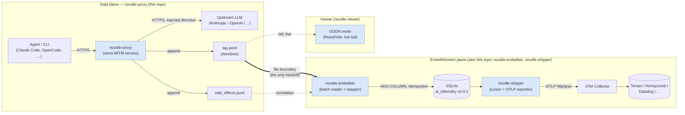
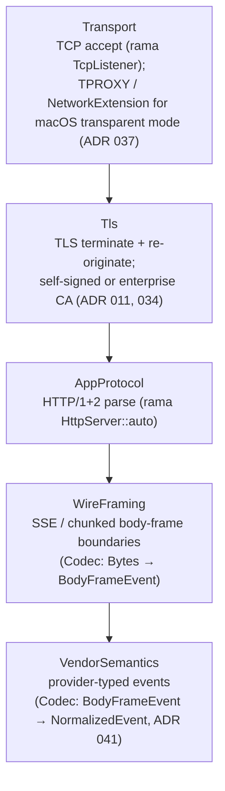
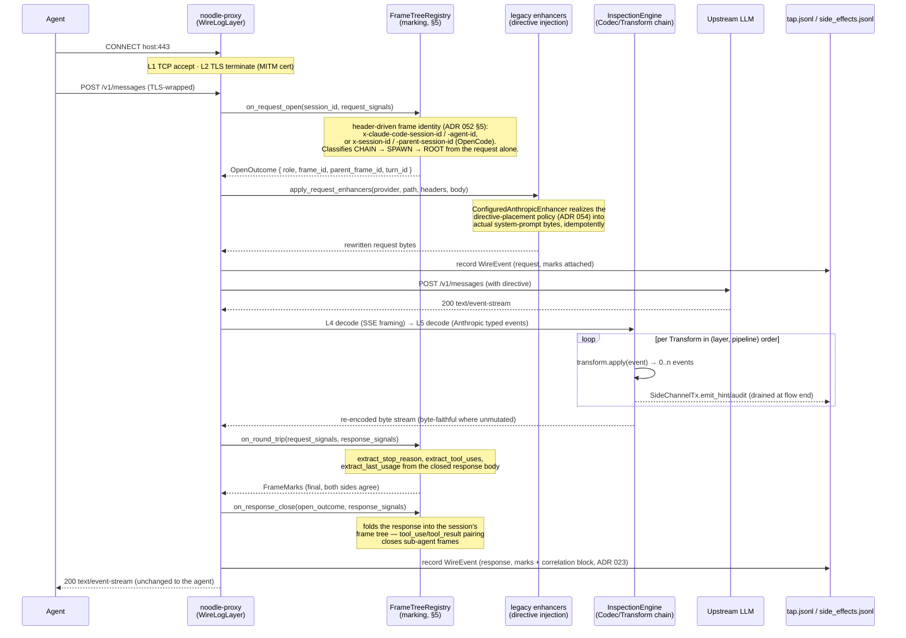
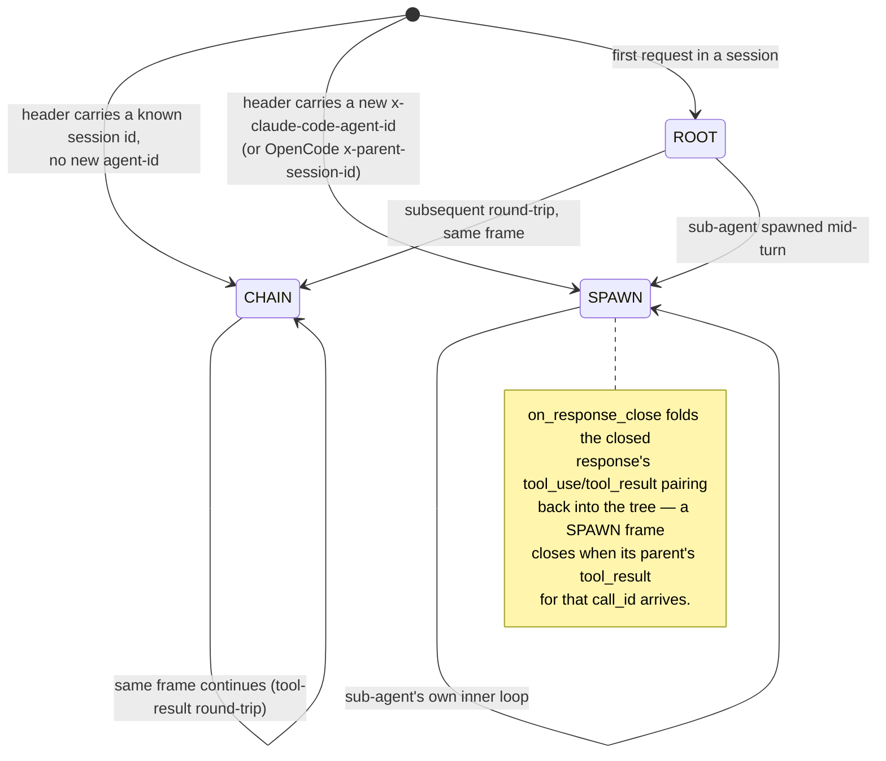
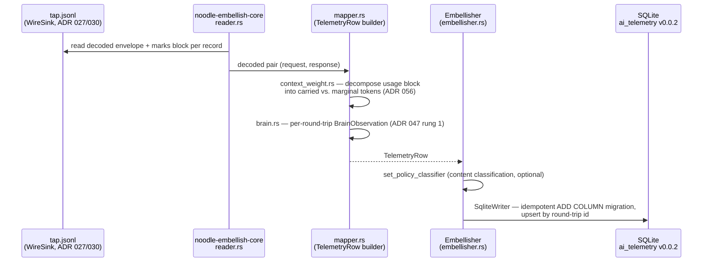
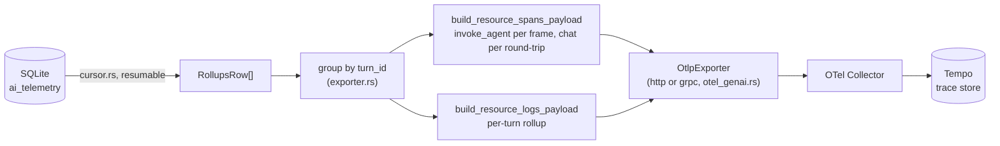

# noodle architecture

> **As-built narrative.** Present-tense description of the system as it
> exists in this tree today. The ADRs (`docs/adrs/`) are authoritative for
> *why* — this doc is authoritative for *what's wired, to what, right now*.
> Where a claim here needs verifying, the anchor is a `crate/path.rs`
> reference, not a line number (line numbers drift; ADR 000 tracks
> shipped-vs-designed status per decision).

**Status:** living
**Author:** Joe Barnett
**Last updated:** 2026-08-11 (full freshness pass — supersedes the
2026-05-09 v1-era draft; see §13 for what changed)

## 1. What noodle does

Agent frameworks and coding assistants (Claude Code, OpenCode, and similar)
talk to LLM providers over HTTPS — mostly streaming (SSE). noodle sits as a
MITM proxy in that path and turns the raw wire traffic into **attributed,
turn-shaped telemetry** without requiring the agent's cooperation:

1. **Capture** every request/response byte-faithfully as it crosses the
   proxy (`tap.jsonl`, ADR 027/030).
2. **Inject** an attribution directive into the system prompt so the model
   can be nudged to cooperate where useful (marker tagging, ADR 054's
   `<system-reminder>` convention) — this is now a secondary mechanism, not
   the load-bearing one.
3. **Reconstruct structure the provider doesn't hand you**: which
   round-trips belong to which human-visible *turn*, which round-trips are
   a sub-agent's own inner loop vs. the root conversation, which are
   one-shot side-calls (title generation, quota probes) that don't belong
   in the tree at all (ADR 052).
4. **Enrich** each round-trip with cost, context-weight (carried vs.
   marginal tokens, ADR 056), tool/file-edit activity, and policy
   classification (ADR 031, 047, 055).
5. **Export** the result as OpenTelemetry GenAI-shaped traces — one trace
   per turn, `invoke_agent` spans per frame, `chat` leaves per round-trip —
   into any OTLP-compatible backend (Tempo, Honeycomb, Datadog, …) (ADR 057).
6. **Show it live** in a debug viewer (OODA mode) while the session runs
   (ADR 007, 051, story 059).

The framing that mattered in v1 — "inject a marker, extract a marker" — is
now one input signal among several. The actual hard problem the system
solves is **turn/frame reconstruction from wire evidence alone**, because
neither the agent nor the provider tells you directly which HTTP requests
belong together.

## 2. Goals and non-goals

### Goals

- **Single pipeline for streaming and non-streaming.** A non-streaming JSON
  response is the degenerate case of a stream of one frame (ADR 015, 033).
- **Provider-agnostic core.** Adding a provider means writing codecs +
  detectors in `noodle-adapters`; `noodle-core` never names a vendor.
- **Byte-faithful passthrough by default.** Unmutated bytes reach the
  client unchanged; only redacted/injected regions are rebuilt
  (`EventSource::Upstream` vs `Mutated`, ADR 017).
- **Reconstruct structure without agent cooperation.** Turn/frame
  boundaries come from wire evidence (headers, request shape, tool-use
  correlation) — cooperation (markers) is a bonus signal, not a
  requirement (ADR 052).
- **Fail open.** A crash or slowdown in the inspection path degrades to
  transparent passthrough, never to a broken agent session (ADR 024).
- **Testability per layer.** Every `Codec`/`Transform` is unit-testable
  without TLS, TCP, or a live provider.

### Non-goals (current)

- **Multi-tenant SaaS posture** (rate limits, quota, billing hooks) — out
  of scope until the single-tenant/single-org model is proven.
- **In-path policy enforcement** (block/redact based on classification) —
  designed (ADR 045 "Watchtower") but not built; today noodle observes and
  attributes, it does not gate.
- **Fleet-scale data plane** (Parquet lake, CA service, multi-replica
  session state) — designed (ADR 044, 050) but not built; today's
  deployment is single-Pod / single-process.
- **Replaying historical sessions or an audit UI beyond the live tailer** —
  the OODA viewer tails `tap.jsonl` live; there is no stored-session
  browser.

## 3. The two-process shape

The system is **two processes**, not one (ADR 022, 033). This is the first
thing to understand — everything else nests inside it.

```mermaid
flowchart LR
    subgraph DataPlane["Data plane — noodle-proxy (this repo)"]
        direction TB
        Agent["Agent / CLI<br/>(Claude Code, OpenCode, ...)"] -->|HTTPS| Proxy["noodle-proxy<br/>(rama MITM service)"]
        Proxy -->|HTTPS, injected directive| LLM["Upstream LLM<br/>(Anthropic / OpenAI / ...)"]
        Proxy -->|append| Tap["tap.jsonl<br/>(WireSink)"]
        Proxy -->|append| SideFx["side_effects.jsonl"]
    end

    subgraph EmbellishPlane["Embellishment plane (also this repo: noodle-embellish, noodle-shipper)"]
        direction TB
        Embellish["noodle-embellish<br/>(batch reader + mapper)"] -->|ADD COLUMN, idempotent| Sqlite[("SQLite<br/>ai_telemetry v0.0.2")]
        Sqlite --> Shipper["noodle-shipper<br/>(cursor + OTLP exporter)"]
        Shipper -->|OTLP http/grpc| Collector["OTel Collector"]
        Collector --> Backend[("Tempo / Honeycomb /<br/>Datadog / ...")]
    end

    subgraph ViewerPlane["Viewer (noodle-viewer)"]
        Viewer["OODA mode<br/>(React/Vite, live tail)"]
    end

    Tap -.tail, live.-> Viewer
    Tap ==>|"file boundary<br/>(the only handoff)"| Embellish
    SideFx -.correlation.-> Embellish

    classDef proc fill:#dae8fc,stroke:#6c8ebf
    class Proxy,Embellish,Shipper,Viewer proc
```

**Why two processes, not one:** the data plane's job is narrow and
latency-sensitive — see every byte, decide fast, never block the agent.
The embellishment plane's job is batch/asynchronous — read what was
captured, join it against itself (tool-call ↔ tool-result, request ↔
response), compute derived facts, ship them out. Coupling them would force
the hot path to carry the slow path's failure modes. `tap.jsonl` +
`side_effects.jsonl` are the **only** interface between the two — a file
boundary, not a shared process or a shared database. ADR 022 originally
scoped the embellishment plane as a separate *repo*; in practice it lives
in this workspace as sibling crates (`noodle-embellish`,
`noodle-embellish-core`, `noodle-shipper`) but the process boundary and
file-based handoff are unchanged.

## 4. The data plane: layered codec engine

Inside `noodle-proxy`, the request/response path is a **layered codec
engine** (ADR 015, `crates/noodle-core/src/layered.rs`). Five layers, not
seven — this supersedes the old L1–L7 OSI-styled stack in the prior
version of this document:

```mermaid
flowchart TB
    L1["Transport<br/>TCP accept (rama TcpListener);<br/>TPROXY / NetworkExtension for macOS transparent mode (ADR 037)"]
    L2["Tls<br/>TLS terminate + re-originate;<br/>self-signed or enterprise CA (ADR 011, 034)"]
    L3["AppProtocol<br/>HTTP/1+2 parse (rama HttpServer::auto)"]
    L4["WireFraming<br/>SSE / chunked body-frame boundaries<br/>(Codec: Bytes → BodyFrameEvent)"]
    L5["VendorSemantics<br/>provider-typed events<br/>(Codec: BodyFrameEvent → NormalizedEvent, ADR 041)"]

    L1 --> L2 --> L3 --> L4 --> L5
```

Two trait shapes cover every layer (ADR 015 §2, `extension-interfaces.md`
§2 has the full scorecard with path:line anchors):

| Trait | Shape | Job |
|---|---|---|
| `Codec` + `CodecInstance` | type-changing (`Input → Output`) | L4/L5 only: reshape bytes into typed events. Factory (`Codec`) + per-flow instance (`CodecInstance`). |
| `Transform` + `TransformInstance` | type-preserving (`Event → Vec<Event>`) | Any layer: mutate, drop, insert, or observe. Selected by `(Layer, Pipeline, guard)` metadata, not registration order. |
| `RequestDetector` | read-only, probe-only | Runs once per request against the cheap `CodecProbe` (host/path/method/headers) — no body buffering, side effects only. |
| `SideEffectSink` / `SideChannelTx` | out-of-band write side | The "pass data off" mechanism: a `Codec`/`Transform` reports `Hint`/`Artifact`/`Audit`/`Resolved` facts here *without* perturbing the event flowing down the chain. |

**The empty-on-error contract (ADR 015 §16) is load-bearing.** None of
these traits return `Result`. On failure, a `Codec`/`Transform` emits
`SideEffect::Audit(AuditEvent { kind: Errored, .. })` and returns an empty
`Vec`. This is what makes "fail open" (§8) a property of the trait
contract rather than something every call site has to remember.

`WireLogLayer` (`crates/noodle-proxy/src/wirelog.rs`) is the orchestrator
that owns one HTTP round-trip end to end. It is **hand-wired**, not a
generic middleware-chain object — it opens the engine flow, selects L4/L5
codecs and the transform chain, and *separately* drives the marking
registry (§5) and a legacy `enhancers`/`filters` list (ADR 005, still live
— boot log reports `filters=N enhancers=N`; `extension-interfaces.md` §3
has the full legacy-vs-layered scorecard). Consolidating the legacy list
onto the `Transform` registry is tracked as open work, not done.

### Request/response sequence

```mermaid
sequenceDiagram
    participant Agent
    participant Proxy as noodle-proxy<br/>(WireLogLayer)
    participant Mark as FrameTreeRegistry<br/>(marking, §5)
    participant Enh as legacy enhancers<br/>(directive injection)
    participant Eng as InspectionEngine<br/>(Codec/Transform chain)
    participant LLM as Upstream LLM
    participant Tap as tap.jsonl / side_effects.jsonl

    Agent->>Proxy: CONNECT host:443
    Note over Proxy: L1 TCP accept · L2 TLS terminate (MITM cert)
    Agent->>Proxy: POST /v1/messages (TLS-wrapped)

    Proxy->>Mark: on_request_open(session_id, request_signals)
    Note over Mark: header-driven frame identity (ADR 052 §5):<br/>x-claude-code-session-id / -agent-id,<br/>or x-session-id / -parent-session-id (OpenCode).<br/>Classifies CHAIN → SPAWN → ROOT from the request alone.
    Mark-->>Proxy: OpenOutcome { role, frame_id, parent_frame_id, turn_id }

    Proxy->>Enh: apply_request_enhancers(provider, path, headers, body)
    Note over Enh: ConfiguredAnthropicEnhancer realizes the<br/>directive-placement policy (ADR 054) into<br/>actual system-prompt bytes, idempotently
    Enh-->>Proxy: rewritten request bytes

    Proxy->>Tap: record WireEvent (request, marks attached)
    Proxy->>LLM: POST /v1/messages (with directive)
    LLM-->>Proxy: 200 text/event-stream

    Proxy->>Eng: L4 decode (SSE framing) → L5 decode (Anthropic typed events)
    loop per Transform in (layer, pipeline) order
        Eng->>Eng: transform.apply(event) → 0..n events
        Eng-->>Tap: SideChannelTx.emit_hint/audit (drained at flow end)
    end
    Eng-->>Proxy: re-encoded byte stream (byte-faithful where unmutated)

    Proxy->>Mark: on_round_trip(request_signals, response_signals)
    Note over Mark: extract_stop_reason, extract_tool_uses,<br/>extract_last_usage from the closed response body
    Mark-->>Proxy: FrameMarks (final, both sides agree)
    Proxy->>Mark: on_response_close(open_outcome, response_signals)
    Note over Mark: folds the response into the session's<br/>frame tree — tool_use/tool_result pairing<br/>closes sub-agent frames

    Proxy->>Tap: record WireEvent (response, marks + correlation block, ADR 023)
    Proxy-->>Agent: 200 text/event-stream (unchanged to the agent)
```

**What this sequence corrects from the prior version of this doc:** there
is no single `LlmAdapter.inject_directive()` call and no `TagPolicy`
object — those were v1 names that were never implemented under those
signatures. The real system splits "inject" (legacy `enhancers`, still
literally the ADR-005 generation) from "reconstruct structure" (the
marking registry, §5, which is its own bespoke state machine, not a
`Transform`) from "decode/mutate the byte stream" (the layered
`Codec`/`Transform` engine, this section). Three separate mechanisms,
driven by one orchestrator (`WireLogLayer`), not one unified pipeline
object.

## 5. Turn/frame reconstruction (the marking detector)

This is the part of the system that didn't exist in v1 and is now the
hardest-earned piece of the design (ADR 049 → 052).

**The problem:** a coding-agent session issues many HTTP round-trips that
have no explicit parent/child relationship at the wire level. A sub-agent
spawned mid-turn looks, on the wire, like just another POST to the same
endpoint. Title-generation and quota-probe side-calls look the same too.
Naively, every round-trip looks like a peer.

**The fix (ADR 052):** `FrameTreeDetector` /
`FrameTreeRegistry` (`crates/noodle-adapters/src/marking/frame_tree.rs`) is
a per-session state machine, driven directly by `WireLogLayer` (not
through the `Transform` registry — it needs cross-request state the
per-event chain doesn't carry). It classifies every round-trip's frame
role from **request-only** signals at open time:

```mermaid
stateDiagram-v2
    [*] --> CHAIN: header carries a known session id,<br/>no new agent-id
    [*] --> SPAWN: header carries a new x-claude-code-agent-id<br/>(or OpenCode x-parent-session-id)
    [*] --> ROOT: first request in a session

    CHAIN --> CHAIN: same frame continues (tool-result round-trip)
    SPAWN --> SPAWN: sub-agent's own inner loop
    ROOT --> CHAIN: subsequent round-trip, same frame
    ROOT --> SPAWN: sub-agent spawned mid-turn

    note right of SPAWN
      on_response_close folds the closed
      response's tool_use/tool_result pairing
      back into the tree — a SPAWN frame
      closes when its parent's tool_result
      for that call_id arrives.
    end note
```

Signals used, in order of preference: **client-supplied headers** first
(`x-claude-code-session-id`/`-agent-id` for Claude Code; `x-session-id` /
`x-parent-session-id` for OpenCode, where the frame *is* the session) —
this is why the detector is described as "client-agnostic": each client's
own session/agent header convention maps onto the same
`role`/`frame_id`/`parent_frame_id`/`turn_id` marks. When headers are
absent, response-side signals (`extract_stop_reason`,
`extract_tool_uses`, `extract_last_usage`, all in `wirelog.rs`) fill in
what the request alone can't tell you.

**Known divergence (not resolved, tracked in ADR 000 row 052/058):** a
second, stateless extractor (`crates/noodle-adapters/src/marking/record.rs`,
ADR 052 §5 "clean" design) exists but is **not wired into the live path**.
`frame_tree.rs` — the stateful one described above — is what's actually
live and proven against real cluster traffic. The keeper decision (which
one wins) is deliberately deferred.

**Known gap:** mid-stream attach (proxy restart while a turn is in
flight) orphans that turn's remaining round-trips, because the state
machine's memory doesn't survive a process restart. Feature 063 (designed,
not built) recovers this from the persisted SQLite marks store instead of
replaying `tap.jsonl`.

## 6. Embellishment: tap.jsonl → SQLite

`noodle-embellish` (batch, not streaming) reads `tap.jsonl` +
`side_effects.jsonl`, joins each round-trip against itself and its marks,
and writes one row per round-trip into SQLite (`ai_telemetry` table,
schema version `v0.0.2`, ADR 031):

```mermaid
sequenceDiagram
    participant Tap as tap.jsonl<br/>(WireSink, ADR 027/030)
    participant Reader as noodle-embellish-core<br/>reader.rs
    participant Mapper as mapper.rs<br/>(TelemetryRow builder)
    participant Emb as Embellisher<br/>(embellisher.rs)
    participant Db as SQLite<br/>ai_telemetry v0.0.2

    Reader->>Tap: read decoded envelope + marks block per record
    Reader->>Mapper: decoded pair (request, response)
    Mapper->>Mapper: context_weight.rs — decompose usage block<br/>into carried vs. marginal tokens (ADR 056)
    Mapper->>Mapper: brain.rs — per-round-trip BrainObservation (ADR 047 rung 1)
    Mapper-->>Emb: TelemetryRow
    Emb->>Emb: set_policy_classifier (content classification, optional)
    Emb->>Db: SqliteWriter — idempotent ADD COLUMN migration,<br/>upsert by round-trip id
```

Each new telemetry dimension (context-weight, brain, file-edits) lands as
its own `ADD COLUMN` migration on the same table — additive, never a
schema rewrite. This is why ADR 047/055/056 all describe themselves as
"horizontal extensions of the existing pipeline": the join/mapper shape
doesn't change, only the row gets wider.

## 7. Shipping: SQLite → OTel GenAI traces

`noodle-shipper` reads SQLite via a cursor (`cursor.rs`, resumable —
survives shipper restarts without re-sending), builds OTLP payloads, and
POSTs them to a collector. Two export shapes exist (ADR 057):

- `build_resource_logs_payload` — per-turn summary rollups (log records).
- `build_resource_spans_payload` — **trace = turn.** One `invoke_agent`
  span per `(turn_id, frame_id)`, nested by `parent_frame_id`; one `chat`
  span per round-trip, parented to its frame's `invoke_agent`. Side-calls
  (frame-less round-trips) export as standalone off-tree `chat` spans —
  by design, not a bug: they genuinely have no parent turn.

```mermaid
flowchart LR
    Sqlite[("SQLite<br/>ai_telemetry")] -->|cursor.rs, resumable| Rows["RollupsRow[]"]
    Rows --> Group["group by turn_id<br/>(exporter.rs)"]
    Group --> Spans["build_resource_spans_payload<br/>invoke_agent per frame, chat per round-trip"]
    Group --> Logs["build_resource_logs_payload<br/>per-turn rollup"]
    Spans --> Otlp["OtlpExporter<br/>(http or grpc, otel_genai.rs)"]
    Logs --> Otlp
    Otlp --> Collector["OTel Collector"]
    Collector --> Tempo[("Tempo<br/>trace store")]
```

This chain is **proven live in a real cluster** (a `rancher-desktop`
deployment): a Claude Code session with parallel sub-agents renders as a
navigable `invoke_agent ROOT → sub-agent frames → chat leaves` tree in
Tempo, with `context.*` (ADR 056) and `brain.*` (ADR 047) attributes on
the spans. See `docs/operations/otel-genai-harness.md` for the dated
TraceQL evidence and `crates/noodle-trace-emitter` for an offline
reproducer that doesn't need a live agent session.

## 8. Fail-open and trust boundaries

**What's exposed:**

- The proxy's MITM listener — localhost-only in dev, a single Kubernetes
  Pod's ClusterIP in the gateway deployment (ADR 043); never `0.0.0.0` on
  a developer machine.
- A separate **ops listener** (health, metrics) alongside the MITM
  listener in the k8s gateway topology.
- The CA private key — self-signed (dev, ADR 011) or enterprise
  BYOCA-static / Vault PKI (ADR 034, 038) — whoever holds it can MITM any
  client that trusts it. Filesystem-mode 0600, scoped to the proxy
  process user.
- The OTLP collector endpoint the shipper POSTs to — auth via configured
  headers (ADR 046), not yet mutual-TLS.

**Fail-open is a contract, not a hope (ADR 024).** Because `Codec`/
`Transform` never return `Result` (§4), an inspection-path failure cannot
propagate into a broken proxied response — it becomes an `Errored` audit
event and an empty output, and the "rip cord" health-degradation path
(ADR 024) falls back further to transparent passthrough if inspection
itself becomes unhealthy. The MITM trust boundary (TLS termination) and
the marking/embellishment path are independent failure domains: a marking
bug produces wrong attribution, never a broken byte stream, because marks
are stamped as metadata alongside the wire event, not spliced into it.

**What could still go wrong (unchanged risk classes from v1, still
mitigated the same way):** CA key compromise (scoped key, regenerable);
directive/marker leakage into agent-visible content (redaction tested at
the byte level, ADR 017 §7); provider event shapes an adapter doesn't
recognize (default pass-through + WARN, never silent drop).

## 9. Deployment topologies

Three, at different maturity (ADR 039 is the umbrella; ADR 000 has current
status per row):

| Topology | Status | Where |
|---|---|---|
| Local forward proxy (dev) | ✓ shipped | `noodle-proxy` binary, HTTP CONNECT, `127.0.0.1` |
| macOS transparent (sysext) | ✓ shipped | `apps/noodle-macos` (Xcode/xcodegen) + `crates/noodle-macos-tproxy` (NetworkExtension) |
| Kubernetes gateway (single Pod) | ◐ shipped, acceptance test not logged | `deploy/k8s/{deployment,service,otlp-sink,observability}.yaml` |
| Scalable cluster (CA service + Parquet data plane) | □ designed only | ADR 044 |

The dev observability harness (`docker/otel-genai/` — collector + Tempo +
Grafana) is a fourth, harness-only topology for proving the trace-export
chain without a live agent session; not a deployment target.

## 10. Patterns in play

Cross-reference for `../adrs/002-hexagonal-and-patterns.md`. This replaces
the v1 pattern table, which named types (`OpenAiAdapter`, `TagPolicy`,
`MultiAuditSink`) that were never implemented under those exact names —
though the *shape* MultiAuditSink was gesturing at is real: a dedicated
`crates/noodle-sinks` implements a fan-out (`MultiSideEffectSink`) plus
`TracingSink`/`SideEffectsJsonlSink`/`RoundTripSink`, all `SideEffectSink`
impls (§4).

| Pattern | Where | Note |
|---|---|---|
| **Hexagonal / Ports & Adapters** | `noodle-core` (ports) vs. `noodle-adapters` (impls) vs. `noodle-proxy` (driving) | The Cargo dependency graph enforces it — `core` cannot depend on `adapters` or `proxy`. |
| **Strategy** | Each `Codec`/`Transform`/`RequestDetector` impl | e.g. `LayeredAnthropicCodec` (L5, the new-generation `Codec` trait) — interchangeable behind the same trait as any future L5 codec. `OpenAiCodec` exists today but still implements the legacy `ProviderCodec` trait (`codec.rs`), not yet ported to `Codec`. |
| **Registry + selection-by-predicate** (not classic first-match Factory) | `CodecRegistry`, `TransformRegistry`, `RequestDetectorRegistry` (`layered.rs`) | Selected by `(Layer, Pipeline, guard)` metadata or a cheap probe predicate, not simple registration order. |
| **Builder** | `InspectionEngineBuilder` (`layered/engine.rs`) | Required-port validation at `build()`, not at every call site. |
| **Pipeline / typed-stream middleware** | `decode → Transform chain (ordered) → encode` | The `Transform` trait is the "Gin handler chain" shape, but ordered by `(layer, pipeline, order)` metadata, not registration order. |
| **State machine** | `FrameTreeDetector` (§5) | Per-session; the one place cross-request state lives outside a store. |
| **Side-channel / CQS-flavored audit** | `SideChannelTx` / `SideEffectSink` | Facts about a flow are reported out-of-band from the payload that flows through it — a `Codec` can't accidentally corrupt bytes by trying to log something. |
| **Cache-and-Release buffering primitive** | `CacheAndRelease<E>` (ADR 016) | Generic bounded-buffer-with-flush-policy; four specialized `Extractor`s cover ~80% of buffering needs without a bespoke FSM each time. |
| **Pipes-and-filters at the system level** | `tap.jsonl` → embellish → SQLite → shipper → OTLP (§3, §6, §7) | The macro architecture is this pattern one level up: each stage reads a durable artifact the previous stage wrote, never a live call. |
| **Decorator** | rama `Layer<S>` composition in `noodle-proxy::main` | Standard tower/rama service-layering; unchanged from v1. |
| **Empty-on-error / fail-open contract** | ADR 015 §16, all `Codec`/`Transform` impls | Not a GoF pattern by name, but load-bearing enough to call out on its own — see §8. |

If a pattern doesn't fit anywhere in this table, or a type from an older
doc doesn't appear here, that's a signal the older doc was describing
something that was designed but never built — check ADR 000 before citing
it as current.

## 11. Companion docs

- [`extension-interfaces.md`](extension-interfaces.md) — the two
  generations of extension interface (layered v2 vs. legacy three-role),
  with `path:line` anchors and a genericity scorecard. Read this alongside
  §4/§10 above for the trait-level detail this doc summarizes.
- [`../diagrams/flows.md`](../diagrams/flows.md) — the mermaid diagram set
  (hexagonal view, sequence diagrams, state machines) this doc's inline
  diagrams are drawn from, kept as a standalone reference.
- [`../diagrams/type-model.md`](../diagrams/type-model.md) — struct/trait
  topology at the type level (domain types, ports, adapters, per-request
  object lifecycle).
- [`../adrs/000-tracking.md`](../adrs/000-tracking.md) — shipped-vs-designed
  status per ADR; the authority on "is X built yet."
- [`../adrs/002-hexagonal-and-patterns.md`](../adrs/002-hexagonal-and-patterns.md)
  — the pattern catalog referenced in §10.
- [`../adrs/015-layered-codec-architecture.md`](../adrs/015-layered-codec-architecture.md),
  [`052-turn-run-lineage-frame-tree.md`](../adrs/052-turn-run-lineage-frame-tree.md),
  [`057-otel-genai-trace-export.md`](../adrs/057-otel-genai-trace-export.md)
  — the three ADRs §4/§5/§7 summarize; read these for full rationale.

## 12. References

- rama framework: <https://github.com/plabayo/rama> (sibling checkout
  `../rama`, path dependency)
- OpenTelemetry GenAI semantic conventions: what `noodle-shipper`'s
  `gen_ai.*` attributes target (ADR 057).

## 13. What changed in this freshness pass (2026-08-11)

The prior version of this doc (2026-05-09) described a **prototype design
that was superseded before it shipped**: `LlmAdapter`/`TagPolicy`/
`SessionStore`/`AuditSink` traits, an `OpenAiAdapter`/`AnthropicAdapter`/
`WsAdapter` registry, a single `InspectionPipeline`, and a 7-layer OSI
stack. None of those type names exist in the current tree. What actually
shipped (ADR 015 layered codec engine, ADR 052 marking/frame-tree
detector, the two-process embellishment architecture of ADR 022, and the
OTel GenAI export chain of ADR 057) is a different and considerably larger
design than the v1 draft anticipated. This rewrite replaces the doc body
wholesale rather than patching it — ADR 053's "architecture is living
description, rewritten as reality changes" rule applied literally, since
patching would have left load-bearing fictions (like `TagPolicy`) standing
next to real code. Companion diagram docs (`flows.md`, `type-model.md`)
were rewritten in the same pass for the same reason — see their own
freshness notes.
