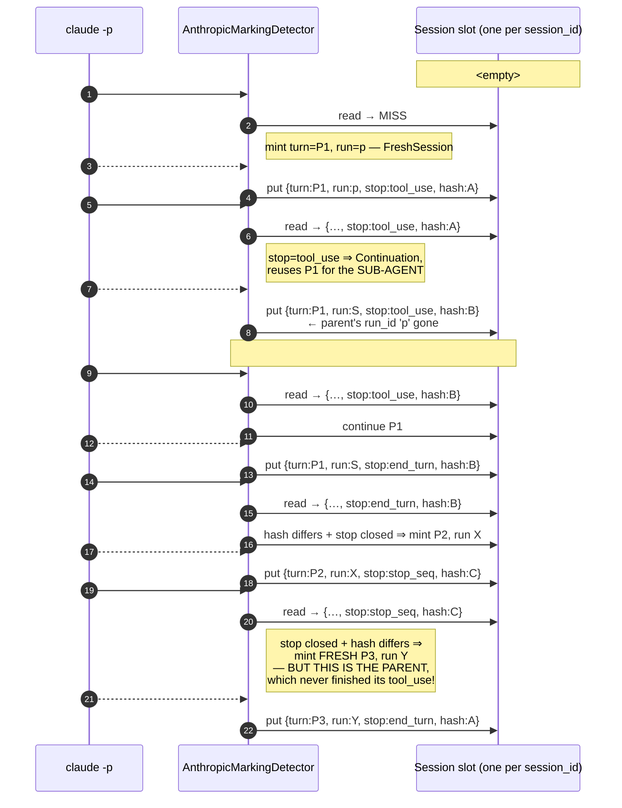
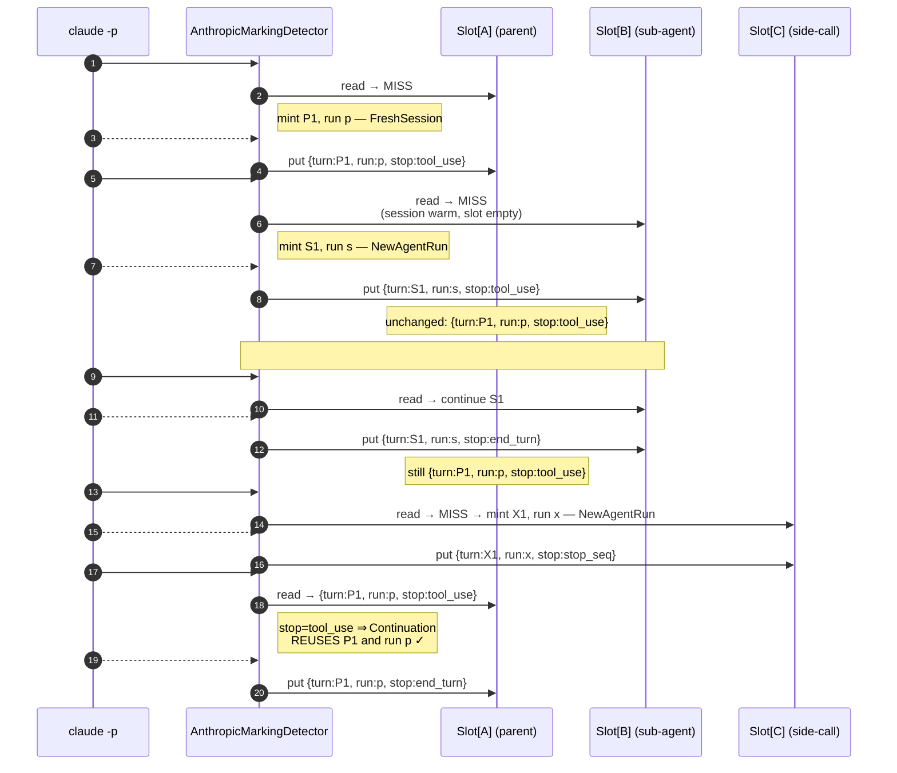

# Per-agent-run SessionState (ADR 048 §11 item 0)

Walks through the canonical 8-turn `claude -p` sequence captured in
`captures/max/parent-task-subagent.mitm`, showing how the
single-slot `SessionState` corrupts parent tracking and how the
per-agent-run map fixes it. Driven by the same fixture the Rust
tests consume:
`crates/noodle-adapters/tests/fixtures/adr_048/parent-task-subagent.fixture.json`.

## The capture, abstractly

All 8 round-trips share the same Anthropic `session_id` (verified:
`metadata.user_id.session_id == 230b90e5-…` on every turn). What
varies is the canonical system-prompt hash, which identifies which
agent is talking:

| Turn | system hash (truncated) | stop_reason | role |
|:----:|:------------------------|:------------|:------|
| #1   | `1e426…` (A)            | `tool_use`  | parent calls `Task` (Agent tool) |
| #2   | `1157b…` (B)            | `tool_use`  | sub-agent kicks off (Bash) |
| #3   | `1157b…` (B)            | `tool_use`  | sub-agent reads files |
| #4   | `1157b…` (B)            | `tool_use`  | sub-agent reads files |
| #5   | `1157b…` (B)            | `tool_use`  | sub-agent reads files |
| #6   | `1157b…` (B)            | `end_turn`  | sub-agent returns its answer |
| #7   | `f7a4c…` (C)            | `stop_seq.` | a separate side-call |
| #8   | `1e426…` (A)            | `end_turn`  | parent resumes with the Agent tool_result |

The right answer: turns #1 and #8 belong to **one** parent turn —
the parent emitted a `tool_use` at #1, the API replays the
sub-agent's result at #8, and the parent finishes the turn. They
must carry the **same** `turn_id` and the **same** `agent_run_id`.

## BEFORE — single-slot SessionState (the bug)

The old `SessionState` had one slot per `MarkingSessionId`:

```rust
struct SessionState {
    current_turn_id: Option<TurnId>,
    current_agent_run_id: Option<AgentRunId>,
    last_stop_reason: Option<StopReason>,
    last_system_hash: Option<SystemHash>,
    parent_session_id: Option<MarkingSessionId>,
    last_observed_at_unix_ms: u64,
}
```

Every `on_response_close` overwrote those four "current/last"
fields. With one slot and N agents sharing a session, last writer
wins:



Net effect: parent's #1 was stamped with `(P1, run:p)`, parent's #8
with `(P3, run:Y)`. Downstream telemetry shows two unrelated turn
ids and two unrelated agent runs for what was one logical turn.

## AFTER — per-agent-run map (the fix)

`SessionState.runs: HashMap<Option<SystemHash>, AgentRunState>`.
Each agent's in-flight state lives in its own slot, keyed by the
canonical system hash that identifies it.

```rust
struct SessionState {
    runs: HashMap<Option<SystemHash>, AgentRunState>,
    parent_session_id: Option<MarkingSessionId>,
    last_observed_at_unix_ms: u64,
}
struct AgentRunState {
    current_turn_id: TurnId,
    agent_run_id: AgentRunId,
    last_stop_reason: Option<StopReason>,
}
```

The detector reads / writes only the slot keyed by the request's
canonical system hash. Parent and sub-agent are isolated:



Now turn #1 and turn #8 both stamp `(P1, run:p)`. The parent's
logical turn is one turn end-to-end. The sub-agent's lifecycle
(`B`) and the side-call (`C`) have their own slots and don't
touch the parent's.

## Decision-kind mapping

The four `MarkingDecisionKind` variants are now scoped per-slot,
not per-session:

| Cached state for `request_system_hash` | `last_stop_reason` | Variant |
|---|---|---|
| no session at all | — | `FreshSession` |
| session exists, no slot for this hash | — | `NewAgentRun` |
| slot exists | `tool_use` | `Continuation` |
| slot exists | `end_turn` / `max_tokens` / `stop_sequence` / unknown | `NewTurn` |

`AgentRunDecisionKind` maps 1:1: `FreshSession` ↔ `FreshSession`,
`NewAgentRun` ↔ `NewAgentRun`, `NewTurn`/`Continuation` ↔
`Continuation` (an existing slot's agent_run_id is always reused).

## Why a `HashMap` and not a `BTreeMap`

`SystemHash` is a 32-byte content-addressable fingerprint —
ordering between hashes has no semantic meaning, only equality
does. `HashMap` is the natural choice; insertion order doesn't
matter, and the small per-session entry count (typically 1–3:
parent + occasional sub-agent + occasional side-call) means
hashing overhead is negligible.

## Eviction is unchanged

`InMemoryMarkingStore::evict_older_than(ttl_ms, now)` still keys on
`last_observed_at_unix_ms` at the session level. When a session is
evicted, all its agent-run slots go with it. There is no per-slot
TTL — agent runs share the lifetime of the wire session.

## What this does NOT solve

ADR 048 §11 item 0 enumerates four sub-problems; PR-B addresses
**only item 0** (per-agent-run state shape). Still open:

- **Sub-agent lineage** (`parent_turn_id`, `parent_session_id` of
  the spawning turn) — needs the assistant-side `Task` tool_use_id
  → next turn's tool_result correlation. Tracked for PR-C.
- **Tap.jsonl / OTLP schema additions** — once lineage is captured,
  the marks block + ai_telemetry_v_0_0_2 record need new fields.
  Tracked for PR-C.
- **Viewer OODA tree** — rendering parent → sub-agent as a tree
  rather than a flat session list. Tracked for PR-D.
