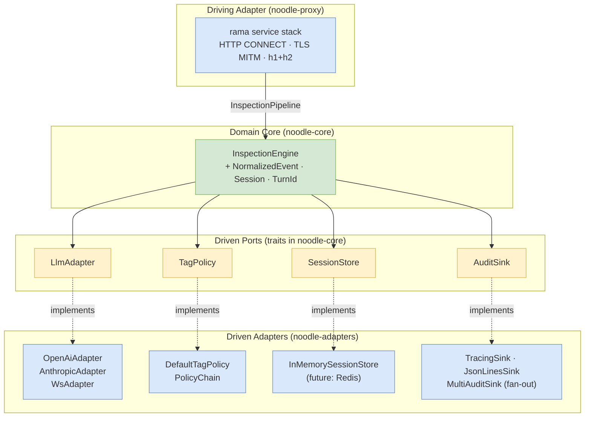
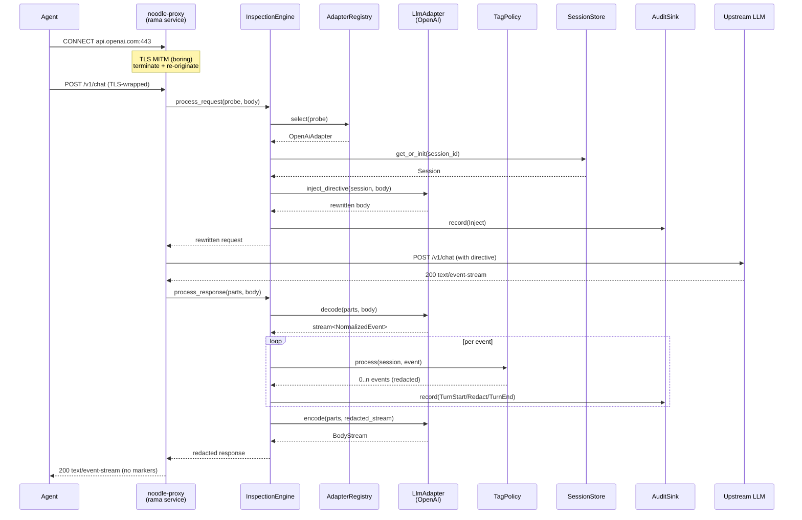
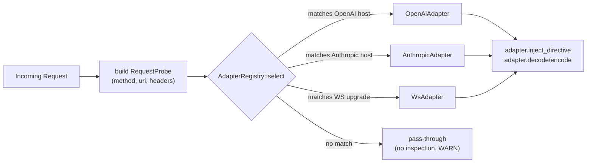
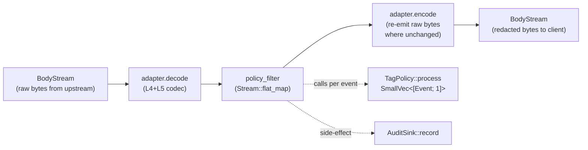
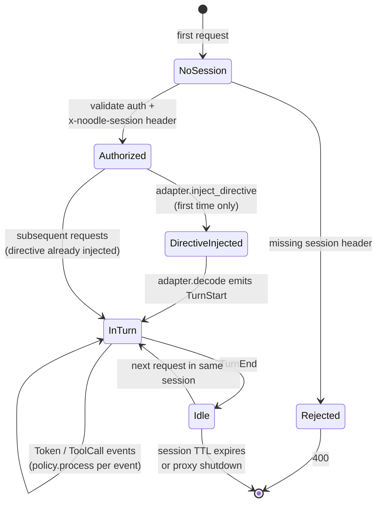

# noodle flow diagrams

Five mermaid diagrams that together describe how noodle works. Drawio files
in this directory cover the same material with more visual detail; this
file is the LLM-friendly text version.

## 1. Hexagonal component view

The whole architecture in one picture. Domain core in the middle, four
driven ports on the boundary, driving adapter at the top, driven adapters
on the outside.

## 2. Request lifecycle

End-to-end on a streaming chat completion. The driving adapter (rama)
brackets the call; the engine + ports do the work in between.

## 3. Adapter selection (Factory pattern)

The registry is first-match-wins, registered in order at startup. Adding
a provider is exactly: write an `LlmAdapter`, register it in
`OrderedRegistry::builder()`. No central `match` statement to update.

## 4. Stream pipeline (decode → policy → encode)

The hot path for streaming responses. Pure stream combinators; no I/O
inside the policy step.

Backpressure is preserved end-to-end because every step is a `Stream`
adapter; no buffering except inside the policy when it is mid-marker.

## 5. Session + turn lifecycle (state machine)

The `directive_injected` flag lives on the `Session` itself (an
`AtomicBool`), so the "inject once" semantic survives concurrent
requests.
