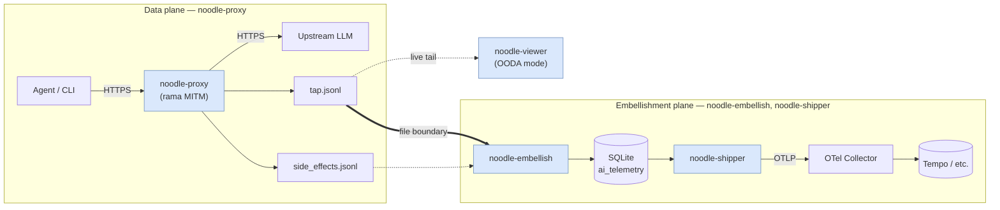
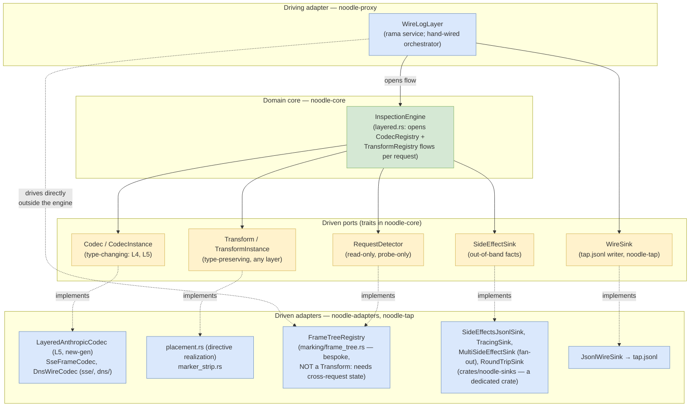
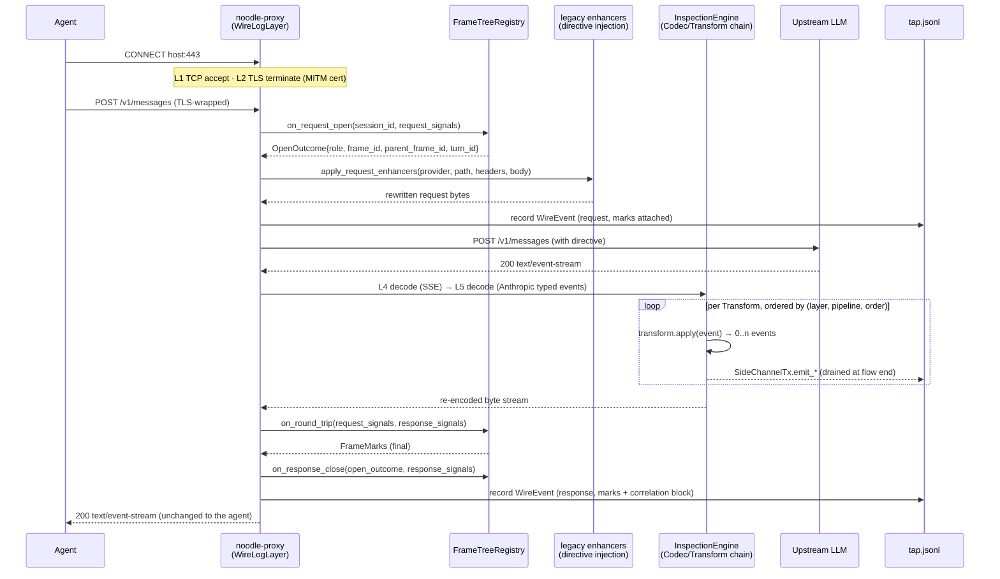
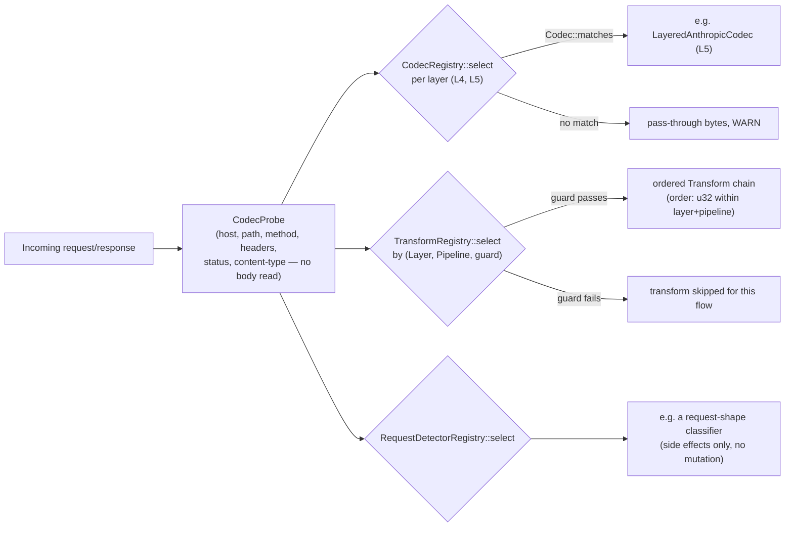
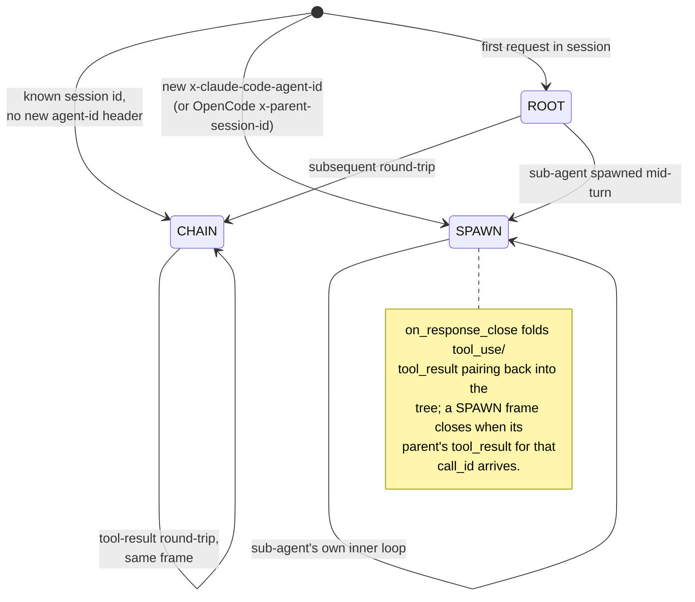
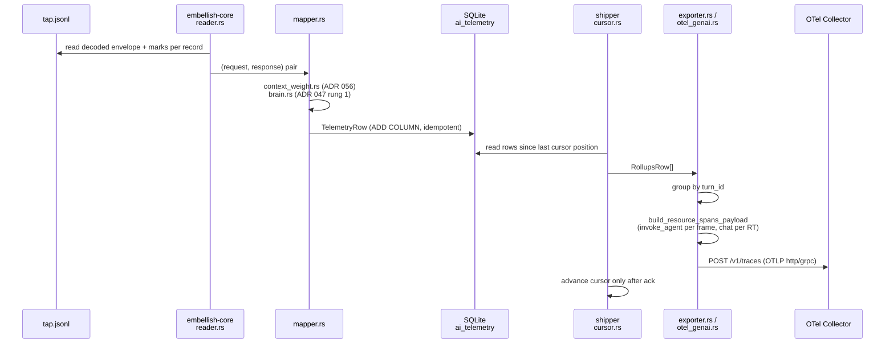
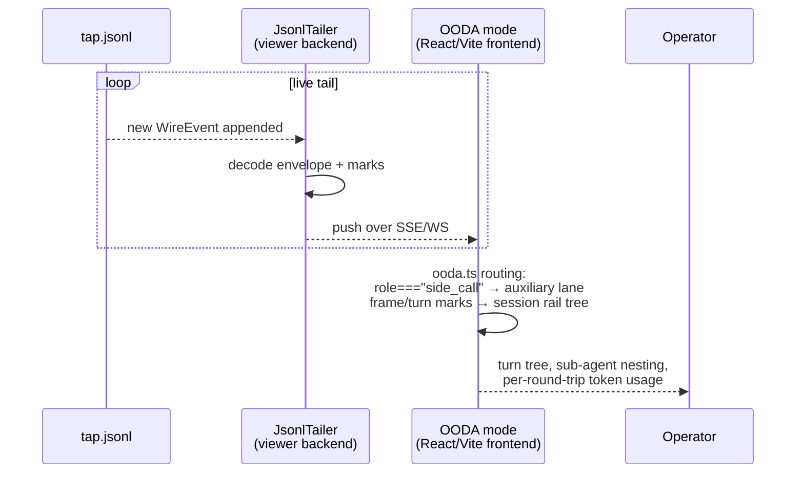

# noodle flow diagrams

> **Freshness note (2026-08-11):** this file was a v1-era companion to the
> old `../architecture/architecture.md` draft and described types
> (`LlmAdapter`, `TagPolicy`, `AdapterRegistry`) that were never
> implemented under those names. Rewritten wholesale against the current
> tree — see `../architecture/architecture.md` §13 for why a rewrite
> rather than a patch. Drawio files in this directory cover some of the
> same material with more visual polish; the ADR-015/016/022-numbered ones
> (`015-layered-codec-architecture.drawio`, `016-cache-and-release-primitives.drawio`,
> `022-data-and-embellishment-planes.drawio`) are current. The
> un-numbered ones (`architecture-hexagonal.drawio`,
> `noodle-component-object-model.drawio`, `component-relationships.drawio`,
> `osi-mapping.drawio`) predate this rewrite and carry the same v1
> fictions as the old architecture doc — treat this file and
> `type-model.md` as authoritative until those are refreshed or retired.

Seven mermaid diagrams describing how noodle actually works today, grouped
the way you'd read the system: system shape, then the data-plane hot path,
then the two places that hold cross-request state, then the batch pipeline
that turns capture into shipped telemetry, then the live viewer.

## 1. System shape — two processes, one file boundary

The whole system in one picture. Full narrative in
[`../architecture/architecture.md`](../architecture/architecture.md) §3.

```mermaid
flowchart LR
    subgraph DataPlane["Data plane — noodle-proxy"]
        direction TB
        Agent["Agent / CLI"] -->|HTTPS| Proxy["noodle-proxy<br/>(rama MITM)"]
        Proxy -->|HTTPS| LLM["Upstream LLM"]
        Proxy --> Tap["tap.jsonl"]
        Proxy --> SideFx["side_effects.jsonl"]
    end

    subgraph EmbellishPlane["Embellishment plane — noodle-embellish, noodle-shipper"]
        direction TB
        Embellish["noodle-embellish"] --> Sqlite[("SQLite<br/>ai_telemetry")]
        Sqlite --> Shipper["noodle-shipper"]
        Shipper -->|OTLP| Collector["OTel Collector"] --> Backend[("Tempo / etc.")]
    end

    Viewer["noodle-viewer<br/>(OODA mode)"]

    Tap -.live tail.-> Viewer
    Tap ==>|file boundary| Embellish
    SideFx -.-> Embellish

    classDef proc fill:#dae8fc,stroke:#6c8ebf
    class Proxy,Embellish,Shipper,Viewer proc
```

## 2. Hexagonal component view — the data plane's ports and adapters

Domain core in the middle, the real driven ports from
`crates/noodle-core/src/layered.rs`, driving adapter (`noodle-proxy`) on
top, driven adapters (`noodle-adapters`, `noodle-tap`) on the outside.

```mermaid
flowchart TB
    subgraph Driving["Driving adapter — noodle-proxy"]
        Rama["WireLogLayer<br/>(rama service; hand-wired orchestrator)"]
    end

    subgraph Core["Domain core — noodle-core"]
        Engine["InspectionEngine<br/>(layered.rs: opens CodecRegistry +<br/>TransformRegistry flows per request)"]
    end

    subgraph Ports["Driven ports (traits in noodle-core)"]
        P1["Codec / CodecInstance<br/>(type-changing: L4, L5)"]
        P2["Transform / TransformInstance<br/>(type-preserving, any layer)"]
        P3["RequestDetector<br/>(read-only, probe-only)"]
        P4["SideEffectSink<br/>(out-of-band facts)"]
        P5["WireSink<br/>(tap.jsonl writer, noodle-tap)"]
    end

    subgraph DrivenAdapters["Driven adapters — noodle-adapters, noodle-tap"]
        A1["LayeredAnthropicCodec (L5, new-gen)<br/>SseFrameCodec, DnsWireCodec (sse/, dns/)"]
        A2["placement.rs (directive realization)<br/>marker_strip.rs"]
        A3["FrameTreeRegistry<br/>(marking/frame_tree.rs — bespoke,<br/>NOT a Transform: needs cross-request state)"]
        A4["SideEffectsJsonlSink, TracingSink,<br/>MultiSideEffectSink (fan-out), RoundTripSink<br/>(crates/noodle-sinks — a dedicated crate)"]
        A5["JsonlWireSink → tap.jsonl"]
    end

    Rama -->|opens flow| Engine
    Rama -.drives directly<br/>outside the engine.-> A3
    Engine --> P1 & P2 & P3 & P4
    P1 -.implements.-> A1
    P2 -.implements.-> A2
    P3 -.implements.-> A3
    P4 -.implements.-> A4
    P5 -.implements.-> A5
    Rama --> P5

    classDef core fill:#d5e8d4,stroke:#82b366
    classDef port fill:#fff2cc,stroke:#d6b656
    classDef adapter fill:#dae8fc,stroke:#6c8ebf
    class Engine core
    class P1,P2,P3,P4,P5 port
    class Rama,A1,A2,A3,A4,A5 adapter
```

**What's different from the v1 diagram this replaces:** there is no
`LlmAdapter` port bundling matches/inject/decode/encode into one trait —
that's split across `Codec` (decode/encode, type-changing) and `Transform`
(mutation, type-preserving). There is no `TagPolicy` — redaction/injection
is the `placement.rs`/`marker_strip.rs` transforms. `FrameTreeRegistry` is
drawn as driven *directly* by the proxy layer, not through the engine's
port abstraction — it genuinely isn't one of the four generic ports; it's
bespoke, hand-wired, session-stateful code (see `extension-interfaces.md`
§3.3).

## 3. Request lifecycle — full sequence

The hot path for one round-trip, three mechanisms running under one
orchestrator. Identical to `architecture.md` §4's sequence, repeated here
as the dedicated diagram reference.

```mermaid
sequenceDiagram
    participant Agent
    participant Proxy as noodle-proxy<br/>(WireLogLayer)
    participant Mark as FrameTreeRegistry
    participant Enh as legacy enhancers<br/>(directive injection)
    participant Eng as InspectionEngine<br/>(Codec/Transform chain)
    participant LLM as Upstream LLM
    participant Tap as tap.jsonl

    Agent->>Proxy: CONNECT host:443
    Note over Proxy: L1 TCP accept · L2 TLS terminate (MITM cert)
    Agent->>Proxy: POST /v1/messages (TLS-wrapped)

    Proxy->>Mark: on_request_open(session_id, request_signals)
    Mark-->>Proxy: OpenOutcome{role, frame_id, parent_frame_id, turn_id}

    Proxy->>Enh: apply_request_enhancers(provider, path, headers, body)
    Enh-->>Proxy: rewritten request bytes

    Proxy->>Tap: record WireEvent (request, marks attached)
    Proxy->>LLM: POST /v1/messages (with directive)
    LLM-->>Proxy: 200 text/event-stream

    Proxy->>Eng: L4 decode (SSE) → L5 decode (Anthropic typed events)
    loop per Transform, ordered by (layer, pipeline, order)
        Eng->>Eng: transform.apply(event) → 0..n events
        Eng-->>Tap: SideChannelTx.emit_* (drained at flow end)
    end
    Eng-->>Proxy: re-encoded byte stream

    Proxy->>Mark: on_round_trip(request_signals, response_signals)
    Mark-->>Proxy: FrameMarks (final)
    Proxy->>Mark: on_response_close(open_outcome, response_signals)

    Proxy->>Tap: record WireEvent (response, marks + correlation block)
    Proxy-->>Agent: 200 text/event-stream (unchanged to the agent)
```

## 4. Codec / Transform / RequestDetector selection

How the engine picks *which* codec or transform runs, per request. This
is a **registry-selects-by-predicate** pattern, not a classic
first-match-wins Factory (the v1 diagram's framing).

```mermaid
flowchart LR
    Req["Incoming request/response"] --> Probe["CodecProbe<br/>(host, path, method, headers,<br/>status, content-type — no body read)"]

    Probe --> CReg{"CodecRegistry::select<br/>per layer (L4, L5)"}
    CReg -->|Codec::matches| C1["e.g. LayeredAnthropicCodec (L5)"]
    CReg -->|no match| CNone["pass-through bytes, WARN"]

    Probe --> TReg{"TransformRegistry::select<br/>by (Layer, Pipeline, guard)"}
    TReg -->|guard passes| T1["ordered Transform chain<br/>(order: u32 within layer+pipeline)"]
    TReg -->|guard fails| TSkip["transform skipped for this flow"]

    Probe --> DReg{"RequestDetectorRegistry::select"}
    DReg --> D1["e.g. a request-shape classifier<br/>(side effects only, no mutation)"]
```

Each registry is **independent per layer** (ADR 015 §14.1 decision 1) —
an L4 codec choice never constrains the L5 codec choice; cross-layer
constraints surface as side-channel hints, not coupled selection logic.
Adding a provider is: write the `Codec`/`Transform` impls, register them —
no central `match` statement to touch.

## 5. Turn/frame reconstruction — marking state machine

The per-session state machine that reconstructs conversational structure
the wire doesn't hand you directly (ADR 052). Full narrative in
`architecture.md` §5.

```mermaid
stateDiagram-v2
    [*] --> CHAIN: known session id,<br/>no new agent-id header
    [*] --> SPAWN: new x-claude-code-agent-id<br/>(or OpenCode x-parent-session-id)
    [*] --> ROOT: first request in session

    CHAIN --> CHAIN: tool-result round-trip,<br/>same frame
    SPAWN --> SPAWN: sub-agent's own inner loop
    ROOT --> CHAIN: subsequent round-trip
    ROOT --> SPAWN: sub-agent spawned mid-turn

    note right of SPAWN
        on_response_close folds tool_use/
        tool_result pairing back into the
        tree; a SPAWN frame closes when its
        parent's tool_result for that
        call_id arrives.
    end note
```

Classification happens **at request open**, from request-only signals —
by the time a round-trip closes, every response it causally depends on has
already closed. The response side only *confirms and folds in* what open
already decided (`on_response_close`), it doesn't reclassify.

## 6. Batch pipeline — tap.jsonl → SQLite → OTLP traces

Everything after the data plane is pull-based batch processing over
durable files, not a live call chain. Full narrative in
`architecture.md` §6–§7.

```mermaid
sequenceDiagram
    participant Tap as tap.jsonl
    participant Reader as embellish-core<br/>reader.rs
    participant Mapper as mapper.rs
    participant Db as SQLite<br/>ai_telemetry
    participant Cursor as shipper<br/>cursor.rs
    participant Exp as exporter.rs /<br/>otel_genai.rs
    participant Collector as OTel Collector

    Reader->>Tap: read decoded envelope + marks per record
    Reader->>Mapper: (request, response) pair
    Mapper->>Mapper: context_weight.rs (ADR 056)<br/>brain.rs (ADR 047 rung 1)
    Mapper->>Db: TelemetryRow (ADD COLUMN, idempotent)

    Cursor->>Db: read rows since last cursor position
    Cursor->>Exp: RollupsRow[]
    Exp->>Exp: group by turn_id
    Exp->>Exp: build_resource_spans_payload<br/>(invoke_agent per frame, chat per RT)
    Exp->>Collector: POST /v1/traces (OTLP http/grpc)
    Cursor->>Cursor: advance cursor only after ack
```

The cursor being resumable (`cursor.rs`) is what makes this pipeline
restart-safe: a shipper crash re-reads from the last acknowledged
position, never re-derives from `tap.jsonl` directly.

## 7. Live viewer — OODA mode

The one place in the system that reads `tap.jsonl` as a live stream
instead of a batch file (`crates/noodle-viewer`).

```mermaid
sequenceDiagram
    participant Tap as tap.jsonl
    participant Tail as JsonlTailer<br/>(viewer backend)
    participant UI as OODA mode<br/>(React/Vite frontend)
    participant Op as Operator

    loop live tail
        Tap-->>Tail: new WireEvent appended
        Tail->>Tail: decode envelope + marks
        Tail-->>UI: push over SSE/WS
    end
    UI->>UI: ooda.ts routing:<br/>role==="side_call" → auxiliary lane<br/>frame/turn marks → session rail tree
    UI-->>Op: turn tree, sub-agent nesting,<br/>per-round-trip token usage
```

This is the fastest feedback loop in the system — no SQLite, no OTLP, no
batch step. It trades that speed for shallower enrichment: the viewer
shows what the marking detector decided live, not the fuller
context-weight/brain/file-edit dimensions that only exist after
`noodle-embellish` runs.
