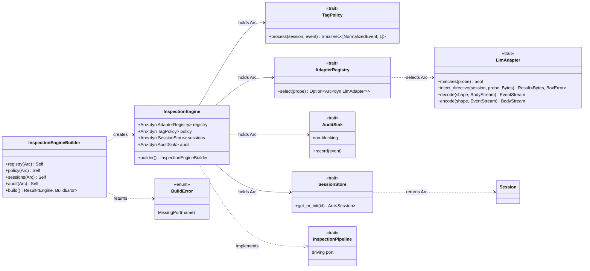
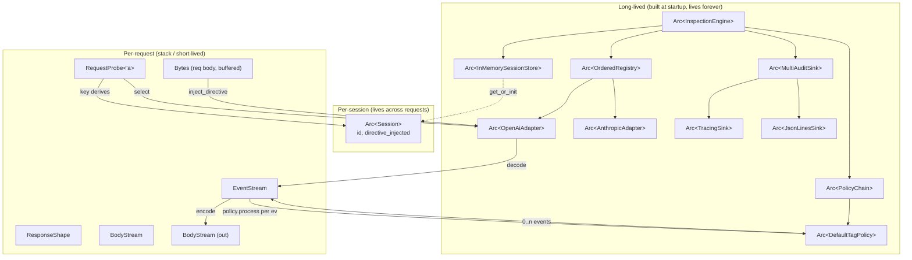

# noodle type model

The actual struct/trait topology. Companion to
[`flows.md`](flows.md) (behaviour) and the architecture diagram
(structure at the package level). This file is the structure at the
type level.

Four diagrams:

1. Domain value types (data the system reasons about).
2. Ports and the engine (interfaces and the orchestrator).
3. Driven adapters (concrete impls realizing the ports).
4. Per-request object lifecycle (which instances exist when, and who
   owns them).

## 1. Domain value types

Pure data. No logic, no I/O. These cross every boundary in the system,
which is why they are deliberately thin and immutable-by-construction.

```mermaid
classDiagram
    direction LR

    class NormalizedEvent {
        <<enum>>
        TurnStart{turn_id, role}
        Token{text, raw}
        ToolCall{call_id, name, args_json, raw}
        TurnEnd{turn_id, finish}
        Metadata{raw}
    }

    class TurnId {
        +SmolStr 0
    }
    class Role {
        <<enum>>
        System
        User
        Assistant
        Tool
    }
    class FinishReason {
        <<enum>>
        Stop
        Length
        ToolCall
        ContentFilter
        Other(SmolStr)
    }
    class ProviderChunk {
        +Bytes 0
        wire-faithful raw
    }

    class Session {
        +SessionId id
        +AtomicBool directive_injected
    }
    class SessionId {
        -[u8; 32] hash
        +prefix() SmolStr
    }
    class SessionKey {
        +&[u8] auth_header
        +&[u8] session_header
        +id() SessionId
    }

    class RequestProbe {
        +&Method method
        +&Uri uri
        +&HeaderMap headers
    }
    class ResponseShape {
        +StatusCode status
        +HeaderMap headers
        +ResponseKind kind
    }
    class ResponseKind {
        <<enum>>
        Sse
        JsonOnce
        Other
    }

    class AuditEvent {
        <<enum>>
        Inject
        TurnStart
        Redact
        TurnEnd
    }

    NormalizedEvent --> TurnId
    NormalizedEvent --> Role
    NormalizedEvent --> FinishReason
    NormalizedEvent --> ProviderChunk
    Session --> SessionId
    SessionKey ..> SessionId : derives
    ResponseShape --> ResponseKind
    AuditEvent --> SessionId
    AuditEvent --> TurnId
    AuditEvent --> FinishReason
```

**Ownership notes:**

- `RequestProbe` and `SessionKey` are **borrowed views** — they hold
  references with a lifetime, never own. Cheap to construct per request,
  cannot leak past the call site.
- `Session` uses `AtomicBool` for `directive_injected` so it can be
  shared across concurrent requests without a lock.
- `ProviderChunk(Bytes)` is a newtype, not just `Bytes`, so the
  re-encode contract ("emit these bytes verbatim") is a type-level
  signal — you can't accidentally pass arbitrary bytes where a
  faithful re-emission is required.

## 2. Ports and the engine

Four driven ports + one driving port + the orchestrator. Everything in
`noodle-core`.



**Ownership notes:**

- All ports stored as `Arc<dyn Trait>` on the engine. Cloning the
  engine across tokio tasks is `Arc::clone` x4. No locks.
- `&self` everywhere on traits — interior mutability lives inside
  concrete impls (e.g. `DashMap` inside `InMemorySessionStore`,
  `AtomicBool` inside `Session`).
- The traits are object-safe (no generics, no `Self` in return
  position) — this is why `Arc<dyn Trait>` works at all.

## 3. Driven adapters realizing the ports

In `noodle-adapters`. One concrete file per impl. The Composite impls
(`PolicyChain`, `MultiAuditSink`) hold `Vec<Arc<dyn ...>>` of the same
trait — they are themselves implementations of the port.

```mermaid
classDiagram
    direction TB

    class LlmAdapter { <<trait>> }
    class TagPolicy { <<trait>> }
    class SessionStore { <<trait>> }
    class AuditSink { <<trait>> }
    class AdapterRegistry { <<trait>> }

    class OpenAiAdapter
    class AnthropicAdapter
    class WsAdapter

    class DefaultTagPolicy {
        +Marker marker
        +TurnState state via Session ext
    }
    class PolicyChain {
        +Vec~Arc~dyn TagPolicy~~ inner
        Composite
    }
    class NoOpPolicy

    class InMemorySessionStore {
        +DashMap~SessionId, Arc~Session~~ map
    }

    class TracingSink
    class JsonLinesSink {
        +tokio::sync::mpsc::Sender tx
        bg writer task
    }
    class MultiAuditSink {
        +Vec~Arc~dyn AuditSink~~ sinks
        Composite
    }

    class OrderedRegistry {
        +Vec~Arc~dyn LlmAdapter~~ adapters
        Factory + first-match
    }

    OpenAiAdapter ..|> LlmAdapter
    AnthropicAdapter ..|> LlmAdapter
    WsAdapter ..|> LlmAdapter

    DefaultTagPolicy ..|> TagPolicy
    PolicyChain ..|> TagPolicy
    NoOpPolicy ..|> TagPolicy
    PolicyChain o-- TagPolicy : aggregates many

    InMemorySessionStore ..|> SessionStore

    TracingSink ..|> AuditSink
    JsonLinesSink ..|> AuditSink
    MultiAuditSink ..|> AuditSink
    MultiAuditSink o-- AuditSink : fan-out

    OrderedRegistry ..|> AdapterRegistry
    OrderedRegistry o-- LlmAdapter : ordered list
```



**Ownership notes:**

- Every Composite (`PolicyChain`, `MultiAuditSink`, `OrderedRegistry`)
  is itself an impl of the same port, not a special wrapper type.
  This is what makes them transparent: anywhere a `Arc<dyn TagPolicy>`
  is accepted, a chain works.
- `JsonLinesSink` owns a bounded `mpsc::Sender`. The receiver runs in a
  background task spawned at construction. The inspection path never
  blocks — full channels drop and increment a counter (per
  `010-audit-log-and-tracing.md`).

## 4. Per-request object lifecycle

What exists at runtime when one request flows through. Stack-allocated
or short-lived items in lighter borders; long-lived `Arc`s are darker.



**Lifetime summary:**

| object | scope | count |
|-|-|-|
| `InspectionEngine` and the four port `Arc`s | process | 1 |
| `Arc<dyn LlmAdapter>` per provider | process | N (small) |
| `Arc<Session>` | session (TTL) | per session |
| `RequestProbe`, `SessionKey` | one fn call | per request |
| `BodyStream`, `EventStream` | one request | per request |
| `NormalizedEvent` | one stream tick | thousands per stream |

The hot allocation in the system is `NormalizedEvent`. That's why
`Token::raw: ProviderChunk(Bytes)` is a cheap reference-counted slice
(via `bytes::Bytes`) and why `TagPolicy::process` returns
`SmallVec<[NormalizedEvent; 1]>` — the common case (one event in,
one event out unchanged) does not allocate.

## 5. Where each pattern lives, in types

Cross-reference for the pattern catalog in
[`../adrs/002-hexagonal-and-patterns.md`](../adrs/002-hexagonal-and-patterns.md):

| pattern | type | crate |
|-|-|-|
| Factory | `OrderedRegistry` (`AdapterRegistry` impl) | adapters |
| Strategy | `OpenAiAdapter`, `DefaultTagPolicy`, … | adapters |
| Composite | `PolicyChain`, `MultiAuditSink` | adapters |
| Builder | `InspectionEngineBuilder` | core |
| Lazy factory | `SessionStore::get_or_init` (creates `Session` on demand) | core port, in-memory impl |
| Decorator | rama `Layer<S>` chain in `noodle-proxy::main` | proxy |
| Pipeline | `decode → flat_map(policy) → encode` over `Stream` | core engine + adapters |

If a pattern doesn't fit anywhere in this table, that is signal it
shouldn't be in the codebase yet.
