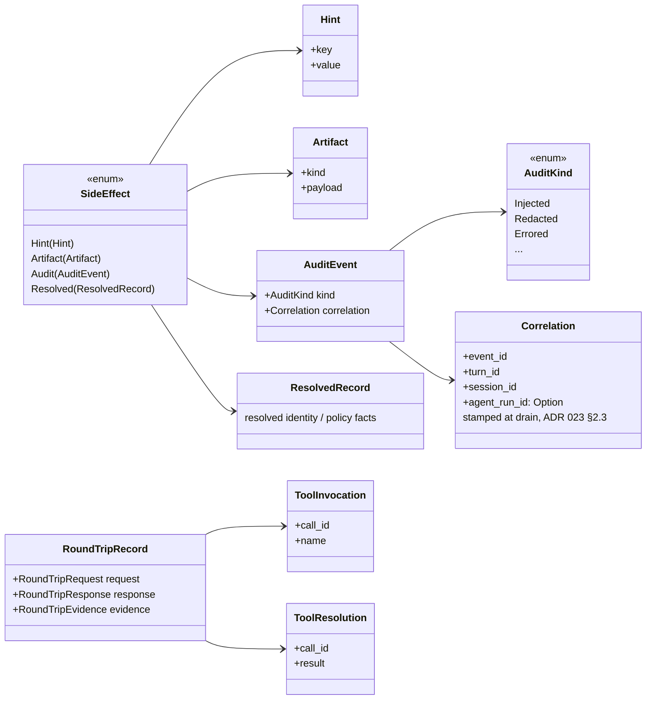
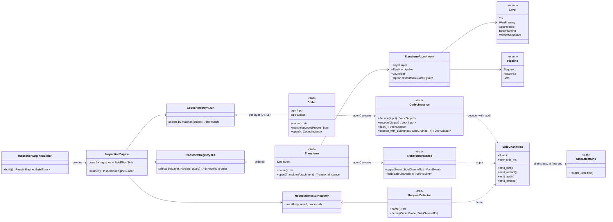
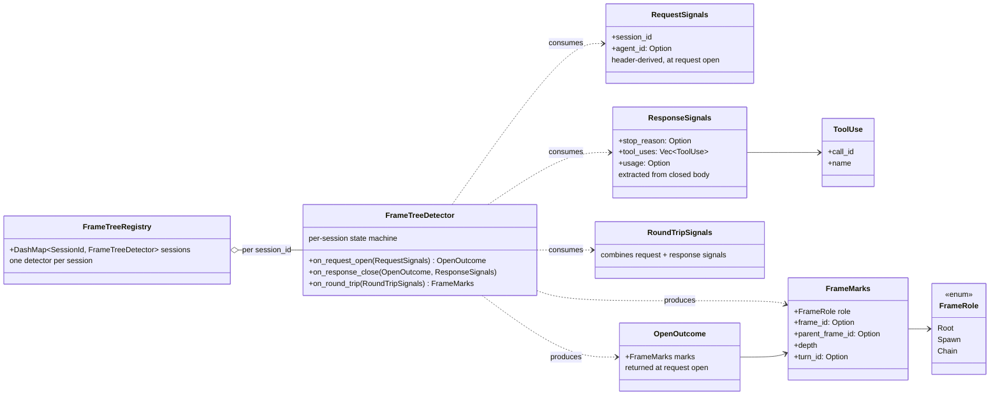
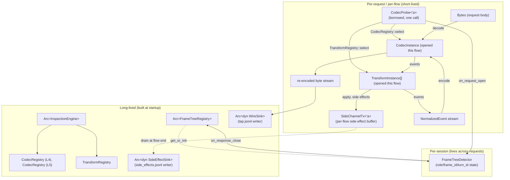
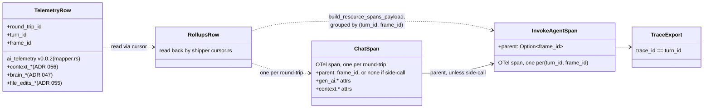

# noodle type model

> **Freshness note (2026-08-11):** fully rewritten. The prior version
> described `NormalizedEvent`/`LlmAdapter`/`TagPolicy`/`InspectionPipeline`
> — a v1 trait surface that was superseded by the layered codec engine
> (ADR 015) before it shipped under those names. See
> `../architecture/architecture.md` §13.

The actual struct/trait topology in `crates/noodle-core/src/layered.rs`
(the data-plane engine) plus the marking, embellishment, and shipping
types that sit alongside it. Companion to [`flows.md`](flows.md)
(behaviour) — this file is the structure at the type level.

Five diagrams:

1. Side-effect and correlation value types (what crosses the data plane's
   out-of-band channel).
2. The engine's ports (`Codec`, `Transform`, `RequestDetector`,
   `SideEffectSink`) and the `InspectionEngine` that owns their registries.
3. Marking types — the frame-tree state machine's inputs/outputs
   (ADR 052).
4. Per-request object lifecycle — what exists at runtime, and for how
   long.
5. Downstream types — the embellishment row and the OTel span shapes it
   becomes.

## 1. Side-effect and correlation value types

Pure data. Crosses every layer via `SideChannelTx`, never via the typed
event stream itself — this is what makes it safe for a `Codec` to report
a fact without risking the bytes flowing through it.

```mermaid
classDiagram
    direction LR

    class SideEffect {
        <<enum>>
        Hint(Hint)
        Artifact(Artifact)
        Audit(AuditEvent)
        Resolved(ResolvedRecord)
    }
    class Hint {
        +key
        +value
    }
    class Artifact {
        +kind
        +payload
    }
    class AuditEvent {
        +AuditKind kind
        +Correlation correlation
    }
    class AuditKind {
        <<enum>>
        Injected
        Redacted
        Errored
        ...
    }
    class Correlation {
        +event_id
        +turn_id
        +session_id
        +agent_run_id: Option
        stamped at drain, ADR 023 §2.3
    }
    class ResolvedRecord {
        resolved identity / policy facts
    }
    class RoundTripRecord {
        +RoundTripRequest request
        +RoundTripResponse response
        +RoundTripEvidence evidence
    }
    class ToolInvocation {
        +call_id
        +name
    }
    class ToolResolution {
        +call_id
        +result
    }

    SideEffect --> Hint
    SideEffect --> Artifact
    SideEffect --> AuditEvent
    SideEffect --> ResolvedRecord
    AuditEvent --> AuditKind
    AuditEvent --> Correlation
    RoundTripRecord --> ToolInvocation
    RoundTripRecord --> ToolResolution
```

**Ownership notes:**

- `Correlation` is stamped by the engine at **drain time**, not at
  emission time — a `Codec`/`Transform` never has to know its own
  `event_id`/`turn_id`; it just calls `emit_hint`/`emit_audit` and the
  engine fills in the join keys when it flushes the per-flow buffer.
- `agent_run_id` is `Option` by design: it stays `None` until boundary
  detection resolves it, so the schema never needed an additive migration
  to add the field later — it shipped present-but-unpopulated first
  (story 040.c).
- `AuditKind::Errored` is the empty-on-error contract's payload (ADR 015
  §16) — every `Vec::new()` a `Codec`/`Transform` returns on failure is
  paired with exactly one of these.

## 2. The engine's ports

Everything in `crates/noodle-core/src/layered.rs`. Four generic ports,
selected from per-layer registries, opened by one `InspectionEngine`.

```mermaid
classDiagram
    direction LR

    class Codec {
        <<trait>>
        type Input
        type Output
        +name() str
        +matches(CodecProbe) bool
        +open() CodecInstance
    }
    class CodecInstance {
        <<trait>>
        +decode(Input) Vec~Output~
        +encode(Output) Vec~Input~
        +flush() Vec~Output~
        +decode_with_audit(Input, SideChannelTx) Vec~Output~
    }
    class Transform {
        <<trait>>
        type Event
        +name() str
        +open(TransformAttachment) TransformInstance
    }
    class TransformInstance {
        <<trait>>
        +apply(Event, SideChannelTx) Vec~Event~
        +flush(SideChannelTx) Vec~Event~
    }
    class TransformAttachment {
        +Layer layer
        +Pipeline pipeline
        +u32 order
        +Option~TransformGuard~ guard
    }
    class Layer {
        <<enum>>
        Tls
        WireFraming
        AppProtocol
        BodyFraming
        VendorSemantics
    }
    class Pipeline {
        <<enum>>
        Request
        Response
        Both
    }
    class RequestDetector {
        <<trait>>
        +name() str
        +detect(CodecProbe, SideChannelTx)
    }
    class SideEffectSink {
        <<trait>>
        +record(SideEffect)
    }
    class SideChannelTx {
        +flow_id
        +now_unix_ms
        +emit_hint()
        +emit_artifact()
        +emit_audit()
        +emit_errored()
    }
    class CodecRegistry~I,O~ {
        selects by matches(probe), first-match
    }
    class TransformRegistry~E~ {
        selects by (Layer, Pipeline, guard),<br/>opens in order
    }
    class RequestDetectorRegistry {
        runs all registered, probe-only
    }
    class InspectionEngine {
        owns 3x registries + SideEffectSink
        +builder() InspectionEngineBuilder
    }
    class InspectionEngineBuilder {
        +build() Result~Engine, BuildError~
    }

    Codec ..> CodecInstance : open() creates
    Transform ..> TransformInstance : open() creates
    Transform --> TransformAttachment
    TransformAttachment --> Layer
    TransformAttachment --> Pipeline
    CodecInstance ..> SideChannelTx : decode_with_audit
    TransformInstance ..> SideChannelTx : apply
    RequestDetector ..> SideChannelTx : detect
    SideChannelTx ..> SideEffectSink : drains into, at flow end

    InspectionEngine --> CodecRegistry
    InspectionEngine --> TransformRegistry
    InspectionEngine --> RequestDetectorRegistry
    InspectionEngineBuilder ..> InspectionEngine : creates
    CodecRegistry o-- Codec : per layer (L4, L5)
    TransformRegistry o-- Transform : ordered
    RequestDetectorRegistry o-- RequestDetector
```

**Ownership notes:**

- `Codec`/`Transform` are the **factory**; `CodecInstance`/
  `TransformInstance` are the **per-flow instance**. Two flows never
  share an instance — this is what lets a codec hold mid-parse state
  (a half-assembled SSE frame) without a lock.
- `CodecRegistry<I, O>` is generic over the event types at that layer —
  L4's registry is `CodecRegistry<Bytes, BodyFrameEvent>`, L5's is
  `CodecRegistry<BodyFrameEvent, NormalizedEvent>`. They cannot be mixed
  up at compile time.
- `TransformRegistry` selection is **not** first-match — it opens *every*
  transform whose `guard` passes, in `order`, for the given
  `(Layer, Pipeline)`. This is the one place the v1 doc's "Factory,
  first-match-wins" framing genuinely doesn't apply.
- `SideChannelTx` is per-flow and short-lived; `SideEffectSink` is the
  long-lived `Arc<dyn Trait>` it drains into.

## 3. Marking types — turn/frame reconstruction

`crates/noodle-adapters/src/marking/frame_tree.rs`. Not part of the ports
above — this is bespoke, cross-request state, driven directly by
`WireLogLayer` (see `flows.md` §2, §5).

```mermaid
classDiagram
    direction LR

    class FrameRole {
        <<enum>>
        Root
        Spawn
        Chain
    }
    class RequestSignals {
        +session_id
        +agent_id: Option
        header-derived, at request open
    }
    class ResponseSignals {
        +stop_reason: Option
        +tool_uses: Vec~ToolUse~
        +usage: Option
        extracted from closed body
    }
    class ToolUse {
        +call_id
        +name
    }
    class RoundTripSignals {
        combines request + response signals
    }
    class OpenOutcome {
        +FrameMarks marks
        returned at request open
    }
    class FrameMarks {
        +FrameRole role
        +frame_id: Option
        +parent_frame_id: Option
        +depth
        +turn_id: Option
    }
    class FrameTreeDetector {
        per-session state machine
        +on_request_open(RequestSignals) OpenOutcome
        +on_response_close(OpenOutcome, ResponseSignals)
        +on_round_trip(RoundTripSignals) FrameMarks
    }
    class FrameTreeRegistry {
        +DashMap~SessionId, FrameTreeDetector~ sessions
        one detector per session
    }

    FrameTreeRegistry o-- FrameTreeDetector : per session_id
    FrameTreeDetector ..> RequestSignals : consumes
    FrameTreeDetector ..> ResponseSignals : consumes
    FrameTreeDetector ..> RoundTripSignals : consumes
    FrameTreeDetector ..> OpenOutcome : produces
    FrameTreeDetector ..> FrameMarks : produces
    OpenOutcome --> FrameMarks
    FrameMarks --> FrameRole
    ResponseSignals --> ToolUse
```

**Ownership notes:**

- One `FrameTreeDetector` per `SessionId`, held in the registry's map —
  this is the one place in the data plane where state genuinely outlives
  a single request (a `Session` in the old v1 doc's sense doesn't exist
  as its own type; the detector *is* the session-scoped state).
- `FrameMarks` is deliberately small and `Option`-heavy: a round-trip with
  no extractable session id gets `frame_id: None` etc., and the
  `tap.jsonl` record simply omits the marks block rather than failing.

## 4. Per-request object lifecycle

What exists at runtime when one round-trip flows through the data plane.

```mermaid
flowchart TB
    subgraph "Long-lived (built at startup)"
        ENGINE["Arc&lt;InspectionEngine&gt;"]
        CREG["CodecRegistry (L4), CodecRegistry (L5)"]
        TREG["TransformRegistry"]
        MARKREG["Arc&lt;FrameTreeRegistry&gt;"]
        WIRE["Arc&lt;dyn WireSink&gt;<br/>(tap.jsonl writer)"]
        SFX["Arc&lt;dyn SideEffectSink&gt;<br/>(side_effects.jsonl writer)"]
        ENGINE --> CREG & TREG
    end

    subgraph "Per-session (lives across requests)"
        DET["FrameTreeDetector<br/>(role/frame_id/turn_id state)"]
        MARKREG -.get_or_init.-> DET
    end

    subgraph "Per-request / per-flow (short-lived)"
        PROBE["CodecProbe&lt;'a&gt;<br/>(borrowed, one call)"]
        REQB["Bytes (request body)"]
        CINST["CodecInstance (opened this flow)"]
        TINST["TransformInstance[] (opened this flow)"]
        TX["SideChannelTx&lt;'a&gt;<br/>(per-flow side-effect buffer)"]
        EVS["NormalizedEvent stream"]
        OUT["re-encoded byte stream"]
    end

    PROBE -->|CodecRegistry::select| CINST
    PROBE -->|TransformRegistry::select| TINST
    PROBE -->|on_request_open| DET
    REQB -->|decode| CINST
    CINST -->|events| TINST
    TINST -->|apply, side effects| TX
    TX -.drain at flow end.-> SFX
    TINST -->|events| EVS
    EVS -->|encode| CINST
    CINST --> OUT
    DET -->|on_response_close| MARKREG
    OUT --> WIRE
```

**Lifetime summary:**

| object | scope | count |
|---|---|---|
| `InspectionEngine`, registries | process | 1 |
| `Arc<dyn WireSink>`, `Arc<dyn SideEffectSink>` | process | 1 each |
| `FrameTreeDetector` | session | per active session |
| `CodecProbe` | one call | per request/response |
| `CodecInstance`, `TransformInstance[]` | one flow | per request |
| `SideChannelTx` | one flow | per request, drained at end |
| `NormalizedEvent` | one stream tick | thousands per streamed response |

The hot allocation is still `NormalizedEvent`, same as v1 — that part of
the original design's reasoning held up. `CodecInstance` holding
`Box<dyn ...>` state (not `Arc`) is what makes two concurrent flows on the
same provider never share a parser's mid-frame buffer.

## 5. Downstream types — embellishment row and OTel spans

What `tap.jsonl` becomes after the batch pipeline (`flows.md` §6). These
types live in `noodle-embellish-core`, `noodle-embellish`, and
`noodle-shipper` — outside the data-plane engine entirely.

```mermaid
classDiagram
    direction LR

    class TelemetryRow {
        ai_telemetry v0.0.2 (mapper.rs)
        +round_trip_id
        +turn_id
        +frame_id
        +context_* (ADR 056)
        +brain_* (ADR 047)
        +file_edits_* (ADR 055)
    }
    class RollupsRow {
        read back by shipper cursor.rs
    }
    class InvokeAgentSpan {
        OTel span, one per (turn_id, frame_id)
        +parent: Option~frame_id~
    }
    class ChatSpan {
        OTel span, one per round-trip
        +parent: frame_id, or none if side-call
        +gen_ai.* attrs
        +context.* attrs
    }
    class TraceExport {
        trace_id == turn_id
    }

    TelemetryRow ..> RollupsRow : read via cursor
    RollupsRow ..> InvokeAgentSpan : build_resource_spans_payload,<br/>grouped by (turn_id, frame_id)
    RollupsRow ..> ChatSpan : one per round-trip
    InvokeAgentSpan --> TraceExport
    ChatSpan --> InvokeAgentSpan : parent, unless side-call
```

**Ownership notes:**

- `TelemetryRow` is append-only-wide: every ADR that adds a telemetry
  dimension (056 context-weight, 047 brain, 055 file-edits) adds columns,
  never restructures the row. The mapper (`mapper.rs`) is the one place
  that knows how to build a row from a decoded `tap.jsonl` pair.
- A `ChatSpan` with no resolvable `frame_id` is exported as a standalone
  trace, not dropped and not force-parented — side-calls (title
  generation, quota probes) are real telemetry, they just aren't part of
  a turn.

## 6. Where each pattern lives, in types

Cross-reference for the pattern catalog in
[`../adrs/002-hexagonal-and-patterns.md`](../adrs/002-hexagonal-and-patterns.md)
and `../architecture/architecture.md` §10:

| pattern | type | crate |
|---|---|---|
| Strategy | `Codec`/`Transform`/`RequestDetector` impls (e.g. `LayeredAnthropicCodec`) | noodle-adapters |
| Registry + selection-by-predicate | `CodecRegistry`, `TransformRegistry`, `RequestDetectorRegistry` | noodle-core |
| Builder | `InspectionEngineBuilder` | noodle-core |
| State machine | `FrameTreeDetector` | noodle-adapters |
| Side-channel / out-of-band audit | `SideChannelTx` / `SideEffectSink` | noodle-core |
| Pipeline (typed-stream middleware) | `decode → Transform chain → encode` | noodle-core engine + noodle-adapters |
| Pipes-and-filters (system level) | `TelemetryRow → RollupsRow → {InvokeAgentSpan, ChatSpan}` | noodle-embellish, noodle-shipper |
| Decorator | rama `Layer<S>` chain in `noodle-proxy::main` | noodle-proxy |

If a pattern doesn't fit anywhere in this table, that's signal it
shouldn't be cited as current — check ADR 000 before relying on it.
