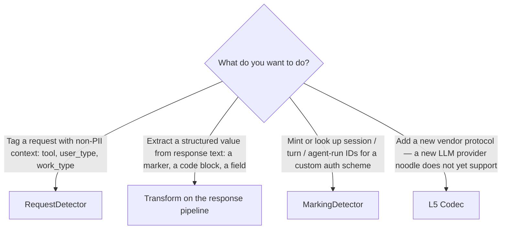

# Plugin authoring guide

How to write a `noodle-detect` plugin from scratch and ship it as
a `wasm32-unknown-unknown` artifact a host LLM gateway can load.

The contracts this guide assumes are specified in:

- [`docs/adrs/039-...`](../adrs/039-deployment-topologies-and-the-noodle-detect-facade.md) — the facade API and the WASM boundary.
- [`docs/adrs/015-layered-codec-architecture.md`](../adrs/015-layered-codec-architecture.md) — the `Codec` / `Transform` traits a plugin extends.
- [`docs/adrs/021-detector-vs-transform-two-tier.md`](../adrs/021-detector-vs-transform-two-tier.md) — the `RequestDetector` shape.
- [`docs/adrs/042-codec-side-channel-and-error-contract.md`](../adrs/042-codec-side-channel-and-error-contract.md) — the audit-emission contract every codec follows.

---

## 1. Scope

This guide covers:

- The decision of what kind of capability to write (detector,
  transform, marking detector).
- The minimal Rust scaffolding for a plugin crate.
- Building the plugin to WASM.
- Verifying the artifact loads in a host runtime.

This guide does **not** cover:

- The host-language glue that loads the WASM artifact and calls
  `detect()` — see the per-host embedding guides
  (`plugin-embedding-python.md`, `-go.md`, `-node.md`).
- Testing the plugin in isolation — see
  [`plugin-testing-guide.md`](plugin-testing-guide.md).
- Operating the plugin in production — see
  [`plugin-debugging-guide.md`](plugin-debugging-guide.md).

## 2. Prerequisites

| Tool | Version | Purpose |
|---|---|---|
| `cargo` + `rustup` | rust 1.93+ | Building the plugin |
| `wasm32-unknown-unknown` target | installed via `rustup target add` | Compiling to WASM |
| `wasm-tools` (optional) | 1.0+ | Inspecting the built artifact |

```bash
rustup target add wasm32-unknown-unknown
```

## 3. Steps

### 3.1 Decide what capability to write

The `noodle-detect` facade composes three kinds of plugin
capabilities. Pick one (or more):



| Capability | Trait | Where it runs | Output |
|---|---|---|---|
| `RequestDetector` | `noodle_core::layered::RequestDetector` | At flow open, against the request probe | `Hint`s — non-PII tags |
| `Transform<NormalizedEvent>` | `noodle_core::layered::Transform` | Per-event, request or response pipeline | `Hint`s, `Artifact`s, mutated events |
| `MarkingDetector` | `noodle_core::MarkingDetector` | At request open + response decode | Session / turn / agent-run IDs |
| `Codec<I, O>` | `noodle_core::layered::Codec` | One per protocol layer | Decoded events / re-encoded bytes |

The rest of this guide walks through a `RequestDetector` example.
The other shapes follow the same crate layout — only the trait
implemented differs.

### 3.2 Scaffold the plugin crate

```bash
cargo new --lib my-noodle-plugin
cd my-noodle-plugin
```

`Cargo.toml`:

```toml
[package]
name = "my-noodle-plugin"
version = "0.0.1"
edition = "2024"

[lib]
crate-type = ["cdylib", "rlib"]   # cdylib for the WASM export; rlib for in-process tests

[dependencies]
# Path or git dep; published crate when noodle releases to crates.io.
noodle-detect = { path = "../noodle/crates/noodle-detect" }
smol_str       = "0.3"
serde          = { version = "1", features = ["derive"] }
serde_json     = "1"

[target.'cfg(target_arch = "wasm32")'.dependencies]
getrandom = { version = "0.3", features = ["wasm_js"] }
```

The `cdylib` crate type produces a WASM artifact with C ABI exports
when built for `wasm32-unknown-unknown`. The `rlib` lets the same
source run in-process for unit / integration tests.

### 3.3 Write the detector

`src/lib.rs`:

```rust
use noodle_detect::{
    DetectContext, DetectRequest, DetectResponse, AttributionFacts,
    request_detector::UserAgentDetector,   // re-export from noodle_adapters
};
use noodle_core::layered::{Hint, RequestDetector, SideChannelTx, CodecProbe};
use smol_str::SmolStr;

/// A toy detector: tags every request whose `user-agent` header
/// contains "MyClient" as `tool = "MyClient"`.
pub struct MyClientDetector;

impl RequestDetector for MyClientDetector {
    fn detect(&self, probe: &CodecProbe<'_>, side: &mut SideChannelTx<'_>) {
        let ua = probe
            .request_headers
            .get("user-agent")
            .and_then(|h| h.to_str().ok())
            .unwrap_or("");
        if ua.contains("MyClient") {
            side.emit_hint(Hint {
                category: SmolStr::new_static("tool"),
                value: SmolStr::new_static("MyClient"),
                confidence: 0.95,
                source: SmolStr::new_static("my-client-detector"),
                correlation: None,
            });
        }
    }
}
```

### 3.4 Expose the WASM entry point

The plugin must export the `detect` function under a stable C ABI
the host expects. ADR 039 §2.5 specifies JSON serialisation across
the boundary; this guide ships a thin shim that conforms to that
contract.

`src/shim.rs`:

```rust
#![cfg(target_arch = "wasm32")]

use noodle_detect::{DetectRequest, DetectResponse, DetectContext, AttributionFacts};
use std::sync::Arc;

#[unsafe(no_mangle)]
pub extern "C" fn noodle_detect_call(
    req_ptr: *const u8, req_len: usize,
    resp_ptr: *const u8, resp_len: usize,
    ctx_ptr: *const u8, ctx_len: usize,
    out_ptr: *mut *mut u8, out_len: *mut usize,
) -> i32 {
    let req_json = unsafe { std::slice::from_raw_parts(req_ptr, req_len) };
    let req: DetectRequest = match serde_json::from_slice(req_json) {
        Ok(r) => r,
        Err(_) => return 1,
    };
    // … similarly for resp and ctx; full code in examples/ ...
    let facts = noodle_detect::detect(&req, /* resp */ None, /* ctx */ &todo!());
    let out = match serde_json::to_vec(&facts) {
        Ok(b) => b,
        Err(_) => return 2,
    };
    unsafe {
        *out_ptr = out.as_ptr() as *mut u8;
        *out_len = out.len();
    }
    std::mem::forget(out);
    0
}
```

The full reference shim lives at
`crates/noodle-detect/examples/wasm-shim/` once that example
lands. Until then, copy this sketch and reference ADR 039 §2.5 for
the ABI contract.

### 3.5 Build the plugin

```bash
cargo build --release --target wasm32-unknown-unknown
# → target/wasm32-unknown-unknown/release/my_noodle_plugin.wasm
```

Verify the export is present:

```bash
wasm-tools dump target/wasm32-unknown-unknown/release/my_noodle_plugin.wasm | grep noodle_detect_call
```

### 3.6 Hand off to the host

The WASM artifact is now ready for the host to load. Follow the
per-host embedding guide for your gateway's language.

## 4. Troubleshooting

| Symptom | Likely cause | Fix |
|---|---|---|
| `error[E0432]: unresolved import noodle_detect` | The path dep doesn't resolve | Check `Cargo.toml` `path = "../noodle/crates/noodle-detect"` matches your local checkout |
| WASM build fails: `the wasm32-unknown-unknown targets are not supported by default ... wasm_js configuration flag` from `getrandom` | The `[target.'cfg(target_arch = "wasm32")']` block is missing or wrong | See §3.2 — the `getrandom = { ..., features = ["wasm_js"] }` line is required on the wasm32 target |
| `noodle_detect_call` not present in the built `.wasm` | The `crate-type = ["cdylib"]` is missing, or the function isn't `#[no_mangle] pub extern "C"` | Both are required in §3.4 |
| Plugin loads but `AttributionFacts.hints` is empty | The detector's `match` predicate didn't fire — check the probe shape in [`plugin-testing-guide.md`](plugin-testing-guide.md) |

## 5. Where to go next

- [`plugin-testing-guide.md`](plugin-testing-guide.md) — drive `detect()` against fixtures in isolation, without spinning up a host.
- `plugin-embedding-python.md` / `-go.md` / `-node.md` — load the WASM artifact in your host.
- [`plugin-debugging-guide.md`](plugin-debugging-guide.md) — operate the plugin in production: audit emissions, error contract, performance budget.
- [`docs/adrs/039-...`](../adrs/039-deployment-topologies-and-the-noodle-detect-facade.md) — design contract; consult when the facade's behaviour surprises you.
