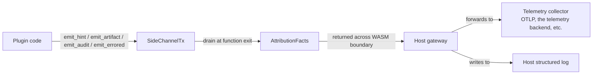

# Plugin debugging guide

How to inspect, diagnose, and reason about a `noodle-detect`
plugin running in a host LLM gateway.

The contracts this guide assumes are specified in:
- [`docs/adrs/039-...`](../adrs/039-deployment-topologies-and-the-noodle-detect-facade.md) — facade surface.
- [`docs/adrs/042-codec-side-channel-and-error-contract.md`](../adrs/042-codec-side-channel-and-error-contract.md) — error / audit-emission contract.
- [`docs/adrs/020-side-effect-sink-and-resolver-wiring.md`](../adrs/020-side-effect-sink-and-resolver-wiring.md) — `SideEffectSink` port.

---

## 1. Scope

Covered:

- Where audit emissions land and how to inspect them.
- Per-call performance budgets and how to measure against them.
- How to debug a plugin that runs in WASM, where standard
  debuggers don't reach.
- The empty-on-error contract and how to recognise when a codec
  is silently dropping input.

Not covered:

- Host-runtime-specific debugging (wasmtime's `wasmtime serve`,
  jco's source maps, etc.) — see your host's documentation.
- Building or testing the plugin — see
  [`plugin-authoring-guide.md`](plugin-authoring-guide.md) and
  [`plugin-testing-guide.md`](plugin-testing-guide.md).

## 2. Prerequisites

The plugin is built and loaded by the host. You have shell access
to either the host process's stdout/stderr or the host's
structured-logging output channel.

## 3. Observability surfaces

Three places to look:

1. **`AttributionFacts.audits`** — every `AuditEvent` the plugin
   emitted on the call. This is the primary debugging surface.
2. **Host structured log** — every audit forwarded by the host's
   telemetry middleware. If the host uses `tracing` (Rust) or
   `structlog` (Python), the audit's `transform`, `layer`, and
   `detail` fields appear as structured key-value pairs.
3. **OTLP collector** — the host's downstream forwarding sends
   per-record OTLP Log records; the `ResourceLogs.resource` block
   names the plugin and the host gateway (per ADR 023).

## 4. Steps

### 4.1 Recognise the empty-on-error contract

ADR 042 §2 pins: on any failure path, a codec or transform MUST
emit exactly one `AuditEvent { kind: Errored, ... }` and return
`Vec::new()`. A consequence: **if `AttributionFacts.hints` is
empty AND `AttributionFacts.audits` contains no `Errored` entry,
the input was legitimately empty.** If hints are empty AND a
non-`Errored` audit is present, look at that audit's `detail` for
what happened.

Common `errored` reasons and their meanings:

| `detail.reason` | Where it fires | What to do |
|---|---|---|
| `frame_buffer_overflow` | SSE codec saw > 4 MiB without a frame terminator | Upstream peer is malformed or compromised. Inspect `bytes_dropped` and `overflow_total`. |
| `tool_use_accumulator_overflow` | Anthropic `input_json_delta` accumulated > 256 KiB on a single block | Inspect `index` and `cap`. ADR 041 §2.1. |
| `decode_failed` | Vendor codec couldn't parse a single frame | Inspect `error` for the parser's error string. |

### 4.2 Trace the per-call lifecycle

For a flow that produced no `Resolved` record but should have:

1. Confirm the request reached the plugin: every call emits at
   least an `AttributionFacts` with `correlation.event_id` and
   `at_unix_ms` populated. Look for that in the host log.
2. Inspect `facts.hints` — were any hints emitted at all?
3. If hints fired but `resolved` is `None`: the Resolver requires
   a `response` to fire; a request-only call returns
   `resolved: None` by design (ADR 020 §2.6).
4. If `response` was supplied and hints fired but `resolved` is
   still `None`: a Resolver category-config mismatch. Inspect
   the configured category list (ADR 020 §2.3).

### 4.3 Per-call performance budget

ADR 039 §2.3 pins the facade as synchronous and pure. The host
calls it on the request critical path. Reference budgets:

| Operation | Target |
|---|---|
| One `detect()` call, non-streaming, ~5 KiB body | < 200 µs in-process Rust; < 2 ms via WASM JSON-marshal |
| `AttributionFacts` serialisation (JSON, ~25 records) | < 100 µs |
| WASM-boundary JSON round trip | dominated by `serde_json` — proportional to body size; benchmark per-host |

The codec-layer perf reference lives at
[`codec-perf-bench.md`](codec-perf-bench.md). Numbers there are
Apple M1 with `rustc 1.95.0`; rerun on your target hardware
before reading them as expected.

### 4.4 Debugging a WASM plugin without losing inspectability

In-process Rust hosts have a debugger; WASM hosts often don't.
Two techniques:

1. **Mirror runs.** Run the same plugin in-process against the
   same fixtures (per the testing guide) and compare the
   `AttributionFacts` JSON. Any divergence pinpoints the WASM
   boundary as the cause.
2. **Audit pinning.** Insert temporary `emit_audit(...)`-style
   tracepoints in the plugin code; these survive the WASM compile
   and surface as audit records on `AttributionFacts`. Remove
   before merge.

### 4.5 Per-host debugging cross-links

Each host language has its own WASM-runtime knobs. Once those
embedding guides land, they will be linked here:

- Python (`wasmtime-py`): `plugin-embedding-python.md` §4.
- Go (`wasmtime-go`): `plugin-embedding-go.md` §4.
- Node (`jco`): `plugin-embedding-node.md` §4.

## 5. Where to go next

- [`plugin-authoring-guide.md`](plugin-authoring-guide.md) — return here when an audit points at a code change.
- [`plugin-testing-guide.md`](plugin-testing-guide.md) — once you reproduce a failure, capture it as a fixture.
- [`docs/adrs/042-codec-side-channel-and-error-contract.md`](../adrs/042-codec-side-channel-and-error-contract.md) — the contract this guide makes operational.
- [`shipper-runbook.md`](shipper-runbook.md) — once attribution is correct, downstream delivery troubleshooting lives in the shipper runbook.
