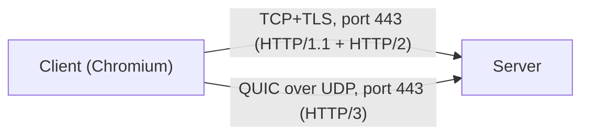
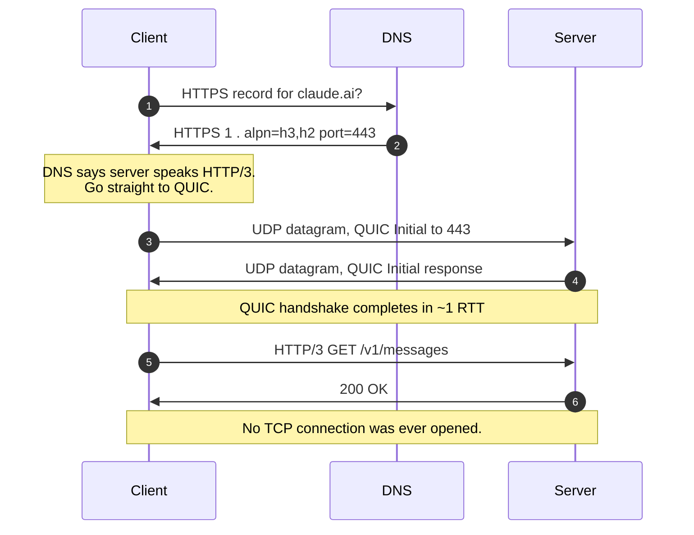
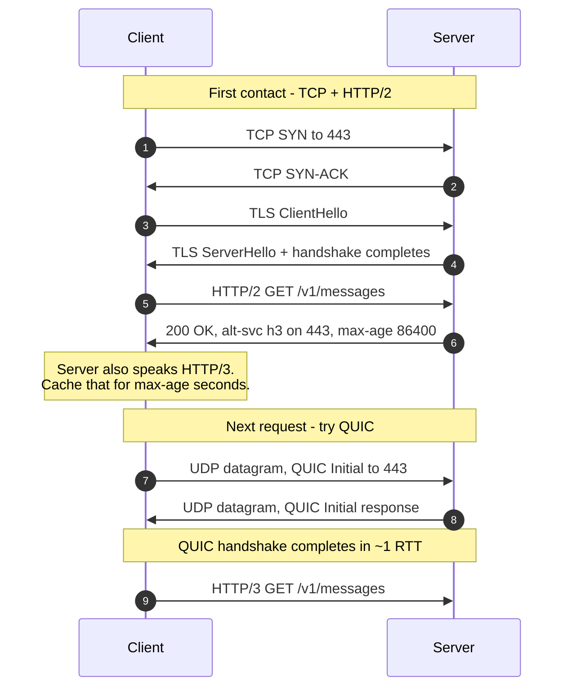
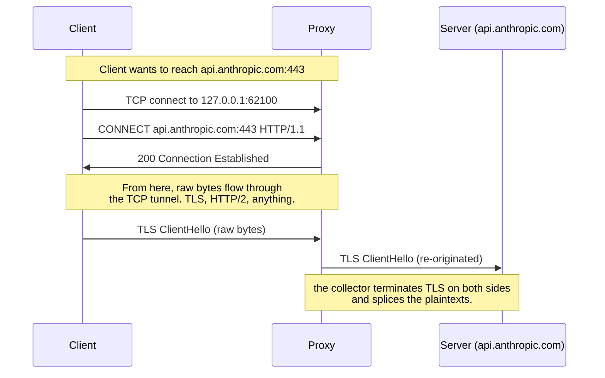

# QUIC and HTTP/3 — a primer

**Status:** Reference / educational.
**Audience:** Anyone who has to operate or extend the collector and isn't
already a networking expert. If you've used `HTTPS_PROXY` before and
wondered why some traffic refuses to go through it, start here.

This doc explains *why* the world's moving to QUIC, *why* it bypasses
classic HTTP proxies, and *what your options are* when you need to
inspect traffic that's using it.

---

## 1. Glossary (skim if familiar)

- **TCP** — the protocol that powers most of the internet. Reliable,
  ordered, bidirectional byte stream. The thing `telnet` and `nc`
  speak. Layer 4.
- **UDP** — TCP's stripped-down cousin. Sends individual datagrams.
  No ordering, no retransmission, no flow control. Used for DNS,
  video conferencing, gaming — anything where speed matters more
  than guaranteed delivery.
- **TLS** — Transport Layer Security. Encrypts a byte stream
  *on top of* TCP. Browsers use TLS over TCP to get `https://`.
- **HTTP/1.1, HTTP/2** — HTTP versions that run over TCP+TLS.
- **HTTP/3** — the *latest* HTTP version. Runs over a brand-new
  transport called QUIC, which is built on UDP.
- **QUIC** — Quick UDP Internet Connections. A modern transport
  protocol that combines TCP's reliability and TLS's encryption
  into one bundle, runs over UDP, and adds features TCP can't
  retrofit. Standardised in 2021 as RFC 9000.
- **`Alt-Svc`** (Alternative Services) — an HTTP response header
  the server uses to tell the client "I also speak HTTP/3, here's
  where." Standardised in RFC 7838.
- **`CONNECT`** — the HTTP method a client uses to tell an HTTP
  proxy *"open a raw byte tunnel to this host:port and let me talk
  through it."* The mechanism `HTTPS_PROXY` uses. Carries TCP only.
- **`CONNECT-UDP`** — RFC 9298, part of the MASQUE framework.
  Extends HTTP CONNECT to carry UDP datagrams over HTTP/2 or HTTP/3
  connections. The UDP equivalent of CONNECT that didn't exist until
  2022. Adoption in proxy tooling is nascent.
- **MITM** — Man-in-the-middle. In our context: our app pretends to
  be the upstream server (presenting a leaf it minted), so it can
  see the plaintext, while talking to the real upstream separately.

---

## 2. The 30-second mental model



Both paths reach the same server on port 443. The first uses TCP
(reliable byte stream + TLS encryption layered on top). The second
uses UDP (datagrams) with QUIC (which bundles its own reliability
and encryption together).

That single move from TCP to UDP is why QUIC traffic is invisible
to a traditional HTTP proxy.

---

## 3. What QUIC actually changes, side-by-side

| | HTTP/2 over TLS over TCP (the "classic" path) | HTTP/3 over QUIC (the "modern" path) |
|---|---|---|
| **Layer-4 protocol** | **TCP** | **UDP** |
| Port | 443 | 443 (but UDP) |
| Encryption | TLS 1.2/1.3 layered on top of TCP | TLS 1.3 baked **into** QUIC — no separate handshake |
| Handshake round-trips | TCP SYN (1) + TLS (1–2) = 2–3 RTT | 1-RTT new; **0-RTT** when resuming (client sends data in its FIRST packet) |
| Multiplexed streams | Inside one TCP connection — but a single dropped packet stalls *all* streams (head-of-line blocking) | Independent streams with per-stream loss recovery — no head-of-line blocking |
| Connection identity | (src_ip, src_port, dst_ip, dst_port) — change any of these and the connection is dead | A **Connection ID** that travels in every packet — survives IP changes (Wi-Fi → cellular handoff, NAT rebinding) |
| MITM proxy support | Mature (go-proxy, every commercial WAF, etc.) | Emerging — mitmproxy v11 (aioquic) |

The properties in QUIC's column are real engineering wins for end users. The cost is that *everything* that inspected TCP/443 (network debugging tools, corporate proxies, load balancers without QUIC support) is blind to it.

### QUIC Version 2 (RFC 9369)

QUIC v2 is not a new protocol — it is an intentionally minimal copy
of v1 with different cryptographic constants (salt, Initial packet
keys, Retry tag keys). The wire format, framing, flow control, loss
recovery, and TLS 1.3 handshake are all identical.

**Why it exists:** Anti-ossification. Because v1's Initial packet
encryption uses a well-known salt published in RFC 9000, middleboxes
(firewalls, DPI, NAT devices) started decrypting Initial packets to
inspect the SNI. By changing the salt, v2 breaks those
implementations. It also exercises the version negotiation codepath
that would otherwise rot from disuse.

**Who supports it:** Chromium, Firefox, and Cloudflare's edge all
support v2 today. Connections to Cloudflare-fronted origins
(including `claude.ai`) can negotiate v2 when the client supports
it.

**What it means for interception:** A proxy that decrypts QUIC
Initial packets to read the SNI must be version-aware — the salt
used to derive Initial keys differs between v1 and v2. Hardcoding
the v1 salt means v2 connections are opaque. The fix is mechanical
(version-keyed salt table), and everything after the Initial
(TLS termination, HTTP/3 parsing, stream forwarding) is unaffected.
More version numbers will come — that's the whole point of v2
existing.

---

## 4. TLS 1.3 and what it means for MITM interception

QUIC mandates TLS 1.3 — no fallback to TLS 1.2. This section
covers what that means for a proxy that mints certificates
on-the-fly.

### TLS 1.3 does not block certificate minting

A MITM proxy terminates both sides of the connection independently.
The TLS 1.3 handshake changes are mechanical, not adversarial to
this model:

- **Encrypted server certificate.** In TLS 1.2, the server's
  certificate was sent in plaintext. In TLS 1.3, it's encrypted.
  This blocks *passive* observers but not a MITM proxy — the proxy
  terminates the connection and decrypts it.
- **CertificateVerify is mandatory.** The server must prove it
  holds the private key for the certificate it presents. The proxy
  generated the key for the cert it minted, so this is trivially
  satisfied.
- **RSA-PSS required.** TLS 1.3 removes PKCS#1 v1.5 for handshake
  signatures. The proxy's signing code must produce RSA-PSS
  signatures, or use ECDSA (P-256/P-384) which avoids the issue.
- **SHA-256 minimum.** SHA-1 signatures are gone. Minted certs
  must use SHA-256 or better.
- **1-RTT handshake.** TLS 1.3 completes in one round trip vs two
  for TLS 1.2. A MITM proxy does two back-to-back handshakes
  (client-to-proxy, proxy-to-server), so the total is 2 RTTs — an
  improvement over the 4 RTTs required with TLS 1.2.

### 0-RTT does not block interception

When a client resumes a connection with 0-RTT, it sends application
data in the first packet using keys from a previous session. The
proxy manages its own session tickets on the client-facing side. The
client's 0-RTT is between the client and the proxy, encrypted with
the proxy's PSK — the proxy decrypts it normally and forwards to the
upstream server.

### The real threats are adjacent to TLS 1.3, not in it

**Encrypted Client Hello (ECH):** ECH encrypts the SNI using a
public key published in the server's DNS HTTPS record. Without SNI,
the proxy doesn't know which domain the client is connecting to and
can't mint the right certificate. Cloudflare already ships ECH for
free-tier domains.

ECH is defeatable today by stripping the `ech` parameter from DNS
HTTPS records — the same DNS interception point used to strip
`alpn=h3`. The client falls back to plaintext SNI. As of mid-2026,
browsers treat ECH failure as a soft error, though this may harden
over time.

**Certificate Transparency (CT):** Browsers require Signed
Certificate Timestamps (SCTs) for publicly-trusted certificates.
However, browsers **exempt locally-trusted root CAs from CT
enforcement.** As long as the proxy's root CA is installed in the
system trust store, CT is not a concern.

**Connection migration (QUIC-specific):** QUIC connections survive
IP address changes using connection IDs. A transparent proxy could
lose a flow mid-connection if the client migrates. This is a concern
for network-level proxies, less so for a local system proxy.

**Chromium does not trust user-added CAs for QUIC connections.**
This is a significant constraint. When Chromium encounters a
certificate signed by a locally-trusted (non-public) root CA during
a QUIC handshake, it rejects the connection and falls back to
HTTP/2 over TCP. This applies to all Chromium-based apps — Chrome,
Edge, and Electron apps like Claude Desktop. The practical effect:
even if a proxy successfully intercepts QUIC and presents a minted
certificate, Chromium-based clients will refuse it over QUIC and
silently retry over TCP.

Firefox does trust user-added CAs for QUIC connections.

This has two implications:
- For Chromium-based targets (Claude Desktop), QUIC MITM with a
  local CA will not produce HTTP/3 flows — the client will always
  fall back to TCP, which the proxy intercepts normally.
- True HTTP/3 MITM testing requires either Firefox or curl with
  HTTP/3 support.

**QUIC v2 Initial packet decryption:** A proxy that reads QUIC
Initial packets must use the correct salt for the QUIC version
(v1 vs v2 use different salts). Hardcoding v1 constants makes v2
connections opaque. See Section 3 (QUIC Version 2).

### Summary

| Concern | Effect on MITM | Mitigation |
|---|---|---|
| TLS 1.3 encrypted handshake | None — proxy terminates both sides | Speak TLS 1.3 natively |
| RSA-PSS / SHA-256 requirements | Cert minting must use modern algorithms | Use ECDSA P-256 or RSA with PSS |
| 0-RTT | Proxy participates normally | Issue own session tickets |
| ECH (Encrypted Client Hello) | Hides SNI from proxy | Strip `ech` from DNS HTTPS records |
| Certificate Transparency | Exempted for local root CAs | Install root CA in system trust store |
| Chromium + local CA over QUIC | Chromium rejects, falls back to TCP | Intercept on TCP; use Firefox for HTTP/3 testing |
| QUIC connection migration | Flow can move out from under proxy | Less relevant for local system proxy |
| QUIC v2 Initial packets | Opaque if proxy hardcodes v1 salt | Version-keyed salt table |

---

## 5. How a client decides to use QUIC

The protocol upgrade is **opportunistic**. A client goes through
three steps before it sends a QUIC packet.

### Step 1: Check capability and policy

Before anything hits the wire, the client asks "am I allowed to
use QUIC at all?" This depends on:

- Whether the implementation supports QUIC/HTTP-3.
- User or enterprise policies (e.g., QUIC disabled on managed
  devices).
- Any previous failures for this origin that caused the client to
  de-prefer QUIC (broken-QUIC blacklist).

If any of these say no, the client falls back to TCP+TLS for the
lifetime of the session. No further QUIC logic runs.

### Step 2: Discover whether the server supports QUIC

Two mechanisms, and the client may use either or both:

**a) DNS SVCB/HTTPS records (Safari, Chromium, and others)**

The client issues a DNS query for `HTTPS` records for the origin.
If the response advertises an ALPN of `h3`, the client knows up
front that the server supports QUIC and can immediately open a QUIC
connection to port 443 instead of starting with TCP.



Cloudflare (which fronts Anthropic's edge) publishes DNS HTTPS
records with `alpn=h3` for origins that support it. For `claude.ai`,
the SVCB record advertises `h3,h2` — the client goes straight to
QUIC on the very first request. Note that `api.anthropic.com` only
advertises `h2` (see Section 10).

**b) Alt-Svc header — "second-use" discovery (fallback)**

If the client doesn't have a DNS signal (or before SVCB/HTTPS was
common), it falls back to learning about HTTP/3 from the server's
response:



The client caches the `Alt-Svc` advertisement for `ma` seconds.
On subsequent requests to that origin, it tries QUIC first. The
cache is **persisted to disk** — restarting the browser doesn't
clear it.

### Step 3: Connection strategy

Once the client believes QUIC is available, it chooses a strategy:

- **QUIC-first:** If there's a strong signal (DNS HTTPS record with
  `h3` and recent success history), start with QUIC alone and wait
  for it to succeed or time out.
- **Happy-eyeballs-style race:** Some stacks fire both a QUIC
  attempt (UDP/443) and a TCP SYN simultaneously and go with
  whichever completes first.
- **Fallback:** If QUIC packets don't get a response within a
  timeout (or get ICMP "port unreachable"), fall back to TCP+TLS.
  The client may blacklist QUIC for that origin for a cooldown
  period.

Three things to notice:

1. **DNS makes the common path instant.** With HTTPS records, there
   is no TCP-first step — the client goes straight to QUIC. The
   Alt-Svc path only kicks in when DNS doesn't advertise h3.
2. **The cache persists.** Once cached (via either path), the client
   prefers QUIC for that origin until the cache expires (typically
   24 hours). Restarting the browser doesn't clear it.
3. **0-RTT.** Once the client has a cached session, the *very first
   UDP packet of subsequent connections already contains request
   data.* No round-trip cost at all. This is fast, and it means a
   proxy that intercepts after the handshake has nothing to inspect.

---

## 6. Why HTTPS_PROXY can't carry QUIC

Trace through what `HTTPS_PROXY=http://127.0.0.1:62100` actually
asks the client to do:



The whole mechanism is "open a **TCP** tunnel to host:port." There
was no UDP equivalent until 2022. RFC 9298 (CONNECT-UDP, part of the
MASQUE framework) defines one — it extends HTTP CONNECT to carry UDP
datagrams over HTTP/2 or HTTP/3 connections. Chrome has experimental
support and Apple's `Network.framework` relay support uses it. But
adoption in proxy tooling is nascent and no major HTTP proxy library
supports it as an interception mechanism today. For practical
purposes, the proxy can only forward bytes through a reliable
stream.

So when Chromium decides to use QUIC, it ignores `HTTPS_PROXY`
entirely and sends UDP/443 packets directly to the upstream IP. Your
proxy never sees them.

This is not a bug. It's the design of the protocol layer.

---

## 7. Interception points in a QUIC-aware proxy

A proxy that intercepts HTTPS traffic has several points in the
connection lifecycle where it can interact with QUIC:

1. **DNS.** The earliest point — before the client opens any
   connection. The proxy controls DNS resolution for target origins.
   For QUIC, this is where the client discovers `alpn=h3` in DNS
   HTTPS records. Stripping that flag forces the client back to TCP
   without touching anything else.

2. **Filtering.** The proxy decides which flows to intercept based
   on the destination host. The same filtering logic that routes TCP
   flows can identify QUIC/UDP flows to target origins. Whether
   those flows get suppressed (DNS stripping), blocked (UDP drop),
   or intercepted (QUIC MITM) is a policy decision at this layer.

3. **Certificate minting.** A TLS MITM proxy mints leaf
   certificates signed by its root CA. QUIC uses TLS 1.3 for its
   handshake — the same certificate infrastructure applies. A QUIC
   MITM proxy presents a minted leaf to the client over QUIC just
   as a TCP proxy does over TLS.

4. **QUIC MITM.** The proxy terminates the client's QUIC
   connection, decrypts, inspects the HTTP/3 frames, and
   re-originates a QUIC connection to the upstream server. This is
   the same architecture as TCP MITM — just over a different
   transport. mitmproxy v11 (using `aioquic` in Python) demonstrates
   this is a working technique. Rust's `quinn` crate is a separate
   QUIC implementation that could be used to build a QUIC proxy, but
   it is not used by mitmproxy — mitmproxy's Rust layer (`mitmproxy_rs`)
   is purely a transport shim that shuttles raw UDP datagrams between
   the macOS Network Extension and Python.

---

## 8. Approaches to intercepting QUIC traffic

If you need to inspect QUIC traffic, there are three categories of
approach. Each operates at a different layer and makes different
tradeoffs.

### 8.1 Suppress QUIC discovery

Prevent the client from learning that the server supports HTTP/3.
If the client never sees `alpn=h3` in DNS HTTPS records or `Alt-Svc`
in HTTP response headers, it stays on TCP+TLS — which existing
proxies already handle.

This can be done per-origin (strip the hint for specific hosts) or
globally (remove all HTTPS records). The client still gets a valid
response — it just doesn't know HTTP/3 is available.

### 8.2 Block QUIC transport

Drop or reject UDP/443 packets at the network layer so QUIC
handshakes never complete. Clients detect the failure and fall back
to TCP. This is blunt — it affects all QUIC traffic, not just the
origins you care about.

### 8.3 True QUIC man-in-the-middle

Terminate and re-originate the QUIC connection the same way a TLS
MITM proxy does for TCP: mint a leaf certificate, decrypt, inspect,
re-encrypt. The client speaks QUIC to the proxy, the proxy speaks
QUIC to the upstream server, and the proxy sees plaintext HTTP/3
frames in between.

This is a real, working technique. mitmproxy v11+ ships QUIC
interception using `aioquic` in Python. The approach is the direct
parallel of what existing TCP MITM proxies do — just newer and less
mature tooling.

---

## 9. What "falling back to TCP" actually gets you

Once QUIC is dead and the client uses TCP:

1. Client tries to connect to `api.anthropic.com:443` via TCP.
2. With `HTTPS_PROXY` set, Chromium does `CONNECT api.anthropic.com:443`
   to the collector on 127.0.0.1:62100.
3. The collector accepts the CONNECT, opens TCP to the real upstream, and
   transparently splices.
4. The client speaks TLS through the tunnel. The collector terminates with
   a freshly-minted leaf signed by the collector's root CA.
5. The collector now sees the plaintext HTTP/2 frames in both directions
   and can record, decode, filter — anything its codec layer can do.

This is the state where the collector is useful. Everything we've built —
the wire log, frames.jsonl, events.jsonl, the OODA viewer — depends
on being in this state.

---

## 10. The Anthropic-specific note

Anthropic uses Cloudflare as its edge. The two relevant origins
behave differently:

**`claude.ai`** (Claude Desktop Chat, browser):
- DNS SVCB record advertises `alpn=h3,h2` — clients with HTTPS
  record support go straight to QUIC on the first connection.
- HTTP responses emit `Alt-Svc: h3=":443"; ma=86400` — clients
  without SVCB support discover QUIC after one HTTP/2 response.
- Both discovery paths are active. This is the origin where QUIC
  interception matters most.

**`api.anthropic.com`** (SDK, CLI, direct API calls):
- DNS SVCB record advertises `alpn=h2` only — no `h3`.
- HTTP responses do not include an `Alt-Svc` header.
- QUIC is **not advertised**. Traffic to the API stays on TCP+TLS
  and flows through existing HTTP proxies without issue.

The practical impact: the collector already intercepts API traffic fine.
The gap is `claude.ai` and any other Cloudflare-fronted origin
that advertises `h3`.

---

## 11. Debugging and identifying QUIC traffic

### Verify what DNS advertises

Query the SVCB/HTTPS record (TYPE65) to see what the client learns
before it opens a connection:

```sh
# dig on macOS (older dig doesn't know "HTTPS" — use TYPE65)
dig +short TYPE65 claude.ai
dig +short TYPE65 api.anthropic.com
```

If the record contains `h3` in its ALPN, the client will attempt
QUIC. If it only shows `h2`, the client stays on TCP.

### Capture QUIC packets with tcpdump

```sh
# Capture all UDP/443 traffic (QUIC runs on UDP port 443)
sudo tcpdump -i en0 udp port 443 -s 0 -w quic.pcap

# Filter to a specific host (resolve the IP first with dig +short)
sudo tcpdump -i en0 udp port 443 and host 160.79.104.10 -s 0 -w quic.pcap

# Filter by domain — resolve and capture in one line
sudo tcpdump -i en0 udp port 443 and host $(dig +short claude.ai | head -1) -s 0 -w quic-claude.pcap

# Watch live (no file) — see packet count and timing
sudo tcpdump -i en0 udp port 443 -vv
```

QUIC long-header packets have the Form bit (bit 7) set, meaning
first byte >= 0x80. The Fixed bit (bit 6) is also set in valid
packets, giving >= 0xC0. The packet type is encoded in bits 4-5:
v1 Initials use type 00 (upper nibble 0xC0), v2 Initials use type
01 (upper nibble 0xD0). To filter for Initial packets across both
versions:

```sh
# udp[8] is the first byte of UDP payload (UDP header is 8 bytes)
# Match v1 Initials (0xC0) OR v2 Initials (0xD0)
sudo tcpdump -i en0 'udp port 443 and ((udp[8] & 0xf0) = 0xc0 or (udp[8] & 0xf0) = 0xd0)' -s 0 -w quic_initial.pcap
```

Open the pcap in Wireshark (3.6+) for native QUIC dissection. Use
display filter `quic` to isolate QUIC frames.


### Check for Alt-Svc headers in existing captures

If you're already running traffic through the collector and want to know
which origins *would* use QUIC on the next request:

```sh
jq -c 'select(.direction=="response")
       | .headers[]
       | select(.name | ascii_downcase == "alt-svc")' \
   ~/.noodle/tap.jsonl
```

### Firefox and Safari

- **Firefox:** `about:config` → set `network.http.http3.enabled`
  to `false`.
- **Safari:** No user-facing QUIC toggle. Safari uses Apple's
  `Network.framework`, which honours the macOS system proxy setting
  but has no stable `defaults write` key for disabling QUIC.

---

## 12. Using mitmproxy for QUIC investigation

mitmproxy (v11+, source checkout is 13.0.0.dev) supports QUIC/HTTP3
interception. Its "local capture" mode on macOS uses a
`NETransparentProxyProvider` Network Extension that intercepts both
TCP and UDP flows at the OS level — no `HTTPS_PROXY` env var, no pf
rules, no DNS configuration needed. The extension knows which
process originated each flow, so you can target a single app.

### Architecture

mitmproxy's QUIC interception has three layers:

1. **Network Extension (Swift)** — `NETransparentProxyProvider`
   intercepts `NEAppProxyTCPFlow` and `NEAppProxyUDPFlow` from the
   OS. Sends flows to the Rust core over Unix sockets.
2. **Transport (Rust, `mitmproxy_rs`)** — manages UDP server/client
   sockets and concurrent flow IPC between the extension and the
   Python layer.
3. **Protocol (Python)** — QUIC termination via the `aioquic`
   library (pinned at exactly 1.2.0 — `>=1.2.0,<=1.2.0` in
   `pyproject.toml`). Terminates the client's QUIC connection,
   decrypts, inspects HTTP/3 frames, and re-originates a QUIC
   connection to the upstream server. Certificate minting uses the
   same code path as TCP TLS — no QUIC-specific cert logic.

QUIC version negotiation is delegated to aioquic, but **packet
detection is not** — mitmproxy maintains a `KNOWN_QUIC_VERSIONS`
set in `addons/next_layer.py` with explicit v1, v2, and Google
QUIC version numbers used to sniff whether a UDP packet is QUIC.
Adding a new QUIC version requires updating both aioquic and that
detection set.

### Install and setup

```sh
brew install --cask mitmproxy
```

The brew cask ships the signed/notarized Network Extension. On
first run, macOS prompts to approve it in System Settings >
Privacy & Security. Trust the CA:

```sh
sudo security add-trusted-cert -d -p ssl -p basic \
  -k /Library/Keychains/System.keychain \
  ~/.mitmproxy/mitmproxy-ca-cert.pem
```

### Running local capture

```sh
# Intercept all traffic on this machine
mitmproxy --mode local

# Intercept a specific app only
mitmproxy --mode local:curl
mitmproxy --mode local:Firefox
```

HTTP/3 is enabled by default (`http3=true`). No extra flags needed.

### Modes that support QUIC

| Mode | QUIC support | Notes |
|---|---|---|
| Local capture | Yes | macOS Network Extension, per-app targeting |
| Reverse proxy (https://) | Yes (dual) | `--mode reverse:https://example.com` — accepts TCP+TLS (HTTP/2) or QUIC (HTTP/3) |
| Reverse proxy (http3://) | Yes (HTTP/3 + QUIC) | `--mode reverse:http3://example.com` — speaks HTTP/3 to upstream over QUIC |
| Reverse proxy (quic://) | Yes (raw QUIC) | `--mode reverse:quic://example.com` — raw QUIC relay, no HTTP framing |
| Transparent | **No** | TCP only, does not handle UDP |

### Chromium limitation

Chromium-based apps (Chrome, Edge, Claude Desktop) do not trust
user-added CAs for QUIC connections. When mitmproxy presents its
minted certificate over QUIC, Chromium rejects it and falls back to
HTTP/2 over TCP — which mitmproxy intercepts normally. To observe
actual HTTP/3 flows, use Firefox or curl with HTTP/3 support.

### What mitmproxy shows

HTTP/3 flows appear as standard HTTP request/response pairs —
headers, bodies, timing — the same as HTTP/1 and HTTP/2. The
protocol version is visible in the flow details. For raw QUIC
(non-HTTP), flows appear as UDP streams.

---

## 13. Decision framework: QUIC interception for the collector

Given everything above, what approach makes sense for a local macOS
proxy that needs to inspect AI-provider traffic?

### The Chromium constraint narrows the field

Chromium-based apps (Chrome, Edge, Electron apps including Claude
Desktop) reject locally-trusted CAs over QUIC and fall back to TCP.
This means true QUIC MITM — terminating and re-originating the QUIC
connection — won't produce HTTP/3 flows for the primary targets.
The client will always fall back to TCP, which the proxy already
handles.

### Recommended: suppress QUIC discovery for target origins

Strip `alpn=h3` from DNS HTTPS records for the origins you
intercept. The client never learns HTTP/3 is available, stays on
TCP+TLS, and traffic flows through the existing proxy path. This
approach:

- Requires DNS interception (`NEDNSProxyProvider` or a local
  resolver) — the same mechanism needed for ECH stripping.
- Is per-origin — non-target traffic uses QUIC normally.
- Has zero latency cost beyond the proxy's existing TLS overhead.
- Is invisible to the user — no error dialogs, no degraded UX.
- Doesn't require a QUIC stack in the proxy.

### When to revisit

True QUIC MITM becomes worth the investment if:

- **Chromium changes its CA trust policy for QUIC** — then
  suppressing QUIC means losing the performance benefit for no
  reason, and full interception is both possible and preferable.
- **Non-Chromium targets matter** — Firefox trusts local CAs over
  QUIC today. If the collector needs to intercept Firefox HTTP/3
  traffic natively (not just force it to TCP), that requires a
  QUIC termination stack.
- **The collector moves from debug tool to always-on attribution
  proxy** — the 1-RTT cost of forcing TCP becomes a measurable
  production cost, and QUIC interception avoids it.

Until one of those triggers fires, DNS-based suppression is the
simplest correct approach. This requires the client to use system
DNS; if DoH is active, DNS stripping has no effect (see Q9).

---

## 14. FAQ

### Q1. Why does QUIC exist at all if it breaks every existing tool?

Real wins for end users:

- **Better mobile performance.** Connection migration means your
  TCP doesn't reset when you walk from Wi-Fi to cellular — your
  video call doesn't drop, your HTTP request doesn't restart.
- **Faster handshakes.** 0-RTT means the first byte of an API
  response can arrive in the time it took TCP+TLS to finish saying
  hello.
- **No head-of-line blocking.** If one TCP packet drops, all the
  streams sharing that connection stall waiting for retransmit.
  QUIC's streams are independent; only the affected stream stalls.

For a $5B company shipping a browser, those wins are worth breaking
network-debug tooling. The Internet runs for end users, not for
network engineers.

### Q2. Can I make the collector understand QUIC the same way it understands TLS over TCP?

In principle, yes. mitmproxy v11+ ships working QUIC interception
using `aioquic` in Python. The approach is the same as TCP MITM —
terminate the QUIC connection on the proxy side, mint a leaf cert,
inspect plaintext, re-originate a QUIC connection to the upstream.
It's a significant engineering investment but proven technique.

### Q3. Does Firefox / Safari have the same QUIC issue?

Yes, with quirks:

- **Firefox** uses its own QUIC stack ("neqo") instead of Chromium's.
  Has a similar disable flag: `network.http.http3.enabled = false`
  in `about:config`.
- **Safari** uses Apple's `Network.framework`, which honours the
  macOS system proxy setting (not env vars). Safari's QUIC use
  is controlled by Apple's flags; you can't disable it via a CLI
  argument.

### Q4. What other protocols use UDP and bypass HTTPS_PROXY similarly?

- **WebRTC** — peer-to-peer video, audio, screen sharing. Heavy UDP
  user. Apps like Zoom, Google Meet, FaceTime.
- **DNS-over-HTTPS (DoH)** — Chromium runs its own DoH client and
  bypasses system DNS *and* the HTTPS_PROXY for those queries.
  Yes, really.
- **mDNS / Bonjour** — local network discovery. UDP multicast.
  Apple devices spam it constantly. Not security-relevant.
- **NTP** — time sync, UDP/123.

A classic HTTP proxy sees none of these. If you care about any of
them, you need a transparent proxy at the network layer.

### Q5. I disabled QUIC but Chromium still bypasses the proxy. What gives?

Three possibilities, in order of likelihood:

1. **Chromium cached the `Alt-Svc` advertisement** before you set
   the flag. Clear it:
   - Open `chrome://net-internals/#alt-svc` in Chromium-based browsers
     and click "Clear Alt-Svc cache."
   - For Claude Desktop / VS Code / other Electron apps: delete the
     `Network Persistent State` file in the app's profile dir, or
     just delete the whole profile.

2. **HTTP/3 cache is in the persistent state file** — `~/Library/
   Application Support/<app>/Network Persistent State`. Delete it
   to force re-discovery.

3. **App uses its own QUIC stack** (not Chromium's). Chromium-level
   flags won't help. You need to suppress QUIC discovery at the DNS
   level or block QUIC transport (see Section 8).

### Q6. Why is "0-RTT" a concern for security?

0-RTT means the client sends application data **in the same packet
as the handshake** — before the server has authenticated itself.
This data is encrypted, but with keys derived from a *previous*
session that an attacker might have captured.

The TLS 1.3 spec acknowledges 0-RTT is replay-vulnerable: an
attacker who captures a 0-RTT packet can replay it later and the
server can't distinguish replay from original. Servers are supposed
to either disable 0-RTT for non-idempotent requests, or implement
replay detection (which is hard at scale).

In our context: if the collector ever does QUIC MITM, it has to decide
what to do about 0-RTT replays. mitmproxy's reference implementation
handles this; we'd need to port the logic.

### Q7. Does HTTP/3 actually win in production? What am I sacrificing by disabling it?

Real numbers from a few sources:

- Cloudflare's blog: 5–10% reduction in tail-latency p99 for
  page-load times.
- Mobile users on flaky cellular: ~30% reduction in tail latency,
  driven mostly by no-head-of-line-blocking.
- API consumers (the dominant collector case): much smaller wins
  because API calls are short, single-request, and don't see HoL
  blocking. The 0-RTT savings matter more here — a saved RTT can
  be 100ms on transcontinental routes.

For a debug proxy use case where the operator is on their own
machine inspecting their own traffic, the latency cost of disabling
QUIC is irrelevant. For production use of the collector as an
always-on attribution proxy, it'd be ~1 RTT extra per request — a
real cost, but bounded.

### Q8. How does DNS trigger QUIC? Why don't I ever see an HTTP/2 request first?

The DNS HTTPS record (SVCB) is the primary discovery mechanism on
modern stacks. When the client resolves an origin like `claude.ai`,
the DNS response includes an HTTPS record with `alpn=h3,h2`. The
client reads that and knows the server speaks HTTP/3 before it opens
any connection at all. Because the client already has a QUIC
implementation, it goes straight to UDP/443 with a QUIC handshake.
TCP is never attempted. The Alt-Svc header path (where you'd see an
HTTP/2 request first) only kicks in when HTTPS records aren't
available in DNS. Note: not all origins advertise `h3` — for
example, `api.anthropic.com` only advertises `h2` in its SVCB
record (see Section 10).

### Q9. Could we control what the client sees by intercepting DNS?

Yes. If you intercept the DNS response and strip `alpn=h3` from the
HTTPS record (or drop the HTTPS record entirely), the client has no
signal that the server speaks HTTP/3. It falls back to TCP+TLS,
which flows through the proxy. This is the surgical version of "kill
QUIC" — you're not blocking UDP system-wide, you're removing the
hint for the specific origins you want to intercept.

**Caveat: DNS-over-HTTPS (DoH).** This strategy depends on the
client using the system DNS resolver. Chromium has its own DoH
client that can bypass system DNS entirely (see Q4). When Chromium
uses DoH, it opens a regular HTTPS connection to the DoH resolver
(e.g., `dns.google`) and parses DNS responses from the HTTP body.
`NEDNSProxyProvider` never sees these queries because they never
enter the system DNS path — DoH is an HTTPS request, not a system
DNS call.

Mitigations for DoH bypass:
- **Enterprise policy:** Disable DoH in Chromium via managed
  preferences (`DnsOverHttpsMode = off`).
- **macOS managed preferences:** Force system DNS resolution.
- **`NETransparentProxyProvider`:** Intercepts the DoH HTTPS
  connection as a TCP flow. The proxy could MITM it and modify the
  DNS response inside the HTTP payload, but this requires
  recognizing DoH traffic and parsing DNS wire format within HTTP.

### Q10. What macOS mechanisms exist for hooking DNS?

Several, not all of them Network Extension:

- **`NEDNSProxyProvider`** — a Network Extension subclass
  specifically for DNS. All DNS queries on the system flow through
  your provider. You see the query and control the response. This
  is the most surgical option — you can selectively strip `alpn=h3`
  from HTTPS records for target origins and pass everything else
  through untouched. Same mechanism apps like Little Snitch and
  NextDNS use.
- **`NEDNSSettingsManager`** — lighter touch. Pushes DNS
  configuration (e.g., point the system at a custom resolver)
  without writing a full DNS proxy. Pair with a local DNS server
  that does the filtering.
- **Local DNS resolver** — run a resolver on localhost (e.g.,
  `dnsmasq`, `coredns`) and configure the system to use it. No
  Network Extension needed, but no system integration either.
- **`NEFilterDataProvider`** — content filter extension. Sees
  network flows and can block them, but operates above DNS. Less
  appropriate for this.

### Q11. Can we modify the flags in the DNS response before the application sees them?

Yes. With `NEDNSProxyProvider` you are the DNS resolver from the
system's perspective. The query comes in, you forward it upstream,
get the real response, and modify it before handing it back to the
requesting application. You have full control over the response
payload — including the HTTPS/SVCB record and its parameters
(`alpn`, `port`, `ech`, etc.). For a target origin like
`claude.ai`, you strip `alpn=h3` from the HTTPS record while
leaving the A/AAAA records intact. The application gets a
valid DNS response — it just doesn't know HTTP/3 is available.

### Q12. How can I tell if traffic *would have been* QUIC?

Look for `Alt-Svc: h3` in HTTP response headers from the server.
Any host that emits it is a candidate for "this might use QUIC on
the next request." `jq` recipe against `tap.jsonl`:

```sh
jq -c 'select(.direction=="response")
       | .headers[]
       | select(.name | ascii_downcase == "alt-svc")' \
   ~/.noodle/tap.jsonl
```

Anything that comes back tells you "the next request to this origin
would have been QUIC if you hadn't blocked it."

---

## 15. Related reading

- [RFC 9000](https://datatracker.ietf.org/doc/html/rfc9000) — QUIC
  protocol spec. Long but readable.
- [Cloudflare HTTP/3 series](https://blog.cloudflare.com/tag/http-3/)
  — the best plain-English walkthrough of the protocol changes.
- [mitmproxy QUIC implementation](https://github.com/mitmproxy/mitmproxy)
  — reference implementation of QUIC MITM in Python (v11+).
