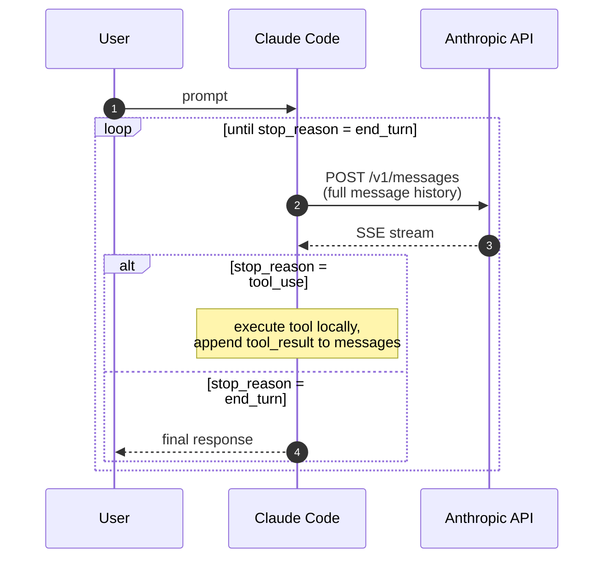
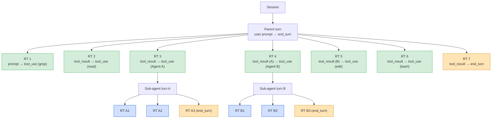
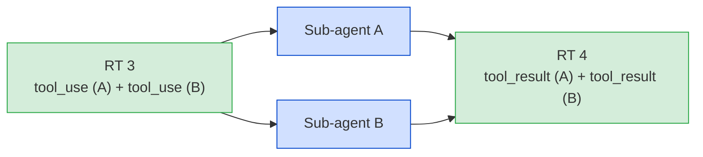
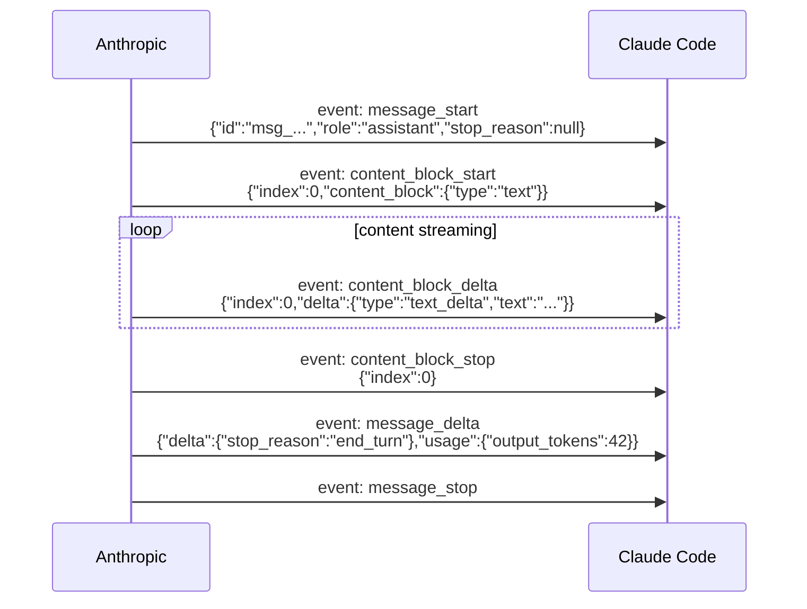

# Session hierarchy — how Claude Code talks to the Anthropic API

**Status:** Authoritative external knowledge. Captured 2026-05-10.
This is **not** a design we own; it documents the system noodle
observes. The protocol's structure — sessions, turns, OODA loops,
sub-agent isolation, SSE event ordering — is the constraint our
designs operate within.

Anyone working on the noodle proxy or viewer needs this material to
understand what the proxy can infer from a single HTTP request, why
turn-scoped operations require state across requests, and how
sub-agents complicate session-level attribution.

## Definitions

| Term | Scope | What it is |
|------|-------|------------|
| **Session** | One conversation | One Claude Code window — open to close. |
| **Turn** | One user prompt → final response | The user-visible unit of work. Bounded by the user's prompt and the assistant's `end_turn` response. |
| **Round trip** | One HTTP request/response | One POST `/v1/messages` and its SSE response. The atomic unit the proxy sees. |
| **Sub-agent turn** | One nested turn | A turn spawned by the `Agent` tool inside a parent turn. Has its own system prompt, messages array, and OODA loop — a separate conversation from the API's perspective. |

A session contains 1–N turns. A turn contains 1–N round trips. A turn
may spawn sub-agent turns; each sub-agent turn contains 1–N round
trips of its own.

## The OODA loop

Claude Code fulfills a turn by running an OODA loop against the
Anthropic API. Each iteration is one round trip; the loop terminates
when the model returns `stop_reason: end_turn`.

The API is **stateless**. Every round trip carries the full
conversation history in its `messages` array. Round trip 5 of a turn
includes every message from round trips 1–4 plus the new tool_result.

## The hierarchy

A session decomposes into turns; turns decompose into round trips;
some turns spawn sub-agent turns whose round trips do not appear under
the parent turn's round-trip sequence. A representative trace with 12
round trips across one user turn:

This trace contains **12 round trips across 1 user turn** — 7 in the
parent, 3 in sub-agent A, 2 in sub-agent B.

### Sequential vs parallel sub-agents

The trace above shows **sequential** spawning: RT 3 spawns sub-agent
A, waits for `end_turn`, then RT 4 spawns sub-agent B.

**Parallel** spawning happens when the model emits two `tool_use`
blocks (Agent A and Agent B) in a single response. Both sub-agent
turns become children of the same round trip and run concurrently:

The tree shape is determined by the model's choices and not
predictable in advance.

### Sub-agent isolation

A sub-agent turn is a **separate conversation** from the API's
perspective:

| Aspect | Parent turn | Sub-agent turn |
|--------|-------------|----------------|
| System prompt | Claude Code's main system prompt | Parent's `prompt` parameter to the Agent tool |
| Messages array | Continuation of session history | Starts fresh; no parent context |
| OODA loop | Has its own `end_turn` | Has its own `end_turn` |
| `X-Claude-Code-Session-Id` | Parent session ID | **Same as parent's session ID** (see correction below) |

From the user's perspective sub-agent turns are invisible — they see
one turn: their prompt and the final response. From the proxy's
perspective sub-agents look like independent conversations with no
link back to the parent.

## What the proxy sees

The proxy sits between Claude Code and `api.anthropic.com`,
intercepting every HTTPS request via MITM. It has **no built-in
concept of turn, sub-agent, or session hierarchy** — it sees a flat
stream of HTTP requests. All 12 round trips in the trace above arrive
as independent POST `/v1/messages` calls; no header or payload field
declares "A1 is a child of RT 3."

### Observable signals per round trip

**Request side** (available in the request capture path):

| Signal | Source | What it tells us |
|--------|--------|------------------|
| `messages` array | Request body | Full conversation history for this round trip |
| `system` field | Request body | System prompt (differs between parent and sub-agent) |
| `User-Agent` | Headers | Identifies the client (e.g., `claude-code/1.x`) |
| `X-Claude-Code-Session-Id` | Headers | Per-OODA-loop session ID; sub-agents get distinct IDs from their parent |
| `X-Client-Request-Id` | Headers | Per-request correlation ID (unique per round trip, not per turn) |
| `max_tokens` | Request body | Identifies quota preflights when set to `1` |

**Response side** (available via SSE stream events):

| Signal | SSE event | What it tells us |
|--------|-----------|------------------|
| `message_start` | First event | Response is beginning |
| `content_block_start/delta/stop` | Content events | Response content streaming |
| `stop_reason` | `message_delta`, near end | `tool_use` = turn continues; `end_turn` = turn is done; `max_tokens` = truncated |
| `message_stop` | Last event | Response stream is complete |

### What the proxy cannot observe directly

- **Which round trips belong to the same turn.** No turn ID header.
  The proxy must track `stop_reason` across same-session requests and
  infer turn boundaries.
- **Parent-child relationships between turns and sub-agents.** See
  the correction below — sub-agents share the parent session id; the
  detection signal is a system-prompt change within one session.
- **Whether a request is the Nth round trip of a turn.** Each request
  arrives in isolation. The messages array allows heuristic inference
  (single user message = likely first round trip; `tool_result` as the
  last message = continuation), but this is not definitive.

### Correction (2026-05-10) — sub-agents share the parent session id

Wire data captured from Claude Code 2.1.138 shows that sub-agents
spawned via the `Agent` tool **reuse the parent's
`X-Claude-Code-Session-Id`**. Within one such session we observe
multiple distinct system prompts coexisting (different
`cc_version=...; cch=...` cache hashes). The agent boundary is therefore
**a system-prompt change within a session**, not a session-id change.

Practical implications for noodle:

- Group a session's round trips chronologically; start a new
  **agent run** whenever the system prompt changes.
- The first agent run is the **main Claude Code agent** (system prompt
  starts with `"You are Claude Code, Anthropic's official CLI…"`).
- Subsequent agent runs (different system prompt) are sub-agents.
  Match each non-main agent run back to the parent's `Agent` tool_use
  whose `input.prompt` (or whose surrounding context) corresponds to
  the sub-agent's system prompt or first user message.
- The `Agent` tool's `input` carries `run_in_background: true` for
  background agents and `subagent_type` / `description` / `prompt`.
  Background agents still flow through the same session and through
  the proxy — they appear as additional agent runs interleaved with
  the parent's.

### Message history carries forward

Because the API is stateless, every round trip's `messages` array
includes the full history. If the proxy modifies a message in round
trip 1 (e.g., appending an instruction to the user's prompt), that
modification **persists** in round trips 2–N of the same turn — it is
part of the conversation history Claude Code replays.

Each subsequent round trip also adds a new last user message (the
`tool_result`). An injector targeting "the last user message" hits a
different message on each round trip. Designs that need turn-stable
injection must dedupe by session, or accept that injection runs once
per round trip.

## SSE message lifecycle

Each round trip's response is an SSE stream with a fixed event
sequence:

`stop_reason` in `message_delta` is the critical signal for turn
detection:

| Value | Meaning |
|-------|---------|
| `end_turn` | The model is done. Final round trip of this turn. |
| `tool_use` | The model wants to call a tool. Claude Code will execute it and POST the next round trip. |
| `max_tokens` | The model hit the token limit. Turn ends; response is truncated. |

Every round trip has its own complete SSE lifecycle (`message_start`
through `message_stop`). These events are per-round-trip, not
per-turn.

## How noodle applies this material

- **Turn detection** uses the prior round-trip's `stop_reason`:
  - `tool_use` → the current round-trip is a continuation of the same turn.
  - `end_turn` / `max_tokens` → the current round-trip starts a new turn.
- **Auxiliary classification.** Not every `/v1/messages` round trip is
  a user-turn round trip. Claude Code makes auxiliary calls (quota
  probes via `max_tokens=1`; title generation via a fixed-shape
  structured-output prompt). The viewer surfaces these in a separate
  "Auxiliary calls" section so they don't appear as fake turns.
- **Sub-agent linking** (deferred — story 015) requires correlating
  parent-session round trips that emit an `Agent` tool_use with the
  child session whose conversation begins shortly after. Will key on:
  - Timestamp proximity (child session begins within seconds of the
    parent's `Agent` tool_use response).
  - System prompt match (parent's `Agent.input.prompt` argument should
    appear as the child session's system prompt).
